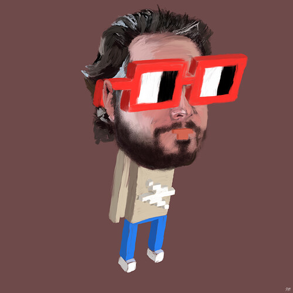

# Introduce Yourself

<!-- ✦✦✦ POST START ✦✦✦ -->

> **Post #1 • devcarrot**
> Created: 2021-09-09 00:12
> Updated: 2022-08-19 01:34

Welcome to the Nouns Discourse, we’re glad you’re here!

Introduce yourself to the rest of the community in this thread and make yourself at home. Not sure where to begin, try these questions:

  * What first brought you to Nouns?
  * There are plenty of experiments and projects happening in the Nouns ecosystem, which ones are interesting to you?
  * If you could teach everyone on Earth one thing about crypto, what would it be?
  * Quick! What’s something Nouns is missing?
  * What kind of music are you listening to lately?
  * Barbarian, Bard, Druid, or Rogue?

<!-- ✦✦✦ POST END ✦✦✦ -->

<!-- ✦✦✦ POST START ✦✦✦ -->

> **Post #2 • 4156**
> Created: 2021-09-09 14:16
> Updated: 2021-09-09 14:16

  * What first brought you to Nouns?  
<https://twitter.com/punk4156/status/1400154938186031104?s=20>

  * There are plenty of experiments and projects happening in the Nouns ecosystem, which ones are interesting to you?  
i’m very interested in all attempts to ‘democratize’ nouns with governance intact

  * If you could teach everyone on Earth one thing about crypto, what would it be?  
the power of composability

  * Quick! What’s something Nouns is missing?  
nounlets

  * What kind of music are you listening to lately?  
[Stars of the Lid - Wikipedia](https://en.wikipedia.org/wiki/Stars_of_the_Lid)

  * Barbarian, Bard, Druid, or Rogue?  
Druid!

<!-- ✦✦✦ POST END ✦✦✦ -->

<!-- ✦✦✦ POST START ✦✦✦ -->

> **Post #3 • devcarrot**
> Created: 2021-09-09 14:49
> Updated: 2021-09-09 14:49

  * What first brought you to Nouns?  
The slow creation felt like it’d result in a more fair distribution and would cause people to think more about each acquisition of a Noun. After realizing the prices would be high, the SubDAO model got me even more excited.
  * There are plenty of experiments and projects happening in the Nouns ecosystem, which ones are interesting to you?  
It’ll be really interesting to see how different SubDAOs structure their communications and form consensus around Nouns proposals.
  * If you could teach everyone on Earth one thing about crypto, what would it be?  
There’s space for everyone, not just some internet nerds. We’re making progress there though.
  * Quick! What’s something (silly) Nouns is missing?  
Noun’o’Clock theme song and notification sounds
  * What kind of music are you listening to lately?  
Yo Yo Ma and 8 Bit tunes
  * Barbarian, Bard, Druid, or Rogue?  
Bard

<!-- ✦✦✦ POST END ✦✦✦ -->

<!-- ✦✦✦ POST START ✦✦✦ -->

> **Post #4 • ONDI**
> Created: 2021-09-09 15:27
> Updated: 2021-09-09 15:27

  * What first brought you to Nouns?  
Following 4156, then joined the tesnet.

  * There are plenty of experiments and projects happening in the Nouns ecosystem, which ones are interesting to you?  
Creating multiple events around nouns o’clock.

  * If you could teach everyone on Earth one thing about crypto, what would it be?  
How much fun it is.

  * Quick! What’s something Nouns is missing?  
Sounds.

  * What kind of music are you listening to lately?  
Max Cooper

  * Barbarian, Bard, Druid, or Rogue?  
Rogue

<!-- ✦✦✦ POST END ✦✦✦ -->

<!-- ✦✦✦ POST START ✦✦✦ -->

> **Post #5 • gremplin**
> Created: 2021-09-09 15:30
> Updated: 2021-09-09 15:30

  * What first brought you to Nouns?  
4156’s tweet thread!

  * There are plenty of experiments and projects happening in the Nouns ecosystem, which ones are interesting to you?  
3D Nouns, Nouns Party & Fractional voting. I’m also really hopeful for what Noun O Clock can become.

  * If you could teach everyone on Earth one thing about crypto, what would it be?  
wagmi

  * Quick! What’s something Nouns is missing?  
Access to Noun O Clock Spaces via the main site <3

  * What kind of music are you listening to lately?  
Holiday Playlist. Sorry I start early.

  * Barbarian, Bard, Druid, or Rogue?  
Rogue most of the time, but Barbarian if I’m hungry.

<!-- ✦✦✦ POST END ✦✦✦ -->

<!-- ✦✦✦ POST START ✦✦✦ -->

> **Post #6 • adulong**
> Created: 2021-09-09 15:31
> Updated: 2021-09-09 15:31

  * What first brought you to Nouns?  
Probably the large twitter community or maybe 4156 (thanks!)

  * There are plenty of experiments and projects happening in the Nouns ecosystem, which ones are interesting to you?  
Everything that can upgrade and user the nouns. But also projects that can allow more people to interact with the project without having to bid 200E

  * If you could teach everyone on Earth one thing about crypto, what would it be?  
How you can take part in anything without having to have a special status before. Just being curious

  * Quick! What’s something Nouns is missing?  
a nouns castle to let nouns chill a bit

  * What kind of music are you listening to lately?  
sorry for my French: <https://www.youtube.com/watch?v=3r9vJI5OiV8>

  * Barbarian, Bard, Druid, or Rogue?  
Druid

<!-- ✦✦✦ POST END ✦✦✦ -->

<!-- ✦✦✦ POST START ✦✦✦ -->

> **Post #7 • hillis**
> Created: 2021-09-09 15:35
> Updated: 2021-09-09 15:35

  * What first brought you to Nouns?

The generative on-chain art & daily release mechanism

  * There are plenty of experiments and projects happening in the Nouns ecosystem, which ones are interesting to you?

Treasury proposals to fund public goods

  * If you could teach everyone on Earth one thing about crypto, what would it be?

Overcoming collective action problems is one of the fundamental bottlenecks of human progress & crypto provides tools to solve it!

  * Quick! What’s something Nouns is missing?

A physical clubhouse : )

  * What kind of music are you listening to lately?

Mostly deep house for working

  * Barbarian, Bard, Druid, or Rogue?

Barbarian

<!-- ✦✦✦ POST END ✦✦✦ -->

<!-- ✦✦✦ POST START ✦✦✦ -->

> **Post #8 • atlaude**
> Created: 2021-09-09 15:36
> Updated: 2021-09-09 15:37

  * What first brought you to Nouns?  
4156, then testing and noun battles, fun times.

  * There are plenty of experiments and projects happening in the Nouns ecosystem, which ones are interesting to you?  
Just enjoying the combined traits for now. The heads are out of this world, for real.

  * If you could teach everyone on Earth one thing about crypto, what would it be?  
To look away from trends when there’s too much eyes

  * Quick! What’s something Nouns is missing?  
animation!

  * What kind of music are you listening to lately?  
The M Machine

  * Barbarian, Bard, Druid, or Rogue?  
Druid

<!-- ✦✦✦ POST END ✦✦✦ -->

<!-- ✦✦✦ POST START ✦✦✦ -->

> **Post #9 • noun22**
> Created: 2021-09-09 15:45
> Updated: 2021-09-09 15:45

  * What first brought you to Nouns?
        

I first caught wind of the project on Twitter, saw some friends were involved, then listened to a podcast with [@4156](/u/4156) and got even more excited and decided to become part of the community.

  * There are plenty of experiments and projects happening in the Nouns ecosystem, which ones are interesting to you?
        

Bridging the gap from crypto-nativity to mainstream consciousness

  * If you could teach everyone on Earth one thing about crypto, what would it be?
        

It is a path to true individual freedom and human agency

  * Quick! What’s something Nouns is missing?
        

Showing who voted on what in the DAO proposal section

  * What kind of music are you listening to lately?
        

Resident by Hernan Cattaneo podcast

  * Barbarian, Bard, Druid, or Rogue?
        

Barb with Rogue alt

<!-- ✦✦✦ POST END ✦✦✦ -->

<!-- ✦✦✦ POST START ✦✦✦ -->

> **Post #10 • ArchDruidOfAllEleves**
> Created: 2021-09-09 16:32
> Updated: 2021-09-09 16:35

  * What first brought you to Nouns?

The artwork! I love the Nouns artwork.

  * There are plenty of experiments and projects happening in the Nouns ecosystem, which ones are interesting to you?

I don’t know where to find

  * If you could teach everyone on Earth one thing about crypto, what would it be?

You can transfer coins/tokens anywhere in the world nearly instantly!

  * Quick! What’s something Nouns is missing?

Nouns needs an official flag designed with the guidelines in the book, “Good Flag, Bad Flag”

  * What kind of music are you listening to lately?

Lately I’ve been listening to 80’s music. I was a teenager in the 90’s and didn’t care for 80’s music 'till recently.

  * Barbarian, Bard, Druid, or Rogue?

With my user name obliviously Druid! Bard is a close 2nd though.

<!-- ✦✦✦ POST END ✦✦✦ -->

<!-- ✦✦✦ POST START ✦✦✦ -->

> **Post #11 • dlcatyao**
> Created: 2021-09-09 16:41
> Updated: 2021-09-09 16:41

  * What first brought you to Nouns?  
Get to know a twitter link from a telegram channel: <https://twitter.com/kankanivishal/status/1435396767865098241>
  * If you could teach everyone on Earth one thing about crypto, what would it be?  
Permissionless for all on-chain data
  * What kind of music are you listening to lately?  
light music without lyrics
  * Barbarian, Bard, Druid, or Rogue?  
Bard! Because the name “Bard” in Chinese sounds beautiful

<!-- ✦✦✦ POST END ✦✦✦ -->

<!-- ✦✦✦ POST START ✦✦✦ -->

> **Post #12 • 0xYumYum**
> Created: 2021-09-09 16:54
> Updated: 2021-09-09 16:54

  * What first brought you to Nouns?  
Twitter spaces from 4156

  * There are plenty of experiments and projects happening in the Nouns ecosystem, which ones are interesting to you?  
The possibility of bringing noun’ o’ clock to the metaverse, in combination with voxelized nouns

  * If you could teach everyone on Earth one thing about crypto, what would it be?  
That having true ownership of a digital asset is something that is just as important as the internet itself

  * Quick! What’s something Nouns is missing?  
Sound effects, background music [I’m getting a Terraria, or 8-bit vibe  ]

  * What kind of music are you listening to lately?  
Super Mario Galaxy OST on repeat ;))

  * Barbarian, Bard, Druid, or Rogue?  
Bullish on Druid

<!-- ✦✦✦ POST END ✦✦✦ -->

<!-- ✦✦✦ POST START ✦✦✦ -->

> **Post #13 • rayo**
> Created: 2021-09-09 17:09
> Updated: 2021-09-09 17:09

  * What first brought you to Nouns?  
4156 posted a link to the discord when the project was on rinkeby and I joined

  * There are plenty of experiments and projects happening in the Nouns ecosystem, which ones are interesting to you?  
Projects that are trying to build out governance with subdaos while trying to maximize the information that happens on chain

  * If you could teach everyone on Earth one thing about crypto, what would it be?  
The power of immutability and censorship resistance

  * Quick! What’s something Nouns is missing?  
Face filters of nouns that move the mouth if you speak–like apple’s memoji

  * What kind of music are you listening to lately?  
Tokisha x Rosalia- Linda. Tyler the Creator - SWEET / I THOUGHT YOU WANTED TO DANCE

  * Barbarian, Bard, Druid, or Rogue?  
Druid

<!-- ✦✦✦ POST END ✦✦✦ -->

<!-- ✦✦✦ POST START ✦✦✦ -->

> **Post #14 • devcarrot**
> Created: 2021-09-09 17:57
> Updated: 2021-09-09 17:57

Welcome to the Discourse everyone so far and a special welcome to those that answered correctly with `Bard` 

The platform is a little empty now but I’m hoping it will fill up with activity fast. Thank you for taking the time to post an introduction, we’ll be kickstarting some discussions so I may ping you on topics that you’ve listed as areas of interest.

<!-- ✦✦✦ POST END ✦✦✦ -->

<!-- ✦✦✦ POST START ✦✦✦ -->

> **Post #15 • DAVID**
> Created: 2021-09-09 18:30
> Updated: 2021-09-09 18:30

  * What first brought you to Nouns?  
4156 helped us better understand the world of NFT art which lead to our knowing about nouns. I was immediately drawn to nouns via design language and character but stayed for the underlying soul and intent.

  * There are plenty of experiments and projects happening in the Nouns ecosystem, which ones are interesting to you?  
Curious re: nouns impact on my own legacy world of character IP, licensing, and the inner workings of such, which I believe is a much needed inevitability but fascinated by everything from proving provenance over trademarks to the 1 rezzed per day activation. Also 3D nouns looks incredible.

  * If you could teach everyone on Earth one thing about crypto, what would it be?  
Digital art is not only just as valid as an offline canvas on a gallery wall, it is perhaps more real, and the gatekeepers are no longer needed if we wish it so.

  * Quick! What’s something Nouns is missing?  
toys… they are missing, but are they missed?

  * What kind of music are you listening to lately?  
not a joke at all, whole family is listening to super Sentai theme songs from the 2005-2013 era while going on long drives through farmland. May tire of it soon, but for now, this is the answer. Before that, New Order had a new song out at the start of the pandemic but no other shoes dropped.

  * Barbarian, Bard, Druid, or Rogue?  
There is no Area 51 in D&D, so not sure but I share some Druid’s dislike of Vampires.

<!-- ✦✦✦ POST END ✦✦✦ -->

<!-- ✦✦✦ POST START ✦✦✦ -->

> **Post #16 • LedroitTiger**
> Created: 2021-09-09 19:09
> Updated: 2021-09-09 23:33

  * What first brought you to Nouns?  
kevin rose podcast

  * There are plenty of experiments and projects happening in the Nouns ecosystem, which ones are interesting to you?  
i’m a supporter over at the thierry noir discord and anticipating a vote on nouns x noir collab!

  * If you could teach everyone on Earth one thing about crypto, what would it be?  
be prepared to make expensive mistakes

  * Quick! What’s something Nouns is missing?  
access

  * What kind of music are you listening to lately?  
television

  * Barbarian, Bard, Druid, or Rogue?  
druid

<!-- ✦✦✦ POST END ✦✦✦ -->

<!-- ✦✦✦ POST START ✦✦✦ -->

> **Post #17 • galaxy_stargraph**
> Created: 2021-09-09 20:50
> Updated: 2021-09-09 20:51

  * What first brought you to Nouns?  
[https://twitter.com/xaix2k/status/1424786415607455745 ](https://twitter.com/xaix2k/status/1424786415607455745)

  * There are plenty of experiments and projects happening in the Nouns ecosystem, which ones are interesting to you?  
Building the structure of “Noun Town”!

  * If you could teach everyone on Earth one thing about crypto, what would it be?  
The importance that crypto is the future of electronic payments.

  * Quick! What’s something Nouns is missing?  
World wide fame.

  * What kind of music are you listening to lately?  
Music from the 1980s and also Synthwave  
[ 1980s in music - Wikipedia ](https://en.wikipedia.org/wiki/1980s_in_music)

  * Barbarian, Bard, Druid, or Rogue?  
Barbarian to the max!

<!-- ✦✦✦ POST END ✦✦✦ -->

<!-- ✦✦✦ POST START ✦✦✦ -->

> **Post #18 • goldy.mov**
> Created: 2021-09-09 22:41
> Updated: 2021-09-09 22:41

  * What first brought you to Nouns?  
4156’s tweet thread

  * There are plenty of experiments and projects happening in the Nouns ecosystem, which ones are interesting to you?  
The building of a cultural phenomenon around noun o’clock and the auction cadence with more nouns based media

  * If you could teach everyone on Earth one thing about crypto, what would it be?  
The value that open and permissionless systems can bring to many parts of human activity

  * Quick! What’s something Nouns is missing?  
interactivity

  * What kind of music are you listening to lately?  
Currently it’s exclusively Remi Wolf, the Steven Universe soundtrack, and Miles Davis

  * Barbarian, Bard, Druid, or Rogue?  
Druid

<!-- ✦✦✦ POST END ✦✦✦ -->

<!-- ✦✦✦ POST START ✦✦✦ -->

> **Post #19 • thedavidb**
> Created: 2021-09-10 14:05
> Updated: 2021-09-10 14:05

What first brought you to Nouns?

  * Twitter I think

There are plenty of experiments and projects happening in the Nouns ecosystem, which ones are interesting to you?

  * The story of how an experiment based on open-sourced 32x32 pixelated characters whose population increases one a day and that cost more than a Ferrari could one day become an organization that will rival Fortune 100 corporations. It’s nuts, but genius and has no precedent. This is now the world we live in.

If you could teach everyone on Earth one thing about crypto, what would it be?  
-That crypto will change (is changing) everything and opens up opportunities for anyone who is willing to take the ride. There are no longer any rules. Just play nice out there.

Quick! What’s something Nouns is missing?

  * A coherent accessible story platform that engages the next part of the wider community, who need to understand what the project means and how that can engage. I can help with that by the way.

What kind of music are you listening to lately?

  * Rae & Christian, Eliza, Jordan Raki, Sault

Barbarian, Bard, Druid, or Rogue?

  * Druid with Bard tendencies

<!-- ✦✦✦ POST END ✦✦✦ -->

<!-- ✦✦✦ POST START ✦✦✦ -->

> **Post #20 • Noun12**
> Created: 2021-09-10 15:59
> Updated: 2021-09-15 13:18

  * What first brought you to Nouns?

The 4156 Podcast. That is when I was all-in.

  * There are plenty of experiments and projects happening in the Nouns ecosystem, which ones are interesting to you?

Creating a never before seen entertainment collective as a whole. I would not want to reduce it or bet on just one thing because I don’t want to limit it.

Aside from that, one projects that’s been talked about a lot inside my own head is, how I, Noun 12, will be sending love letters to every single female punk over the next 10 years, one by one. It’s the only way I can get over breaking up with my Canadian girlfriend, so it will be art as therapy.

  * Quick! What’s something Nouns is missing?

Bidders from 10pm to 3am PST. And generative theme music for each Noun (Soon); hopefully mine sounds like the Italian Spiderman theme.

  * What kind of music are you listening to lately?

Exclusively Wu Lyf and Shiro Sagisu.

  * Barbarian, Bard, Druid, or Rogue?

Rogue, always a Rogue. I’m clever and fast and very romantic and have great foam-hair.

<!-- ✦✦✦ POST END ✦✦✦ -->

<!-- ✦✦✦ POST START ✦✦✦ -->

> **Post #21 • seneca**
> Created: 2021-09-10 17:22
> Updated: 2021-09-10 19:21

  * What first brought you to Nouns?  
Initially, the idea of infinite emissions really drew me in. It seemed unique to the platform (ethereum) so curiosity peaked. Later, flipping the IP model from traditional to crypto native - the possibility of a new business model for IP.

  * There are plenty of experiments and projects happening in the Nouns ecosystem, which ones are interesting to you?  
Currently, nouns.party. Guaranteeing Noun ownership with capital rollovers across auctions is an incredible value proposition.

  * If you could teach everyone on Earth one thing about crypto, what would it be?  
The impact it will have on humanity is beyond what we “early adopters” can imagine. We therefore need others to show us the way in different realms.

  * Quick! What’s something Nouns is missing?  
Synth Nouns

  * What kind of music are you listening to lately?  
Classical

  * Barbarian, Bard, Druid, or Rogue?  
Druid

<!-- ✦✦✦ POST END ✦✦✦ -->

<!-- ✦✦✦ POST START ✦✦✦ -->

> **Post #22 • Coralorca**
> Created: 2021-09-11 03:21
> Updated: 2021-09-11 03:21

  * What first brought you to Nouns?  
@Punk4156 tweets and the fact that they were building in the open on twitter
  * There are plenty of experiments and projects happening in the Nouns ecosystem, which ones are interesting to you?  
I am interested in the avatar ecosystem, and all intersections with the physical world, from AR to built projects.
  * If you could teach everyone on Earth one thing about crypto, what would it be?  
peer to peer
  * Quick! What’s something Nouns is missing?  
A cheaper way to get you own noun
  * What kind of music are you listening to lately?  
Mansur Brown “heiwa” [Heiwa | Mansur Brown](https://mansurbrown.bandcamp.com/album/heiwa)
  * Barbarian, Bard, Druid, or Rogue?  
Druid!

<!-- ✦✦✦ POST END ✦✦✦ -->

<!-- ✦✦✦ POST START ✦✦✦ -->

> **Post #23 • davehaber.eth**
> Created: 2021-09-11 11:45
> Updated: 2021-09-11 11:47

  * **What first brought you to Nouns?**  
Learned about Partybid from NotBoring / Packy M. and then discovered the Nouns project. Was part of the failed campaigns to buy Noun 21 and Noun 31, so instead I gobbled up some NOUN11 and joined SharkDAO.

  * **There are plenty of experiments and projects happening in the Nouns ecosystem, which ones are interesting to you?**  
Really interested in PartyNouns as I feel a more diverse ownership base will ultimately be good for the ecosystem overall.

  * **If you could teach everyone on Earth one thing about crypto, what would it be?**  
There is an infinite number of potential models that humans can use to organize around solving important problems and creating value, and that thanks to a convergence of several macro tech and cultural trends, we now have the ability to explore these models at a faster pace than ever before.

  * **Quick! What’s something Nouns is missing?**  
Diversity? I wonder if the current price point and the fact that it’s still so early, means that only a select cohort truly has access to Nouns… how can the ecosystem attract and recruit more diverse perspectives in its key foundational stages?

  * **What kind of music are you listening to lately?**  
Radiohead (always), new NaS album, Bon Iver on a blue day. Aphex Twin. Max Richter.

  * **Barbarian, Bard, Druid, or Rogue?**  
Can’t we all just get along?

Thanks to everyone in the ecosystem that has been so patient, helpful and welcoming as I’ve learned about Nouns, DAOs, NFTs and discovered the huge potential of all of this. Excited to be a part of it.

<!-- ✦✦✦ POST END ✦✦✦ -->

<!-- ✦✦✦ POST START ✦✦✦ -->

> **Post #24 • dropnerd**
> Created: 2021-09-12 10:33
> Updated: 2021-09-12 10:33

Hi everyone, I’m dropnerd! I helped bootstrap SharkDAO. These days, I focus on auction strategy/execution and assisting with member ideas.

My favorite projects include FOMO Nouns and Nouns x Noir.

DMs open on Discord (dropnerd#1449) and Twitter (<https://www.twitter.com/dropnerdETH>), would love to hear your ideas about the future of the web3/NFT/cc0/DAO ecosystem.

<!-- ✦✦✦ POST END ✦✦✦ -->

<!-- ✦✦✦ POST START ✦✦✦ -->

> **Post #25 • Sasquatch**
> Created: 2021-09-13 12:23
> Updated: 2021-09-13 13:10

Hey everyone, Sasquatch from SharkDAO here. Big excitement to be involved in the Nouns ecosystem!

Background experience includes: Lots of time involved in esports, growing up in a beach town, & spending way too much time improving my home cooking just to order takeout anyway.

Here’s a cool album I’ve been listening to recently: Crumbling by Mid-Air Thief

Sasquatch#0127 on Discord and <https://twitter.com/PartSasquatch> on Twitter!

<!-- ✦✦✦ POST END ✦✦✦ -->

<!-- ✦✦✦ POST START ✦✦✦ -->

> **Post #26 • bybalt**
> Created: 2021-09-14 23:55
> Updated: 2021-09-14 23:55

Hey everyone! Glad to be here 

**What first brought you to Nouns?**  
Saw a tweet by [@4156](/u/4156) and some articles by @coopahtroopa

**There are plenty of experiments and projects happening in the Nouns ecosystem, which ones are interesting to you?**  
First of all really interested in learning more about DAOs and the best way to learn imo is to get involved so very excited about Sub DAOs happening in the Nouns ecosystem.

**If you could teach everyone on Earth one thing about crypto, what would it be?**  
I come from tech in the music industry and I see the panic in record label executives faces when discussing DAOs and NFTs. I would like to teach people how to begin to transition into Web3. Most people think it will be a very fast shift but I think it will take time but there is a lot we can do now in the music industry to prepare for those opportunities. We are so early.

**Quick! What’s something Nouns is missing?**  
Not quite sure yet. More accessibility or fractionalization for those of us just entering the space and limited fund collectors.

**What kind of music are you listening to lately?**  
Robin Thicke lately ha…

**Barbarian, Bard, Druid, or Rogue?**  
Druid 

<!-- ✦✦✦ POST END ✦✦✦ -->

<!-- ✦✦✦ POST START ✦✦✦ -->

> **Post #27 • Sneak**
> Created: 2021-09-15 01:24
> Updated: 2021-09-15 01:24

  * What first brought you to Nouns?

Meandering on Twitter

  * There are plenty of experiments and projects happening in the Nouns ecosystem, which ones are interesting to you?

Party nouns 

  * If you could teach everyone on Earth one thing about crypto, what would it be?

Community compounding

  * Quick! What’s something Nouns is missing?

Synth nouns or cheaper nouns

  * What kind of music are you listening to lately?

WU TANG!

  * Barbarian, Bard, Druid, or Rogue?

Bard, babyyyyyy

<!-- ✦✦✦ POST END ✦✦✦ -->

<!-- ✦✦✦ POST START ✦✦✦ -->

> **Post #28 • sweat**
> Created: 2021-09-15 19:19
> Updated: 2021-09-15 19:19

  * **What first brought you to Nouns?**  
Buy CrypToad → learn about Gremplin → learn about nouns → learn about tech breakthrough of nouns → here I am looking to learn more.

  * **There are plenty of experiments and projects happening in the Nouns ecosystem, which ones are interesting to you?**  
Any projects looking to grow the following, and listen to the following.

  * **If you could teach everyone on Earth one thing about crypto, what would it be?**  
That we are still early, for better and worse.

  * **Quick! What’s something Nouns is missing?**  
A way to poll noun fans (supporters of the brand) for what they want.  
Or a pilot of the same model, except all sold at once instead of once daily.  
Or movie media to bring nouns to life and give them personalities.

  * **What kind of music are you listening to lately?**  
Ted Nugent, Patrick Holland, and Yoko

  * **Barbarian, Bard, Druid, or Rogue?**  
Druid 

Follow me on twitter! @0xSweat

<!-- ✦✦✦ POST END ✦✦✦ -->

<!-- ✦✦✦ POST START ✦✦✦ -->

> **Post #29 • Phlote**
> Created: 2021-09-15 20:59
> Updated: 2021-09-15 20:59

What first brought you to Nouns?

Lucked into the Nouns Discord one day, saw Sharks DAO forming, and followed the sharks into their own Discord. Learned a ton from watching both over the past month or so.
    
    
    There are plenty of experiments and projects happening in the Nouns ecosystem, which ones are interesting to you?
    

DAO^2 model.
    
    
    If you could teach everyone on Earth one thing about crypto, what would it be?
    

Get in NOW.
    
    
    Quick! What’s something Nouns is missing?
    

More media.
    
    
    What kind of music are you listening to lately?
    

100% indie hip-hop
    
    
    Barbarian, Bard, Druid, or Rogue?
    

Have no clue what that means. 

<!-- ✦✦✦ POST END ✦✦✦ -->

<!-- ✦✦✦ POST START ✦✦✦ -->

> **Post #30 • Djabatt**
> Created: 2021-09-16 06:47
> Updated: 2021-09-16 06:47

Hello nouns world!

I enjoy the creative journey Nouns is on. The art work is fun too.

I like open source software and music.

I have been listening to Sam Geldel & Sam Wilkes these days.

Looking forward to being apart of the community

<!-- ✦✦✦ POST END ✦✦✦ -->

<!-- ✦✦✦ POST START ✦✦✦ -->

> **Post #31 • coranovoa**
> Created: 2021-09-16 16:55
> Updated: 2021-09-16 16:55

    **What first brought you to Nouns?**
    

I discovered Nouns on a discord server and I totally felt in love with the concept and the beauty <3

**There are plenty of experiments and projects happening in the** Nouns with Punks
    
    
    **If you could teach everyone on Earth one thing about crypto, what would it be?**
    

Crypto is an open window to the reality
    
    
    **Quick! What’s something Nouns is missing?**
    

Music and sound design. I’m music composer and I would love to add a layer of complexity + creativity to the project
    
    
    What kind of music are you listening to lately?
    

Doja cat
    
    
    Barbarian, Bard, Druid, or Rogue?
    Rogue

<!-- ✦✦✦ POST END ✦✦✦ -->

<!-- ✦✦✦ POST START ✦✦✦ -->

> **Post #32 • comtechnet**
> Created: 2021-09-17 15:45
> Updated: 2021-09-17 15:45

comtechnet / twin here:

  * What first brought you to Nouns?  
**The Kevin Rose podcast / Cooper T’s insights**
  * There are plenty of experiments and projects happening in the Nouns ecosystem, which ones are interesting to you?  
**Where are the list of projects and experiments? Copyright2.0 / Loot-ish / DAOs**
  * If you could teach everyone on Earth one thing about crypto, what would it be?  
**They are the equiv of non fiat Francs, Marcs, Pounds, etc. - so don’t be afraid**
  * Quick! What’s something Nouns is missing?  
**Many, including Nouns - coming across as to exclusive b/c to expensive - average pep can’t get in!**
  * What kind of music are you listening to lately?  
**Hans Zimmer Ultimate Mix**
  * Barbarian, Bard, Druid, or Rogue?  
**NOTA / Spirit**  
[/quote]

<!-- ✦✦✦ POST END ✦✦✦ -->

<!-- ✦✦✦ POST START ✦✦✦ -->

> **Post #33 • RealPirault**
> Created: 2021-09-18 04:40
> Updated: 2021-09-18 04:40

  * What first brought you to Nouns?  
I honestly can’t remember. For certain I was ingesting Cannabis pretty heavily at the time.

  * There are plenty of experiments and projects happening in the Nouns ecosystem, which ones are interesting to you?  
Verbs

  * If you could teach everyone on Earth one thing about crypto, what would it be?  
It can be a tool of empowerment to identify and eradicate legacy systems of oppression/suppression

  * Quick! What’s something Nouns is missing?  
MMRAG - Massive Multiplayer Reality Anon Game

  * What kind of music are you listening to lately?  
Talking Heads & Dead Prez

  * Barbarian, Bard, Druid, or Rogue?  
Druid of Course

<!-- ✦✦✦ POST END ✦✦✦ -->

<!-- ✦✦✦ POST START ✦✦✦ -->

> **Post #34 • joshuafisher**
> Created: 2021-09-21 22:32
> Updated: 2021-09-21 22:32

Hi all, Joshua Fisher here. Love what’s going on and excited to build with you all.

  * I wish I could remember exactly which twitter post lead me to Nouns. When I first discovered it I think it was maybe on Noun 3. I quickly found SharkDAO and dove in head first.
  * I’m a music and art person so the possibility of derivatives and understanding the potential of CCO is what excites me the most. Otherwise I love that NounsDAO is community focused and charity driven. I love that the first proposal was to multiple charities.
  * Don’t get swept away by the headlines. Look under the hood at the technology and the possibilities that it brings.
  * Nountracks - On Chain Music to go along with the Nouns. Anyone want to help?
  * 70’s Rock, 80’s Pop, 90’s Hip Hop and recently Jazz and mood music.
  * Leonardo (big TMNT fan here)

<!-- ✦✦✦ POST END ✦✦✦ -->

<!-- ✦✦✦ POST START ✦✦✦ -->

> **Post #35 • shawndao.eth**
> Created: 2021-09-22 07:15
> Updated: 2021-09-22 07:15

  * What first brought you to Nouns?  
**Twitter / Kevin Rose podcast**
  * There are plenty of experiments and projects happening in the Nouns ecosystem, which ones are interesting to you?  
**Public arts project to create 1m high sculptures**
  * If you could teach everyone on Earth one thing about crypto, what would it be?  
**HODL**
  * Quick! What’s something Nouns is missing?  
**Opportunities to get to know other Nouns members 1:1**
  * What kind of music are you listening to lately?  
**EDM**
  * Barbarian, Bard, Druid, or Rogue?  
**Bard**

<!-- ✦✦✦ POST END ✦✦✦ -->

<!-- ✦✦✦ POST START ✦✦✦ -->

> **Post #36 • Amish**
> Created: 2021-09-24 03:18
> Updated: 2021-09-24 03:18

  * What first brought you to Nouns?  
I follow a lot of Bitcoin, DeFi and NFT related accounts on Twitter. The degeneration took place along that way and was lucky enough to come across 4156’s profile while searching for random NFT projects. The NounsDAO website seemed interesting so i joined the discord, only to discover that they are beyond the reach of the average Twitter wanderer. Read on Discord and found a lot of smart people so stayed hoping to learn from the interactions.

  * There are plenty of experiments and projects happening in the Nouns ecosystem, which ones are interesting to you?  
Maybe I am missing something but I am not sure about the “experiments” part except the novel idea of bootstrapping DAO with daily auctions. These are fetching good value because of a lot of NFT OGs being part of this. Most others initiatives are artists and developers who naturally flock to something that is rich and looking for buidlers.

  * If you could teach everyone on Earth one thing about crypto, what would it be?  
Read the [post by Hal Finney](https://bitcointalk.org/index.php?topic=155054.0) to understand the kind of people and depth underlying Bitcoin and by extension, all crypto. The scammers you see shilling their next NFT with anon profiles and fake twitter followers isn’t what crypto is all about. Also, Join [bitcointalk.org](http://bitcointalk.org)

  * Quick! What’s something Nouns is missing?  
Some kind of low-bar entry point. “Nounlets” like 4156 said.

  * What kind of music are you listening to lately?  
The Nights, Waiting for the End, Leave out all the Rest on loop

  * Barbarian, Bard, Druid, or Rogue?  
Druid

<!-- ✦✦✦ POST END ✦✦✦ -->

<!-- ✦✦✦ POST START ✦✦✦ -->

> **Post #37 • kenbot**
> Created: 2021-09-25 21:34
> Updated: 2021-09-25 21:37

Hi, I’m [kenbot](https://twitter.com/kenbot)! one of the bootstrappers of @sharkDAO, and founder of [studioDao](https://discord.gg/27rdbXHpe5)

I have a wide variety of experience at big media companies (Disney/MTV/Nickelodeon/WalkingDead) developing content and content platforms. I left my full time job in may to learn more about crypto and fully redpill myself.

I believe the best future for media creators is to have access to a protocol that replaces traditional studios with incremental funding and team building DAOs. Creating this protocol by collaborating with world class talent is the intention and spirit of studioDao.

  * What first brought you to Nouns?

I was researching NFTs that made use of text for a project I am developing. That research led me to nouns.wtf. I made my way into the Rinkeby test, won a noun and joined sharkDAO.

  * There are plenty of experiments and projects happening in the Nouns ecosystem, which ones are interesting to you?

I’m open to helping out with great projects like [@brkfstsndwch](/u/brkfstsndwch) proposal for a NounPOAP.

I am developing a slate of new projects with the genesis team at studiodao and will be putting those up for feedback in early october. Happy to disucss with anyone who wants to drop into our discord. [studioDao](https://discord.gg/27rdbXHpe5)

  * If you could teach everyone on Earth one thing about crypto, what would it be?

Only one thing? I would create a visualization of the transactions that happen around a noun auction, bidding, auction extension, settlement, and new noun creation, as a way to make the whole thing tangible. this would include short asides to explain smart contracts and private and public keys. it would be narrated by brain and world nouns. and voiced by Jeff Daniels and Snoop Dogg.

  * Quick! What’s something Nouns is missing?  
A superbowl ad. But I have a plan for that.

  * What kind of music are you listening to lately?  
I listen to aquarium drunkard as much as possible.  
[dublab](https://www.dublab.com/shows/radio-free-aquarium-drunkard)

Viva la NOUNS!

<!-- ✦✦✦ POST END ✦✦✦ -->

<!-- ✦✦✦ POST START ✦✦✦ -->

> **Post #38 • syd.jjj**
> Created: 2021-10-12 02:01
> Updated: 2021-10-12 02:05

What first brought you to Nouns?  
Chaos  
There are plenty of experiments and projects happening in the Nouns ecosystem, which ones are interesting to you?  
The overall nouns ecosystem itself plus the tangible Creative and Outreach projects.  
If you could teach everyone on Earth one thing about crypto, what would it be?  
Crypto can give you the power to define crypto.  
Quick! What’s something Nouns is missing?  
Real Estate.  
What kind of music are you listening to lately?  
Punk Rock, Death Metal, Progressive Metal, Folk  
Barbarian, Bard, Druid, or Rogue?  
Yet to be determined

<!-- ✦✦✦ POST END ✦✦✦ -->

<!-- ✦✦✦ POST START ✦✦✦ -->

> **Post #39 • Nabs**
> Created: 2021-11-15 02:23
> Updated: 2021-11-15 02:23

  * What first brought you to Nouns?  
I was learning about the NFT space and admiring the projects people have brought to life when I stumbled across this Gem and was amazed how well the project was going upon further research I was super impressed with how genuine and nice the community seemed!

  * There are plenty of experiments and projects happening in the Nouns ecosystem, which ones are interesting to you?  
I’m really interested in how the Nouns ecosystem interacts with the wider world, I also love the concept but hope that I can work on a project to make Nouns more accessible to those that can’t afford to bid on a Noun, I’m working through a few ideas in my head!

  * If you could teach everyone on Earth one thing about crypto, what would it be?  
That the applications of it are fairly limitless!

  * Quick! What’s something Nouns is missing?  
Me!

  * What kind of music are you listening to lately?  
Justus Bennetts

  * Barbarian, Bard, Druid, or Rogue?  
Rogue

<!-- ✦✦✦ POST END ✦✦✦ -->

<!-- ✦✦✦ POST START ✦✦✦ -->

> **Post #40 • Ryolion**
> Created: 2021-11-22 11:57
> Updated: 2021-11-22 11:57

Hi, I’m a Japanese composer with 22 years of experience.  
(If you know “Gaur Gura”, you might be friends with me. lol) I provide music for that company… 

My main purpose here is to learn about Web3/DAO, discuss about the next generation of music and  
And I’d like to think about the production of “NFT music”, which is a hot topic right now! Thank you for your continued support!!

  * What first brought you to Nouns?  
It was from a Twitter account I trust.

  * There are plenty of experiments and projects happening in the Nouns ecosystem, which ones are interesting to you?  
I’m interested in Noun Tracks and the ability to recreate music on the Ethereum chain!

  * If you could teach everyone on Earth one thing about crypto, what would it be?  
I’d be the one being taught!

  * Quick! What’s something Nouns is missing?  
I would venture to say that the topic should be organized and categorized more visually and clearly.

  * What kind of music are you listening to lately?  
I’ve been listening to a lot of great music 

  * Barbarian, Bard, Druid, or Rogue?  
Barbarian!!

<!-- ✦✦✦ POST END ✦✦✦ -->

<!-- ✦✦✦ POST START ✦✦✦ -->

> **Post #41 • FineArtNouns**
> Created: 2021-11-25 02:27
> Updated: 2021-11-25 02:27

  * What first brought you to Nouns?

I don’t know…checked my history…it’s like I must have just stumbled on it somehow. What drew me in was the idea that you could leverage NFTs to fund public goods in a democratic way and that DAO was already pulling it off in such a short time.

  * There are plenty of experiments and projects happening in the Nouns ecosystem, which ones are interesting to you?

Noadz is the project that really made things “click” and made me realize that Nouns was the right place for me to start. I had a somewhat similar project in mind and it just clicked that Nouns was missing piece. I couldn’t sleep…ended up working all night on it. A few days later and now I’m here diving deeper.

  * If you could teach everyone on Earth one thing about crypto, what would it be?

That people are generally very kind to newcomers in this space and willing to help.

  * Quick! What’s something Nouns is missing?

Understanding by people like me that there’s a path they can take to step into the community without buying a Noun. The website is wonderfully in depth, but I feel like the “door” to this space we’re in now is hard to find.

  * What kind of music are you listening to lately?

I’m finally getting into “Science Fiction” by Brand New. As usual with their albums, I didn’t get it at first and now I’m digging in and loving it.

  * Barbarian, Bard, Druid, or Rogue?

Bard!

<!-- ✦✦✦ POST END ✦✦✦ -->

<!-- ✦✦✦ POST START ✦✦✦ -->

> **Post #42 • 169**
> Created: 2021-11-25 21:38
> Updated: 2021-11-25 21:38

  * What first brought you to Nouns?

4156

  * There are plenty of experiments and projects happening in the Nouns ecosystem, which ones are interesting to you?

I think it’s one of the most prepared communities, on a technical level, regarding the crypto ecosystem. there’s a lot to learn about all projects

  * If you could teach everyone on Earth one thing about crypto, what would it be?

decentralization

  * Quick! What’s something Nouns is missing?

nothing worth writing about

  * What kind of music are you listening to lately?

Pink floyd , bob marley according on the mood

  * Barbarian, Bard, Druid, or Rogue?

bard

<!-- ✦✦✦ POST END ✦✦✦ -->

<!-- ✦✦✦ POST START ✦✦✦ -->

> **Post #43 • mike**
> Created: 2021-11-26 20:21
> Updated: 2021-11-26 20:21

  * What first brought you to Nouns?  
The community and [@4156](/u/4156)
  * There are plenty of experiments and projects happening in the Nouns ecosystem, which ones are interesting to you?  
I genuinely like the amount of support Nouns are provides the artists with. Shoutout to the Small grants group!
  * If you could teach everyone on Earth one thing about crypto, what would it be?  
the real impact of NFTs
  * Quick! What’s something Nouns is missing?  
Fractionalized Nouns is my first guess
  * What kind of music are you listening to lately?  
Maroon 5 forever!
  * Barbarian, Bard, Druid, or Rogue?  
Rogue lol

<!-- ✦✦✦ POST END ✦✦✦ -->

<!-- ✦✦✦ POST START ✦✦✦ -->

> **Post #44 • joelcares**
> Created: 2021-11-30 00:10
> Updated: 2021-11-30 00:10

Oh Hi There!

My name is Joel Cares and someday I want to make movies. Right now I mostly make short funny 3D things, lil this, lil that. Also I run the company ANOA making portfolio sites for the film industry.

Here is a 3D Fist Bump  

Here’s a Bootleg Aqua Teen video I directed for Adult Swim:

I found Nouns on Twitter… Somewhere in my feed… From Someone… I think?

I absolutely love that nouns is CC0. I’ve been thinking about that for a while. Building a huge universe that everybody can take ownership of and run with.

Nouns are missing pants.

I listen to a lot of Brian Eno these days, that’s my programming music.

I’m looking forward to chatting with people here and adding to the Noun ecosystem.

Sincerely,  
Joel Cares

<!-- ✦✦✦ POST END ✦✦✦ -->

<!-- ✦✦✦ POST START ✦✦✦ -->

> **Post #45 • abstractnoun**
> Created: 2021-11-30 21:30
> Updated: 2021-11-30 21:30

Hi all! I’m ABSTRCT, happy to be apart of the Nouns community.

I was first brought to Nouns through a partner and friend of mine who took a liking to the project. I really admire the strong community and innovation that has been happening around the project and hope to continue to that mission myself. A couple of the most interesting ones are all the collaborations with different artists and the different forms that Nouns can take.

I have been a proprietor of the crypto landscape for awhile now, and I would employ anyone to dig deeper into it if they can. It’s a world full of possibilities. I also love electronic music and I am 100% of a barbarian.

I am currently invested in my own Nouns inspired project: Abstract Noun. It’s a little mix of fine art, AI generation, and the reason we’re all here (the Nouns, duh!) I’m excited to be here and eager to make my mark on the Nouns project.

<!-- ✦✦✦ POST END ✦✦✦ -->

<!-- ✦✦✦ POST START ✦✦✦ -->

> **Post #46 • swift**
> Created: 2021-12-02 18:00
> Updated: 2021-12-02 18:00

Hey everyone! Wanted to start getting more involved in the community so thought I’d start here!

  * What first brought you to Nouns?

Stumbled across the Nouns while looking into DAO’s around a month or so after the project had been launched. Loved the approach to building an on-chain community/org, and the idea around CC0 and proliferation.

  * There are plenty of experiments and projects happening in the Nouns ecosystem, which ones are interesting to you?

Really love the idea of the Prop House and potential new mechanisms for capital deployment. I think sub-DAOs working as extensions of the Nouns ecosystem have a lot of potential as well for proliferation/creation.

  * If you could teach everyone on Earth one thing about crypto, what would it be?

Interoperability, I think this is one of the biggest value adds of the blockchain that the majority of people don’t really quite get, but the use cases are endless.

  * Quick! What’s something Nouns is missing?

A TV show! Love the comics, but seeing a show on a big streaming service would be epic. (Dream big right? haha)

  * What kind of music are you listening to lately?

Anything and everything.  
“Shady” by Hubstcy ft. Willoh Lake was the last song I added to a playlist tho

  * Barbarian, Bard, Druid, or Rogue?

Druid, but enjoys singing along with Bards.

<!-- ✦✦✦ POST END ✦✦✦ -->

<!-- ✦✦✦ POST START ✦✦✦ -->

> **Post #47 • traviscee**
> Created: 2021-12-25 00:16
> Updated: 2021-12-25 00:16

  * What first brought you to Nouns?

Big fan since launch. Just finished writing our [project proposal](https://www.crouns.wtf/proposal) and looking for a sponsor.

  * There are plenty of experiments and projects happening in the Nouns ecosystem, which ones are interesting to you?

We want to start a project called Nouns Tribe.

  * If you could teach everyone on Earth one thing about crypto, what would it be?

Crypto’s role in facilitating future of distributed systems, self-organization and emergence in complex adaptive systems like humanity and economics.

  * Quick! What’s something Nouns is missing?

A meaningful way to create “descendant DAOs” for a more inclusive and thriving ecosystem. Check out our proposed [project](https://www.crouns.wtf/proposal)!

  * What kind of music are you listening to lately?

Past few days, Christmas carols. It’s Dec 24th today.

  * Barbarian, Bard, Druid, or Rogue?

Druid.

<!-- ✦✦✦ POST END ✦✦✦ -->

<!-- ✦✦✦ POST START ✦✦✦ -->

> **Post #48 • color**
> Created: 2021-12-31 04:23
> Updated: 2021-12-31 04:23

  * What first brought you to Nouns?  
_A friend shared the link with me, mind was blown._

  * There are plenty of experiments and projects happening in the Nouns ecosystem, which ones are interesting to you?  
_I’m interested in high high level stuff, like how does the nouns virtuous cycle really play out, does it spread wide and far? Do nouns somehow steer the treasury towards unexpected ways and how does that impact the virtuous cycle?_

  * If you could teach everyone on Earth one thing about crypto, what would it be?  
_That crypto is what we all want it to be and how much work we put it into. So many people on both extremes, some thinking it’s inherently the savior of the world (which it’s not) and others thinking it’s all bullshit (which it’s provably not). Basically, let’s make cool shit that people want and by doing so we are the conjurers of real value_

  * Quick! What’s something Nouns is missing?  
_I’ll be honest, even tho I know some about Nouns I can’t really say what’s missing and not sound a little stupid, yet._

  * What kind of music are you listening to lately?  
_Jazz. I used to think it was the cheesiest music ever but then a friend turned me on to how creative it is and now I love it._

  * Barbarian, Bard, Druid, or Rogue?  
Druid

<!-- ✦✦✦ POST END ✦✦✦ -->

<!-- ✦✦✦ POST START ✦✦✦ -->

> **Post #49 • Elated_Pixel**
> Created: 2021-12-31 20:40
> Updated: 2021-12-31 20:40

  * What first brought you to Nouns?  
Nouns are a process (for me). Disbelief first, gradual acceptance and respect, moving over into warm fuzzies and the desire to share and promote.

  * There are plenty of experiments and projects happening in the Nouns ecosystem, which ones are interesting to you?  
Vox Nouns, The Trapped Nouns, Irregular Nouns are my current favs. And the children’s book idea. Can’t wait to see what 2022 will bring…

  * If you could teach everyone on Earth one thing about crypto, what would it be?  
Be original (like Nouns and Cronje, etc.) and don’t be greedy.

  * Quick! What’s something Nouns is missing?  
Can’t tell you because it’s one of my pet projects. Sry!

  * What kind of music are you listening to lately?  
David Lee Roth (I’m an 80s kid). Supposedly his last show is happening in Vegas on my Bday. So I had to get tix. But I was all about pre-1973 Grateful Dead full live shows from the start of the pandemic to recently. Tennessee Jed helped me get through.

  * Barbarian, Bard, Druid, or Rogue?  
Huh?

<!-- ✦✦✦ POST END ✦✦✦ -->

<!-- ✦✦✦ POST START ✦✦✦ -->

> **Post #50 • wanuda**
> Created: 2022-01-03 05:53
> Updated: 2022-01-03 05:53

  * What first brought you to Nouns?  
Coral Orca’s 3D nouns first brought me here.

  * There are plenty of experiments and projects happening in the Nouns ecosystem, which ones are interesting to you?  
Nouns in CryptoVoxels, 3dnouns, [Irregular nouns](https://opensea.io/collection/irregular-nouns), [Noun GAN study](https://opensea.io/collection/noun-gan)

  * If you could teach everyone on Earth one thing about crypto, what would it be?  
Create awe and put the hours in.

  * Quick! What’s something Nouns is missing?  
A Nouns Boat with Nouns on the sails going around the world, picking up members of the community for adventures. A webpage where the noun community can follow the boat and jump onboard at the next stop. Help oceanography institutes to drop probes.

  * What kind of music are you listening to lately?  
Lofi Hip Hop, Uptown top ranking!

  * Barbarian, Bard, Druid, or Rogue?  
Druid

<!-- ✦✦✦ POST END ✦✦✦ -->

<!-- ✦✦✦ POST START ✦✦✦ -->

> **Post #51 • rumi**
> Created: 2022-01-07 16:09
> Updated: 2022-01-07 16:09

hi everyone,

My name is Rumi and I deeply love the nouns. You can find me here on Twitter <https://twitter.com/nounrumi>.

I’m working on human collaboration tools. Excited to help grow the nouns!

with love,  
rumi

<!-- ✦✦✦ POST END ✦✦✦ -->

<!-- ✦✦✦ POST START ✦✦✦ -->

> **Post #52 • svet**
> Created: 2022-01-08 05:15
> Updated: 2022-01-08 05:15

  * What first brought you to Nouns?

My friend said to check this out.

  * There are plenty of experiments and projects happening in the Nouns ecosystem, which ones are interesting to you?

Just joined and about to discover them!

  * If you could teach everyone on Earth one thing about crypto, what would it be?

NFTs are not just JPEGs…

  * Quick! What’s something Nouns is missing?

easter eggs on the main page.

  * What kind of music are you listening to lately?

Rock-ish.

  * Barbarian, Bard, Druid, or Rogue?

Rogue is pretty fun.

<!-- ✦✦✦ POST END ✦✦✦ -->

<!-- ✦✦✦ POST START ✦✦✦ -->

> **Post #53 • maggie**
> Created: 2022-01-09 09:53
> Updated: 2022-01-09 09:53

it is amazing to come to nouns，but i have enough ETH to buy a real nouns, but i creat a picture for my self with cat head and i like it very much .

<!-- ✦✦✦ POST END ✦✦✦ -->

<!-- ✦✦✦ POST START ✦✦✦ -->

> **Post #55 • safas**
> Created: 2022-01-19 12:28
> Updated: 2022-01-19 12:28

  * What first brought you to Nouns?  
YouTube Video
  * There are plenty of experiments and projects happening in the Nouns ecosystem, which ones are interesting to you?  
How you guys would invest funds in Treasury, would be interesting to see how all that ideas will effect in best way the project.
  * If you could teach everyone on Earth one thing about crypto, what would it be?  
Decentralization
  * Quick! What’s something Nouns is missing?  
Me as owner of Noun. LOL))
  * What kind of music are you listening to lately?  
P.O.D, SOAD
  * Barbarian, Bard, Druid, or Rogue?  
Druid

<!-- ✦✦✦ POST END ✦✦✦ -->

<!-- ✦✦✦ POST START ✦✦✦ -->

> **Post #56 • KoroMonjya**
> Created: 2022-02-08 10:08
> Updated: 2022-02-08 10:08

  * What first brought you to Nouns?  
At first it was the posts from 4156 on twitter, and then reading through the website. This is such a unique project and that is immensely attractive.
  * There are plenty of experiments and projects happening in the Nouns ecosystem, which ones are interesting to you?  
The Randy’s Donuts proposal had me in stitches. I love the openness of the community, the construction of the auction process is brilliant, and I am very interested in on-chain projects. At this point, I am merely a lostnoun, but will continue to follow the auctions and hope to be a part of the nouns soon. The 3D project is great, and the extensive experimental menu feels both fun and intellectually challenging. The idea of a generative on-chain “hedge fund” is just really cool!
  * If you could teach everyone on Earth one thing about crypto, what would it be?  
That you can teach an old dog new tricks
  * Quick! What’s something Nouns is missing?  
A Nountional Anthem
  * What kind of music are you listening to lately?  
80s alternative,  
Jazz Radio Jazz & Soul (french radio app), Candies, Boney M’s “Daddy Cool”  
Druid

<!-- ✦✦✦ POST END ✦✦✦ -->

<!-- ✦✦✦ POST START ✦✦✦ -->

> **Post #57 • MetasNomadic**
> Created: 2022-02-13 15:42
> Updated: 2022-02-13 15:44

What first brought you to Nouns?

_[@4156](/u/4156) → CrypToad → price spike → chase down multiple “other” projects → learn about Gremplin → learn about Nouns → watch Nouns → Friends tell me about Nouns without telling me a thing about Nouns → learn about LostNouns → buy CrypToad Punks → buy CrypToad → join Nouns Discourse._

There are plenty of experiments and projects happening in the Nouns ecosystem, which ones are interesting to you?

_All of them for I know I truly understand none._

If you could teach everyone on Earth one thing about crypto, what would it be?

_Tribal network effects._

Quick! What’s something Nouns is missing?

_Real estate in the Metaverse._

What kind of music are you listening to lately?

_Hittin up Retrowave/ Synthwave playlist from Spotify at lot… but listening to Days Gone By, Dirty Vegas at the moment._

Barbarian, Bard, Druid, or Rogue?

_Barbarian who dreams of being a Druid_

_To learn more about Nouns, DAOs and share thoughts relating to these pillars feels like the most valuable use of my time for the simple reason of me not yet fully understanding it_

_Advanced thanks to all those who will tolerate my questions and excited to eventually contribute to this truly unique group._

<!-- ✦✦✦ POST END ✦✦✦ -->

<!-- ✦✦✦ POST START ✦✦✦ -->

> **Post #58 • Nate**
> Created: 2022-02-17 19:27
> Updated: 2022-02-17 23:24

Hey everybody I’m a total newbie who found out about the Nouns world through a friend and I think it’s really great. I love all the creative and positive energy I’ve seen so far. I’m hoping I can bring my brand of humor, talent and creativity into the Nouns universe. I really liked the proposal of making Nouns glasses irl. Super cool idea.  
I’ve been listening to a lot of Hall and Oates and Portishead lately. Here’s a painting of me as a noun.  
A Nate Noun.  

<!-- ✦✦✦ POST END ✦✦✦ -->

<!-- ✦✦✦ POST START ✦✦✦ -->

> **Post #59 • skateordao**
> Created: 2022-02-18 04:35
> Updated: 2022-02-18 04:37

**What first brought you to Nouns?**

My keen interest in fully on-chain SVG art, and the recommendation of some amazing friends who are much smarter than I am.

**There are plenty of experiments and projects happening in the Nouns ecosystem, which ones are interesting to you?**

The projects that are pushing the boundaries of nounishness are most interesting, because I think the point of creative abrasion where the magic happens.

**If you could teach everyone on Earth one thing about crypto, what would it be?**

I’d hope to teach them about the profound impact of “trustless” and “permissionless” systems.

**Quick! What’s something Nouns is missing?**

A skateboard accessory, but it’s ok since acquiring Noun 189 at auction, I created Gnars to address said problem, and have submitted a skateboard accessory to The Noundry repo lol.

**What kind of music are you listening to lately?**

A bit of everything as usual, but lately been I’ve had [Dugong Jr](https://www.instagram.com/dugongjr) (from Melbourne) on repeat, and have collected his NFT collabs with Nicholas Keays.

**Barbarian, Bard, Druid, or Rogue?**

Druid 

<!-- ✦✦✦ POST END ✦✦✦ -->

<!-- ✦✦✦ POST START ✦✦✦ -->

> **Post #60 • Animationer**
> Created: 2022-02-18 08:36
> Updated: 2022-02-18 13:05

**What first brought you to Nouns?**  
I am kick-starting a DAO project, and WOWW I was deeply amazed by NOUNS DAO. But a DAO is really too expensive for me to participate in. Hence, I might take that as lessons on my DAO project - [MintOurGalaxy.art](Https://MintOurGalaxy.art)  

**There are plenty of experiments and projects happening in the Nouns ecosystem, which ones are interesting to you?**  
The auction and the way where each NFT is created!!

**If you could teach everyone on Earth one thing about crypto, what would it be?**  
Global Participation - Decentralization without Centralized Authority intervened.

<!-- ✦✦✦ POST END ✦✦✦ -->

<!-- ✦✦✦ POST START ✦✦✦ -->

> **Post #61 • MGoPatio**
> Created: 2022-02-24 19:34
> Updated: 2022-02-24 19:34

  * What first brought you to Nouns?  
Last spring I painted a 10-foot Punk ape wearing a blue bandana on a warehouse wall as part of a charity project…turns out it belonged to 4156. When he turned toward Nouns, I followed but didn’t have the budget to jump ALL the way in.

  * There are plenty of experiments and projects happening in the Nouns ecosystem, which ones are interesting to you?  
I’m particularly interested in the workings of the DAO and Foundation. I do some work to benefit the non-profit community and want to learn more.

  * If you could teach everyone on Earth one thing about crypto, what would it be?  
I wish more people understood that there’s far more to crypto and NFTs than what you read in a headline. NFTs, for example, are much more than a cartoon jpeg. They’re a platform for the future.

  * Quick! What’s something Nouns is missing?  
An IRL presence.

  * What kind of music are you listening to lately?  
Right now…Angels & Airwaves, 30 Seconds to Mars, New Found Glory, Good Charlotte

  * Barbarian, Bard, Druid, or Rogue?  
…uh…?

Happy to be here and looking forward to getting more involved!

<!-- ✦✦✦ POST END ✦✦✦ -->

<!-- ✦✦✦ POST START ✦✦✦ -->

> **Post #62 • rafathebuilder**
> Created: 2022-03-08 17:24
> Updated: 2022-03-08 17:24

  * What first brought you to Nouns?  
Dom’s work on Corruptions and Blitmap (<https://twitter.com/dhof>) and my current work at the Mirror DAO!

  * There are plenty of experiments and projects happening in the Nouns ecosystem, which ones are interesting to you?  
I’m personally interested in the long-term community maturity of Nouns, how it scales it’s governance and begins to unlock the value of the member’s talents and treasury.

  * If you could teach everyone on Earth one thing about crypto, what would it be?  
Building sustainable communities

  * Quick! What’s something Nouns is missing?  
An arm!

  * What kind of music are you listening to lately?  
Bad Bunny today and every day

  * Barbarian, Bard, Druid, or Rogue?  
Barbarian RAAWWWRRR

<!-- ✦✦✦ POST END ✦✦✦ -->

<!-- ✦✦✦ POST START ✦✦✦ -->

> **Post #63 • orangutan**
> Created: 2022-03-11 00:45
> Updated: 2022-03-11 00:45

There are plenty of experiments and projects happening in the Nouns ecosystem, which ones are interesting to you?

  * governance related-efforts

If you could teach everyone on Earth one thing about crypto, what would it be?

  * how it legitimized the commercialability of digital assets

Quick! What’s something Nouns is missing?

  * good question

<!-- ✦✦✦ POST END ✦✦✦ -->

<!-- ✦✦✦ POST START ✦✦✦ -->

> **Post #64 • matas**
> Created: 2022-03-15 12:26
> Updated: 2022-03-15 12:26

  * What first brought you to Nouns?

  4156. 

  * There are plenty of experiments and projects happening in the Nouns ecosystem, which ones are interesting to you?  
Decentralizing conversation to different platforms & cultures. Planting Noun-thought-Seeds as wide as possible in as many places as possible, as soon as possible

  * If you could teach everyone on Earth one thing about crypto, what would it be?  
There’s so much space for curiosity in crypto

  * Quick! What’s something Nouns is missing?  
A manifesto

  * What kind of music are you listening to lately?  
Ambient

  * Barbarian, Bard, Druid, or Rogue?  
Rogue

<!-- ✦✦✦ POST END ✦✦✦ -->

<!-- ✦✦✦ POST START ✦✦✦ -->

> **Post #65 • profwerder**
> Created: 2022-03-15 14:42
> Updated: 2022-03-15 14:42

Hello NounsDao friends! I’m Prof Werder ([@profwerder](/u/profwerder) on twitter) and big fan of all things nounish.

  * What first brought you to Nouns? It was love at first site – but at this time I only own Noun deriviatives – and I love them!
  * There are plenty of experiments and projects happening in the Nouns ecosystem, which ones are interesting to you? I love Sidenouns and Bored Noun gang – I’m also fan of the GIToadz - and I’m working on my own FloriNouns.
  * If you could teach everyone on Earth one thing about crypto, what would it be? That CC0 is the way
  * Quick! What’s something Nouns is missing? I’ll get back to you on that
  * What kind of music are you listening to lately? always retro to 80s-90s
  * Barbarian, Bard, Druid, or Rogue? Druid

<!-- ✦✦✦ POST END ✦✦✦ -->

<!-- ✦✦✦ POST START ✦✦✦ -->

> **Post #66 • biznoun**
> Created: 2022-03-15 21:12
> Updated: 2022-03-15 21:12

**What first brought you to Nouns?** The Noun Punks

**There are plenty of experiments and projects happening in the Nouns ecosystem, which ones are interesting to you?** FUNctional Nounish Glasses and Nouns Luxury Sunglasses

**If you could teach everyone on Earth one thing about crypto, what would it be?** Self custody is a skill that starts in crypto but can expand to other types of property – an important life skill.

**Quick! What’s something Nouns is missing?** A political action committee.

**What kind of music are you listening to lately?** 1990s hip hop

**Barbarian, Bard, Druid, or Rogue?** Rogue

<!-- ✦✦✦ POST END ✦✦✦ -->

<!-- ✦✦✦ POST START ✦✦✦ -->

> **Post #67 • Meghanisa80**
> Created: 2022-03-23 18:12
> Updated: 2022-03-23 18:12

Hi everyone my name is Megha Raj Rai. I am married, ve a 3 beautiful daughters and currently serving in the British Army.  
I’m really interested to be part in to DOA community which I see this community has got a huge potential to be the TOP DOA around worldwide.  
I’m very happy to join in this community.

<!-- ✦✦✦ POST END ✦✦✦ -->

<!-- ✦✦✦ POST START ✦✦✦ -->

> **Post #68 • niftynaut**
> Created: 2022-03-24 09:09
> Updated: 2022-03-24 09:11

  * **What first brought you to Nouns?**  
4156

  * **There are plenty of experiments and projects happening in the Nouns ecosystem, which ones are interesting to you?**  
finding our purpose and our identity

  * **If you could teach everyone on Earth one thing about crypto, what would it be?**  
how to read a contract

  * **Quick! What’s something Nouns is missing?**  
a theme song / jingle  
na na na na  
na na na na  
na na na na  
na na na na  
nouns!

  * **What kind of music are you listening to lately?**  
rock

  * **Barbarian, Bard, Druid, or Rogue?**  
druid

<!-- ✦✦✦ POST END ✦✦✦ -->

<!-- ✦✦✦ POST START ✦✦✦ -->

> **Post #69 • daveronin**
> Created: 2022-03-27 11:53
> Updated: 2022-03-27 11:53

Hi there, just joined the forum - Been watching the project for a while

  * What first brought you to Nouns? Like most of you, a Punk4156 tweet
  * There are plenty of experiments and projects happening in the Nouns ecosystem, which ones are interesting to you? I will be looking around to find out more
  * If you could teach everyone on Earth one thing about crypto, what would it be? Decentralisation and responsibility brings Freedom
  * Quick! What’s something Nouns is missing? To new to comment - Looks great so far.
  * What kind of music are you listening to lately? Progessive House
  * Barbarian, Bard, Druid, or Rogue? Rogue

<!-- ✦✦✦ POST END ✦✦✦ -->

<!-- ✦✦✦ POST START ✦✦✦ -->

> **Post #70 • Cairol**
> Created: 2022-03-27 18:39
> Updated: 2022-03-27 18:41

Hi there!

** ## What first brought you to Nouns? **  
Probably [@niftynaut](/u/niftynaut) ( ), glasses.wtf, curiosity and some time spend on twitter.

** ## There are plenty of experiments and projects happening in the Nouns ecosystem, which ones are interesting to you? **  
I have been working for more than a decade in the field of research, technology and innovation. I have experienced agile experiments, quick wins and learning from early failures are key for innovation and growth. I want to spend my time with disruptive technologies, moonshot thinking, entrepreneurial mindset, exponential growth potential, sustainability, kindness, win-win solutions and cooperation in experiments and projects that interconnect the digital and the real world. 

** ## If you could teach everyone on Earth one thing about crypto, what would it be? **  
If there would be a way to teach everyone on Earth, wouldn’t it be a secure connected, digital, safe and democratic world, where decisions are made in decentralised organisations? Everybody would already know the potential of crypto.

** ## Quick! What’s something Nouns is missing? **  
I went through some of the "**Nouns Weekly World Call** “ summaries on Discord. What I found was a self-critical discussion about strategy, values, vision and mission.   
There is such a high potential with you nouns! What do you think is missing the most?

** ## What kind of music are you listening to lately? **  
I have no clue …

** ## Barbarian, Bard, Druid, or Rogue? **  
Engineer, Demon Hunter, Wizard

<!-- ✦✦✦ POST END ✦✦✦ -->

<!-- ✦✦✦ POST START ✦✦✦ -->

> **Post #71 • Sook**
> Created: 2022-03-27 22:20
> Updated: 2022-03-27 22:20

**What first brought you to Nouns?**  
@punk4156

**There are plenty of experiments and projects happening in the Nouns ecosystem, which ones are interesting to you?**  
CeeFriends

**If you could teach everyone on Earth one thing about crypto, what would it be?**  
The core philosophies shared by Satoshi Nakamoto and why they are still important in the digital age

**Quick! What’s something Nouns is missing?**  
Mainstream (in the context of NFTs) appeal and accessibility for those without 50ETH spare!

**What kind of music are you listening to lately?**  
According to Spotify statistics we are listening to The Weeknd

**Barbarian, Bard, Druid, or Rogue?**  
Rogue

<!-- ✦✦✦ POST END ✦✦✦ -->

<!-- ✦✦✦ POST START ✦✦✦ -->

> **Post #72 • aguwiku**
> Created: 2022-04-04 13:28
> Updated: 2022-04-04 13:28

•What first brought you to Nouns?

Chance - and cairol.

•There are many experiments and projects in the Nouns ecosystem. Which of them are interesting to you?

All proposals and thoughts are interesting in their own way. The very fact that there are many different topics is exciting! I would love to get more involved here!

•If you could teach everyone in the world one thing about crypto, what would it be?

Many topics have already been mentioned here. In my opinion, it is the impact of these technologies and the plenty of applications that will groundbreakingly change the world and the way we interact with each other.

•Quick. What is something that Nouns is missing?

A mission. And bit by bit, more connection to the real world.

•What kind of music are you listening to lately?

When my kids let me have (my!) „Alexa“ I listen to all kinds of stuff - even modern classical music…

•Barbarian, bard, druid, or rogue?

Could I also be an elf?

<!-- ✦✦✦ POST END ✦✦✦ -->

<!-- ✦✦✦ POST START ✦✦✦ -->

> **Post #73 • Yaristotle**
> Created: 2022-04-06 19:45
> Updated: 2022-04-06 19:45

  * What first brought you to Nouns?  
Been following Nouns for a while. Was just fascinated by the 1-mint-a-day idea and how the entire DAO seemed to capture the ethos of web3 and decentralization.

  * There are plenty of experiments and projects happening in the Nouns ecosystem, which ones are interesting to you?  
I’ve been very interested to see how the community is finding creative and artistic ways to do marketing and PR to try and get the Nouns name out there more. Also interested in how DAOs can accomplish building products (digital and physical) together.

  * If you could teach everyone on Earth one thing about crypto, what would it be?  
Simply to teach people about all the middlemen involved in finance, payments, transactions and what removing them could accomplish.

  * Quick! What’s something Nouns is missing?  
Theme song!  
Video content!

  * What kind of music are you listening to lately?  
Right now, listening to Kanye’s old stuff. College Dropout, Graduation, etc. Watching the Netflix documentary at the same time 

  * Barbarian, Bard, Druid, or Rogue?  
Omg probably a Druid tbh, but I spent 5 years living in Paris (currently in the US) where I definitely identified more as a Bard

<!-- ✦✦✦ POST END ✦✦✦ -->

<!-- ✦✦✦ POST START ✦✦✦ -->

> **Post #74 • Sam**
> Created: 2022-04-08 18:50
> Updated: 2022-04-08 18:50

Sam here. I joined back in September last year and swear I filled this out–but don’t see it, so here it goes.

 devcarrot:

>   * What first brought you to Nouns?  
>  **4156 Tweet Thread**
>   * There are plenty of experiments and projects happening in the Nouns ecosystem, which ones are interesting to you?  
>  **Nouns TV/ Nouns Network/ Nouns Media University-Learning Laboratory (Helping folks make Nounish Content) Democratize the creative process.**
>   * If you could teach everyone on Earth one thing about crypto, what would it be?  
>  **The value of utility is in the utility being used**
>   * Quick! What’s something Nouns is missing?  
>  **NounsU (A place to learn about working in the CC0 space)**
>   * What kind of music are you listening to lately?  
>  **Quiet time over here, but will put on something from the 80s at night to karaoke**
>   * Barbarian, Bard, Druid, or Rogue?  
>  **Rogue Bard**
> 

<!-- ✦✦✦ POST END ✦✦✦ -->

<!-- ✦✦✦ POST START ✦✦✦ -->

> **Post #75 • daosapiens**
> Created: 2022-04-11 05:43
> Updated: 2022-04-11 05:43

 devcarrot:

> Barbarian

Hello everyone, my name is Daosapiens, I am a woman who is passionate about the concept of nfts, and especially about my favorite and adorable DAOs, so much so that I quit my job to dedicate myself to the creation of an educational DAO , the first decentralized university in the world, where members can choose the contents and the form and proposals they want to develop them, I am passionate about the project, because I understand the transformative potential of education, and we dream with my team of empowering the community to create their own education DAOs around the world… sorry for going on so long… I’m passionate about the subject… now to the questions:

  1. What I took to the nouns for the first time was the value that I found in their proposal, that it be a DAO and how from there a community is generated to achieve things that we had not imagined before in any way, I also like the how art is generated on chain

  2. I really like the nouns party project, because it makes it easier for people who love nouns and want part of them to access them with a fractional contribution, since we cannot buy a complete one

  3. I would teach them that the traditional financial system of fiat currency is no longer backed by gold, that there is over issuance and that in that sense the trust and security that cryptography offers from cryptocurrencies is a wonderful opportunity for empowerment and freedom

  4. The substantives need to support the first decentralized university Dauniversity hehe we are really doing it and it would be wonderful to be able to take it to the whole world!! Education today is the fire that the first men had to transform their lives… in many parts of the world and Latin America, web 3.0 would reduce the enormous rates of poverty, but despite the wonderful technology and opportunities that it represents, these themes are difficult to transfer and a few take advantage of it 

  5. I listen to rock to exercise while doing crossfit 

  6. Barbarian jajaja 

<!-- ✦✦✦ POST END ✦✦✦ -->

<!-- ✦✦✦ POST START ✦✦✦ -->

> **Post #76 • stand.up.art**
> Created: 2022-04-12 23:15
> Updated: 2022-04-12 23:21

Hello… happy to be here amongst such a great community!

  * What first brought you to Nouns?  
I was introduced by Klim from Big Shot Toyworks and immediately loved what the DAO is doing.

  * There are plenty of experiments and projects happening in the Nouns ecosystem, which ones are interesting to you?  
I’m interested in the art projects listed, as well as events.  
My grandfather was a Silicon Valley pioneer, he was instrumental in hard drive technology and used to make video games for me long before there were gaming consoles. He would tell me his dreams about the future… as such, I’m fascinated by the direction Nouns is going as web3 is realized and good works are manifested.

  * If you could teach everyone on Earth one thing about crypto, what would it be?  
That with this technology we can synchronize the electromagnetic pulse of humanity and co-create a new paradigm for harmonious living.

  * Quick! What’s something Nouns is missing?  
A cohesive and coherent template for project submissions.

  * What kind of music are you listening to lately?  
EDM mixes produced by friends… sounds from the SF underground, mostly tech-house at the moment.

  * Barbarian, Bard, Druid, or Rogue?  
Pixie.

<!-- ✦✦✦ POST END ✦✦✦ -->

<!-- ✦✦✦ POST START ✦✦✦ -->

> **Post #77 • bathwater**
> Created: 2022-04-19 20:21
> Updated: 2022-04-19 20:51

  * What first brought you to Nouns?  
[@4156](/u/4156)’s tweet

  * There are plenty of experiments and projects happening in the Nouns ecosystem, which ones are interesting to you?  
[Nouns Art Festival](https://docs.google.com/document/d/1eLghB6mSXQytbeyIR7J9t51HuCm6zxPPDKsT7ton158/edit)

  * If you could teach everyone on Earth one thing about crypto, what would it be?  
Power to the people

  * Quick! What’s something Nouns is missing?  
You together with me

  * What kind of music are you listening to lately?  
[Welcome to the mystic world of esoteric buddhism](https://toji.or.jp/bgm.mp3)

  * Barbarian, Bard, Druid, or Rogue?  
Druid

<!-- ✦✦✦ POST END ✦✦✦ -->

<!-- ✦✦✦ POST START ✦✦✦ -->

> **Post #78 • CaptainSweet**
> Created: 2022-04-20 18:18
> Updated: 2022-04-20 18:18

Welcome to the Nouns Discourse, we’re glad you’re here!  
Introduce yourself to the rest of the community in this thread and make yourself at home. Not sure where to begin, try these questions:  
• What first brought you to Nouns?  
A glowing twitter thread by (@punk4156) trumpeting the quality of the community.

• There are plenty of experiments and projects happening in the Nouns ecosystem, which ones are interesting to you?  
Community governance on-chain with meaningful stakes.

• If you could teach everyone on Earth two things about crypto, what would they be?  
That ponzinomic dynamics are only one aspect of it. That long-term it will most likely prove to be a net-positive for the world.

• Quick! What’s something Nouns is missing?  
I guess it’s missing the post from me that I haven’t written but apparently have some pent-up desire in my heart to write, since Im here. Hopefully I can assemble my thoughts and rise to the level of thoughtful discourse this platform dictates.

• What kind of music are you listening to lately?  
Niche hip hop mostly. Stove God Cooks. Mach-Hommy. Grip. Also some Jason Isbel mixed in there.

• Barbarian, Bard, Druid, or Rogue?  
Not really familiar with what those represent, which I guess makes me Rogue.

<!-- ✦✦✦ POST END ✦✦✦ -->

<!-- ✦✦✦ POST START ✦✦✦ -->

> **Post #79 • Renaok**
> Created: 2022-04-24 02:48
> Updated: 2022-04-24 02:48

Hello! I am interested in learning more about how Daos work and should work, and think nouns make perfect sense!

<!-- ✦✦✦ POST END ✦✦✦ -->

<!-- ✦✦✦ POST START ✦✦✦ -->

> **Post #80 • samedayjeremy**
> Created: 2022-04-26 16:57
> Updated: 2022-04-26 16:57

  * What first brought you to Nouns?  
I learned about nouns from Partybid. I am a dev/member of PartyDao.
  * There are plenty of experiments and projects happening in the Nouns ecosystem, which ones are interesting to you?  
Party nouns, fomo nouns, nouns explorer
  * If you could teach everyone on Earth one thing about crypto, what would it be?  
You should be getting interest for holding such volatile assets
  * Quick! What’s something Nouns is missing?  
Better social previews
  * What kind of music are you listening to lately?  
Jam bands, drum n bass
  * Barbarian, Bard, Druid, or Rogue?  
Druid

<!-- ✦✦✦ POST END ✦✦✦ -->

<!-- ✦✦✦ POST START ✦✦✦ -->

> **Post #81 • Clubnotaro.eth**
> Created: 2022-04-29 14:24
> Updated: 2022-04-29 14:24

  * What first brought you to Nouns?

I think a coin telegraph article after NOUN 1 was sold. It was unfortunately an article about the price tag, but since I developed a sensibility for ccO and the nouns eco-system.

  * There are plenty of experiments and projects happening in the Nouns ecosystem, which ones are interesting to you?

I am the most curious about the hierarchy in nouniverse. Are Nounpunks coming right bellow punks? Or are Noun cats coming right after? I am not sure. Nobody knows so far, but following up on this will be critical imho.

  * If you could teach everyone on Earth one thing about crypto, what would it be?

Proof of stake is not bad for the environment.

  * Quick! What’s something Nouns is missing?

1/hierarchy in the participants 2/a currency 3/a land sale

  * What kind of music are you listening to lately?  
Disco

  * Barbarian, Bard, Druid, or Rogue?  
Im too young for this (32).

<!-- ✦✦✦ POST END ✦✦✦ -->

<!-- ✦✦✦ POST START ✦✦✦ -->

> **Post #82 • David496**
> Created: 2022-04-29 23:07
> Updated: 2022-04-29 23:07

    What first brought you to Nouns?
    

wish I could remember, but for sure it was an article / posting about Nouns and the DAO  
There are plenty of experiments and projects happening in the Nouns ecosystem, which ones are interesting to you?  
definitely the ones integrating Nouns and gaming  
If you could teach everyone on Earth one thing about crypto, what would it be?  
how to send money across borders  
Quick! What’s something Nouns is missing?  
alerts on Noun o clock  
What kind of music are you listening to lately?  
classical guitar  
Barbarian, Bard, Druid, or Rogue?

<!-- ✦✦✦ POST END ✦✦✦ -->

<!-- ✦✦✦ POST START ✦✦✦ -->

> **Post #83 • daosapiens**
> Created: 2022-05-01 05:50
> Updated: 2022-05-01 05:50

Me too  Welcome to the community

<!-- ✦✦✦ POST END ✦✦✦ -->

<!-- ✦✦✦ POST START ✦✦✦ -->

> **Post #84 • Yasshi**
> Created: 2022-05-01 10:03
> Updated: 2022-05-01 10:03

  * What first brought you to Nouns?  
I learned about it from a Japanese influencer on Twitter space.

  * There are plenty of experiments and projects happening in the Nouns ecosystem, which ones are interesting to you?

  * If you could teach everyone on Earth one thing about crypto, what would it be?  
Sub-DAO moves to gradually launch. Since the main Nouns are mainly for the celebrity segment, the sub-DAO movement is very important for generalization.

  * Quick! What’s something Nouns is missing?  
Real democratization.

  * What kind of music are you listening to lately?  
K-pop

  * Barbarian, Bard, Druid, or Rogue?  
I don’t know

<!-- ✦✦✦ POST END ✦✦✦ -->

<!-- ✦✦✦ POST START ✦✦✦ -->

> **Post #85 • mmmatto**
> Created: 2022-05-02 09:51
> Updated: 2022-05-02 09:51

GM all!

  * What first brought you to Nouns?

I actually first found out about Nouns because I was looking into on-chain storage of pixel data for procedural map generation and dhof mentioned that this project did some cool stuff with it and was open-source.

  * There are plenty of experiments and projects happening in the Nouns ecosystem, which ones are interesting to you?

I’m interested in the hyperstructure concept and how Nouns protocol applies that in a creative domain. I’m interested to see if this CC0 decentralized meme building and funding thing can really work, and what the ramifications of that are.

  * If you could teach everyone on Earth one thing about crypto, what would it be?

That even though 90% of it is bullshit the 10% that is not is important, net-new technology and conceptual architecture for the future and that we need more creative, thoughtful people involved and actively contributing.

  * Quick! What’s something Nouns is missing?

Easy onboarding tools to quickly grasp the project for non-early adopters. I’ve proposed a 5 minute explainer animation.

  * What kind of music are you listening to lately?

Autechre, Fivio Foreign, Dreaming Files and William Basinski.

  * Barbarian, Bard, Druid, or Rogue?

Druid, always.

<!-- ✦✦✦ POST END ✦✦✦ -->

<!-- ✦✦✦ POST START ✦✦✦ -->

> **Post #86 • tracybcarpenter**
> Created: 2022-05-05 23:56
> Updated: 2022-05-05 23:56

Hi!

After being asleep for several years (long story) I woke into a new world of cryptocurrency, NFTs, and Nouns! I was developing in the early days of web 1.0 and 2.0. now here is 3.0 and it’s like the wild west again! What a great time and place to be!

I am very happy to meet you all, and look forward to building amazing things!

#What first brought you to Nouns?  
I have been exploring DAOs for a couple of months now, and Nouns just make more sense than anything else. LOL

#There are plenty of experiments and projects happening in the Nouns ecosystem, which ones are interesting to you?  
I have only read about half of the props so far, but the irl events and all things educational are spiking my interest.

#If you could teach everyone on Earth one thing about crypto, what would it be?

Decentralization!

#Quick! What’s something Nouns is missing?

Incubation. Taking concepts further, pulling concepts from discussion for proposal (ie WordPress plugin).

#What kind of music are you listening to lately?

All of it!

#Barbarian, Bard, Druid, or Rogue?

Druid

<!-- ✦✦✦ POST END ✦✦✦ -->

<!-- ✦✦✦ POST START ✦✦✦ -->

> **Post #87 • 113kw**
> Created: 2022-05-12 22:43
> Updated: 2022-05-12 22:43

  * What first brought you to Nouns? I was mesmerized by the ethics and values of this ecosystem while listening to them in Twitter spaces and Discord audio chat.
  * There are plenty of experiments and projects happening in the Nouns ecosystem, which ones are interesting to you? Nouns, NounPunks, Noun stories, Nouncil, Nounsense
  * If you could teach everyone on Earth one thing about crypto, what would it be? decentralization
  * Quick! What’s something Nouns is missing? diversity
  * What kind of music are you listening to lately? 90´s pop (Crystal Waters - [Crystal Waters - Gypsy Woman (She's Homeless) (Official Music Video) - YouTube](https://www.youtube.com/watch?v=_KztNIg4cvE) )
  * Barbarian, Bard, Druid, or Rogue? Bard or Druid

<!-- ✦✦✦ POST END ✦✦✦ -->

<!-- ✦✦✦ POST START ✦✦✦ -->

> **Post #88 • Aubtoshi**
> Created: 2022-05-13 18:57
> Updated: 2022-05-13 18:57

Hey everyone, [Aubtoshi](https://www.twitter.com/aubtoshi_nft) in the house ya’ll. Stoke level is VERY high right now as I just got my first approval from Small Grants. I look forward to continue building and creating with the Nouns!

**What first brought you to Nouns?**  
While I was teaching an old friend about Sartoshi and the mfers, she taught me about the Nouns. That’s some beautiful cc0 synergy right there. After doing a lot of my own research learning how Nouns DAO worked, I began submitting proposals through PropHouse.

**There are plenty of experiments and projects happening in the Nouns ecosystem, which ones are interesting to you?**  
Gotta love the original Nouns (one day I’ll own one ). Obv love me some [Nouns On The Ground](https://www.twitter.com/NounsOTG) and I have had the best time with the other projects I’ve met and interacted with during the PropHouse proposal process, such as Noun Punks, Stoned Nouns, Lil Nouns and Nounish. I also personally geek out over the Nouns Dota 2 Team and can’t wait to see what happens with that.

**If you could teach everyone on Earth one thing about crypto, what would it be?**  
Were you ever told as a younger child that the world was yours and you were free to create whatever you wanted in it? Crypto allows that idea that be an actual obtainable reality to strive for.

**Quick! What’s something Nouns is missing?**  
IRL MEETUPS

**What kind of music are you listening to lately?**  
Is it just me or is Jack Harlow’s ‘Come Home The Kids Miss You’ album giving major 2006 Drake’s Room For Improvement mixtape vibes?!

**Barbarian, Bard, Druid, or Rogue?**  
Rouge life. I’m so in character, I have real-life lock picking skills. Just saying. I also literally made NFTs for DND lovers. WHO IS BEHIND THIS QUESTION?! Please reach out to me I want to do Web3 DnD I’m so serious.

<!-- ✦✦✦ POST END ✦✦✦ -->

<!-- ✦✦✦ POST START ✦✦✦ -->

> **Post #89 • eduardocruz**
> Created: 2022-05-26 15:42
> Updated: 2022-05-26 15:42

Continuing the discussion from [Introduce Yourself](https://discourse.nouns.wtf/t/introduce-yourself/25):

 devcarrot:

>   * What first brought you to Nouns?
> 

>   * I saw a video from Giancarlo Buys Tokens YT channel.
> 

>   * There are plenty of experiments and projects happening in the Nouns ecosystem, which ones are interesting to you?
> 

>   * Prop House.
> 

>   * If you could teach everyone on Earth one thing about crypto, what would it be?
> 

>   * Crypto has no borders.
> 

>   * Quick! What’s something Nouns is missing?
> 

>   * Internationalization. Translation to non-english speakers.
> 

>   * What kind of music are you listening to lately?
> 

>   * George Benson, CHIC, Earth Wind & Fire, Kool & The Gang …
> 

>   * Barbarian, Bard, Druid, or Rogue?
> 

>   * Druid
> 

<!-- ✦✦✦ POST END ✦✦✦ -->

<!-- ✦✦✦ POST START ✦✦✦ -->

> **Post #90 • krel**
> Created: 2022-05-27 07:42
> Updated: 2022-05-27 07:43

**What first brought you to Nouns?**  
Think I saw Gremplins arts? Been lurking since auction 0.

**There are plenty of experiments and projects happening in the Nouns ecosystem, which ones are interesting to you?**  
Anything and everything with the auction house distribution mechanic

**If you could teach everyone on Earth one thing about crypto, what would it be?**  
Patience

**Quick! What’s something Nouns is missing?**  
Rick & Morty collab

**What kind of music are you listening to lately?**  
PC Music

**Barbarian, Bard, Druid, or Rogue?**  
Undead rogue, female

<!-- ✦✦✦ POST END ✦✦✦ -->

<!-- ✦✦✦ POST START ✦✦✦ -->

> **Post #91 • vectordao**
> Created: 2022-05-27 18:22
> Updated: 2022-05-27 18:22

**What first brought you to Nouns?**  
Been a fan of nouns from the sidelines for a while now, but hadn’t figured out out a way to contribute until now!

**There are plenty of experiments and projects happening in the Nouns ecosystem, which ones are interesting to you?**  
We’re generally interested in the space of staffing and managing long-term DAO contributors, both for ourselves as a DAO, but also when working with other DAOs.

**If you could teach everyone on Earth one thing about crypto, what would it be?**  
Money is a means, not an end.

**Quick! What’s something Nouns is missing?**  
Moar contributors

**What kind of music are you listening to lately?**  
Musicals lol

**Barbarian, Bard, Druid, or Rogue?**  
Glass canon rogue, always. Blow on me and I’m dead.

<!-- ✦✦✦ POST END ✦✦✦ -->

<!-- ✦✦✦ POST START ✦✦✦ -->

> **Post #92 • daosapiens**
> Created: 2022-05-28 22:29
> Updated: 2022-05-28 22:29

Welcome Tracy i liked reading your introduction  i feel the same about the nouns are amazing

<!-- ✦✦✦ POST END ✦✦✦ -->

<!-- ✦✦✦ POST START ✦✦✦ -->

> **Post #93 • Mindtoasted**
> Created: 2022-05-28 22:58
> Updated: 2022-05-28 22:58

**What first brought you to Nouns?**  
I saw Stoned Nouns from the twitter and i kinda familiar with the glasses, so it brought me here.

**There are plenty of experiments and projects happening in the Nouns ecosystem, which ones are interesting to you?**  
Im interesting with all the Nouns ecosystem, especially with things to help others in many different way.

**If you could teach everyone on Earth one thing about crypto, what would it be?**  
About Detail and The Progress.

**Quick! What’s something Nouns is missing?**  
World’s attention.

**What kind of music are you listening to lately?**  
More like futuristic cyberpunk theme, im a big fan or Kavinsky.

**Barbarian, Bard, Druid, or Rogue?**  
Rogue of course.

<!-- ✦✦✦ POST END ✦✦✦ -->

<!-- ✦✦✦ POST START ✦✦✦ -->

> **Post #94 • defnullx**
> Created: 2022-06-08 20:01
> Updated: 2022-06-08 20:01

Hi frens, my name is Reinaldo. I am a brazilian developer with almost 30 years of coding all kind of stuff. From embedded systems to mobile apps.

The first time i saw a computer was a MSX Gradiente Z80. It blew my mind. But after some years working in the industry I lost the enthusiasm.

Then Steve Jobs launched the iphone and the appstore. He got me a second time with pure enthusiasm. I built one of the first apps in the appstore. A game called gudeballs.

But the industry invaded the appstore and we garage developers didn’t stand a chance.

So after many years, I feel the same excitement after discovering the crypto universe and all the magic around NFTs, but I haven’t found any projects that I feel aligned with.

Until I kind of stumbled upon NounsDAO. I fell in love right away. Since then, I have been looking for ways to participate in this universe. I really hope I’m getting it. Even if wrong here or there. Does not matter. What matters is that I feel like a noun and I’m here for the long-term.

Always Bullish my Nouns Frens!

<!-- ✦✦✦ POST END ✦✦✦ -->

<!-- ✦✦✦ POST START ✦✦✦ -->

> **Post #95 • eggman**
> Created: 2022-06-11 21:04
> Updated: 2022-06-11 21:04

  * What first brought you to Nouns?  
my research about all existing NFT Marketplaces for my Art Galery buddy. I found 77 as of today and evaluated them.
  * There are plenty of experiments and projects happening in the Nouns ecosystem, which ones are interesting to you?  
arbinouns cought my attention after stumbling across optinouns.
  * If you could teach everyone on Earth one thing about crypto, what would it be?  
DYOR
  * Quick! What’s something Nouns is missing?  
a VR or AR version, i would like to see an arbinoun in my appartment sitting in the corner on a chair.
  * What kind of music are you listening to lately?  
[Login • Instagram](https://www.instagram.com/attowatt/)
  * Barbarian, Bard, Druid, or Rogue?  
Druid

<!-- ✦✦✦ POST END ✦✦✦ -->

<!-- ✦✦✦ POST START ✦✦✦ -->

> **Post #96 • GeObts**
> Created: 2022-06-16 14:16
> Updated: 2022-06-16 14:16

  * What first brought you to Nouns?  
Brokensea AKA Opensea
  * There are plenty of experiments and projects happening in the Nouns ecosystem, which ones are interesting to you?  
Any project bringing ideas from the space into the real world. Bringing awareness through utilization.
  * If you could teach everyone on Earth one thing about crypto, what would it be?  
How to convert Fiat into crypto.
  * Quick! What’s something Nouns is missing?  
Pronouns
  * What kind of music are you listening to lately?  
Classic salsa.
  * Barbarian, Bard, Druid, or Rogue?  
Rogue

<!-- ✦✦✦ POST END ✦✦✦ -->

<!-- ✦✦✦ POST START ✦✦✦ -->

> **Post #97 • sweepfloors**
> Created: 2022-06-16 15:43
> Updated: 2022-06-16 15:43

Hey everyone, I am new to the community but happy to be here.

  * What first brought you to Nouns?  
**A friend had mentioned the project, and said I need to sink my eyes into it**

  * There are plenty of experiments and projects happening in the Nouns ecosystem, which ones are interesting to you?  
**I have not got this far yet, excited to check it out**

  * If you could teach everyone on Earth one thing about crypto, what would it be?  
**Like anything else in life, it requires consistency, research, and patience.**

  * Quick! What’s something Nouns is missing?  
**Still too early for me to answer this**

  * What kind of music are you listening to lately?  
**Alternative**

  * Barbarian, Bard, Druid, or Rogue?  
**Druid**  
Looking forward to meeting every one

<!-- ✦✦✦ POST END ✦✦✦ -->

<!-- ✦✦✦ POST START ✦✦✦ -->

> **Post #98 • odengarch**
> Created: 2022-06-22 04:34
> Updated: 2022-06-22 04:34

Holaaa everyonee , I am new in the community and just about to introduce myself ,

  * What first brought you to Nouns ?  
**Its all started when I found out most of the community in Nouns are all passionate in CC0 and it makes me curious how everything is going on here**

+There are plenty of experiments and projects happening in the Nouns ecosystem, which ones are interesting to you?  
When I first say the Nouns Animated Series Project by Sam Elis and Jason Shwartz, I feel like making all Nouns Character have these kind of personality

+If you could teach everyone on Earth one thing about crypto, what would it be?  
**Progress and development**

+Quick! What’s something Nouns is missing?  
I think Nouns not missing anything.

+What kind of music are you listening to lately?  
Playstation One Lofi

+Barbarian, Bard, Druid, or Rogue?  
Bard

Thank you for giving me opportunity to introduce myself. Have a good day <3 

<!-- ✦✦✦ POST END ✦✦✦ -->

<!-- ✦✦✦ POST START ✦✦✦ -->

> **Post #99 • ckt**
> Created: 2022-06-22 12:12
> Updated: 2022-06-22 12:12

GM folks – super excited to join the community here; hope to meet you all soon!!

  * What first brought you to Nouns?  
Heard about the project from a Nouner friend, then saw a couple of other friends get Nouns.

  * There are plenty of experiments and projects happening in the Nouns ecosystem, which ones are interesting to you?  
The NFT DAO aspects – governance, sociology as an art form; the technological copyright aspects – the phygital creativity that it enables.

  * If you could teach everyone on Earth one thing about crypto, what would it be?  
NFTs are the future – and it’s a future worth fighting for.

  * Quick! What’s something Nouns is missing?  
Def biased, but I think Nouns is missing a gathering place or a club for Nouners to do all sorts of Nounish things – a members-only Nounhouse. That’s why we’re building [Fam](https://gmfam.xyz)!

  * What kind of music are you listening to lately?  
Listening to some chilled out jazztronica at the moment.

  * Barbarian, Bard, Druid, or Rogue?  
Roguish Rogue

<!-- ✦✦✦ POST END ✦✦✦ -->

<!-- ✦✦✦ POST START ✦✦✦ -->

> **Post #100 • Chantaie**
> Created: 2022-06-30 15:49
> Updated: 2022-06-30 15:49

Hi Everyone, I’m so excited to be a part of this group! I’m a writer, brand strategist, and storyteller. I was introduced to web3 many years ago through a podcast on crypto but didn’t really dive in until last year and then again at SXSW this year where I was finally sparked to explore the space more particularly DAOs. I love the ethos behind the Nouns DAO (though not the price to fully participate)–I bought a lil noun and have been following and finding ways to participate since.

I own a storytelling-led boutique marketing consultancy and work primarily with business owners and startup leaders to help them uncover their purpose, grow their businesses, and share their unique stories with the world through the right storytelling and communications approaches. Wine, books, travel, and great food are my love languages. I’m currently diving into what it means to build brands in web3 so anyone with insight to share please reach out  So excited to connect with and learn from you all! [@Chantaie](/u/chantaie) on all the socials.

<!-- ✦✦✦ POST END ✦✦✦ -->

<!-- ✦✦✦ POST START ✦✦✦ -->

> **Post #101 • Wideeyekarl**
> Created: 2022-07-07 08:45
> Updated: 2022-07-07 08:45

  * What first brought you to Nouns?  
Caught a tweet about Nouns on twitter, got intrigued by cc0 and daily generation of Nouns on chain.

  * There are plenty of experiments and projects happening in the Nouns ecosystem, which ones are interesting to you?  
Mainly those projects/proposal that proliferate Nouns by extending its influence and treasury funds into helping the needy and less fortunate. As well as projects that help bridge Nouns branding from crypto-native to mass pubic.

  * If you could teach everyone on Earth one thing about crypto, what would it be?  
The power of ownership and governance

  * Quick! What’s something Nouns is missing?  
Nounish Trading cards!

  * What kind of music are you listening to lately?  
BAD - Offrami

  * Barbarian, Bard, Druid, or Rogue?  
Rogue for sure

<!-- ✦✦✦ POST END ✦✦✦ -->

<!-- ✦✦✦ POST START ✦✦✦ -->

> **Post #102 • dmorey**
> Created: 2022-07-07 18:25
> Updated: 2022-07-07 18:25

I bought Noun 25 recently. I am excited to join Nounsdao!

  * What first brought you to Nouns?  
I like owning all the blue chip NFTs

  * There are plenty of experiments and projects happening in the Nouns ecosystem, which ones are interesting to you?  
I need to learn about them will come back and comment

  * If you could teach everyone on Earth one thing about crypto, what would it be?  
that it is just a technology – it is not good or bad – only people can use it well or badly

  * Quick! What’s something Nouns is missing?  
more awareness

  * What kind of music are you listening to lately?  
showtunes

  * Barbarian, Bard, Druid, or Rogue?  
Bard

<!-- ✦✦✦ POST END ✦✦✦ -->

<!-- ✦✦✦ POST START ✦✦✦ -->

> **Post #103 • dsoidx**
> Created: 2022-07-14 00:26
> Updated: 2022-07-14 00:26

  * What first brought you to Nouns?  
I was present at a discord talks where <https://twitter.com/beautyandpunk> talked about the project and the possibilities it has to give life to even more innovative projects, making it possible to change the lives of many people around the world.

  * There are plenty of experiments and projects happening in the Nouns ecosystem, which ones are interesting to you?  
Projects with causes that can transform the reality of society and the environment, especially after learning the UN’s SDGs when I worked in agribusiness.

  * If you could teach everyone on Earth one thing about crypto, what would it be?  
The power that cryptos can transform the world and the reality of several people is immeasurable, but let’s always share the good, honesty and mutual help.

  * Quick! What’s something Nouns is missing?  
A way for major contributors and assiduous users who don’t have nouns to get into the ecosystem.

  * What kind of music are you listening to lately?  
[(824) [HD] Pearl Jam - Black [Pinkpop 1992] - YouTube](https://www.youtube.com/watch?v=n3r9KWth84Y)

  * Barbarian, Bard, Druid, or Rogue?  
A big-hearted barbarian

<!-- ✦✦✦ POST END ✦✦✦ -->

<!-- ✦✦✦ POST START ✦✦✦ -->

> **Post #104 • laguren.com.mx**
> Created: 2022-07-14 08:56
> Updated: 2022-07-14 08:56

Helo i’m fouhmx i am graphic designer  
I like abstract art and nous ecosystem ia great concept

O would be know about social ideas aroud use your influence like Help víctim of ciber bully or other social problems.

Thanks

<!-- ✦✦✦ POST END ✦✦✦ -->

<!-- ✦✦✦ POST START ✦✦✦ -->

> **Post #105 • chris**
> Created: 2022-07-17 01:43
> Updated: 2022-07-17 01:43

Hi, my name is chris.
    
    
    What first brought you to Nouns?
    

Liked the art.
    
    
    There are plenty of experiments and projects happening in the Nouns ecosystem, which ones are interesting to you?
    

Bit like drinking from a fire house in the beginning, dont really know yet
    
    
    If you could teach everyone on Earth one thing about crypto, what would it be?
    

belieb the hype about the emancipatory potential of cryptography  
and privacy technology
    
    
    Quick! What’s something Nouns is missing?
    

An organized way to vet proposals
    
    
    What kind of music are you listening to lately?
    

steve lacy, erik satie
    
    
    Barbarian, Bard, Druid, or Rogue?
    

rogue

<!-- ✦✦✦ POST END ✦✦✦ -->

<!-- ✦✦✦ POST START ✦✦✦ -->

> **Post #106 • Immortalgenie**
> Created: 2022-07-21 11:59
> Updated: 2022-07-21 11:59

Hi I am Raj and I am the Co-founder of Envision Art Foundation Community, This community will evolve as DAO in the near future, EAF is aiming to empower people in Web3 Via educating and giving them opportunities and i am here to learn.

  * The work that Noun is doing brought me In here.
  * Its governance.
  * Stay Consistent and devoted to what you’re doing and learn from others’ mistakes?
  * Figuring Out.
  * Listening to Indian Classical Music.
  * Rogue.

<!-- ✦✦✦ POST END ✦✦✦ -->

<!-- ✦✦✦ POST START ✦✦✦ -->

> **Post #107 • TheHeroShep**
> Created: 2022-07-31 19:53
> Updated: 2022-07-31 19:53

  * What first brought you to Nouns?  
<https://twitter.com/punk4156/status/1541582003170164737>
  * There are plenty of experiments and projects happening in the Nouns ecosystem, which ones are interesting to you?  
I’m really interested in bringing a passion for learning about and applying AI to Nouns!
  * If you could teach everyone on Earth one thing about crypto, what would it be?  
How powerful it is for creating community
  * Quick! What’s something Nouns is missing?  
Machine Learning!
  * What kind of music are you listening to lately?  
Joey Badass just dropped an album, love Mac Miller & Daft Punk
  * Barbarian, Bard, Druid, or Rogue?  
Druid (s/o Panoramix)

<!-- ✦✦✦ POST END ✦✦✦ -->

<!-- ✦✦✦ POST START ✦✦✦ -->

> **Post #108 • fabioseva**
> Created: 2022-08-04 02:06
> Updated: 2022-08-04 02:06

  * What first brought you to Nouns?  
the combination of cc0, infinite auctions and DAO
  * There are plenty of experiments and projects happening in the Nouns ecosystem, which ones are interesting to you?  
the ones making Nouns into the real world
  * If you could teach everyone on Earth one thing about crypto, what would it be?  
its freedom if you will
  * Quick! What’s something Nouns is missing?  
proposals accountability
  * What kind of music are you listening to lately?  
Fleetwood Mac
  * Barbarian, Bard, Druid, or Rogue?  
Bard

<!-- ✦✦✦ POST END ✦✦✦ -->

<!-- ✦✦✦ POST START ✦✦✦ -->

> **Post #109 • Rickyday**
> Created: 2022-08-08 20:50
> Updated: 2022-08-08 20:50

  * What first brought you to Nouns?  
Metaverse Event in São Paulo.

  * There are plenty of experiments and projects happening in the Nouns ecosystem, which ones are interesting to you?  
[The Noogles House - The first IRL Nounish building](https://discourse.nouns.wtf/t/the-noogles-house-the-first-irl-nounish-building/1936)

  * If you could teach everyone on Earth one thing about crypto, what would it be?  
Always study about it, try to learn more and more to be shure of what you are doing, It’s nice world, but need to know it

  * Quick! What’s something Nouns is missing?  
sea

  * What kind of music are you listening to lately?  
Landon Mcnamara

  * Barbarian, Bard, Druid, or Rogue?  
Rogue

<!-- ✦✦✦ POST END ✦✦✦ -->

<!-- ✦✦✦ POST START ✦✦✦ -->

> **Post #111 • DTWardani**
> Created: 2022-08-09 05:23
> Updated: 2022-08-09 05:23

  * What first brought you to Nouns?  
tweet post <https://twitter.com/punk4156/status/1556652990987206656> form [  
@punk4156  
](https://twitter.com/punk4156)
  * There are plenty of experiments and projects happening in the Nouns ecosystem, which ones are interesting to you?  
3D Noun to metaverse
  * If you could teach everyone on Earth one thing about crypto, what would it be?  
Crypto is a digital currency in the form of coins that can be used for trading
  * Quick! What’s something Nouns is missing?  
maybe audio visual 
  * What kind of music are you listening to lately?  
i like RnB but sometimes i listen too music Rock
  * Barbarian, Bard, Druid, or Rogue?  
Rogue

<!-- ✦✦✦ POST END ✦✦✦ -->

<!-- ✦✦✦ POST START ✦✦✦ -->

> **Post #112 • lan**
> Created: 2022-08-10 17:01
> Updated: 2022-08-10 17:01

  * What first brought you to Nouns?  
Liked the art
  * There are plenty of experiments and projects happening in the Nouns ecosystem, which ones are interesting to you?  
Applying nouns to the real world
  * If you could teach everyone on Earth one thing about crypto, what would it be?  
The potential
  * Quick! What’s something Nouns is missing?  
New here so not sure as yet
  * What kind of music are you listening to lately?  
Alt rock
  * Barbarian, Bard, Druid, or Rogue?  
Bard

<!-- ✦✦✦ POST END ✦✦✦ -->

<!-- ✦✦✦ POST START ✦✦✦ -->

> **Post #113 • yoonit**
> Created: 2022-08-10 17:17
> Updated: 2022-08-10 17:17

> What first brought you to Nouns?

I heard about Nouns from a good friend who’s also been in the crypto community a very long time! I was instantly stoked, and after two days pretty obsessed.

> There are plenty of experiments and projects happening in the Nouns ecosystem, which ones are interesting to you?

Tinkering and experimenting with a novel model of organization successfully.

> If you could teach everyone on Earth one thing about crypto, what would it be?

I’d like more people to know that the things being built in crypto offer new solutions to problems that don’t seem to be resolving elsewhere today.

> Quick! What’s something Nouns is missing?

Nouns is missing Wine!

> What kind of music are you listening to lately?

I’ve been stoked on this song the past two days: Feelings by Nahko and medicine for the people.

> Barbarian, Bard, Druid, or Rogue?

Bard main, though I’ve been a “Jack” of all the classes at one point or another 

<!-- ✦✦✦ POST END ✦✦✦ -->

<!-- ✦✦✦ POST START ✦✦✦ -->

> **Post #114 • Imaginouns**
> Created: 2022-08-12 03:33
> Updated: 2022-08-12 03:36

Hello Nouns DAO frens!  
I am Art Is My Weapon. Founder of _Imaginouns_ , _Ready Player Noun_ & Co-Founder of _FoodNouns DAO_

What first brought you to Nouns?  
3 individuals: [@Nonodynamo_NFT](/u/nonodynamo_nft) [@aubtoshi](/u/aubtoshi) @cheffo_nft followed by the immediate understanding of what Nouns DAO was capable of.

There are plenty of experiments and projects happening in the Nouns ecosystem, which ones are interesting to you?  
I am most excited by projects who seek to Elevate, Empower, Educate, Entertain and spread  
Nounishness throughout the world.  
So, because we are Nounish, this could easily be a full page of projects that I’m interested in…  
So here are a few of my current favorites(outside of my own of course):  
Regional Colors, Art Basel, Noun HAUS, The Nouniverse, Noun O’ Clock  
The Noggles House, Nouns Esports, NOUNish Friends(Nouns Town)  
Looking forward to the Rose Bowl Parade! Macy’s Day!?
    
    
    If you could teach everyone on Earth one thing about crypto, what would it be?
    It allows for you to have full control of your money, ideas and things.
    
    Quick! What’s something Nouns is missing?
    A Neurodivergent Nouns House. Also, a Mental Health Nouns House.
    
    What kind of music are you listening to lately?
    I love a wide variety of musical genres.(Music was actually my 1st Weapon.)
        Here is what is playing now: https://youtu.be/rTVjnBo96Ug
    
    Barbarian, Bard, Druid, or Rogue?
    Bard all the way.
    

<!-- ✦✦✦ POST END ✦✦✦ -->

<!-- ✦✦✦ POST START ✦✦✦ -->

> **Post #115 • dunsin**
> Created: 2022-08-20 12:51
> Updated: 2022-08-20 12:51

 devcarrot:

> What first brought you to Nouns?

I enjoy learning about all things blockchain. Nouns DAO, as a whole, is a goldmine of a learning opportunity.

 devcarrot:

> There are plenty of experiments and projects happening in the Nouns ecosystem, which ones are interesting to you?

  1. Testing the concept of scarcity
  2. The entire art style, and how people interprete it, is pretty interesting to me
  3. Social interaction

 devcarrot:

> If you could teach everyone on Earth one thing about crypto, what would it be?

Money is made-up

 devcarrot:

> Quick! What’s something Nouns is missing?

Africans, lol

 devcarrot:

> What kind of music are you listening to lately?

Songs by Don Moen, Theophilus Sunday, and Dunsin Oyekan. On repeat all day!

 devcarrot:

> Barbarian, Bard, Druid, or Rogue?

Druid? Druid.

<!-- ✦✦✦ POST END ✦✦✦ -->

<!-- ✦✦✦ POST START ✦✦✦ -->

> **Post #116 • rekola**
> Created: 2022-08-29 17:44
> Updated: 2022-08-29 17:44

Hi Frens - I’m Rekola.

**Lighting Round First -**

  * **What first brought you to Nouns?** \- Jack Butcher
  * **There are plenty of experiments and projects happening in the Nouns ecosystem, which ones are interesting to you?** \- Nouns Coffee, Nouns Esports, and Small Grants.
  * **If you could teach everyone on Earth one thing about crypto, what would it be?** \- The power of blockchain isn’t in money, its in transparency and records.
  * **Quick! What’s something Nouns is missing?** \- Nothing - cause if it is a builder will build it.
  * **What kind of music are you listening to lately?** \- Dermot Kennedy, Sylvann Esso, & Holy Holy.
  * **Barbarian, Bard, Druid, or Rogue?** \- Rogue

**Who am I -**  
I am an executive producer of feature films, tv and film3 projects. My current project is NOUNERS - The Series (inspired by _[Nouns.wtf](http://nouns.wtf/)_) I believe in cinema and think great independent films go beyond technique. A great one results from a cultivated connection between the artists and their work, under a controlled budget. Everyone has a story to tell, and my goal is to champion the filmmakers I work with throughout their journey. I also think every human has their own superpowers, mine are— networking, vision-sharing, team building, and executing from concept to completion. What do you think yours are?

**What am I working on -**

⌐◨-◨ - **NOUNERS**  \- The animated series (funded by NSFW) due October 1st. ([Discourse Link](https://discourse.nouns.wtf/t/nsfw-request-nouners-the-series-mini-episode-embedded/2083)) When a group of [Nouns.wtf](http://nouns.wtf/) NFTs become sentient and self aware in an alien world known as the internet, they must learn to survive while tackling the existential mysteries of the universe in the stupidest ways possible. Watch them grow and learn, all while repeating the same idiotic mistakes that mankind has been making for centuries!

⌐◨-◨ - **NOUNS PRESS CORPS** \- A fully operational press house focused on proliferating the Meme. (**Site** : <http://www.nounspresscorps.wtf/> | **Substack Sign up** : <https://nounspress.substack.com/>) We currently offer four defined services:

  1. **Press Liaison** — Managing and Responding to incoming press requests from journalists.
  2. **Press Release Issuing** — Issuing press releases, on behalf of Nounish Projects.
  3. **Press List Management** — Managing the Nouns Press Corps’ Press List. This is a list of Web3 journalists across many print, television, and online press.
  4. **Pitching Nouns to Press** — Networking with Journalists on behalf of Nouns and proactively pitching on behalf of nouns.

⌐◨-◨ - **NOUN DUST**  \- BBQ Rib Rub (<https://noundust.wtf/>) Hope to ship 9/30 - This stuff is delicious. Noun Dust is an appetizing mix of sweet, salty, and smokey that’s been spicing nouns like beef, pork, chicken, and fish, with real flavor, since 2022. This is sure to please even the seasoned smoker. What started as an experiment inspired by CC0 and @NounsDAO. Funded by Small Grants. From seasoning to smoking, grilling to stewing, Noun Dust delights the tastebuds of those in the web3 world. FREE 1 Ounce Size Sample Containers - Just Pay Shipping - Paid for by NSFW.

**Outside of Nouns my most recent film & television work includes:**

  * **THE SAVAGE STATE** ****-_In 1850’s New England, an innocent boy searches for a fallen star while his world is slowly corrupted by a mysterious evil._ THE SAVAGE STATE is an American film directed by Chris Heck. Currently, in development and I am the Executive Producer.

  * **MY DIVORCE PARTY** \- _Future divorcee, Xan gathers her closest friends in Joshua Tree to celebrate (or more appropriately sulk in) her impending split. Chaos ensues when she reveals she brought her divorce settlement money to the party with the intention of blowing or burning it all by the weekend’s end._ Currently, in post and I was a minority investor.

  * **THIS LAND** [2022] - _The lives of an array of Americans - a Native American grappling with his past, a same-sex couple on opposite sides of the aisle, a Trump supporter fighting to bring his deported wife back home, and more - are chronicled in this film shot on Election Day in nearly every state._ Currently on Film Festival Circuit. I was a minority investor.

  * **THE BETA TEST**  [2021] - _A married Hollywood agent receives a mysterious letter for an anonymous sexual encounter and becomes ensnared in a sinister world of lying, infidelity, and digital data._ Currently released by IFC Distribution. I was a minority investor.

**Full Bio**  
MICHAEL P, REKOLA is the founder & managing producer of Rekola Studios, a multi-family studio, that champions American independent cinema from concept to completion. He is an investor and producer of feature films as well as a consulting producer for various endeavors ranging from global brands, non-profits, national startups, and more. _**“A rising tide lifts all ships,”**_ is a common phrase you’ll hear Michael repeating. He splits his time between Washington, DC, and his 5th generation family farm in Connecticut, with his wife Kaitlin, their daughter Emmi, son Wyatt, and undomesticated yet devoted canine of twelve years— Monty. Michael supports Premier League side, Manchester United.

I hope to continue building on Nouns!

Cheers, Rekola

<!-- ✦✦✦ POST END ✦✦✦ -->

<!-- ✦✦✦ POST START ✦✦✦ -->

> **Post #117 • Bubchameleon**
> Created: 2022-09-01 12:37
> Updated: 2022-09-01 12:39

What first brought you to Nouns?  
-twitter + artwork

There are plenty of experiments and projects happening in the Nouns ecosystem, which ones are interesting to you?  
-DAO’s, proposals for funding public interests!

If you could teach everyone on Earth one thing about crypto, what would it be?  
-Crypto is for everyone. Even for people who don’t know nothing about it. It’s part of the journey to learn.

Quick! What’s something Nouns is missing?  
-Portuguese representation!! 

What kind of music are you listening to lately?  
-indie rock +ABBA

Barbarian, Bard, Druid, or Rogue?  
-rogue

<!-- ✦✦✦ POST END ✦✦✦ -->

<!-- ✦✦✦ POST START ✦✦✦ -->

> **Post #118 • bojangles123**
> Created: 2022-09-19 10:08
> Updated: 2022-09-19 10:08

  * What first brought you to Nouns?  
[https://twitter.com/GiancarloChaux/status/1570954208828084226?s=20&t=Jzoi3DetIcAeQRAaIYxZBw](https://twitter.com/GiancarloChaux/status/1570954208828084226?s=20&t=Jzoi3DetIcAeQRAaIYxZBw)
  * There are plenty of experiments and projects happening in the Nouns ecosystem, which ones are interesting to you?  
I’m interested in treasury management for the Nouns ecosystem, and ways to improve the current treasury management process
  * If you could teach everyone on Earth one thing about crypto, what would it be?  
How it will completely change the future of payments, starting with remittances.
  * Quick! What’s something Nouns is missing?  
A proper treasury management process!
  * What kind of music are you listening to lately?  
Agnes Obel 
  * Barbarian, Bard, Druid, or Rogue?  
Rogue mwahaha

<!-- ✦✦✦ POST END ✦✦✦ -->

<!-- ✦✦✦ POST START ✦✦✦ -->

> **Post #119 • mindVoyage**
> Created: 2022-09-20 17:00
> Updated: 2022-09-20 17:00

  * What first brought you to Nouns?  
When I read about the auction mechanism behind the project. I thought it was revolutionary!!!

  * There are plenty of experiments and projects happening in the Nouns ecosystem, which ones are interesting to you?  
I’m interested broadly in how Web3 spaces can cross into the real world.

  * If you could teach everyone on Earth one thing about crypto, what would it be?  
The Etherean Dream is real: <https://ricburton.mirror.xyz/-24mln0enuVgDgEKAiSGxdUI5YzJjs8t3hkrqGx6bQ8>

  * Quick! What’s something Nouns is missing?  
More public projects

  * What kind of music are you listening to lately?  
My own songs: [Spotify](https://open.spotify.com/track/1aYyLKfHFDyJLwnvUtulkP?si=7af94f285cc2481e)

  * Barbarian, Bard, Druid, or Rogue?  
Rogue for sure.

<!-- ✦✦✦ POST END ✦✦✦ -->

<!-- ✦✦✦ POST START ✦✦✦ -->

> **Post #120 • aa_kur**
> Created: 2022-09-21 02:14
> Updated: 2022-09-21 02:14

  * What first brought you to Nouns?

  * The Nounsquare bring me here. Its an awesome ecosystem

  * There are plenty of experiments and projects happening in the Nouns ecosystem, which ones are interesting to you?

  * I love Lilnouns

  * If you could teach everyone on Earth one thing about crypto, what would it be?

  * Buy your first crypto now

  * Quick! What’s something Nouns is missing?

  * all pakced up

  * What kind of music are you listening to lately?

  * pop music

  * Barbarian, Bard, Druid, or Rogue?

  * Rogue

<!-- ✦✦✦ POST END ✦✦✦ -->

<!-- ✦✦✦ POST START ✦✦✦ -->

> **Post #121 • devops199fan**
> Created: 2022-09-21 13:44
> Updated: 2022-09-21 13:44

Hi, I’m <https://twitter.com/devops199fan>

  * What first brought you to Nouns?  
CC0 + the noun a day auction model with the proceeds being directed by the DAO was a really cool concept.

  * There are plenty of experiments and projects happening in the Nouns ecosystem, which ones are interesting to you?  
As a gamer the eSports efforts are particularly interesting.

  * If you could teach everyone on Earth one thing about crypto, what would it be?  
Crypto is like programmable money.

  * Quick! What’s something Nouns is missing?  
More memes! 

  * What kind of music are you listening to lately?  
Mostly EDM and sets

  * Barbarian, Bard, Druid, or Rogue?  
Rogue

Super excited to be here 

<!-- ✦✦✦ POST END ✦✦✦ -->

<!-- ✦✦✦ POST START ✦✦✦ -->

> **Post #122 • jerk**
> Created: 2022-09-26 17:20
> Updated: 2022-09-26 17:20

**What first brought you to Nouns?**

I heard about it through some Twitter spaces and found the concept really cool. Have been following for a couple months and reading through the discourse.

**There are plenty of experiments and projects happening in the Nouns ecosystem, which ones are interesting to you?**

NounSounds is rad. Lil Nouns also cool. I see massive potential in the esports and gaming areas.

**If you could teach everyone on Earth one thing about crypto, what would it be?**

It’s not as difficult to get into or risky as you might think.

**Quick! What’s something Nouns is missing?**

Exposure on other flourishing chains.

**What kind of music are you listening to lately?**

Mostly Hip Hop but I like variety.

**Barbarian, Bard, Druid, or Rogue?**

A Druid that’s always shapeshifting into a platypus

<!-- ✦✦✦ POST END ✦✦✦ -->

<!-- ✦✦✦ POST START ✦✦✦ -->

> **Post #123 • 0xlaika**
> Created: 2022-10-18 08:36
> Updated: 2022-10-18 08:36

**What first brought you to Nouns?**

Went down a rabbit hole looking for an opensource ERC20 auction protocol, which led me to 0xigami then Gnars then Nouns

**There are plenty of experiments and projects happening in the Nouns ecosystem, which ones are interesting to you?**

Gnars, Nouns Builder

**If you could teach everyone on Earth one thing about crypto, what would it be?**

It’s worth thinking about, even if you’re not sold on it (yet)

**Quick! What’s something Nouns is missing?**

Healthcare plan

**What kind of music are you listening to lately?**

My little pony soundtrack on repeat

**Barbarian, Bard, Druid, or Rogue?**

<!-- ✦✦✦ POST END ✦✦✦ -->

<!-- ✦✦✦ POST START ✦✦✦ -->

> **Post #124 • fiveoceans_dev**
> Created: 2022-10-18 09:08
> Updated: 2022-10-18 09:08

  * What first brought you to Nouns?  
eboy

  * There are plenty of experiments and projects happening in the Nouns ecosystem, which ones are interesting to you?  
nouns agora, and everything related to delegation and governance

  * If you could teach everyone on Earth one thing about crypto, what would it be?  
solidity

  * Quick! What’s something Nouns is missing?  
nouns discord

  * What kind of music are you listening to lately?  
red hot chili pepper

  * Barbarian, Bard, Druid, or Rogue?  
barbarian

<!-- ✦✦✦ POST END ✦✦✦ -->

<!-- ✦✦✦ POST START ✦✦✦ -->

> **Post #125 • OowoO**
> Created: 2022-10-23 16:15
> Updated: 2022-10-23 16:15

  * What first brought you to Nouns?  
DeepDAO

  * There are plenty of experiments and projects happening in the Nouns ecosystem, which ones are interesting to you?

  * If you could teach everyone on Earth one thing about crypto, what would it be?  
Only trust the trustables.

  * Quick! What’s something Nouns is missing?  
To be honest, I’m new, let me time to discover it !

  * What kind of music are you listening to lately?  
STONER ROOOOCK !

  * Barbarian, Bard, Druid, or Rogue?  
BRABARIAAAAAAN

<!-- ✦✦✦ POST END ✦✦✦ -->

<!-- ✦✦✦ POST START ✦✦✦ -->

> **Post #126 • GoldStar**
> Created: 2022-10-24 04:27
> Updated: 2022-10-24 04:27

Hello! I first heard about Nouns when I was invited to a TS by a fren. Noun #388 was being being auctioned.

I am interested in drafting a proposal with my web 3 fren. We both have a desire to help those that can not help themselves. Like dogs and cats!

What is nouns missing? Perhaps a K9 & Feline Committee? ALSO yats. Nouns could use more Yats 

 I have been listening to recently include JB, Anson Sebra, July, Mac Miller, Owl City, and Dampszn.

Druid ferrrr sure.

<!-- ✦✦✦ POST END ✦✦✦ -->

<!-- ✦✦✦ POST START ✦✦✦ -->

> **Post #127 • 0x7d54**
> Created: 2022-10-25 21:13
> Updated: 2022-10-25 21:13

Hi y’all!

I’m a professor of human genetics/ computational biology. I love blockchain tech and decentralization. I’ve been big into DeFi for a number of years, though finance is ultimately not actually my passion in terms of why I see blockchain as so valuable/important. It’s just where the biggest ecosystem of strong innovation has been, and I’ve been able to contribute while also being a user, and I’ve overall had a great time.

I love the ethos and social experiment of Nouns. I’ve been a big advocate of the nouns ecosystem for its leadership in innovation using blockchain tech and I previously held two nouns; I regrettably sold to help portfolio balance, but now I’m in the process of correcting that (I recently acquired Noun #64 and I’ve been bidding on a second one).

I’m in the process of drafting a proposal related to something that through my observation has been under-developed in the DAO (growth investing, but done in a very responsible and noun-ish way), and will share it here for feedback and discussion and (hopefully, if there is interest!) refinement, once it is ready!

And I’ve been listening to country music, lately, and also some Lord Huron.

<!-- ✦✦✦ POST END ✦✦✦ -->

<!-- ✦✦✦ POST START ✦✦✦ -->

> **Post #128 • LaughAndBelly**
> Created: 2022-10-26 02:09
> Updated: 2022-10-26 02:10

##  **What first brought you to Nouns?**

It’s not a what, but a who! I want to thank [@BigshotKlim](/u/bigshotklim) for gifting me a Nouns pin and sticker in New York when I traveled across the world to attend the satellite NFT NYC events.

##  **There are plenty of experiments and projects happening in the Nouns ecosystem, which ones are interesting to you?**

Currently, Lil Nouns has the cutest art and Gnars DAO interests me the most because I am a skater. _(I’ll also say that NounsDAOChinese interests me too as it is my brainchild.)_

##  **If you could teach everyone on Earth one thing about crypto, what would it be?**

The first things I’ll mention to anyone about using crypto would be to have in-depth knowledge of cybersecurity and know how to keep your assets safe by using an airgap device and having several different wallets for different purposes such as cold wallet, hot wallet, and burner wallet.

##  **Quick! What’s something Nouns is missing?**

More love for Chinese-speaking folks! Support NounsDAOChinese on Twitter today! <https://twitter.com/NounsDAOChinese>

##  **What kind of music are you listening to lately?**

Gorillaz and Persona 5 OSTs.

##  **Barbarian, Bard, Druid, or Rogue?**

Druid.

##  **Edit/Add-on:**

I am <https://twitter.com/LaughAndBelly> if you feel we should work together or collaborate on any Noun-related projects!

<!-- ✦✦✦ POST END ✦✦✦ -->

<!-- ✦✦✦ POST START ✦✦✦ -->

> **Post #129 • mferchomu**
> Created: 2022-10-29 13:35
> Updated: 2022-10-29 13:35

  * What first brought you to Nouns?

**\- It’s unique model of distributing ownership.**

  * There are plenty of experiments and projects happening in the Nouns ecosystem, which ones are interesting to you?

**LilNoun**

  * If you could teach everyone on Earth one thing about crypto, what would it be?

**\- The power of self-custody via public-private key cryptography.**

  * Quick! What’s something Nouns is missing?

**A newsletter? - Hard to catch up with what transpired in the past, and what’s happening**

  * What kind of music are you listening to lately?

**[Dimash’s SOS](https://www.youtube.com/watch?v=AUARjexCTlQ)**

  * Barbarian, Bard, Druid, or Rogue?

**Rogue**

<!-- ✦✦✦ POST END ✦✦✦ -->

<!-- ✦✦✦ POST START ✦✦✦ -->

> **Post #130 • heyjeff**
> Created: 2022-10-31 00:34
> Updated: 2022-10-31 00:34

  * What first brought you to Nouns?  
The first time I ever saw Nouns was right around the time I minted CrypToadz and noticed the funny looking glasses. At first I didn’t quite understand the concept, but it’s significance to the ecosystem has grown on me over time.

  * There are plenty of experiments and projects happening in the Nouns ecosystem, which ones are interesting to you?  
Anything gaming related

  * If you could teach everyone on Earth one thing about crypto, what would it be?  
The significance of digital ownership

  * Quick! What’s something Nouns is missing?  
A theme song!

  * What kind of music are you listening to lately?  
Red Hot Chili Peppers - Return of the Dream Canteen

  * Barbarian, Bard, Druid, or Rogue?  
Druid

<!-- ✦✦✦ POST END ✦✦✦ -->

<!-- ✦✦✦ POST START ✦✦✦ -->

> **Post #131 • GoldStar**
> Created: 2022-11-03 17:27
> Updated: 2022-11-03 17:27

The first time I heard about nouns was when I got dm from my friend @bowtiedtreefrog about (I forget but I have the POAP) hehe it’s was noun #388. I remember listening to Im The Bomb on SoundCloud extra times because I thought it was so catchy!!

Yes, there are MANY nounish things already happening around us daily! The ones I am paying attention to are Nouns DOA, Nouns Builder, Food Nouns, and I did win a Gnar from the Twitter picker!!! And a Nounish Watercolor of my Bisoux!! But yes, I’m trying to help some dogs, cats, and horses - and I believe nouns is the best way to go! Good nouns maby to help feed some animals??

If I could teach one thing to anybody about crypto, I would have to say don’t be impulsive when it comes to making decisions in regards to crypto. Patrice PatientLT.

Something nouns is missing is a cashmere pajama party for little dogs!! They are really easy to make it you just cut the arm off a human cashmere sweater🤭

According to the playlist my Bumble made me when I linked it to my sportiffy Justin Bieber, Anson Sebra, July, Mac Miller, Sister Hazel, Owl City, Manna, My Chemical Romance and Paris Hilton.

Druid through and through. Former Prince Valium. Dot Mattrix is my dream best friend 

<!-- ✦✦✦ POST END ✦✦✦ -->

<!-- ✦✦✦ POST START ✦✦✦ -->

> **Post #132 • GoldStar**
> Created: 2022-11-03 17:30
> Updated: 2022-11-03 17:30

Wow I forgot I already did this 

<!-- ✦✦✦ POST END ✦✦✦ -->

<!-- ✦✦✦ POST START ✦✦✦ -->

> **Post #133 • lilskrtskrt**
> Created: 2022-11-04 00:31
> Updated: 2022-11-04 00:31

  * What first brought you to Nouns?  
A friend told me about Nouns nearly a year ago, and I didn’t tune in. I’ve been very hesitant about NFTs in general, but when I saw this community, and the projects, and the decentralized method of supporting ideas that could occur on the other side of the planet just has me stoked to be here! I wanted to see an NFT community that wasn’t just a stupid jpeg that doesn’t mean anything. Nouns mean something.

-There are plenty of experiments and projects happening in the Nouns ecosystem, which ones are interesting to you?  
Very interested in OTG projects, community impact projects, IRL Business projects (products/businesses)

I-f you could teach everyone on Earth one thing about crypto, what would it be?  
That it isn’t just people trying to take advantage of others. That there are people in the crypto ecosystem that care about affecting positive change in decentralized communities across the globe. There are membership organizations all over the world that already exist, NFTs represent a type of membership in a protocol/ subDAO that you believe in.

-Quick! What’s something Nouns is missing?  
A social impact subDAO focused on supporting individuals, communities, and organizations that are interested in pursuing projects that support the common good.

-What kind of music are you listening to lately?  
There’s a local band here in Alaska that has been making big moves lately. **Medium Build** , check em out on Spotify or w/e.

-Barbarian, Bard, Druid, or Rogue?  
Bard

<!-- ✦✦✦ POST END ✦✦✦ -->

<!-- ✦✦✦ POST START ✦✦✦ -->

> **Post #134 • 0xDigitalOil**
> Created: 2022-11-07 12:58
> Updated: 2022-11-07 12:58

Hello sirs. Thinking of becoming a DAO member.

<!-- ✦✦✦ POST END ✦✦✦ -->

<!-- ✦✦✦ POST START ✦✦✦ -->

> **Post #135 • Mantis**
> Created: 2022-11-09 08:37
> Updated: 2022-11-09 08:37

Sup, I’m Mantis from BAYC community!

Interested in music, gaming, web2/web3 bridging and infrastructure.

If I could teach the world one thing about crypto, it’s that you don’t have to give in to crap financial law any more. We can build a new, better system that doesn’t have to compromise with the old one!

Projects that close the bridge between web2 and web3 to scale web3 and make us all happy!

orchestral VGM!

I’ve always counted myself as a “barbardian rogue” with a lemon twist of druid. I can’t pick just one… Bruce Lee said be like water, and I like that!

<!-- ✦✦✦ POST END ✦✦✦ -->

<!-- ✦✦✦ POST START ✦✦✦ -->

> **Post #136 • ferrodri**
> Created: 2022-11-17 10:34
> Updated: 2022-11-17 10:34

  * What first brought you to Nouns?

I met 0xigami in London by coincidence. We actually took a picture with the Nouns sunglasses and I thought it was fun. Later on, I got amazed by the idea as he was speaking to me about it. Nouns and Gnars are crazy good projects.

  * There are plenty of experiments and projects happening in the Nouns ecosystem, which ones are interesting to you?

Gnars, .⌐◨-◨ domain and nouns vision.

  * If you could teach everyone on Earth one thing about crypto, what would it be?

For me, crypto allows mixing of new things that could not be mixed before in a trustworthy way. Art, identity, property and community together is one for example.

  * Quick! What’s something Nouns is missing?

Yesterday night I thought nouns was missing some Nouns christmas tree balls. It could be badass to have the whole community with a nouns formed christmas ball on his christmas tree.

  * What kind of music are you listening to lately?

I’ve always been into classical music, hip hop and reggaeton, depends on my builder mood.

  * Barbarian, Bard, Druid, or Rogue?

Barbarian

<!-- ✦✦✦ POST END ✦✦✦ -->

<!-- ✦✦✦ POST START ✦✦✦ -->

> **Post #137 • 0xkf**
> Created: 2022-11-17 12:28
> Updated: 2022-11-17 12:28

  * What first brought you to Nouns?  
My friend consome recommended,  
<https://twitter.com/0xkfJP>
  * There are plenty of experiments and projects happening in the Nouns ecosystem, which ones are interesting to you?  
i’m very interested in DAO function.
  * If you could teach everyone on Earth one thing about crypto, what would it be?  
A weapon to get human right.
  * Quick! What’s something Nouns is missing?  
Easy way for beginner to join this community,
  * What kind of music are you listening to lately?  
Avicii
  * Barbarian, Bard, Druid, or Rogue?  
Druid!

<!-- ✦✦✦ POST END ✦✦✦ -->

<!-- ✦✦✦ POST START ✦✦✦ -->

> **Post #138 • richard**
> Created: 2022-11-18 03:06
> Updated: 2022-11-18 03:06

Hello! Pleasure to meet you all 

> What first brought you to Nouns?

Heard about it back in 2021, [Makism](https://twitter.com/maksim_s) told me to check it out. Built out a [notifications service for Nouns bids](https://twitter.com/avinashj_/status/1489080167557308423) with [Avi](https://twitter.com/avinashj_) as I was getting into the space.

> There are plenty of experiments and projects happening in the Nouns ecosystem, which ones are interesting to you?

I love ideas that open up creative expression to the community or enable new types of behaviors. Two that come to mind are [nounsounds](https://www.nounsounds.wtf/), [Nounify NYFW](https://nouns.wtf/vote/129), and [heyanoun](https://nouns.wtf/vote/150).

> If you could teach everyone on Earth one thing about crypto, what would it be?

That fiat money and governments and corporations are just as made-up as crypto :). It’s [memes](https://en.wikipedia.org/wiki/Meme) all the way down, and there’s plenty of room for better memes.

> Quick! What’s something Nouns is missing?

Better interoperability with web2! I wrote an essay on this [identity gap](https://app.skiff.com/docs/3e5c70ba-ce96-48fb-a6e7-be34b6e6c77e#tFlZDTabPylC4WiIdCQ+dRLfE2ZoWZ/uUrqBlx7cUUM=).

> What kind of music are you listening to lately?

Don’t really know how to describe the theme of this [playlist](https://open.spotify.com/playlist/1HgTYrBh5QpZBO0q4PfOGU?si=917cb375ca9144cb) besides harsh and experimental. On a poppier note, ODESZA and Beyonce had banger albums this year.

> Barbarian, Bard, Druid, or Rogue?

Rogue, but white-hat (I like to think). Definitely also have some barbarian blood though.

<!-- ✦✦✦ POST END ✦✦✦ -->

<!-- ✦✦✦ POST START ✦✦✦ -->

> **Post #139 • GeObts**
> Created: 2022-11-21 22:16
> Updated: 2022-11-21 22:16

“Be water my friend” That is my all-time favorite quote! Even better to hear it when you watch the interview of him saying it.

<!-- ✦✦✦ POST END ✦✦✦ -->

<!-- ✦✦✦ POST START ✦✦✦ -->

> **Post #140 • Abimbola**
> Created: 2022-11-24 12:03
> Updated: 2022-11-24 12:03

Hi,  
I am Abimbola from Osun State Nigeria.

 devcarrot:

> What first brought you to Nouns?

I was researching DAOs and Blockchain governance when I discovered Nouns DAO. I got excited when I discovered how the DAO was able to build a community and empower them as well.

 devcarrot:

> There are plenty of experiments and projects happening in the Nouns ecosystem, which ones are interesting to you?

Nouns Vision - Their idea of burn to redeem is brilliant. It validate my idea with what my project is doing with Tangible NFTs and real life marketplace.  
Nouns DAO Africa - For obvious reasons.  
Agora.  
FOODNOUNS  
Prop House  
Brkfst World  
Nounish Labs - I love this for the sake of interoperability.

 devcarrot:

> If you could teach everyone on Earth one thing about crypto, what would it be?

Its humanity’s chance to develop, build and elevate itself.

 devcarrot:

> What kind of music are you listening to lately?

Greatest showman album, Bandana by Fire boy and Asake ft Fire boy , Burna boy’s albums, Fireboy’s album and Asake’s album.

<!-- ✦✦✦ POST END ✦✦✦ -->

<!-- ✦✦✦ POST START ✦✦✦ -->

> **Post #141 • idiom_bytes**
> Created: 2022-11-27 22:26
> Updated: 2022-11-28 05:10

Hi, I’m [idiom-bytes](https://github.com/idiom-bytes) and I’m working on [Ocean Nouns](http://oceannouns.wtf/), a fork of Nouns DAO as a community-owned fundraising/grants mechanism for projects inside the Ocean Protocol Ecosystem.

I have been leading many aspects of OceanDAO inside Ocean Protocol, and due to the foundation’s grant program sunsetting recently, I thought I would do something for the community.

I decided to launch a Nouns derivative so the community can own and operate their own funding. My self-assigned goal/role for now is to help set the direction/constraints/group. And then, like a hand-grenade, I’m planning to pull the pin, release it, and back off.

I believe Nouns DAO is a fantastic structure for bootstrapping communities, and for operating in an autonomous manner. My hope is that:

  1. By introducing this primitive to the Ocean Protocol Ecosystem, it can provide funding and accessibility for early-stage teams to access capital.
  2. By focusing on the values, missions, and product constraints, that we can improve proposal quality and guidance towards sustainable products.
  3. By using Nouns DAO as a building block, many participants in the ecosystem can now contribute towards writing proposals and helping to stream funds towards teams that are doing good.

The work being delivered via Ocean Nouns includes:

  * Founding Group: Currently connecting and bringing together well established participants. I’m the person helping to facilitate everything, but my goal is to be working from the background.
  * Mission & framework: Defining the constraints around projects and proposals to accomplish the mission of cash-flow and sustainability.
  * Engineering: Working through the code bases & deployment to get this out the door.
  * Fundraising: Art assets, deployment to mainnet, live operations. ~4.5k USD raised so far.
  * Fundraising: Looking to raise/apply for a grant/retroactive as I move oceannouns forward. I believe it may help me flesh out some designs (like founder funds) which I have not done the complete DD. Everything will be detailed further.
  * Art: My colleague (Phd/DigitalArtist) runs an artist collective between Canada & USA, and is a prof in UC of Santa Cruz. He will be the PM on that project. We may use Jetstream to keep it pixel-perfect (I already scraped all the art, file names, etc… and generate the dozens of new items).

You can [follow us on twitter](https://twitter.com/oceannouns).

P.S. If anyone can help me get back onto the nouns Discord that would be awesome (I was kicked off because of recent changes to activity)

Great to meet everyone!

<!-- ✦✦✦ POST END ✦✦✦ -->

<!-- ✦✦✦ POST START ✦✦✦ -->

> **Post #142 • shockermandan**
> Created: 2022-11-28 00:46
> Updated: 2022-11-28 01:37

Hi there - my name is shockermandan and I’m the new owner of Noun 524.

> What first brought you to Nouns?

I’ve been following Nouns since its inception. I’m a big fan just of the ideas of decentralization in general not DAOs particularly but everything from finance to education and anything else that can be decentralized.

> There are plenty of experiments and projects happening in the Nouns ecosystem, which ones are interesting to you?

I’m not quite there yet. Still getting my bearings about me before diving into the projects and experiments. From my perspective I’m most excited about things that would either be cool (subjective) and/or bring value to the brand and ultimately to holders.

> If you could teach everyone on Earth one thing about crypto, what would it be?

I copy-pasta’d this format from someone, and I’ll use their response…

That fiat money and governments and corporations are just as made-up as crypto :). It’s [memes](https://en.wikipedia.org/wiki/Meme) all the way down, and there’s plenty of room for better memes.

> Quick! What’s something Nouns is missing?

Every time I’m involved in something I think to myself WTF “Where’s the Fun?”

> What kind of music are you listening to lately?

Usually Hip-Hop, but whatever Spotify tells me to listen to. Childish Gambino, maybe.

> Barbarian, Bard, Druid, or Rogue?

Rogue, 100%

shockermandan

<!-- ✦✦✦ POST END ✦✦✦ -->

<!-- ✦✦✦ POST START ✦✦✦ -->

> **Post #143 • rosenoble**
> Created: 2022-11-28 06:51
> Updated: 2022-11-28 06:51

  * What first brought you to Nouns?  
Saw the panel at NFTFest Aus

  * There are plenty of experiments and projects happening in the Nouns ecosystem, which ones are interesting to you?  
Really interested in the community impact projects

  * If you could teach everyone on Earth one thing about crypto, what would it be?  
I’m still learning! And still have a long way to go…

  * Barbarian, Bard, Druid, or Rogue?  
None of the above

<!-- ✦✦✦ POST END ✦✦✦ -->

<!-- ✦✦✦ POST START ✦✦✦ -->

> **Post #144 • camster0310**
> Created: 2022-12-05 14:28
> Updated: 2022-12-05 14:28

  * There are plenty of experiments and projects happening in the Nouns ecosystem, which ones are interesting to you?  
Proposal 173 sailing Nouns at NFT.NYC is a sweet experiment.

  * If you could teach everyone on Earth one thing about crypto, what would it be?  
Community. Community. Community.

  * Quick! What’s something Nouns is missing?  
Motorsports enthusiasts

  * What kind of music are you listening to lately?  
Jack Harlow

  * Barbarian, Bard, Druid, or Rogue?  
Ashamed to admit, this is N/A for me.

<!-- ✦✦✦ POST END ✦✦✦ -->

<!-- ✦✦✦ POST START ✦✦✦ -->

> **Post #146 • alanalevin**
> Created: 2022-12-06 20:35
> Updated: 2022-12-07 18:12

Variant has purchased a number of Nouns. As new Nouns owners, we thought it only made sense to introduce ourselves in a Nounish way: via the Introduce Yourself questions. The following are our answers, and elaborate on why we’re so excited to join this community.

**What first brought you to Nouns?**  
It’s hard to pinpoint what first brought us to Nouns, because so many people on our team have interacted with the Nouns community in various ways. What grew our collective excitement, however, was simple: we think it’s one of the most actively engaged, creative communities in all of web3.

In particular, NounsDAO pioneered the following designs for building strong, credibly neutral communities:

  1. **The continuous auction mechanism.** One Noun is minted each day in perpetuity, which means there’s an equal opportunity for entry into the community, protected over long periods of time. It also means there’s a continuous source of funding to sustain the project.

  2. **A treasury governed by Noun holders, denominated in ETH.** Whereas many projects today sell NFTs for the benefit of a central company, Nouns are sold for ETH that accrues to a treasury governed by Nouns holders. ETH is money, Nouns are governance. While many DAO treasuries are denominated in their native token, unbundling the job of money and governance streamlines NounsDAO’s ability to activate funding for community efforts: using ETH avoids the risk of price-related sell pressure while also ensuring that funding does not result in unnecessary dilution of governance power.

  3. **A CC0 model of open, permissionless tools & design parameters.** Doing so creates another equitable access point for community entry by eliminating financial and legal barriers that may normally prevent a project’s users from becoming owners. The benefits are clear: Nouns continue to organically and authentically proliferate faster than its peers because community members feel empowered and supported in their contributions.

Combined, these design choices form the basis of NounsDAO’s self-propagating meme machine: the proceeds from each auction fund the treasury, the treasury [funds projects to propagate the meme](https://nouns.wtf/vote), and perpetuating the meme increases demand, which in turn funds the treasury. It’s a robust, positive feedback loop. This works because the meme is meaningful: it acts as a continual schelling point for community-driven projects, for everything from public goods efforts to [educational workshops](https://nouns.wtf/vote/142) to [in-person events](https://nouns.wtf/vote/162).

**There are plenty of experiments and projects happening in the Nouns ecosystem, which ones are interesting to you?**  
Nouns’ unique structure, culture of funding public goods, and process governed by user-owners gracefully coordinates economic and social incentives in a way that few other communities have achieved. In particular, the experiments outlined below highlight ways in which Nouns is actively scaling its impact, exemplifying our thesis at Variant that user-owned networks can grow bigger faster, in more sustainable and equitable ways than centralized alternatives.

  1. **Funding for public goods.** A second order effect of the self-propagating meme machine is that Nouns can fund public goods, so long as they also serve to raise awareness about the project. Examples include [a trash cleanup in Nairobi](https://twitter.com/nounsDAOAfrica/status/1586441205398716416?s=20&t=nMVN5OYBiSdr8okPeF1Otw) with people wearing Nouns shirts and the provision of care packages in Nouns-branded bags to children in hospitals. We’re excited to see these efforts continue to scale with Nouns.

  2. **NounsDAO setting a standard for how communities form and evolve.** [Nouns Builder](https://nouns.build/why), for instance, allows anyone to easily deploy a Nounish DAO – i.e. a DAO that uses Nouns’ coordination and mechanism primitives – in minutes. We expect adoption of the NounsDAO design will continue to grow and become a default for decentralized communities.

**If you could teach everyone on Earth one thing about crypto, what would it be?**  
“Crypto represents a potent combo of ideology and incentives, and has a rich and diverse array of ideologies represented therein. One lens to view crypto through is as an experiment in shifting from shareholder to stakeholder primacy” -[Li](https://twitter.com/ljin18)

**Quick! What’s something Nouns is missing?**

  * “A theme song” -[Alana](https://twitter.com/AlanaDLevin)
  * “Its Burning Man variant” -[Jesse](https://twitter.com/jessewldn?s=20&t=ZUttu2PhCLU_c9QCHyOy_g)
  * “Its own ski resort” -[Li](https://twitter.com/ljin18)

**What kind of music are you listening to lately?**

  * “TikTik bops” -[Mason](https://twitter.com/masonnystrom)
  * “Lake Street Dive, 2000s pop” -[Alli](https://twitter.com/sonofalli)
  * “Migos” -[Spencer](https://twitter.com/spencernoon)
  * “Ritviz, Kali Uchis, and Piff Marti” -[Medha](https://twitter.com/medhakothari)
  * “Interpol, White Lies” -[Derek](https://twitter.com/Derekmw23)

**Barbarian, Bard, Druid, or Rogue?**

  * “Bard” -[Mason](https://twitter.com/masonnystrom)
  * “Rogue” -[Derek](https://twitter.com/Derekmw23?s=20&t=ZUttu2PhCLU_c9QCHyOy_g)
  * “Barbarian/Druid” -[Geoff](https://twitter.com/gham1lt0n)
  * “Druid” -[Spencer](https://twitter.com/spencernoon?s=20&t=ZUttu2PhCLU_c9QCHyOy_g)

_This post was co-authored by Jesse Walden and Alana Levin. See[disclosures](https://variant.fund/disclosures/)._

<!-- ✦✦✦ POST END ✦✦✦ -->

<!-- ✦✦✦ POST START ✦✦✦ -->

> **Post #147 • Juan**
> Created: 2022-12-06 20:42
> Updated: 2022-12-06 20:42

[@alanalevin](/u/alanalevin) You should join us in the Jungle discord, that’s where we do weekly calls with Nouners, Tuesdays at 5:30pm EST. Hope to see you there and (virtually) meet you on the calls!

 [Discord](https://discord.com/invite/737Nkufqnw) 

### [Join the The Jungle Discord Server!](https://discord.com/invite/737Nkufqnw)

Check out the The Jungle community on Discord - hang out with 186 other members and enjoy free voice and text chat.

<!-- ✦✦✦ POST END ✦✦✦ -->

<!-- ✦✦✦ POST START ✦✦✦ -->

> **Post #148 • byhardy**
> Created: 2022-12-10 19:51
> Updated: 2022-12-10 19:51

Hey everyone, I’m Christian! I’ve been working in branded social content + journalism for about 10 years, five years full-time. I started working full-time in web3 as the lead of content at collective, the creators of House of Nouns. I also manage the House of Nouns Twitter account.

I host the [Prop Talk podcast](https://podcasts.apple.com/us/podcast/prop-talk-voter-companion-for-nouns-dao/id1651565766) — a voter companion podcast for Nouns — and was recently funded for a trial run of [Video Proposal Trailers](https://prop.house/nouns/open-round:-12/2202) through Prop House. Both are created with my friend Seth Anderson (@jackwyldes on Twitter).

Twitter [@byhardy](/u/byhardy) / Discord byhardy#8888

**What first brought you to Nouns?**  
I definitely remember it launching and was really my first time thinking about how a DAO works, but was way out of my price range. The collective team started getting involved in Lil Nouns, and I followed soon after.

**There are plenty of experiments and projects happening in the Nouns ecosystem, which ones are interesting to you?**  
House of Nouns, of course! I also love The Noun Square — which almost feels like Nouns FM Radio — and all Nounish content creators who aim to get Nouns in front of not only a larger web3 audience, but also the mainstream.

I also love Nouns commitment to AI with the AI Pod. It’s something I want to continue to work to incorporate into my own content.

**If you could teach everyone on Earth one thing about crypto, what would it be?**  
Beyond basic necessities (i.e. food, shelter, clothes), digital ownership is just as valid, if not moreso, than owning a physical item. Today, true digital ownership is only possible with blockchain.

**Quick! What’s something Nouns is missing?**  
Attention from mainstream creators in art, video, music, etc.

**What kind of music are you listening to lately?**  
I listen to John Summit sets when I work all the time. New SZA album is great. Lots of Turnstile always. Daniel Allen. Fred Again. I’m kind of all over the place.

edit: formatting

<!-- ✦✦✦ POST END ✦✦✦ -->

<!-- ✦✦✦ POST START ✦✦✦ -->

> **Post #149 • xerophyte**
> Created: 2022-12-10 22:42
> Updated: 2022-12-10 22:42

  * What first brought you to Nouns?

> I was attracted by the high quality, pixelated JPGs, it gives me a CryptoPunk vibe. Then, I saw the high quality discourse discussions and feel like this is the right community to be part of.

  * There are plenty of experiments and projects happening in the Nouns ecosystem, which ones are interesting to you?

> I am interested in DAO Governance practice in general.

  * If you could teach everyone on Earth one thing about crypto, what would it be?

> Not Your Keys, Not Your Coins.

  * Quick! What’s something Nouns is missing?

> Some high tech experiment, like ZK, AI, or AR/VR

  * What kind of music are you listening to lately?

> Experimental Jazz, Electric

  * Barbarian, Bard, Druid, or Rogue?

> Barbarian

<!-- ✦✦✦ POST END ✦✦✦ -->

<!-- ✦✦✦ POST START ✦✦✦ -->

> **Post #150 • Toxicfication**
> Created: 2022-12-11 07:48
> Updated: 2022-12-11 07:49

  * What first brought you to Nouns?  
I research about CC0 and found Nouns DAO

  * There are plenty of experiments and projects happening in the Nouns ecosystem, which ones are interesting to you?

I’m interesting about how to decentralize power, democracy ,transparent and public domain on music field

  * If you could teach everyone on Earth one thing about crypto, what would it be?  
Trust no one .

  * Quick! What’s something Nouns is missing?  
Local Communities , Web 2 expansion .

  * What kind of music are you listening to lately?  
l listen fork song from around the world sometime experimental music

  * Barbarian, Bard, Druid, or Rogue?  
Bard.

<!-- ✦✦✦ POST END ✦✦✦ -->

<!-- ✦✦✦ POST START ✦✦✦ -->

> **Post #151 • Noun219**
> Created: 2022-12-11 18:39
> Updated: 2022-12-11 18:39

  * What first brought you to Nouns?  
Kevin Rose podcast
  * There are plenty of experiments and projects happening in the Nouns ecosystem, which ones are interesting to you?  
Curiosity of where such self governance can lead
  * If you could teach everyone on Earth one thing about crypto, what would it be?  
Not your keys - not your crypto
  * Quick! What’s something Nouns is missing?  
Incentives for memebers
  * What kind of music are you listening to lately?  
Latexfauna
  * Barbarian, Bard, Druid, or Rogue?  
o_O

<!-- ✦✦✦ POST END ✦✦✦ -->

<!-- ✦✦✦ POST START ✦✦✦ -->

> **Post #152 • arya**
> Created: 2022-12-13 09:25
> Updated: 2022-12-13 09:33

  * What first brought you to Nouns?  
Hello, I’m Arya. I joined the Nouns community to eventually push a proposal that I have in mind which could really bring good revenue to the Nouns treasury. More personal and professional details about me and the contributors will be in the proposal topic that I look forward to create soon. I wanted to gather as much feedback as I could before going on-chain and hence I joined Discourse. If anyone could help me out to get more involved in the community and to make my idea reach out to as many people as I can, would really appreciate that!

  * There are plenty of experiments and projects happening in the Nouns ecosystem, which ones are interesting to you?  
One interesting topic I found was about Bonuses to Noun owners from the treasury. Also gave my bit of feedback as a reply. Very interesting replies in the thread. People with contrasting views, but very sensible and creative discussion in my opinion. Another topic I found interesting was about the Nounish Cryptodemocracy ball, it’s a cause we all support - fair, democratic and transparent governance through blockchain.

  * If you could teach everyone on Earth one thing about crypto, what would it be?  
I would teach people how to own their own crypto without relying on custodians and still not get hacked. Very important to push to crypto ethos forward.

  * Quick! What’s something Nouns is missing?  
This is the first time I have been on Discourse and haven’t spent enough time to notice anything that is missing in the Nouns community yet. But will definitely answer this in few days if I find something!

  * What kind of music are you listening to lately?  
LoFi

[@devcarrot](/u/devcarrot)

<!-- ✦✦✦ POST END ✦✦✦ -->

<!-- ✦✦✦ POST START ✦✦✦ -->

> **Post #153 • supriyo**
> Created: 2022-12-15 10:17
> Updated: 2022-12-15 10:19

Hello All,

My name is Supriyo. I am founder of Atrium.art and Hyy.pe . I’ve been in crypto since 2016 and had the chance to be involved a bunch of crypto native initiatives. At Atrium, we have been trying to build a decentralised production house for extremely high quality cinematic content.

**What first brought you to Nouns?**

> Nouns have always been intriguing since its launch. I saw the first auction go for 600+ eth and the idea of nouns controlling a transparent treasury deployment has been a good and novel governance initiative to follow along. CC0 content is great and in terms of philosophy has a lot of merits. Currently, we have yet to see any real and lasting viral moments of cc0 which goes beyond our bubble and hopefully that changes over time.

**There are plenty of experiments and projects happening in the Nouns ecosystem, which ones are interesting to you?**

> Nouns.build is interesting. Gnars DAO is another one.

**If you could teach everyone on Earth one thing about crypto, what would it be?**

> self-sovereignty.

**Quick! What’s something Nouns is missing?**

> Mainstream and extremely high bar of content being created which can cement Nouns as a timeless brand. Something which people beyond crypto care about. Some really good value experiments are already happening in this regard (See ordinary folks)

**What kind of music are you listening to lately?**

> Lo-fi. Helps consistent hours of productivity.

**Barbarian, Bard, Druid, or Rogue?**

> Definitely Druid.

<!-- ✦✦✦ POST END ✦✦✦ -->

<!-- ✦✦✦ POST START ✦✦✦ -->

> **Post #154 • innit**
> Created: 2022-12-15 16:43
> Updated: 2022-12-15 17:02

Heyah  been a follower for a while and didn’t know I could get involved until yesterday, when someome commented this [this](https://twitter.com/bigshottoyworks/status/1603266308598104064?s=46&t=3OC1mnBwXE8Ohi-tarO0kw) in response to something I suggested…so I figured this would be the perfect place to start?!

**What first brought you to Nouns?**

• 4156’s Twitter, the art, and of course what Nouns represents

**There are plenty of experiments and projects happening in the Nouns ecosystem, which ones are interesting to you?**

• All of them? Heh…but seriously the prop house, nounish and the recent holiday efforts

**If you could teach everyone on Earth one thing about crypto, what would it be?**

• the beneficial impacts that it offers society as a whole

**Quick! What’s something Nouns is missing?**

• SEO so when ppl search space related terms Nouns shows up at the top of the results, and onboard ppl from web2 into web3 through Nouns; a legitimate & sustainable project

*** What kind of music are you listening to lately?**

• mostly punk rock

**Barbarian, Bard, Druid, or Rogue?**

•bard

<!-- ✦✦✦ POST END ✦✦✦ -->

<!-- ✦✦✦ POST START ✦✦✦ -->

> **Post #155 • Kehla_R**
> Created: 2022-12-26 14:23
> Updated: 2022-12-26 14:23

What first brought you to Nouns?  
Nouns Esports

There are plenty of experiments and projects happening in the Nouns ecosystem, which ones are interesting to you?  
The Nounish public goods

If you could teach everyone on Earth one thing about crypto, what would it be?  
Not your keys,Not your Crypto

Quick! What’s something Nouns is missing?  
Supporting music artists

What kind of music are you listening to lately?  
Classical

Barbarian, Bard, Druid, or Rogue?  
Druid

<!-- ✦✦✦ POST END ✦✦✦ -->

<!-- ✦✦✦ POST START ✦✦✦ -->

> **Post #156 • jessepollak**
> Created: 2022-12-26 18:22
> Updated: 2022-12-26 18:29

Hi! I’m Jesse ([jesse.xyz](https://app.ens.domains/name/jesse.xyz) on ENS, [jessepollak](https://twitter.com/jessepollak) on Twitter). I’ve worked at Coinbase for the last 6 years, previously ran all of our consumer facing engineering teams (Coinbase, Wallet, Pro) and now lead Protocols, with a focus on Ethereum L1, L2, and onchain infrastructure that accelerate the migration of our products, users, and assets onto natively onchain platforms.

>   * What first brought you to Nouns?
> 

I’ve been following Nouns for a while, but was waiting for the right Noun to buy. Bought #555 on Christmas Day. #555 resonated because I love tracking snowstorms as an amateur meteorologist (it’s a snowman), am very interested in onchain governance (it has a DAO shirt), and bleed Coinbase blue (blue noggles).

>   * There are plenty of experiments and projects happening in the Nouns ecosystem, which ones are interesting to you?
> 

I’m interested in the reusability of the Nouns governance infrastructure through things like Prop House and Nounsbuilder. I believe that crypto has the potential to totally overhaul how humans make decisions and work together in groups and see Nouns at the forefront of that today.

>   * If you could teach everyone on Earth one thing about crypto, what would it be?
> 

I would get everyone an ENS name with a profile picture and have them send money to one friend who lives in another country. Feels like that user experience is a turning point for most people.

>   * Quick! What’s something Nouns is missing?
> 

I want to see Nouns showing up in the onboarding experience for the next wave of 1B+ crypto users.

>   * What kind of music are you listening to lately?
> 

My most recently loved song on Spotify is [No Smoke by LU KALA](https://open.spotify.com/track/0HYxvIjWvX8Mcjx5ShhB9l?si=6b82c63f8faa4bbb).

>   * Barbarian, Bard, Druid, or Rogue?
> 

Rogue

<!-- ✦✦✦ POST END ✦✦✦ -->

<!-- ✦✦✦ POST START ✦✦✦ -->

> **Post #157 • vegasstacy02**
> Created: 2022-12-26 18:26
> Updated: 2022-12-26 18:26

Just introducing myself  I’m a motivated and dedicated fourth grade teacher with over 10 years of experience in education. Seeking a new challenge in the web 3 community.

<!-- ✦✦✦ POST END ✦✦✦ -->

<!-- ✦✦✦ POST START ✦✦✦ -->

> **Post #158 • pumey**
> Created: 2022-12-26 19:34
> Updated: 2022-12-26 19:34

Hi! I’m pumey_arts from twitter, an artist from filipinouns, a recently created group for Filipino artists from PH. You can call me pums or pumey. I just joined in discourse to introduce myself as one of the community artists in Nouns, and also encouraging other people to learn and dive in into world of becoming an artist and be part of this amazing community.

  * What first brought you to Nouns?  
Gnars. I am an artist, previously worked with MLBB and just so happen that I stumbled upon this group of athletes that supports artist as well. They held art contest around august and it was fun! And then it got me curious that Gnars is funding athletes, not similar to other crypto projects that I joined in. Aaaand kinda searched a bit more about Nouns and I was shocked that they support ideas from any people all over the world! I love how they can give chance for people to share ideas and make it into reality. This movement made me think that this is really a good and warm community.
  * There are plenty of experiments and projects happening in the Nouns ecosystem, which ones are interesting to you?  
Proposals funding merch and any other art things that helps spread Nouns.
  * If you could teach everyone on Earth one thing about crypto, what would it be?  
They should join in this community. Regardless of holding a token or not, anyone is welcome to hop in and share ideas to make it happen in a nounish way.
  * Quick! What’s something Nouns is missing? Hmm… voting system probably? I’d suggest to focus on quality and constructive criticism way of judging anything inside this community. And active participation in voting. I can somehow see votes are less than what I expect from the volume of token holders.
  * What kind of music are you listening to lately? Jpop. Anything pop that pumps my mood to draw nounish stuffs.
  * Barbarian, Bard, Druid, or Rogue? Druid!

<!-- ✦✦✦ POST END ✦✦✦ -->

<!-- ✦✦✦ POST START ✦✦✦ -->

> **Post #159 • vegasstacy02**
> Created: 2022-12-26 20:05
> Updated: 2022-12-26 20:05

I was going down a tunnel of web 3 NFT based fashion projects and found myself here.

For music I’ve been listening to Tom McDonald lately.

<!-- ✦✦✦ POST END ✦✦✦ -->

<!-- ✦✦✦ POST START ✦✦✦ -->

> **Post #160 • marcus**
> Created: 2022-12-27 20:33
> Updated: 2022-12-27 20:34

Hola! I’m [Marcus](https://twitter.com/marcusdotam), I’m a researcher and builder from Guatemala and am happy to be here with you all  Looking forward to the journey!

  * What first brought you to Nouns?

> I can’t quite recall where the first time I came across the Nouns community was. However, the community’s focus on creating a flywheel of support for propagating a really valuable culture both inside and outside of web3 is something I deeply care about!

  * There are plenty of experiments and projects happening in the Nouns ecosystem, which ones are interesting to you?

> Being from Latin America, I’m a fan of the NounsAmigos community! One of my favourite initiatives was the project you supported at an autistic school in SG as well. My brother has down sydrome, and I’ve spent a significant amount of time working in special education, so am always really happy to see the overlap of crypto and education!

  * If you could teach everyone on Earth one thing about crypto, what would it be?

> The capacity to build self-sovereign systems that minimize exploitation and enable more flourishing and equitable futures! This is exactly what I’m working with a Fellowship at the Ethereum Foundation, where I am conducting some research on the role of crypto in emerging economies. You can read more about that project [here](https://ef.marcus.am).

  * Quick! What’s something Nouns is missing?

> There will never be enough focus on public goods and creating network effects around driving positive social change in the world!

  * What kind of music are you listening to lately?

> I recently went to a Bob Marley musical and was blown away by his capacity to be both an artist and the conveyor of a strong message. As such, I’ve been jamming a lot to Latin Reggae

  * Barbarian, Bard, Druid, or Rogue?

> Rogue   
>  [/quote]

<!-- ✦✦✦ POST END ✦✦✦ -->

<!-- ✦✦✦ POST START ✦✦✦ -->

> **Post #161 • maxand98**
> Created: 2022-12-28 02:52
> Updated: 2022-12-28 02:52

Hi, I’m max ([maxand98](https://twitter.com/maxand98) on twitter).

  * What first brought you to Nouns?  
Mostly the conversations 4156 has had around the evolution of cryptopunks and why he left that community. That thinking resonated with me having been fairly heavily into cryptopunks at one time.

  * There are plenty of experiments and projects happening in the Nouns ecosystem, which ones are interesting to you?  
The most interesting questions to me are:  
-What is the value proposition of buying a noun? Very few people can articulate an answer to that succinctly  
-Does a governance model like nouns work long term? I agree with the statement that this is the most interesting project in crypto right now because that answer to that question seems very important. The most interesting experiments in nouns are definitely the most on chain ones.

  * If you could teach everyone on Earth one thing about crypto, what would it be?  
The notion and power of disintermediation and self sovereignty. It’s hard to teach but a red pill moment if someone can understand what that means

  * Quick! What’s something Nouns is missing?  
Better directories for all the activities and members. A music project/radio station

  * What kind of music are you listening to lately?  
[Fred again](https://youtu.be/97DXQTS3pFU). Reminds me nouns needs a radio station like [this](https://www.rrr.org.au/)

  * Barbarian, Bard, Druid, or Rogue?  
you tell me

<!-- ✦✦✦ POST END ✦✦✦ -->

<!-- ✦✦✦ POST START ✦✦✦ -->

> **Post #162 • msizz**
> Created: 2023-01-05 17:20
> Updated: 2023-01-05 17:20

Hi all! I’m Mike (msizz.eth on ENS, and [msizzzzz](https://twitter.com/Msizzzzz) on Twitter). I’ve been a web2 founder building B2B2C co’s for the past ~10 years and most recently a partner at an accelerator & early stage VC here in NYC. I am incredibly excited to be part of NounsDAO as I have a particular interest in exploring decentralized governance and identity.

**What first brought you to Nouns?**  
I have been a Nouns follower from the beginning and a [recent session between 4156 and 6529](https://www.youtube.com/watch?v=ID1sTIn2sKE) really resonated.

**There are plenty of experiments and projects happening in the Nouns ecosystem, which ones are interesting to you?**  
Like others, I’ve seen Nouns create some of the most interesting infrastructure/tools for DAO’s and there is so much more to be done. P.S. Love the idea of the upcoming [Prop 200](https://nouns.wtf/vote/200) (Nouns Mail)!

**If you could teach everyone on Earth one thing about crypto, what would it be?**  
Power of self-sovereignty and the usefulness of compostability

**Quick! What’s something Nouns is missing?**  
Even more experimentation with governance tools and infrastructure.

**What kind of music are you listening to lately?**  
Work-Jams [Above & Beyond](https://open.spotify.com/playlist/5ORb0nuzmG5JvIktvbmPQN?si=c510de800d9b4fb6)  
Relax [Xavier Rudd](https://open.spotify.com/artist/5lbM4g6bhxjNX7R5QHP2nD?si=r51b1iGcT8iY_EvkpOsBzw)

**Barbarian, Bard, Druid, or Rogue?**  
Rogue

<!-- ✦✦✦ POST END ✦✦✦ -->

<!-- ✦✦✦ POST START ✦✦✦ -->

> **Post #163 • lcsant**
> Created: 2023-01-05 20:13
> Updated: 2023-01-05 20:13

  * What first brought you to Nouns?  
Being in an active and exciting community with many wonderful possibilities in the future

  * There are plenty of experiments and projects happening in the Nouns ecosystem, which ones are interesting to you?  
Gnars, Nouns BR, Events, Solidarity Actions, Films

  * If you could teach everyone on Earth one thing about crypto, what would it be?  
Study a lot. Get informed, learn, unlearn, discover, innovate

  * Quick! What’s something Nouns is missing?  
Bull Marketing

  * What kind of music are you listening to lately?  
Pink Floyd

  * Barbarian, Bard, Druid, or Rogue?  
Druid

<!-- ✦✦✦ POST END ✦✦✦ -->

<!-- ✦✦✦ POST START ✦✦✦ -->

> **Post #164 • bebis**
> Created: 2023-01-05 23:55
> Updated: 2023-01-05 23:55

  * What first brought you to Nouns?
        

_I’ve been interested in Nouns for quite a while. It was first brought to my attention by a prospective client who wanted to create a similar system, and has since been popping into my head every couple of weeks. I’m currently watching every day for a perfect noun to bid on_

  * There are plenty of experiments and projects happening in the Nouns ecosystem, which ones are interesting to you?
        

_To be honest, I’m hear as a builder more than anything. I see a big pile of ETH and a community dedicated to public good and think of all the problems we could solve together. I’m interested in spearheading philanthropic efforts and contributing to technical development of the ecosystem._

  * If you could teach everyone on Earth one thing about crypto, what would it be?
        

_That it solves coordination problems previously thought impossible_

  * Quick! What’s something Nouns is missing?
        

_Protocol! I see nouns everywhere off-chain, but not so much on-chain. There is a lot of potential to build out a truly native Nouns experience._

  * What kind of music are you listening to lately?
        

DJ Rashad

  * Barbarian, Bard, Druid, or Rogue?
        

Bard 

<!-- ✦✦✦ POST END ✦✦✦ -->

<!-- ✦✦✦ POST START ✦✦✦ -->

> **Post #165 • Hawwal**
> Created: 2023-01-11 11:42
> Updated: 2023-01-11 11:44

Hello everyone.  
My name is Hawwal, I am a British Nigerian currently living in Lagos Nigeria and the Founder of Blaqk Stereo Dao [Linktr ](https://linktr.ee/blaqkstereo). I’m into filmmaking (2D animation || 3D), digital art and music, you can check out my [EPk](https://drive.google.com/file/d/1HQ-zka076NJh5p7fE8KqizKple46cofN/view?usp=share_link). I’ve been into the web3 space learning and adapting for about 2 years now.

 devcarrot:

> What first brought you to Nouns?

  * I came across the animation video done by Ordinary Folk which was really interesting and I decided to come visit the website, after seeing that Nouns is actually a place for creatives I instantly fell involve with the project.

 devcarrot:

> There are plenty of experiments and projects happening in the Nouns ecosystem, which ones are interesting to you?

  * Well I would say that there’s so much I have seen and each and every creative project I see looks quite enticing every single time. If I was to mention a few though that would be [Gnars project](https://discourse.nouns.wtf/t/proposal-gnars-x-nouns-athletes/858) for athletes, and [Ordinary folk](https://nouns.wtf/vote/113).

 devcarrot:

> If you could teach everyone on Earth one thing about crypto, what would it be?

  * I’d say “Crypto is a prolific platform with limitless possibilities”.

 devcarrot:

> Quick! What’s something Nouns is missing?

  * An animation series which I will be introducing.

 devcarrot:

> What kind of music are you listening to lately?

  * Afro-beats, RnB, Hip-hop.

 devcarrot:

> Barbarian, Bard, Druid, or Rogue?

  * Barbarian

<!-- ✦✦✦ POST END ✦✦✦ -->

<!-- ✦✦✦ POST START ✦✦✦ -->

> **Post #166 • yohangglobal**
> Created: 2023-01-11 16:04
> Updated: 2023-01-11 16:04

Hey everyone, my name is Yohan 

To learn more about my work in crypto, you can find me on [Twitter](https://twitter.com/yohangglobal) or catch up with my [Research](https://ggcapital.notion.site/Research-b47b51d18e994fadaa17467f84a0cd09) at [GG Capital](https://ggcapital.io/).

I’m primarily an editor, writer and researcher with a focus on DeFi & Policy. I’m always looking for new projects to learn from and hope to infuse myself within the Nouns community over time!

**What first brought you to Nouns?**

> I initially noticed @stevefink talking about the Nouns on Twitter and continue to be impressed by the many accomplishments the community strives to complete.

**There are plenty of experiments and projects happening in the Nouns ecosystem, which ones are interesting to you?**

> I’ve thoroughly enjoyed seeing what NounsAfrica has acheived as their efforts are synonymous with my own background. Viewing the real world impact of a crypto project helps envision what communities with mutual ideals can accomplish.

**If you could teach everyone on Earth one thing about crypto, what would it be?**

> I would either want to educate people in third world countries about the improvements of crypto payments for cross-border transactions in comparison to government currency or explain how verifiable community funding can lead to a greater change in our society.

**Quick! What’s something Nouns is missing?**

> A comprehensive report on all of the various SubDAOs with their purpose and achievements over time. I hope to help build this out this year!

**What kind of music are you listening to lately?**

> Have always frequented R&B like Erykah Badu or oldies like Marvin Gaye/ but now listening to a lot of Paradis and Elvis Crespo.

  * Barbarian, Bard, Druid, or Rogue?

> Bard 

<!-- ✦✦✦ POST END ✦✦✦ -->

<!-- ✦✦✦ POST START ✦✦✦ -->

> **Post #167 • TriggityTron**
> Created: 2023-01-19 16:49
> Updated: 2023-01-19 16:49

  * What first brought you to Nouns?  
Lil Nouns!!! I actually kept seeing the noggles everywhere on twitter but I ultimately loved the look of the lil nouns so I got one!

  * There are plenty of experiments and projects happening in the Nouns ecosystem, which ones are interesting to you?  
I first was fascinated by DAOs and learned alot by participating in the Lil Nouns DAO and even submitted a successful prop for a nonprofit. (prop 16)

  * If you could teach everyone on Earth one thing about crypto, what would it be?  
The ability it would have to bank the bankless and spread economic prosperity to further reaches of the world.

  * Quick! What’s something Nouns is missing?  
More youth and student initiatives to educate about web3, blockchain, coding etc.

  * What kind of music are you listening to lately?  
[Polaris - Hey Sandy (and other 90s grungy tunes from my middle school days)](https://open.spotify.com/track/1eVZzSg88d5k5E9fVv0Xw6?si=44d1bb22a03947f6)

  * Barbarian, Bard, Druid, or Rogue?  
Rogue (Love the high risk/reward, the trying to play smarter aspect)

<!-- ✦✦✦ POST END ✦✦✦ -->

<!-- ✦✦✦ POST START ✦✦✦ -->

> **Post #168 • diegobas**
> Created: 2023-02-06 17:43
> Updated: 2023-02-06 17:43

Hi! My name is Diego Basave. I am a crypto/NFT/Nouns enthusiast.  
I was introduced (properly) to The Nouns a few months ago and the ecosystem is like nothing i’ve seen before  
Listening to a lot of The Sound of Music soundtrack lately. Yes, i have a small kid lol

<!-- ✦✦✦ POST END ✦✦✦ -->

<!-- ✦✦✦ POST START ✦✦✦ -->

> **Post #169 • mizukigreen**
> Created: 2023-02-09 15:26
> Updated: 2023-02-09 15:27

Hi! My name is Mizukigreen, a breakdancer and also creating danceNFT!

In NounsDAO Japan , I open English Twitter space every Wednesday with my team member.

 devcarrot:

>   * What first brought you to Nouns?
> 

> 
> From our sweet community, NounsDAO Japan🇯🇵
> 
>   * There are plenty of experiments and projects happening in the Nouns ecosystem, which ones are interesting to you?
> 

> 
> To support the artist with Nouns⌐◨-◨
> 
>   * If you could teach everyone on Earth one thing about crypto, what would it be?
> 

> 
> It’s gonna be a special connection with people who have same favorite,value and aims!
> 
>   * Quick! What’s something Nouns is missing?
> 

> 
> More and more attention to the people all over the world!
> 
>   * What kind of music are you listening to lately?
> 

> 
> City pop ( I love Tasturo Yamashita so much)  
>  Future funk  
>  chill lofi  
>  Bossa Nova mix
> 
>   * Barbarian, Bard, Druid, or Rogue?  
>  Bard!
> 

Thanks🥰

<!-- ✦✦✦ POST END ✦✦✦ -->

<!-- ✦✦✦ POST START ✦✦✦ -->

> **Post #170 • Andrew**
> Created: 2023-02-10 04:56
> Updated: 2023-02-10 04:56

  * What first brought you to Nouns?

The need to create awareness about the major challenges affecting humanity and together with the nouns , create a better solution for these challenges. That’s why I came up with this proposal.

 [I. Small Grants: Nouns in Uganda + access to clean water](https://discourse.nouns.wtf/t/i-small-grants-nouns-in-uganda-access-to-clean-water/3868/1) [Small Grants](/c/nounsdao/small-grants/7)

> Hi Nouns community! TL;DR: To spread the Nouns ecosystem in Uganda, Africa through the construction of rain water tanks. I’m the co-founder of a Community Based Organization from Uganda named Faith Angels Ministry. We operate an elementary school and orphanage for unprivileged children while improving the quality of life in Karungu village through different initiatives. ①[Background] Since February of 2022, we’ve been able to corroborate that Web3 can contribute to positive social changes, t… 

  * There are plenty of experiments and projects happening in the Nouns ecosystem, which ones are interesting to you?  
Am interested in knowing how the Nouns will help the most needless vulnerable groups of people in Uganda.

  * If you could teach everyone on Earth one thing about crypto, what would it be?  
That Crypto is here for everyone. So everyone should embrace, promote and sustain it

  * Quick! What’s something Nouns is missing?  
Sounds

  * What kind of music are you listening to lately?

  * Barbarian, Bard, Druid, or Rogue?  
Rogue

<!-- ✦✦✦ POST END ✦✦✦ -->

<!-- ✦✦✦ POST START ✦✦✦ -->

> **Post #171 • Dawn**
> Created: 2023-02-10 08:09
> Updated: 2023-02-10 08:09

  * What first brought you to Nouns?

    * There was all this talk about CC0 Summer on Twitter, and I found out about Nouns from reading up about other projects that were going CC0
  * There are plenty of experiments and projects happening in the Nouns ecosystem, which ones are interesting to you?  
Those that have to do with fashion, writing, and anything DIY creative!

  * If you could teach everyone on Earth one thing about crypto, what would it be?  
To not be afraid of it, and get involved because the possibilities are endless!

  * Quick! What’s something Nouns is missing?  
I am still exploring the landscape, but I’ll definitely chime in if I see a need:)

  * What kind of music are you listening to lately?  
Beyonce and Harry Styles–especially after his big Grammy win. I’m addicted!

<!-- ✦✦✦ POST END ✦✦✦ -->

<!-- ✦✦✦ POST START ✦✦✦ -->

> **Post #172 • Andrew**
> Created: 2023-02-11 07:03
> Updated: 2023-02-11 07:03

 [I. Small Grants: Nouns in Uganda + access to clean water](https://discourse.nouns.wtf/t/i-small-grants-nouns-in-uganda-access-to-clean-water/3868) [Small Grants](/c/nounsdao/small-grants/7)

> Hi Nouns community! TL;DR: To spread the Nouns ecosystem in Uganda, Africa through the construction of rain water tanks. I’m the co-founder of a Community Based Organization from Uganda named Faith Angels Ministry. We operate an elementary school and orphanage for unprivileged children while improving the quality of life in Karungu village through different initiatives. ①[Background] Since February of 2022, we’ve been able to corroborate that Web3 can contribute to positive social changes, t… 

<!-- ✦✦✦ POST END ✦✦✦ -->

<!-- ✦✦✦ POST START ✦✦✦ -->

> **Post #173 • pedrobreuer**
> Created: 2023-02-28 18:15
> Updated: 2023-02-28 18:15

What first brought you to Nouns?

Hi! Mi name is Pedro and I’m an Argentinian IP lawyer. I am passionate about Nouns culture and its mission to spreading the bounties of CC0.

There are plenty of experiments and projects happening in the Nouns ecosystem, which ones are interesting to you?

I’m interested in spreading Nouns brand through Spanish – talk natives all through Latin America.

If you could teach everyone on Earth one thing about crypto, what would it be?

The urgent need of decentralized governance systems.

Quick! What’s something Nouns is missing?

I think Nouns is perfect as it is. That said, I think that in order to scale C00 culture and Nouns brand more branding actions should be done.

What kind of music are you listening to lately?

I like Argentinian rock & roll

Barbarian, Bard, Druid, or Rogue?

CC0 and Art combination is magic, so its Bard for me.

<!-- ✦✦✦ POST END ✦✦✦ -->

<!-- ✦✦✦ POST START ✦✦✦ -->

> **Post #174 • Andrew**
> Created: 2023-03-01 09:38
> Updated: 2023-03-01 09:38

So nice  Nouns are the best

<!-- ✦✦✦ POST END ✦✦✦ -->

<!-- ✦✦✦ POST START ✦✦✦ -->

> **Post #175 • 241st.eth**
> Created: 2023-03-05 15:51
> Updated: 2023-03-05 15:51

**What first brought you to Nouns?**

Noundles brought me to Nouns in 2021.  
But what made me stay are the Core Values of Nouns I can identify with.

**There are plenty of experiments and projects happening in the Nouns ecosystem, which ones are interesting to you?**

At the moment I love the audio-visual communication of Nouns, which manages to convey complex topics in a simple way. Therefore, all projects that play with the art of digital connection are interesting to me.

**If you could teach everyone on Earth one thing about crypto, what would it be?**

Don’t be evil!

**Quick! What’s something Nouns is missing?**

Visibility and digital seduction

**What kind of music are you listening to lately?**

The genre is not the most important thing for me, what is important is that the music has a positiveeffect on me and not a negative one.

**Barbarian, Bard, Druid, or Rogue?**

Rogue

<!-- ✦✦✦ POST END ✦✦✦ -->

<!-- ✦✦✦ POST START ✦✦✦ -->

> **Post #176 • Becco_Nounish**
> Created: 2023-03-06 18:31
> Updated: 2023-03-06 18:31

I’m Becco! (Twitter: @Pixel_Becco, Youtube: @nounish, discord: Becco ~ nounish team ⌐◨-◨) - I’m a content creator for nounish and production manager for nounish umbrella company, Pixel.

  * What first brought you to Nouns?

I was introduced to nouns by my colleague, Goldy. I had dabbled in some crypto before but was truly such a novice in the world of web3 and it’s been a huge (and exciting) learning journey for me over the past 6 months. In learning how prop.house worked I put in my own proposal ([Prop House](https://prop.house/nouns/open-round:-12)) - which ended up getting funded. What a good time! We’re currently making a documentary about Prop House at nounish, so you’ll be able to see my whole journey soon.

  * There are plenty of experiments and projects happening in the Nouns ecosystem, which ones are interesting to you?

I’m very excited about what we’re making at nounish. Documenting the many incredible projects being funded by nouns and making the whole ecosystem accessible to people from all sorts of backgrounds. I also love the work that Necfas is doing with Mucholove, and the welcoming communities of LilSisters and The Nouns Square.

  * If you could teach everyone on Earth one thing about crypto, what would it be?

It’s the future, and it will be as ubiquitous as email before too long. It’s not just for speculative finance bros or extremely techie people. It’s for everyone, and there is so much possibility!

  * Quick! What’s something Nouns is missing?

Plain talking explainers - we’re working on it. We’re at this super exciting point at the moment where we have the opportunity to cross the chasm of innovation and bring this incredible community into the mainstream. I’m really committed to making this happen.

  * What kind of music are you listening to lately?

I listen to a lot of jazz - lots of Nina Simone, Billie Holiday, Louis Armstrong - that kind of thing.

  * Barbarian, Bard, Druid, or Rogue?

Natural bard.

<!-- ✦✦✦ POST END ✦✦✦ -->

<!-- ✦✦✦ POST START ✦✦✦ -->

> **Post #177 • Thinker**
> Created: 2023-03-08 05:43
> Updated: 2023-03-08 05:43

  * What first brought you to Nouns?  
Fomo and Belief
  * There are plenty of experiments and projects happening in the Nouns ecosystem, which ones are interesting to you?  
Building a surreal oasis through decentralized governance.
  * If you could teach everyone on Earth one thing about crypto, what would it be?  
Freedom, Equality, and Disorder.
  * Quick! What’s something Nouns is missing?  
Practicality
  * What kind of music are you listening to lately?  
Bruno Mars
  * Barbarian, Bard, Druid, or Rogue?  
Bard! Romance & Freedom

<!-- ✦✦✦ POST END ✦✦✦ -->

<!-- ✦✦✦ POST START ✦✦✦ -->

> **Post #178 • Shreddy**
> Created: 2023-03-13 20:53
> Updated: 2023-03-13 20:53

Hey everyone!

My name is Shreddy, I am a longtime DeFi / NFTFi contributor and Nouns, being one of the projects at the forefront of these industries, always piqued my interest.

  * What first brought you to Nouns?

What first brought me to Nouns was playing around in NFT Finance. Specifically, in the NFT Lending & Borrowing space!

  * There are plenty of experiments and projects happening in the Nouns ecosystem, which ones are interesting to you?

The most interesting to me are the forays that Nouns has made to be included in a large variety of print & visual media using the unique IP. I think this is a fantastic use case for NFTs and should be included more in the roadmap of other NFT projects.

  * If you could teach everyone on Earth one thing about crypto, what would it be?

That crypto is the answer to corrupt monetary policy.

  * Quick! What’s something Nouns is missing?

Robust NFT Lending markets!

  * What kind of music are you listening to lately?

Men I Trust, Lute Music, Fleet Foxes, Pantera

  * Barbarian, Bard, Druid, or Rogue?

Bard 4sure

<!-- ✦✦✦ POST END ✦✦✦ -->

<!-- ✦✦✦ POST START ✦✦✦ -->

> **Post #179 • pk_thunder**
> Created: 2023-03-28 05:57
> Updated: 2023-03-28 05:57

[quote=“devcarrot, post:1, topic:25”]

  * What first brought you to Nouns?

down the hole behind gremplin on a cryptoadz tip

  * There are plenty of experiments and projects happening in the Nouns ecosystem, which ones are interesting to you?

clever cc0 branding

  * If you could teach everyone on Earth one thing about crypto, what would it be?

take logistics out of trust

  * Quick! What’s something Nouns is missing?

irl food. like burg0rz

  * What kind of music are you listening to lately?

found this slumper of recent: Os Tincoãs

  * Barbarian, Bard, Druid, or Rogue?

Rogue

<!-- ✦✦✦ POST END ✦✦✦ -->

<!-- ✦✦✦ POST START ✦✦✦ -->

> **Post #180 • Franchor**
> Created: 2023-04-13 14:21
> Updated: 2023-04-13 14:23

Hi Noun Community! I’m Bre Pettis, [twitter.com/bre](http://twitter.com/bre) for socials and [bantamtools.com](http://bantamtools.com) is my company. I just got 674 and named it Franchor. I’ve been lurking for a while waiting for the character that resonated with me. Very happy to finally be in the mix. I make things that make things and my machines all use SVG files so I’m excited to explore the Nouns world.

  * What first brought you to Nouns?  
I’m very curious about DAOs that support artists. I am in a community called Center For Machine Arts that gathers and supports artists that make art with machines. Nouns is the experiment that seems to be working. I want to support and learn from Nouns as an example of creating and supporting a creative ecosystem.
  * There are plenty of experiments and projects happening in the Nouns ecosystem, which ones are interesting to you?  
I am most interested in projects that manifest Nouns as physical objects in the world. Art and sculptural installations are most interesting to me.
  * If you could teach everyone on Earth one thing about crypto, what would it be?  
It’s an exciting time to explore the overlap of creativity, community, speculation, and shared infrastructure.
  * Quick! What’s something Nouns is missing?  
A blog.
  * What kind of music are you listening to lately?  
Tallest Man on Earth
  * Barbarian, Bard, Druid, or Rogue?  
Bard!

<!-- ✦✦✦ POST END ✦✦✦ -->

<!-- ✦✦✦ POST START ✦✦✦ -->

> **Post #181 • DickyMorris**
> Created: 2023-04-19 22:10
> Updated: 2023-04-19 23:25

  * What first brought you to Nouns?  
Friends working on a project

  * There are plenty of experiments and projects happening in the Nouns ecosystem, which ones are interesting to you?  
Honestly, the whole concept and grappling with the potential

  * If you could teach everyone on Earth one thing about crypto, what would it be?  
Be Brave

  * Quick! What’s something Nouns is missing?  
Cohesion

  * What kind of music are you listening to lately?  
Boxy shambling beats and soulful melodies

  * Barbarian, Bard, Druid, or Rogue?  
Barbarian

<!-- ✦✦✦ POST END ✦✦✦ -->

<!-- ✦✦✦ POST START ✦✦✦ -->

> **Post #182 • Porter**
> Created: 2023-04-21 13:54
> Updated: 2023-04-21 13:54

Hey everyone,

We’re long-time Nouns followers and excited to announce **a16z crypto** will begin participating in NounsDAO with Noun 657. As part of our broader governance program, we’re increasingly focusing on cutting-edge projects that are exploring innovative ideas, delivering new products, and experimenting with unique business models and organizational designs. NounsDAO is at the intersection of many of these currents. Moving forward, we’re planning on contributing to community research efforts and actively voting ourselves, with a bias towards action.

**What first brought you to Nouns?**

The unique issuance model, the sustained involvement of the community, the DAO infrastructure initiatives, and the commitment to trying new things. We see a broad spectrum of projects working on crypto governance, but Nouns stood out to us as a unique example of community bootstrapping and viral brand proliferation.

**There are plenty of experiments and projects happening in the Nouns ecosystem, which ones are interesting to you?**

Research and projects with the capacity to deliver on-chain and real-world impacts.

**DAO infrastructure.** Projects like Nouns Builder and Nouns Agora represent some of the potential pathways for Nouns to fund important tooling. Agora is already in use with other projects like Optimism. It’s introducing new delegation infrastructure that has the potential to fundamentally change how on-chain communities make collective decisions. Likewise, Nouns Builder is offering a pathway to rapidly spin up DAOs with a recurring revenue model.

**CC0 pilots.** We’ve long been interested in CC0 as a new avenue that leverages some of the incentives built into the web3 model to distribute content and build brands. One example: a16z research advisor Scott Kominers [described how](https://a16zcrypto.com/content/article/cc0-nft-creative-commons-zero-license-rights/) CC0 could change the content creation industry.

**Research.** NounsDAO has fostered a culture of technological innovation by supporting proposals related to the research and development of privacy-preserving technologies, including [private voting](https://nouns.wtf/vote/216) and [Noun Nyms](https://nouns.wtf/vote/250). For on-chain governance to reach its full potential, we will need new cryptographic tools to build systems that are more robust, secure, and expressive than the ones that came before it. We look forward to collaborating with the community on these research efforts.

**If you could teach everyone on Earth one thing about crypto, what would it be?**

The first era of the modern internet [~1990-2005] was about open protocols that were decentralized and community-governed. Most of the value accrued to the edges of the network: users and builders. The second era of the internet [~2005-2020] favored siloed, centralized services. Most of the value accrued to a handful of large tech companies. We are now beginning the third era of the internet – web3 – which combines the decentralized, community-governed ethos of the first era with the advanced, modern functionality of the second era. This unlocks a new wave of creativity and entrepreneurship.

**Quick! What’s something Nouns is missing?**

A Formula One partnership!

**What kind of music have you been listening to recently?**

a16z crypto [Spotify playlist](https://open.spotify.com/playlist/1iUtEiashtFs5X0fzRrmiE?si=8749bc90ed1a4a2d&nd=1).

**Barbarian, Bard, Druid, or Rogue?**

“Druid” - the governance team

<!-- ✦✦✦ POST END ✦✦✦ -->

<!-- ✦✦✦ POST START ✦✦✦ -->

> **Post #183 • Sam**
> Created: 2023-04-21 15:07
> Updated: 2023-04-21 15:07

Welcome, excited to have you here!

<!-- ✦✦✦ POST END ✦✦✦ -->

<!-- ✦✦✦ POST START ✦✦✦ -->

> **Post #184 • tonystark**
> Created: 2023-04-25 18:17
> Updated: 2023-04-25 18:38

  * What first brought you to Nouns?  
[HouseofNouns system](https://houseofnouns.wtf/). I was in search of a discourse alternative, then I fell into nouns rabbithole.

  * There are plenty of experiments and projects happening in the Nouns ecosystem, which ones are interesting to you?  
I haven’t found one to align with yet, I am still looking for something that would help me hone my web dev skills ( NextJS ).

  * If you could teach everyone on Earth one thing about crypto, what would it be?  
Ha! community coordination hacks = crypto is all about community.

  * Quick! What’s something Nouns is missing?  
chickens, lol - I haven’t seen chicken nouns yet.

  * What kind of music are you listening to lately?  
Afrobeats

  * Barbarian, Bard, Druid, or Rogue?  
Barbarian

<!-- ✦✦✦ POST END ✦✦✦ -->

<!-- ✦✦✦ POST START ✦✦✦ -->

> **Post #186 • COT**
> Created: 2023-06-10 08:12
> Updated: 2023-06-10 08:12

Hello everyone,

I’m delighted to be a part of this incredible platform, and I’m excited to introduce myself. I am a creative director, community builder, and audio engineer based in Nigeria, with a passion for all things innovative and boundary-pushing.

Over the past two years, I’ve been actively involved in the Web3 space, exploring its vast possibilities and collaborating with talented individuals. One of my proudest achievements has been founding [APEX TRYBE](https://linktr.ee/apextrybe), a decentralized record label that aims to revolutionize the music industry.

Being a community builder has been an incredible journey for me. I believe in the power of strong and supportive communities, and I’ve had the privilege of fostering vibrant ecosystems where collaboration and growth flourish. Together, we’ve created engaging events, formed strategic partnerships, and shared valuable knowledge.

As an audio engineer, I’ve been honing my skills to create captivating soundscapes that resonate with listeners on a deep level. I’m passionate about pushing the boundaries of audio technology and creating immersive experiences that leave a lasting impact.

I’m truly excited to connect and collaborate with all of you. Let’s embark on a journey together, leveraging the potential of Web3 to unlock new realms of creativity.

Looking forward to the exciting possibilities ahead,

COT

<!-- ✦✦✦ POST END ✦✦✦ -->

<!-- ✦✦✦ POST START ✦✦✦ -->

> **Post #187 • tridog**
> Created: 2023-06-12 19:32
> Updated: 2023-06-12 19:32

gm frens!

I’m Tridog from the Own The Doge project ([ownthedoge.com](http://ownthedoge.com)) spun out of PleasrDAO ([pleasr.org](http://pleasr.org)). [Backstory](https://www.cnbc.com/2021/09/01/fans-can-buy-a-fraction-of-original-doge-meme-nft-owned-by-pleasrdao.html).

I first came to Nouns when we fractionalized Nounlet #69 as a Doge Pixel ($DOG) perk (and for the lolz) for our community. [Claim page](https://www.ownthedoge.com/nounlet).

Then we started playing with Prop House to run our “Bark Tank” for grants to further the Doge legacy. [Our page](https://prop.house/own-the-doge).

I’m most interested in, like Doge, building a decades long brand for Nouns. I’d love to see this exist as an iconic NFT project that supersedes its blockchain beginnings.

I’m passionate about this because I think the art, culture, and social impact of crypto can be so much larger. That’s what I often teach people when talking about Own The Doge (we are the largest crypto gift to Save The Children ($1M+), for example).

So, I’d like to see Nouns continue on the fun brand building angle as well as leave a positive impact not just in fun, but real impact with real people and animals.

I also just got back from Lightning in a Bottle and was blown away by the Zhu set.

169% I’m a Druid and believer of cults for good.

xoxo

<!-- ✦✦✦ POST END ✦✦✦ -->

<!-- ✦✦✦ POST START ✦✦✦ -->

> **Post #188 • Boredsword**
> Created: 2023-06-14 18:49
> Updated: 2023-06-14 18:49

  * What first brought you to Nouns?

  * Read about it on Twitter, then one of my community members told me to refer to the DAO structure

  * There are plenty of experiments and projects happening in the Nouns ecosystem, which ones are interesting to you?

  * Recently saw the Trailer of the Nouns movie. Loved the animation of it. I want to explore more

  * If you could teach everyone on Earth one thing about crypto, what would it be?

  * Decentralization that actually works

  * Quick! What’s something Nouns is missing?

  * Honestly, it just never stops to surprise!

  * What kind of music are you listening to lately?
  * Radiohead, Karnivool, AR Rahman

<!-- ✦✦✦ POST END ✦✦✦ -->

<!-- ✦✦✦ POST START ✦✦✦ -->

> **Post #189 • cody**
> Created: 2023-06-22 18:12
> Updated: 2023-06-22 18:12

Hey everyone, I’m [Cody](https://twitter.com/cody_mccauley). Stoked to introduce myself. I’ve been keeping up with the Nouns ecosystem from the periphery for the past 18 months (I own Gnar 434 and Lil Noun 4303), but have recently started going much deeper on Nouns and have found myself spending a bunch of time on the discourse and reading through Prop House.

I lead partnerships for HNT Labs where we’re building [Towns](https://www.towns.com/), a group chat protocol and application for online communities. I’ve learned, and continue to learn, a wealth of information about web3 communities (and movements) through Nouns, so am excited to spend more time with everyone here.

  * What first brought you to Nouns?  
_Coming across 4156’s Twitter_

  * There are plenty of experiments and projects happening in the Nouns ecosystem, which ones are interesting to you?  
_Gnars has definitely been one of my favorite projects to join and keep track of_

  * If you could teach everyone on Earth one thing about crypto, what would it be?  
_The importance of provable ownership_

  * Quick! What’s something Nouns is missing?  
_A digital town square for Nouns that’s provably owned and operated by Nouns. Excited to share more of my thoughts on this_

  * What kind of music are you listening to lately?  
_[Barry Can’t Swim](https://www.youtube.com/watch?v=jBShgx0wWBw&ab_channel=BoilerRoom)_

  * Barbarian, Bard, Druid, or Rogue?  
_Bard_

<!-- ✦✦✦ POST END ✦✦✦ -->

<!-- ✦✦✦ POST START ✦✦✦ -->

> **Post #190 • evknows**
> Created: 2023-07-10 13:49
> Updated: 2023-07-10 13:49

Gm y’all I’m Ev,  
New to the nouns ecosystem, not a holder yet, I’ve been introduced to it while meeting aubtoshi.

Was wondering how does it work for looking for holders to represent my proposal. I’ve built a proposal for a Nouns online conference. Would love to share it and talk about it with holders.

Have a great day  
Eve

<!-- ✦✦✦ POST END ✦✦✦ -->

<!-- ✦✦✦ POST START ✦✦✦ -->

> **Post #191 • mesk85**
> Created: 2023-07-11 20:19
> Updated: 2023-07-11 20:19

  * What first brought you to Nouns?  
I first heard about Nouns while searching for a successful example of how to create a DAO

  * There are plenty of experiments and projects happening in the Nouns ecosystem, which ones are interesting to you?  
personally, everything related to public goods is very appealing but I try to follow sport-related projects such as gnars and cycling bc I have a lot of friends with whom I’m sharing information, trying to bridge them to web3

  * If you could teach everyone on Earth one thing about crypto, what would it be?  
decentralization is without a doubt what I love the most about crypto, so that would be it

  * Quick! What’s something Nouns is missing?  
I’d like a more direct and quick way to get feedback on proposals that are being built, I believe it ain’t easy for holders to keep track of everything, but I honestly feel lost when I get no response and I don’t really like to nag people on their socials

  * What kind of music are you listening to lately?  
a lot of instrumental hiphop and related genres, I do like jazzy melodies and deep beats. Orelha Negra is one of my favs

  * Barbarian, Bard, Druid, or Rogue?  
all my life I’ve considered myself more like a Rogue, but as I grew up, I feel like Bard could also suit my personality bc I like to see others doing well while I dance through life and its obstacles

<!-- ✦✦✦ POST END ✦✦✦ -->

<!-- ✦✦✦ POST START ✦✦✦ -->

> **Post #192 • Nepara**
> Created: 2023-07-13 08:19
> Updated: 2023-07-13 08:19

Hello, I’m Piero from Italy

  * What first brought you to Nouns?  
Twitter
  * There are plenty of experiments and projects happening in the Nouns ecosystem, which ones are interesting to you?  
Metaverse
  * If you could teach everyone on Earth one thing about crypto, what would it be?  
Security
  * Quick! What’s something Nouns is missing?  
Better publicity
  * What kind of music are you listening to lately?  
Alternative rock, surf music
  * Barbarian, Bard, Druid, or Rogue?  
Druid!

<!-- ✦✦✦ POST END ✦✦✦ -->

<!-- ✦✦✦ POST START ✦✦✦ -->

> **Post #193 • frodocho**
> Created: 2023-07-13 17:23
> Updated: 2023-07-13 17:23

  * What first brought you to Nouns?

Ran into [@Sasquatch](/u/sasquatch) at 3XP gaming conference last month; love the whole setup & vibe here!

  * There are plenty of experiments and projects happening in the Nouns ecosystem, which ones are interesting to you?

I really dig the nouns.gg stuff (esports brand building makes a lot of sense); also love some of the NSFW work with beach cleanup (Singpaore FTW!) and these Noggles!!

  * If you could teach everyone on Earth one thing about crypto, what would it be?

crypto when setup with the right incentives structure, can redistribute resources and coordinate human efforts at a global scale way faster than any other centralized system

  * Quick! What’s something Nouns is missing?

NounsBots (IRL sidewalk robots; watch out for our proposal soon  )

  * What kind of music are you listening to lately?

“This is Pokemon” playlist on Spotify, over & over & over & over again…help meeeeee~ (dads will understand this)

<!-- ✦✦✦ POST END ✦✦✦ -->

<!-- ✦✦✦ POST START ✦✦✦ -->

> **Post #194 • Pakoko521**
> Created: 2023-07-13 18:57
> Updated: 2023-07-13 19:01

Hi Everyone,

My names **Mujtaba Khan** , I’m a recent CS graduate based in Canada . I have a background in software + data, I’m big on sustainability, and have always been interested in energy .

I’m excited to be part of this vibrant community! I’m here to learn, contribute, and hopefully find a way to merge my passion for crypto with my career. I’ve been exploring the space + this DAO for a while now and have a few ideas that I believe may be of some help.

  1. **Community Onboarding:** I’m particularly interested in leveraging your unique “NFT → Treasury → Projects” business model to onboard marginalized communities. Being based in Canada, I see a significant opportunity to engage with indigenous communities, providing them with their own platform to have community treasuries, local artist-based NFTs, and funds flowing toward community-led initiatives (big issue is health care, access to Internet, schooling, food security, energy poverty, etc). This way we can effect real-world change in communities that need it.
  2. **Sustainable Crypto Mining:** I’m also the founder of a BTC mining startup, and I’ve seen firsthand how mining can be made sustainable, beneficial to grid systems, and can even support communities. I propose we explore cryptocurrency mining, staking, validator nodes, and hosting as potential revenue sources for the DAO.
  3. **Ecosystem Clarity:** Navigating the crypto ecosystem can be challenging for newcomers. I believe we could benefit from a more visual, intuitive navigation system that makes it easier for everyone to find their way around (GPS system).
  4. **Data Collection:** Data is power. A yearly census could provide valuable insights into our community’s backgrounds, highlight underrepresented groups, and help us create targeted support systems/on-ramps/programs.
  5. **University Partnerships:** I have connections with several major Canadian universities and Solana U. I believe partnerships with these institutions could provide a steady stream of new eyes, talent, fresh ideas, and potential funding.

I’m looking forward to getting to know you all better and contributing to this community in any way I can. If any of this sounds interesting to anyone, I would love to chat. Let’s make great things happen together!

If anyone is interested in collaborating here is my [LinkedIn](https://www.linkedin.com/in/mujtaba-khan521/) (only social media I have ), and my email is `mkhan787@uwo.ca`.

P.s. I’m currently looking for remote internships or early career roles in data analysis, software, or project management. If anyone knows of any opportunities, I’d be incredibly grateful for your help.

<!-- ✦✦✦ POST END ✦✦✦ -->

<!-- ✦✦✦ POST START ✦✦✦ -->

> **Post #195 • AMP2**
> Created: 2023-07-14 07:30
> Updated: 2023-07-14 07:30

What first brought you to names?  
It was discussed in a business meeting and it was very interesting for me  
There are many experiments and projects happening in the Nouns

ecosystem, which ones are interesting to you?  
Until now, everything is new and interesting for me

If you could teach everyone on earth one thing about crypto, what would it be?  
A key thing to know about digital currencies: You can be your own bank, manage your assets independently and make transactions without intermediaries. Digital currencies provide security, privacy and financial empowerment. Embracing digital currencies opens up a world of financial possibilities.

Quick! What is missing from nouns?  
It is difficult to communicate between people

What kind of music are you listening to lately?  
That 1 Guy - The Moon is Disgusting

Barbarian, bard, druid or rogue?  
Druid

<!-- ✦✦✦ POST END ✦✦✦ -->

<!-- ✦✦✦ POST START ✦✦✦ -->

> **Post #198 • MovieKey**
> Created: 2023-07-15 15:02
> Updated: 2023-07-15 15:02

Hello everyone in the Nouns DAO community! I’m thrilled to have found my way here.

What first brought me to Nouns was the compelling intersection of creativity and blockchain technology. The opportunity to contribute to this dynamic environment was too enticing to pass up.

Among the myriad of projects in the Nouns ecosystem, I’m particularly captivated by the initiatives focusing on NFT integration with movie production. The idea of tokenizing film production assets and enabling decentralized creative processes is both innovative and full of possibilities.

If I could impart one piece of knowledge about crypto to everyone on Earth, it would be its potential to democratize finance and empower individuals. It’s not just about digital money, it’s about a whole new wave of decentralized possibilities.

One area where I think Nouns can grow is in establishing more educational resources, especially aimed at those new to the crypto world. Making our community more accessible can help grow our ranks and impact.

My music taste is always evolving, but lately, I’ve been engrossed in the world of classic rock. The powerful chords and timeless lyrics always manage to energize me.

As for my choice in character, I’d go with a Druid. There’s something fascinating about their connection with nature and versatile abilities.

Excited to be part of this community, and looking forward to contributing to the Nouns discourse!

<!-- ✦✦✦ POST END ✦✦✦ -->

<!-- ✦✦✦ POST START ✦✦✦ -->

> **Post #199 • Nnrbzz**
> Created: 2023-07-20 14:49
> Updated: 2023-07-20 14:50

Hi there, I came across the gnarsdao and was amazed at the possibilities to get stuff done within and for communities!

Im still looking around but just found out about mucho love! And I want to make something similar for garden clubs in urban areas.

I want to show people how easy it can be to have all our belongings in one digital wallet that can actually be kept very safe from theft and other issues.

I’m in all sorts of things, I love skipping and yoga, gardening and getting my hands dirty, shaping green spaces with different plants and their colours throughout the year is awesome, and I love to paint while listening to my friends who DJ - one being VRSYJNES who I want to bring in to the NFT world and help him grow the community he’s in too

I’ve always leaned towards support classes in my world of warcraft days and when I play Wild rift on my down time I like to play as Rakan, Thresh, or Nani 

Oh and I love Warframe! That game is so immense and the way it’s built is really appreciative of the technologies that NFTs are based on.

<!-- ✦✦✦ POST END ✦✦✦ -->

<!-- ✦✦✦ POST START ✦✦✦ -->

> **Post #200 • JoshCross**
> Created: 2023-07-31 03:55
> Updated: 2023-07-31 03:55

Hey everyone! I’m Josh, a crypto YouTuber digging into the world of nouns. I’ve been reading from websites, joining Discords, and working to get a strong grasp of nouns so I can make a video on it and get more involved in the community. Stoked to be here!

**What first brought you to Nouns?**

[@Hindsight](/u/hindsight) DM’d me about it on Twitter.

**There are plenty of experiments and projects happening in the Nouns ecosystem, which ones are interesting to you?**

Any that are for public good are especially interesting, but there have been some rad creative projects as well.

**If you could teach everyone on Earth one thing about crypto, what would it be?**

The best investment is learning fundamentals and critical thinking. Life changing opportunities amidst a sea of garbage and nonsense here in the crypto world.

**Quick! What’s something Nouns is missing?**

Easy onboarding for new community members.

**What kind of music are you listening to lately?**

Synthwave and Power Metal. ([The Midnight](https://youtu.be/AzywQ1cO-4Y) and [Beast in Black](https://youtu.be/tXZK2PIL3pc) if I had to choose two bands).

**Barbarian, Bard, Druid, or Rogue?**

Rogue with a Druid Alt.

<!-- ✦✦✦ POST END ✦✦✦ -->

<!-- ✦✦✦ POST START ✦✦✦ -->

> **Post #201 • inuh**
> Created: 2023-08-05 06:43
> Updated: 2023-08-05 06:43

Greetings everyone,

  * What first brought you to Nouns?  
I have been following Nouns from a distance for quite a while and was always fascinated by the concept and technical implementation. After onboarding into web3 professionally working on a NFT project myself and now working at a web3 company (YGG) I decided to that I was ready to do a deep dive into the community.

  * There are plenty of experiments and projects happening in the Nouns ecosystem, which ones are interesting to you?  
I think the Nouns Esports caught my biggest attention as I was working in the esports industry myself for over 8 years - as a progamer, team head manager and on the game publisher side (Blizzard Entertainment, Tencent). I know how complicated it can be to run an esports team and watching Nouns do it from a DAO is quite amazing.

  * If you could teach everyone on Earth one thing about crypto, what would it be?  
To keep it simple I think it is a tool that opens new doors and everyone should at least give it a chance.

  * Quick! What’s something Nouns is missing?  
A way to proliferate through content on different social networks to onboard general audiences from gen MZ.

  * What kind of music are you listening to lately?  
Pretty hooked with Post Malone - Chemical - going to his concert in September in Seoul - Korea.

  * Barbarian, Bard, Druid, or Rogue?  
Rogue - Agility is key.

<!-- ✦✦✦ POST END ✦✦✦ -->

<!-- ✦✦✦ POST START ✦✦✦ -->

> **Post #202 • developera**
> Created: 2023-08-06 18:36
> Updated: 2023-08-06 18:36

  1. Twitter 
  2. TBH not familiar with many experiments and projects form the Nouns ecosystem, but animated series looks promising
  3. Not to be afraid of the thing you should NEVER EVER FORGET OR LOSE OR THE WHOLE WORLD IS DOOMED: seedphrases and how to stay safe while interacting with dApps or smart contracts
  4. Lower entry barrier
  5. Khadja Nin - sina mali, sina deli
  6. Druid

<!-- ✦✦✦ POST END ✦✦✦ -->

<!-- ✦✦✦ POST START ✦✦✦ -->

> **Post #203 • James_Lefey**
> Created: 2023-08-18 23:06
> Updated: 2023-08-18 23:06

Hi Everybody! My name is James Lefey, I live in Northern California and am working on becoming a crypto-community buidlr

  * What first brought you to Nouns?  
Decentralized Governance is one of my favorite aspects of cryptocurrency and I found nouns about a year ago while carousing projects

  * There are plenty of experiments and projects happening in the Nouns ecosystem, which ones are interesting to you?  
I like the smaller subdao’s and the nouncil. I think they’re really interesting solutions to scaling and stuff.

  * If you could teach everyone on Earth one thing about crypto, what would it be?  
to write down their wallet recovery phrases not on their computers… … … … .

  * Quick! What’s something Nouns is missing?  
nouns is one of the biggest, and most active DAO’s out there! I think nouns is missing a presence in popular culture. Nouns should be a household name!

  * What kind of music are you listening to lately?  
lil bubble, yung snat, neils, and riff raff ; D

  * Barbarian, Bard, Druid, or Rogue?  
A rougish lyrical rambunctious druid

<!-- ✦✦✦ POST END ✦✦✦ -->

<!-- ✦✦✦ POST START ✦✦✦ -->

> **Post #204 • paladin**
> Created: 2023-08-20 12:42
> Updated: 2023-08-20 12:42

Hi,  
My name is Paladin and I am the creator of the Paladin Punks. The Paladin Punks collection pays homage to the legendary original Cryptopunks, both the V1 and V2 collections. They carved their way on the blockchain for art and development in Web3 back in June 2017. The 2.320 less female punks in the original collection have now been created after real Web3 women to foster a more inclusive and equal Web3 community going forward. Excitingly, male versions of the Paladin Punks will also be created.  
We have a very interesting project coming up where we can get a lot of exposure and we can add the Nounce glasses to it for promotion, we would like to organize music classes for kids inside the our existing Metaverse Museum during this event that brings in 500k people to the city where this is happening.  
We have already created some 3D assets for you to look at and we are looking for a small grant to finance our idea for an irl Web2 to Web3 experience. Ideally we would like to organize a tour through our Museum, so we can explain the ideas behind the Paladin Punks.  
Would appreciate your help in pointing me in the right direction on how to go about founding sponsors for creating a proposal and post it in the DAO.  
Thank you  
Paladin

<!-- ✦✦✦ POST END ✦✦✦ -->

<!-- ✦✦✦ POST START ✦✦✦ -->

> **Post #205 • mmb.kevin**
> Created: 2023-08-23 14:05
> Updated: 2023-08-23 14:07

Hey Nouns Community!

**What first brought you to Nouns?**  
For me, the journey into Nouns started when a close friend and client from Belgium mentioned it to me back in June. I’m a technologist with a focus on increasing donations for non-profits, a passion for web3 and DAOs. Intrigued about web3 projects I decided to check it out. The Prop 143 video explained just about everything, and from that point on, I’ve been following Nouns.

**There are plenty of experiments and projects happening in the Nouns ecosystem, which ones are interesting to you?**  
 Prop 143 for the Prop House, the Bonney Lake Food Bank and Prop 245 Nouns: A Movie are the top 3 I’ve been following.

**If you could teach everyone on Earth one thing about crypto, what would it be?**  
 As a technologist I’ve seen first hand how DAOs are improving the way humans transact, live, work and play. One of the most exciting aspects of crypto and blockchain technology IMO is their potential to enhance transparency and accountability in various aspects of society. The blockchain’s inherent transparency empowers DAOs like Nouns and fosters more participatory and democratic decision-making processes.

**Quick! What’s something Nouns is missing?**  
 I think it would be great to have more collaboration spaces or think-tank events for creators to come together and brainstorm. A place where artists, technologists, thinkers, anyone could share ideas and create something amazing collectively. I’m thinking of something like a hackathon where teams form around ideas and then present then for immediate funding.

**What kind of music are you listening to lately?**  
 Lately, DROLOE, Kiasmos, and Kasbo artist station on SoundCloud. Electronic vibes that let the mind wander. <https://soundcloud.com/discover/sets/artist-stations:149025691>

**Barbarian, Bard, Druid, or Rogue?**  
Um, y’all forgot Mage/Wizard , so I’ll go with Druid.

Looking forward to connecting.

Cheers,  
Kevin aka Atlantean

<!-- ✦✦✦ POST END ✦✦✦ -->

<!-- ✦✦✦ POST START ✦✦✦ -->

> **Post #206 • Virus**
> Created: 2023-08-25 16:26
> Updated: 2023-08-25 16:26

Hello. I got to know the Nouns community because of a friend that already got a project approved ( nouns glow stickers project) and just loved the spirit.  
I’ve just assembled a proposal of my own and wanted to post here about it to see if anyone is interested in collaborating.  
I leave the link down below, thanks for your attention and hope you enjoy it.

 [Proposal : Promotional Video "Ubique"](https://discourse.nouns.wtf/t/proposal-promotional-video-ubique/4989) [NounsDAO Proposals](/c/nounsdao/nounsdao-proposals/6)

> "“UBIQUE” INTRO. The project I am presenting is called “Ubique”. It consists on me, Francisco bravo, 29 year old Portuguese mural artist and amateur cyclist, to make a full lap of portugal on my bicycle, with the purpose of painting 15 Nouns artwork murals throughout the course. The objective will be to record the whole experience and produce a 5 to 10 minute promotion video for the brand that represents creativity, freedom and self-empowerment. With this project, we can make serious impact… 

.  
.

Please comment on your opinion and how could we improve the project. If you want to support it please share it with members of the community. Really loonking forward to hear from you guys.   
Thanks for your time.  
#WhatANounishWorld

<!-- ✦✦✦ POST END ✦✦✦ -->

<!-- ✦✦✦ POST START ✦✦✦ -->

> **Post #207 • Melz**
> Created: 2023-08-26 14:53
> Updated: 2023-08-26 14:53

Hello i am Melz from Indonesia👋

  * What first brought you to Nouns?  
this twitter brought it: <https://twitter.com/nounsdao/status/1424339469952507905?s=19>
  * There are plenty of experiments and projects happening in the Nouns ecosystem, which ones are interesting to you? Maybe Gnars DAO and Prop.house
  * If you could teach everyone on Earth one thing about crypto, what would it be?  
Wagmi
  * Quick! What’s something Nouns is missing? Maybe Metaverse
  * What kind of music are you listening to lately? Rich brian - Bali □_□
  * Barbarian, Bard, Druid, or Rogue?  
Bard

<!-- ✦✦✦ POST END ✦✦✦ -->

<!-- ✦✦✦ POST START ✦✦✦ -->

> **Post #209 • solutionist**
> Created: 2023-09-04 16:27
> Updated: 2023-09-04 16:30

hello fellow nounites. i’m shola. excited to be here…  
discovered about noun via youtube and loved the energy it entails.

  * There are plenty of experiments and projects happening in the Nouns ecosystem, which ones are interesting to you?  
= social impact projects. have a team of engineers and we’ve been cooking something for a while now and have succesfully made a breakthrough.

a groundbreaking generator operating without external propellants, delivering clean, sustainable energy without emissions. It’s not just an innovation; it’s a climate solution.

we want to take it to the next level and we hope noun Community can partner with us in slowing down and eventually delivering a huge blow to carbon footprint globally.

<!-- ✦✦✦ POST END ✦✦✦ -->

<!-- ✦✦✦ POST START ✦✦✦ -->

> **Post #210 • Velvet**
> Created: 2023-09-18 15:16
> Updated: 2023-09-18 15:16

  * What first brought you to Nouns?  
I learned about Nouns awhile back during the NFT hype of 2021. I then rediscovered it via friends suggestion who I check out the DAO infrastructure. I’m now working my way through the DAO world.

  * There are plenty of experiments and projects happening in the Nouns ecosystem, which ones are interesting to you?  
Nouns Sound. I’d like to build my own project within the Nouns Ecosystem.

  * If you could teach everyone on Earth one thing about crypto, what would it be?  
It’s censorship resistant, it’s transparent, and can be used to combat many aspects of the corrupt world that we know of today.

  * Quick! What’s something (silly) Nouns is missing?  
Candy bars and a rollercoaster ride.

  * What kind of music are you listening to lately?  
90s trance and disco.

  * Barbarian, Bard, Druid, or Rogue?  
Druid.

<!-- ✦✦✦ POST END ✦✦✦ -->

<!-- ✦✦✦ POST START ✦✦✦ -->

> **Post #211 • richkidsofsolana**
> Created: 2023-09-27 18:55
> Updated: 2023-09-27 18:55

I shared my story as a video :

[watch from here](https://x.com/yasinaktimur/status/1706848887158297062?s=20)

<!-- ✦✦✦ POST END ✦✦✦ -->

<!-- ✦✦✦ POST START ✦✦✦ -->

> **Post #212 • sumiez**
> Created: 2023-09-28 15:50
> Updated: 2023-09-28 15:50

Hey all, it’s sumiez (pronounced “sue-meez”) here from the pixel shop! Wanted to do a little introduction as we I have a candidate proposal coming soon!

  * What first brought you to Nouns?

Pixel Art!

  * There are plenty of experiments and projects happening in the Nouns ecosystem, which ones are interesting to you?

Love the philanthropy and community reinvestment more than anything.

  * If you could teach everyone on Earth one thing about crypto, what would it be?

Ethereum is 99.9 percent carbon neutral…

  * Quick! What’s something Nouns is missing?

Games!

  * What kind of music are you listening to lately?

Wutang Clan ain’t nothin’ to fuck with!

  * Barbarian, Bard, Druid, or Rogue?

Warrior/Barbarian in WoW, Bard in BG3, Rogue in Diablo 4, Druid IRL.

<!-- ✦✦✦ POST END ✦✦✦ -->

<!-- ✦✦✦ POST START ✦✦✦ -->

> **Post #213 • SignsFromAbove**
> Created: 2024-01-26 20:55
> Updated: 2024-01-26 20:55

What first brought you to Nouns?  
I saw it as a PFP … Maybe one from the early 20. I knew that guy had a pretty deep understanding from crypto and especially NFTs. I did a quick research and fell in love deeply! 

There are plenty of experiments and projects happening in the Nouns ecosystem, which ones are interesting to you?  
I am very much interested I the retires punktockers cookie delivery service! 

If you could teach everyone on Earth one thing about crypto, what would it be?  
Don’t go the mainstream road - it’s a silk road! 

Quick! What’s something Nouns is missing?  
The attention it deserves buy connecting to physical & essential stuff. We/I hope we can become a part to change that. 

What kind of music are you listening to lately?  
MEUTE - you & me 

Barbarian, Bard, Druid, or Rogue?  
Barbarian 

<!-- ✦✦✦ POST END ✦✦✦ -->

<!-- ✦✦✦ POST START ✦✦✦ -->

> **Post #214 • normancomics.eth**
> Created: 2024-06-03 03:04
> Updated: 2024-06-03 03:06

  * What first brought you to Nouns? _**LOVED THE LITTLE NOUNS CHARACTERS I SAW ALL ACROSS WARPCAST/FARCASTER. DECIDED TO START MAKING MY OWN ART WITH NOUNS INFULENCES… REALIZED THE COMMUNITY WAS PRETTY DOPE. REMINISCENT OF THE RARE-PEPE COMMUNITY CIRCA 20-21 BUT MORE FREN-LY.**_

  * There are plenty of experiments and projects happening in the Nouns ecosystem, which ones are interesting to you? _**NOUNS DRAWS, NOUNS ANIMATES, AND TRYING TO GET MORE INVOLVED WITH ANYTHING THAT WILL HELP MY ACTUAL SOFTWARE DEVELOPMENT SKILLS, SO FINDING BASE BUILDS AND NOUNS-DAO WAS PRETTY REFRESHING.**_

  * If you could teach everyone on Earth one thing about crypto, what would it be?  
_**CAN’T TAKE IT WITH YOU WHEN YOU DIE.**_

  * Quick! What’s something Nouns is missing?  
_**NORMANCOMICS NOUNS.**_

  * What kind of music are you listening to lately?  
_**IM NOT. NO MUSIC, JUST SASQUATCH STORIES WHILE I WORK. BUT IF I HAD TO SAY WHAT WAS I BOBBIN’ MY HEAD TO LAST? GIMME THE LOOT- BIGGIE SMALLS**_

  * Barbarian, Bard, Druid, or Rogue? **_IS THIS SOME KIND OF STARWARS REFERENCE? SOUNDS SUPER NERDY… BUT I’D SAY THE BARBARIAN WOULD CRUSH THE BARD, TAKE THE DRUID’S ESOTERIC KNOWLEDGE & PLUG IT INTO THE ROGUE & CONQUER THE WORLD_.**

<!-- ✦✦✦ POST END ✦✦✦ -->

<!-- ✦✦✦ POST START ✦✦✦ -->

> **Post #215 • alvaro.AnimalDeLux**
> Created: 2024-06-07 10:39
> Updated: 2024-06-07 10:40

  * What first brought you to Nouns?

I am a part of the Precious Plastic community here in Spain. I produce products for Pets - specifically, pet houses which for which I use recycled plastic. I learned about Noggles this way and so i learned about Nouns however I only considered submitting a proposal to Nouns after the support of a member.

  * There are plenty of experiments and projects happening in the Nouns ecosystem, which ones are interesting to you?

I am particularly inspired by Proposal 462. Coral, the owner of the proposal, has done an amazing job at helping vulnerable animals who don’t have any support or help. I am really impressed by both the proposal itself, but the execution and updates. I made cat houses here in Spain and I support the local sanctuaries, but with Nouns’ help I believe I will be able to follow Coral’s lead and make a massive impact in my region.

  * If you could teach everyone on Earth one thing about crypto, what would it be?

Crypto is about more than just currency and alternatives to fiat. Crypto has the power to help a lot of people and change operational processes outside of just accounting ledgers. Crypto is a tool.

  * Quick! What’s something Nouns is missing?

I would love to see in-person events, especially here in Spain! Maybe i can host one? It would be amazing to make an event about my proposed project - perhaps we can organized and volunteer our time for a good cause? For me, that could be arranging workshops for the Nouns community to attend which would have a positive impact immediately

  * What kind of music are you listening to lately?

I am Spanish and have lived in Latin American countries. Recently, i’ve been listening a lot to Bachata and Merengue music.

  * Barbarian, Bard, Druid, or Rogue?

Druid! I try my best to connect with nature and help animals in real life. So if i can do that with special powers like a Druid - even better!

<!-- ✦✦✦ POST END ✦✦✦ -->

<!-- ✦✦✦ POST START ✦✦✦ -->

> **Post #216 • trashmammal**
> Created: 2024-06-17 04:26
> Updated: 2024-06-17 04:26

Heya, I’m an interdisciplinary artist(animator, musician, live coder) and I don’t hold any nouns but I was curious about the project after applying for the film festival. I think it’s great that y’all treat artists so well compared to a lot of the early projects in the space, and would like to work on some projects sometime.

My music tastes are probably what you would describe as bouncy trash, bands like lemon demon, tally hall.

<!-- ✦✦✦ POST END ✦✦✦ -->

<!-- ✦✦✦ POST START ✦✦✦ -->

> **Post #217 • mikdog**
> Created: 2024-06-18 16:16
> Updated: 2024-06-18 16:16

Hi all, my name’s Mike, I’m animating one of the Nouns Shorts!  
I’m from South Africa, mostly have a background in 2D animation, work for Nickelodeon, Disney, buncha music videos and 2D pixel animation stuff etc. mostly been a (proud) indie my whole career. Having fun animating the short, what a great open brief! Grateful.

I’m also one of the 3 co-founders of Nifty League, a Web3 gaming company. We have our multiplayer platform fighter mobile game ‘Nifty Smashers’ playable on iOS (via TestFlight) and Android via Google Play Store, and are in the process of fixing bugs and optimizing the experience. Nouns has been on my radar for ages, I think we have a couple peeps in our community who are proud Nouns-holders too.

I’ve been lurking around the DAO, and really like what Nouns has going on there. We’re launching our own DAO in Sept, I’m not super clued up on DAO things, our actual founder is more into that space, but I’ve found the Nouns DAO to be nice and clear, and appealing-looking.

Anyways, back to work (and lurking), pleasure to be here, thank you. 

<!-- ✦✦✦ POST END ✦✦✦ -->

<!-- ✦✦✦ POST START ✦✦✦ -->

> **Post #218 • AGI**
> Created: 2024-06-21 11:14
> Updated: 2024-06-21 11:14

hi all

glad i ended up here, the nouns deli, sandwich shop in Melb. Australia, bought me here and I’m so glad I found you all. I am slowly working my way through the community, it’s all so very interesting and exciting as we have been trying to work with NFT communities for years now in a practical and useful way.  
Our goal has been and is, to create real life utility and value in Digital Tokens and NFTS - www.nftopia.vip and we see nouns as an opportunity to do this. I feel the value we could bring via our projects could really add value to the nouns community and create crossover into real life, like the nouns deli which seems like a solid step in the right direction - [www.c51consulting.com](http://www.c51consulting.com)  
I love listening to old school rock from to 70s & 80s, hate grunge, apart from Soundgarden.  
Look forward to connecting and adding value to this community

<!-- ✦✦✦ POST END ✦✦✦ -->

<!-- ✦✦✦ POST START ✦✦✦ -->

> **Post #219 • Thomas**
> Created: 2024-07-25 19:26
> Updated: 2024-07-25 19:26

Hello everybuddy, my name is Thomas

You can find me at the intersection of biodiversity and technology, developing BÚAN_fund

  * The funding space on Ethereum is severely broken, but there is so much potential - I’d love to help improve the overall stasis of things
  * I saw alot of really cool things happening, I’m here for all of it
  * Crypto is the best shot that we have at creating new kinds of economic vehicles that work for society at large
  * Ablation of the baddies
  * Lithonia <https://www.youtube.com/watch?v=yD9Xo0V-hPw>
  * Viking

<!-- ✦✦✦ POST END ✦✦✦ -->

<!-- ✦✦✦ POST START ✦✦✦ -->

> **Post #220 • xbase**
> Created: 2024-07-26 05:18
> Updated: 2024-07-26 06:03

Hullo my friends my friends,

So lovely to meet you all : )

Very excited to read about the noun.deli in Melbourne, Australia. My fam originate from just down the road, in fact my Pops had Melbourne’s first globally-reaching, indie HAM radio setup in Glenferrie, with an antenna so tall it took guide wires attached to 5 houses to hold it up. In the early 20th century, he and his other 100 indie HAM radio enthusiasts worldwide basically had a democratized autonymous internet, non-government authorized, before the rest of us. The DAO is strong in my kin and BurnCity.

I am interested in the big guys which are planning to help sprout new nouns. DAO infrastructure. I have in fact spent 17 years building a large project, and I was never comfortable with it sitting within a corporate entity, as it always posed a risk that investors might undermine it’s purpose ‘to preserve cultural knowledge for generations to come’, by selling it out or taking it offline. So, in 2020, I bought out my investors, and had been strategising over the next move when I found you guys. So, I am here with a proposal, to see if the nouns want to become its new guardians, with revenue share perpetually refuelling the parent noun.dao fund.

(Imho) In a hive like humanity, there are two potential forms of control: ladder and lattice. Colonial invaders executed a top-of-the-ladder-down approach to control. But there is an inverse relationship to control. The more you need to use, the less you have. The internet has given us the strongest tool ever to collaboratively rewrite control structures. Projects like Gnu, Creative Commons, Crypto and Dao, fork the ladder into a lattice heirarchy. We are literally re-engineering and rebasing reality. I believe these movements, of what I collectively define as Autonomous Governance, are the single, strongest inversion of the social dynamics of power, humanity has ever seen. Autonomous Governance is not just changing society. It is changing us as individuals. With great power comes great responsibility. It is improving us as societies, and as individuals, in the best of both ways.

  * … Nouns missing?  
Internet Database of EveryNoun.

  * Beats?  
BurnCity TechHouse, Techno inc Machine label

  * Barbarian, Bard, Druid, or Rogue?  
Oracle

<!-- ✦✦✦ POST END ✦✦✦ -->

<!-- ✦✦✦ POST START ✦✦✦ -->

> **Post #222 • steve**
> Created: 2024-08-03 16:56
> Updated: 2024-08-03 16:56

**What first brought you to Nouns?**

I heard about Nouns early on from X, but at the time, I didn’t know much about DAOs, and participating was too expensive for me (it still is but…).

Recently, I’ve been researching NFT projects that have remained active over the years, and Nouns felt like the right community. I’ve been reading Nouns DAO proposals, documentation, and GitHub repos for a few days now, and this has brought me closer to the Nouns Culture.

The fact that Nouns is the first `open source` brand really resonated with me. As an artist, the ability to use Assets from Nouns DAO and build upon them is endlessly inspiring.

**There are plenty of experiments and projects happening in the Nouns ecosystem, which ones are interesting to you?**

  * The Technology and Nouns Culture. Providing public goods is a dream for me.

  * IP Brand, Storytelling, Funding Creatives… that’s truly the “IKIGAI”.

  * Also, the YouTube Channel is cool.

**If you could teach everyone on Earth one thing about crypto, what would it be?**

I would start with a quote that I really like: `What the Internet did to newspapers, crypto is doing for money.` It’s a natural evolution, giving equal opportunities by providing trust.

**Quick! What’s something Nouns is missing?**

Even though Nouns Center has all the information gathered in one place, it’s still difficult to explore Nouns World.

I found Nouniversary page by chance on X.

Also, some domains have invalid SSL certificates or no longer exist. I think a “clean up” would be beneficial. Organize everything, remove non-functional links.

**What kind of music are you listening to lately?**

I grew up with Hip Hop and still listen to it. I also enjoy Rock and RnB.

**Barbarian, Bard, Druid, or Rogue?**

Bard

<!-- ✦✦✦ POST END ✦✦✦ -->

<!-- ✦✦✦ POST START ✦✦✦ -->

> **Post #223 • satchel**
> Created: 2024-08-05 17:26
> Updated: 2024-08-05 17:26

** What first brought you to Nouns?**  
I heard of it on the outside, but talked to someone who is involved and he was very bullish on it. Then I read up on it, and loved the concept. But I couldn’t win any bids in my price range and costs came down and I was finally able to join.

**There are plenty of experiments and projects happening in the Nouns ecosystem, which ones are interesting to you?**

I’m very interested in the ‘headless brand’ concept, and think Nouns could be the first to really make it happen. There are other experiments in the space, but I love the trustless technical foundation.

**If you could teach everyone on Earth one thing about crypto, what would it be?**  
Bitcoin isn’t crypto; but crypto will unleash alot of new self-organizing principles and remove middle-men.

**Quick! What’s something Nouns is missing?**  
I am still struggling to figure out where all the things are, and even basic things, like cultural norms and stuff.

**What kind of music are you listening to lately?**  
Accoustic Sessions #1

**Barbarian, Bard, Druid, or Rogue?**  
Druid

<!-- ✦✦✦ POST END ✦✦✦ -->

<!-- ✦✦✦ POST START ✦✦✦ -->

> **Post #224 • utuman**
> Created: 2024-09-02 08:55
> Updated: 2024-09-02 08:55

Hi all, I’m Jason, aka, utuman, a builder based in Kenya for the last 11 years or so. I’m building decentralized reputation and reviews with UTU protocol and building the African Web3 ecosystem with projects like Safari DAO/ETHSafari, Africa Defi Alliance, and Artstorm.nft.

  * What first brought you to Nouns?

[@carlosjmelgar](/u/carlosjmelgar) first introduced me to Nouns last year and I’ve been exploring the mechansims and culture over the last year to understand how it fits with my own building and projects.

  * There are plenty of experiments and projects happening in the Nouns ecosystem, which ones are interesting to you?

The various mechanisms for delegation, participation, and contribution and the way in which mission, culture, treasury, and other factors can be balanced, sub-communities spawned and supported.

  * If you could teach everyone on Earth one thing about crypto, what would it be?

Patience…and to not worry and let it come to them unless they’re particularly interested in it. Decentralization is a feature that many people don’t even realize they want or need and can’t be the tagline of mass adoption. Useful things built on these concepts will eventually win for a variety of reasons. And it will likely be led by the Global Majority…GM, indeed.

  * Quick! What’s something Nouns is missing?

A strong presence and community in Kenya and an easy way for someone like me to explore and understand all the different ways I can get involved.

  * What kind of music are you listening to lately?

Sahara desert rock.

  * Barbarian, Bard, Druid, or Rogue?

Druid

<!-- ✦✦✦ POST END ✦✦✦ -->

<!-- ✦✦✦ POST START ✦✦✦ -->

> **Post #225 • gramajo**
> Created: 2024-09-11 19:42
> Updated: 2024-09-11 19:42

  * What first brought you to Nouns?  
For me it has to be the amount of activity you guys have been doing during this weird bear market. I’ve been in the space for over 10 years now and it was time to join.
  * There are plenty of experiments and projects happening in the Nouns ecosystem, which ones are interesting to you?  
I think for me, I want to help in spreading awareness as a content creator but also an ops person irl, I want to see how I can help with making sure we get updates on the projects we fund.
  * Quick! What’s something Nouns is missing?  
Payment streaming with superfluid. Mostly because, sending over 100k before seeing some work seems not great model for all projects. Streaming payments would allow us to see progress or it is closer aligned with irl work.
  * What kind of music are you listening to lately?  
Right now, mostly music for young kids as I have a young kid haha. But when not listening to that, I listen to Tame Impala, rap or edm.

<!-- ✦✦✦ POST END ✦✦✦ -->

<!-- ✦✦✦ POST START ✦✦✦ -->

> **Post #226 • ridgely**
> Created: 2025-02-13 15:32
> Updated: 2025-02-13 15:32

  * What first brought you to Nouns?

I own one! I’m not going to share so I don’t dox the wallet, but happy to be a member of the community.

  * There are plenty of experiments and projects happening in the Nouns ecosystem, which ones are interesting to you?

Small grants

  * If you could teach everyone on Earth one thing about crypto, what would it be?

Crypto == digital property rights

  * Quick! What’s something Nouns is missing?

Less noise and more focus on what the community is hoping to achieve.

  * What kind of music are you listening to lately?

Kendrick Lamar

  * Barbarian, Bard, Druid, or Rogue?

Rogue

<!-- ✦✦✦ POST END ✦✦✦ -->

