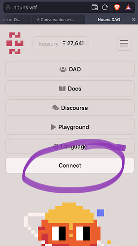

# Change login with wallet instead of Email

<!-- ✦✦✦ POST START ✦✦✦ -->

> **Post #1 • Miaryafar**
> Created: 2022-07-06 22:33
> Updated: 2022-07-06 22:33

it is not nice that I must log in to the nouns website with Email.  
Nouns is a cultural project in the web3 environment and needs to change the login method.

<!-- ✦✦✦ POST END ✦✦✦ -->

<!-- ✦✦✦ POST START ✦✦✦ -->

> **Post #2 • Benbodhi**
> Created: 2022-07-07 05:55
> Updated: 2022-07-07 05:55

Which do you mean?  
The main site is wallet connect  

Or do you mean here on discourse?  
That could be cool to make discourse a wallet connect log in.

<!-- ✦✦✦ POST END ✦✦✦ -->

