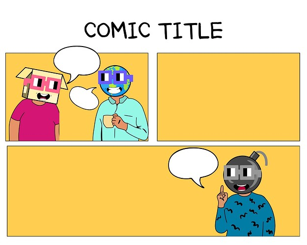

# Nounsfun Recap #Make Nouns Go Viral

<!-- ✦✦✦ POST START ✦✦✦ -->

> **Post #1 • system**
> Created: 2022-11-13 19:15
> Updated: 2022-11-13 19:15

Creative Entertainment #Nounish, With the goal of Make Nouns Go Viral.  
_Goal_

  * Create a strong interest to Nouns community.
  * Bringing the Nouns Glasses Trend to the Web2 of social media users.
  * Introduce Nouns differently and creatively.
  * Making Nouns go to Viral.

_Activity_

  * created 9 [tiktok](http://www.tiktok.com/@nounsfun) video content, reached 25k View and 2000 Like.
  * partnership with [MSV studio](https://msvstudio.co.id/2d-works) to create an animation short film.

MSV Studio has worked for years to produce animated stories and films that bring joy to its viewers. Artists, storytellers, and engineers in MSV Studio have created breathtaking animated feature films such as Battle of Surabaya, in 2015. This movie won more than 20 International awards. We also deliver services for advertising, TV project. As an animation studio we also have education and training programs for students an professionals.

  * [Nouns Comic template ](https://www.canva.com/design/DAFRiuMYcLs/iHVO_-_7V9TOFxfwu9o_Ow/edit?utm_content=DAFRiuMYcLs&utm_campaign=designshare&utm_medium=link2&utm_source=sharebutton)(Beta)

Comics as a Marketing Tool?

Why not?

  * Comics are a soft-selling marketing medium

  * Comics are casual

  * Comics, interaction-friendly marketing media

Those three things are why we’ve created a Comics Template that’s very easy for community to use creatively.

_Next Planing_

  * Creating More content to no end !
  * Improve our Comic templates for the better.
  * Extend our Partnership with MSV studio

<!-- ✦✦✦ POST END ✦✦✦ -->

