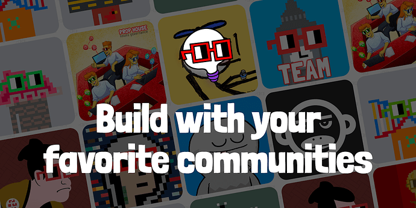

# Misuse of Delegation and voting power?

<!-- ✦✦✦ POST START ✦✦✦ -->

> **Post #1 • Evil**
> Created: 2022-11-24 11:06
> Updated: 2022-11-24 11:06

**tldr** : Small group of people manipulating votes and bending props in their way. Entry for new people into the nouns ecosystem decreases.

**Problem** : I’ve noticed that most of the prop and project have the same number of individuals. They are everywhere, be it either as team members or multi signer and even more. Feels like few people have got a tight grasp over the Nouns community where they just drain weekly and monthly ETH regularly. Thats okay right? You put in the work and hour and get compensated accordingly. But it feels like they are over paid, and that too from multiple sources.

One thing I noticed was delegates voting for themselves. This is just one of the few examples I have seen and few people think there are many others as well. Question arises, should delegates be allowed to vote for their own proposals and contest? Makes sense for a nouner but delegates? Who are building their own product or community but will ofc be biased towards their own proposal and vote.  
One recent example can be seen below at the [here](https://prop.house/nouns/challenge:-make-nouns-go-viral)  
The top voted proposal here is by [The Nouns Square](https://twitter.com/thenounsquare)  
Let’s ignore the first thing that is baiting people to do good for the prize money of $5,000 and focus on the things thats even more weird and maybe ethically wrong.  
TNS was set up with the goal to onboard new people into the Nouns ecosystem and spread the word around Nouns, in this case for sure they have been funded and using the same to organize prop house and contest, but why take part in an open round and submit for the prize when you have already been funded nicely before. This creates a huge gap between them VS someone with the potential to bring a whole new audience to Nouns. Thats **-1** potential builder already.  

Second of all, this wasnt even fair voting. The people who voted are the team members of TNS itself.

  

  
That’s **53 votes out of 87** on this prop already, way more than 50% in favour of a proposal by its own team.  
Let’s get to the nouncil voting side. 8 people from TNS are part of Nouncillors. See the entire list [here](https://maty-eth.notion.site/maty-eth/0b1e0f6e2c2549d6958ea5f61e64e112?v=7476442ec02e4eccbfa8cb7d1ea5ff19)  

It’s easy to say that even nouncil votes on the proposals are easily manipulated for the same reason. Consider what all they have contributed for the DAO. But why take part at all where it could have been won by someone else ? Should Delegates be allowed to vote on their own proposal ? Thats not morally wrong or right but is something that should be considered because vote manipulation in DAOs are not a new problem. If there will be some sort of rule then still something like can easily be done via friends voting for friends.  
Another example can be in the second winning entry. Keeping in mind that its a contest about making nouns go viral, and second place goes to an account that was made in November itself. Clearly not something that has been able to spread the words around nouns as of yet but still won. You can see everyone who voted for this entry as well. You can see where I’m going with this  

So this is a problem that should be solved soon otherwise in the long run these things can be problematic specially when there’s centralized groups in a community that calls itself DAO.

<!-- ✦✦✦ POST END ✦✦✦ -->

<!-- ✦✦✦ POST START ✦✦✦ -->

> **Post #2 • Evil**
> Created: 2022-11-24 11:07
> Updated: 2022-11-24 11:07

FYI, there are many more examples like this, from previous prop house to on-chains as well.

<!-- ✦✦✦ POST END ✦✦✦ -->

<!-- ✦✦✦ POST START ✦✦✦ -->

> **Post #3 • Hindsight**
> Created: 2022-11-24 11:40
> Updated: 2022-11-24 11:40

 Evil:

> Should Delegates be allowed to vote on their own proposal ?

I think this is a very good question.

I do not think that delegates should vote on any proposal they are in any way financially involved in.  
Dont know if this can be enforced on chain but should at least be a social norm.

<!-- ✦✦✦ POST END ✦✦✦ -->

<!-- ✦✦✦ POST START ✦✦✦ -->

> **Post #4 • Nounsfun**
> Created: 2022-11-24 11:53
> Updated: 2022-11-24 11:53

[@AndrewLaddusaw](/u/andrewladdusaw) any Feedback about this?

<!-- ✦✦✦ POST END ✦✦✦ -->

<!-- ✦✦✦ POST START ✦✦✦ -->

> **Post #5 • RGB-NOUN**
> Created: 2022-11-24 12:24
> Updated: 2022-11-24 12:24

Yip, this is the Nouns Atm that I keep referring to. I don’t think these questions are an attack on anyone but as props are scrutinised or ignored by the powers that be then the same tough love should come from the public’s side as well. It is going to be interesting if anyone from the core money makers give any transparent feedback. I think it should be [@maty](/u/maty) job to make a public ledger of how much money goes to all these individuals since the inception of the project. Is that not fair?

<!-- ✦✦✦ POST END ✦✦✦ -->

<!-- ✦✦✦ POST START ✦✦✦ -->

> **Post #6 • Evil**
> Created: 2022-11-24 12:44
> Updated: 2022-11-24 12:44

Maty has recorded so much already, keeping a track of this would be even more hectic for him I guess, also it’s almost impossible to track this. What I saw is a couple of people getting payment from multiple sources of the project they are a part of. This followed by the latest prop 175, where ~surprise surprise~ has the same number of people already. Also this very same has its own conflicts as of now.  
So same number of people doing work for different projects and then adding on more, being paid from all of these, that too overpaid is a problem of its own

<!-- ✦✦✦ POST END ✦✦✦ -->

<!-- ✦✦✦ POST START ✦✦✦ -->

> **Post #7 • RGB-NOUN**
> Created: 2022-11-24 12:46
> Updated: 2022-11-24 12:46

[@maty](/u/maty) is getting paid 5.5 eth a month to manage Nouns finances. I think he has time to fit this in to his schedule.

<!-- ✦✦✦ POST END ✦✦✦ -->

<!-- ✦✦✦ POST START ✦✦✦ -->

> **Post #8 • Evil**
> Created: 2022-11-24 12:50
> Updated: 2022-11-24 12:50

If this can happen then it would be amazing. But considering that he is a part of their team as well idk if that should be done.

  * Keeping track of all of these things might be hectic but I hope its possible.

<!-- ✦✦✦ POST END ✦✦✦ -->

<!-- ✦✦✦ POST START ✦✦✦ -->

> **Post #9 • Hindsight**
> Created: 2022-11-24 12:58
> Updated: 2022-11-24 12:58

 RGB-NOUN:

> [@maty](/u/maty) is getting paid 5.5 eth a month to manage Nouns finances. I think he has time to fit this in to his schedule.

Im not 100% sure that is [@maty](/u/maty) 's job.

I cant see why anyone would argue against complete transparency about what they are being compensated by the DAO. The onus should be on the people receiving funding for work to simply provide a very monthly update to a sheet saying how much compensation they got and from where.  
There are a lot of funding sources now in the dao between props, nfsw, nouncil etc etc. so expecting people to be able go into each of them and work out how much anyone is getting an compile a list is unrealistic. Maybe Maty could maintain this simple sheet. But it should really take up little time.

For example:

Hindsight (October 22)  
Prop House: 3 eth  
Prop 43: 1 eth  
NFSW: 1 eth  
**Total:** 5eth

<!-- ✦✦✦ POST END ✦✦✦ -->

<!-- ✦✦✦ POST START ✦✦✦ -->

> **Post #10 • RGB-NOUN**
> Created: 2022-11-24 13:06
> Updated: 2022-11-24 13:06

It is not hectic, as he is getting paid to essentially do a day job for the 5.5 eth p/m. If you can’t work on Nouns finances for 40 hours a week then you shouldn’t be getting paid this much. This is just logic if this machine is going to last, in-depth finances tracked, no double-dipping so that new people with solid ideas are going to get funded. If the core people involved can’t see this and be transparent with what they earn then the system is fundamentally broken.

<!-- ✦✦✦ POST END ✦✦✦ -->

<!-- ✦✦✦ POST START ✦✦✦ -->

> **Post #11 • RGB-NOUN**
> Created: 2022-11-24 13:09
> Updated: 2022-11-24 13:09

 [Proposal tracking & information sharing by maty](https://discourse.nouns.wtf/t/proposal-tracking-information-sharing-by-maty/2938) [NounsDAO Proposals](/c/nounsdao/nounsdao-proposals/6)

> TLDR: Fund maty to continue tracking all funded [proposals](http://www.proposal.wtf) (46 ETH saved) and writing [newsletters](https://nouns.substack.com/) (over 14k reads) for 5.5 ETH/month. About me Active in nouns every day for a year, founding Nouncil and Esports Pod member, Discord mod (rip), NSFW team member… but most of my work has been centered around a weekly newsletter and a few dashboards I have created in Notion. Tracking proposals Problem: It’s hard to follow individual projects after they get funded, the information is scattered. Acco… 

<!-- ✦✦✦ POST END ✦✦✦ -->

<!-- ✦✦✦ POST START ✦✦✦ -->

> **Post #12 • Sam**
> Created: 2022-11-24 13:31
> Updated: 2022-11-24 13:31

 Evil:

> should delegates be allowed to vote for their own proposals and contest?

This is between the delegate and the one who delegates, is it not?

<!-- ✦✦✦ POST END ✦✦✦ -->

<!-- ✦✦✦ POST START ✦✦✦ -->

> **Post #13 • Hindsight**
> Created: 2022-11-24 13:55
> Updated: 2022-11-24 13:55

If it was somehow enforceable on chain what do you think would be the optimal choice in terms of DAO governance and incentives…if you had to choose, knowing everything you do about the current delegate structure.

  1. Delegates CAN vote for props they are involved in
  2. Delegates CAN NOT vote for props they are involved in

<!-- ✦✦✦ POST END ✦✦✦ -->

<!-- ✦✦✦ POST START ✦✦✦ -->

> **Post #14 • Evil**
> Created: 2022-11-24 14:59
> Updated: 2022-11-24 14:59

Not when delegates votes on behalf of some nouns on their own proposal, specially when there are literally 100% nouns involved in a vote

<!-- ✦✦✦ POST END ✦✦✦ -->

<!-- ✦✦✦ POST START ✦✦✦ -->

> **Post #15 • BigshotKlim**
> Created: 2022-11-24 15:42
> Updated: 2022-11-24 15:42

100% agreed on this one. delegates should abstain if there is conflict

<!-- ✦✦✦ POST END ✦✦✦ -->

<!-- ✦✦✦ POST START ✦✦✦ -->

> **Post #16 • Nounsfun**
> Created: 2022-11-24 16:40
> Updated: 2022-11-24 16:40

I also feel that this should be handled, btw thank you [@evil](/u/evil) for conveying it here, actually I’ve brought up a little topic to fix this problem on discord NFSW, I think this is an obstacle to the development of nouns to develop in the future, how not? if this keeps happening then Nouns is no more than paying for 1 shirt at a price that is much more than once (if compared)

<!-- ✦✦✦ POST END ✦✦✦ -->

<!-- ✦✦✦ POST START ✦✦✦ -->

> **Post #17 • Nounsfun**
> Created: 2022-11-24 16:49
> Updated: 2022-11-24 16:49

it’s not about 1 person doing some of the work of the proposal they submitted, but HOW CAN THOSE WHO HAVE BEEN FUNDED PRIORLY WITH THEIR PROPOSAL, CAN REWRITE THE PROPOSAL WITH THE SAME PURPOSE AND THEY ARE VOTE TO WIN THE PROPOSAL

<!-- ✦✦✦ POST END ✦✦✦ -->

<!-- ✦✦✦ POST START ✦✦✦ -->

> **Post #18 • Nounsfun**
> Created: 2022-11-24 16:58
> Updated: 2022-11-24 17:05

for example like the one above, TNS was founded with the aim of getting new people into the Nouns ecosystem, and TNS should have been funded before. and they have a Nouns Give Back contest , and that I think is a feedback from TNS to Nouns , then they wrote a proposal to make nouns go viral, and they won it.

isn’t that the same?

[@cdt.eth](/u/cdt.eth) it seems the steps that must be improved for Prophouse are to review the proposal and prohibit a team or individual from participating in the round prop if (they have been previously funded to do the same thing) to make it run more fairly.

<!-- ✦✦✦ POST END ✦✦✦ -->

<!-- ✦✦✦ POST START ✦✦✦ -->

> **Post #19 • ponti**
> Created: 2022-11-24 19:27
> Updated: 2022-11-24 19:27

 BigshotKlim:

> 100% agreed on this one. delegates should abstain if there is conflict

Thank you [@BigshotKlim](/u/bigshotklim), 100% agreed on this one. delegates should abstain if there is conflict.

<!-- ✦✦✦ POST END ✦✦✦ -->

<!-- ✦✦✦ POST START ✦✦✦ -->

> **Post #20 • ponti**
> Created: 2022-11-24 19:33
> Updated: 2022-11-24 19:33

But [@toadyhawk](/u/toadyhawk) does not agree with you [@BigshotKlim](/u/bigshotklim), as he will continue to vote with his delegate votes to enrich himself at the expense of the DAO. He now has a new prop (Prop 175) with his usual friends who all vote together as Evil has noted. [@AndrewLaddusaw](/u/andrewladdusaw), any feedback on this?

 [nouns.wtf](https://nouns.wtf/vote/175)

### [Nouns DAO](https://nouns.wtf/vote/175)

One Noun, every day, forever. Nouns DAO is an experiment on the Ethereum blockchain.

<!-- ✦✦✦ POST END ✦✦✦ -->

<!-- ✦✦✦ POST START ✦✦✦ -->

> **Post #21 • BigshotKlim**
> Created: 2022-11-24 19:43
> Updated: 2022-11-24 19:43

I do not think that Toady or any of the Nouncilors are trying to do anything as you describe. It seems that you joined on the 19th and all of your posts have been pretty aggressive, demanding and accusatory. maybe you should back up and do some research on what has been going on with the DAO, the governance and the people in the community. Right now it sounds to me like you are trolling for conflict and attention. Are you building tools and projects to address the problems you are seeing? Would love to know what your angle is here

<!-- ✦✦✦ POST END ✦✦✦ -->

<!-- ✦✦✦ POST START ✦✦✦ -->

> **Post #22 • AndrewLaddusaw**
> Created: 2022-11-24 21:30
> Updated: 2022-11-24 21:30

A couple things. Looks like they would have won even without all of the extra votes from TNS people. The really bad part is that I believe each Noun gets 10 votes in the rounds. That means there were about 5000 votes available and only 379 cast. That’s criminally low participation. It points to there being a huge opportunity for those willing to step up the promotion game to breakthrough in the voting.

I actually like the fact that you guys are asking these questions. I think it’s healthy to look into it. I don’t feel anything nefarious is happening with prop house, and I do wish your methods were less accusatory, but it’s a good conversation to have.

I vote in all the prop house rounds for Nouncil, so I take the responsibility to read through all the props very seriously. I do find that most of the time the best props seem to make it through. I have also seen those that are close to winning get funding in other ways and get momentum even in a loss. That’s the whole reason for our incubator as well. We want to see more people create better props and get funded. Let’s keep making it better.

<!-- ✦✦✦ POST END ✦✦✦ -->

<!-- ✦✦✦ POST START ✦✦✦ -->

> **Post #23 • Evil**
> Created: 2022-11-25 05:29
> Updated: 2022-11-25 05:29

I know for a fact that many people have seen this issue and talk, but they dont wanna come forward and speak it out as they are a part of such teams themselves. My guess is Ponti is just one of those anon who create another anon account to bring this problem forward.  
Other thing is it will hurt their image and title in Nouns, you know how things are

<!-- ✦✦✦ POST END ✦✦✦ -->

<!-- ✦✦✦ POST START ✦✦✦ -->

> **Post #24 • Evil**
> Created: 2022-11-25 05:38
> Updated: 2022-11-25 05:38

"_That means there were about 5000 votes available and only 379 cast._ " ~ yeh thats not gonna help the case, its clearly visible in prop house vote that 100% of the votes on TNS prop is from them only. You cant divert this fact sorry.

“ _I do wish your methods were less accusatory, but it’s a good conversation to have_.” ~ It’s not accusation when one shows proof of their claims.

<!-- ✦✦✦ POST END ✦✦✦ -->

<!-- ✦✦✦ POST START ✦✦✦ -->

> **Post #25 • tracybcarpenter**
> Created: 2022-11-25 09:12
> Updated: 2022-11-25 13:16

Hey Evil!

First and foremost, TNS team members are a teeny tiny part of Nouncil votes. Please fill out this form immediately and get your butt in there:  
<https://form.addressform.io/f/nouncil-apply-for-membership>

**“Should Delegates be allowed to vote on their own proposal ?”**  
The voting system is defined and understood. The question of people voting for their own props is long standing, and has been questioned by many. Some of whom, have actually done the math. I am not aware of any time where it was found that these votes would make a difference. That said, I think a lot of folks would just feel better if you put it to vote. I see no reason not to! The ones for it say it doesn’t matter so let’s do this.

**“Let’s ignore the first thing that is baiting people to do good for the prize money of $5,000…”**

NGL. That struck me a little odd at first too. Doing good for reasons other than simple selflessness, at a high level, does not get one where one needs to go. For the younger, incentives get us going in the right direction, and help us become sensitive to the depth and value of what it creates. This is not a bad thing, IMHO. Especially in these times where kids grow up on-line with working parents, and have little guidance. It’s like Santa. The concept of unconditional love is extremely complex. Santa helps little ones understand the concept as they begin their journey towards oneness. I am not condoning lying to kids here, just making a point.

Perhaps a few people might have gotten involved in doing good because of the contest. I watched dozens of the videos, and the huge majority had obvious organizational experience in feeding the hungry and other ways of doing good in the world. The younger ones, less organized, but still mostly very effective and clearly inspired.

**“This creates a huge gap between them VS someone with the potential to bring a whole new audience to Nouns. Thats -1 potential builder already.” + “when you have already been funded nicely before.”**

Show me a +1 who has anywhere near the impact of TNS. And when you find them, ask if they were on a Noun O’Clock show. Our goal is to be behind that 1, and to promote their work on an ongoing basis. I don’t think we loose every builder who does not win any given prop house round. That person who becomes a -1 in your mind, will come again, or can drop into any TNS or internatioNouns show or discord, start asking questions, and they will be directed to any number of resources, including Nouncil.

I totally get the fact that other builders need space in prop house rounds, while TNS is partially funded. I say partially, because our props go in, but over time, our work expands exponentially. This is the nature of Nouns. The perfect example is the 24 hour spaces. In a traditional business situation, I would have budgeted 175k+ for it. Our team did it with zero ask. We sacrifice sleep and meals, to go way beyond what was planned, and that pattern continues as we grow. The incoming team has the same heart, dedication, and vision. And now, we are putting in some props to cover things.

Entering the Make Nouns Go Viral Challenge was simply a part of that, as are initiatives such as [nomo.wtf](http://nomo.wtf), and quite a few other things that we are discussing. The votes show support of this within the Nouns ecosystem. TNS is running it’s own prop house as a way to bring more builders on board in new ways, and we hope many of these will also increase our funding while putting less weight on the ecosystem.

This doesn’t address everything, but I hope it will help understanding as to why TNS is starting to participate more frequently in prop house rounds.

I appreciate everyone’s time, energy, and love for Nouns. Nouns rule!

~mamaxargs

<!-- ✦✦✦ POST END ✦✦✦ -->

<!-- ✦✦✦ POST START ✦✦✦ -->

> **Post #26 • AndrewLaddusaw**
> Created: 2022-11-25 17:02
> Updated: 2022-11-25 17:02

I used your proof in my response. You glossed over my entire comment evidently. I’m trying to point out solutions and other perspectives, but it doesn’t seem you’re ever interested in that side of the conversation.

I get that things are imperfect (that’s the case everywhere, especially web3). I also think we should strive for better all the time. When I look at the issues we have though, I think we need to improve proposals drastically before we can say that we have a vote collusion problem. We also need voter participation to increase a lot if we’re going to be able to point to a deep systemic issue in the DAO (Low vote participation is already a problem, but I digress).

From what I see, most props don’t get votes because they are woefully incomplete, not because of some nefarious gatekeeping plot. In rounds with 50+ proposals, on average maybe 5-10 are what I would consider complete. Those that understand what a voter is looking to see will continue to get funded over and over again unless the others can step up their game and make better asks.

<!-- ✦✦✦ POST END ✦✦✦ -->

<!-- ✦✦✦ POST START ✦✦✦ -->

> **Post #27 • ponti**
> Created: 2022-11-26 12:23
> Updated: 2022-11-26 12:23

What do we think will happen on the Prop 175 vote? Let’s look at the team list, it looks very familiar:

[@AndrewLaddusaw](/u/andrewladdusaw)  
BradQ  
ProfWerder  
SuperTightWoody  
Toady Hawk

How do you think [@toadyhawk](/u/toadyhawk) will vote with his 23 delegates? Will he vote to enrich himself further?

Do we not see a conflict of interest where Toady can create a prop, vote it through with his delegated votes and the influence he has in Nouncil and other places, and then just do it again and again and again?

This is obvious for everyone to see, and it is stopping people from joining Nouns community.

It is the same Toady people on The Noun Square, Nouncil, Ugly Nouns, all giving themselves money from the DAO.

Nouns is a farce, it makes me sad to say out loud.

<!-- ✦✦✦ POST END ✦✦✦ -->

<!-- ✦✦✦ POST START ✦✦✦ -->

> **Post #29 • Evil**
> Created: 2022-11-26 17:30
> Updated: 2022-11-26 17:30

I agree with you Andrew, idk which part myself but I think you are pointing out the latest Prop 175 here as a solution.  
Your intentions are at the right places and everything, but yes things are imperfect. I personally believe that PropBox proposal could have been constructed even better so that those who have mixed feelings about this would have liked it as well.  
I’m sorry for my past behavior last week if you think I was rude, I watched a new movie and I’m a whole different person now… for a couple of days

<!-- ✦✦✦ POST END ✦✦✦ -->

<!-- ✦✦✦ POST START ✦✦✦ -->

> **Post #30 • Evil**
> Created: 2022-11-26 17:34
> Updated: 2022-11-26 17:34

 tracybcarpenter:

> This doesn’t address everything, but I hope it will help understanding as to why TNS is starting to participate more frequently in prop house rounds.

I see, like Andrew said " things are imperfect " but still the way that prop won by votes from just the team involved in TNS is pretty scary in the long term. These things makes a DAO- a DAO on surface but in mid level turns it into a monopoly of only few specific people that control things, Thats not very decentralized and nounish

<!-- ✦✦✦ POST END ✦✦✦ -->

<!-- ✦✦✦ POST START ✦✦✦ -->

> **Post #31 • AndrewLaddusaw**
> Created: 2022-11-26 18:44
> Updated: 2022-11-26 18:44

> I watched a new movie and I’m a whole different person now

This made me laugh out loud. Time for a user name change? 

I’ve always said I’m not against you. That remains true. Let’s build solutions together.

<!-- ✦✦✦ POST END ✦✦✦ -->

<!-- ✦✦✦ POST START ✦✦✦ -->

> **Post #32 • ponti**
> Created: 2022-11-28 21:57
> Updated: 2022-11-28 21:57

These pictures were shared with me as they are public data but tell more stories of misuse and corruption at the DAO.

This is about [@AndrewLaddusaw](/u/andrewladdusaw), who is on [@toadyhawk](/u/toadyhawk) team from Prop 175.

Look at how Andrew abuses DAO money for his InternatioNouns project.

  1. Andrew get funding from NFSW for 2.2 ETH for his project InternatioNouns.

  2. Andrew then used those funds for a like and share competition to get engagement on his social media channel.

  3. Andrew then submitted a prop on the Nouns Go Viral Prop House campaign for InternatioNouns - which he already got funding for (which is already wrong).

  4. Andrew, who is active on Nouncil, then got his Nouncil friends to vote for him and win the 5 ETH (which is wrong because he already got funding for this).

You can see he pays himself twice for same work.

See, he pays himself twice. OK, maybe he just does this once, no big deal?

Now look at Prop 175 and Nouns Incubator.

  1. Andrew gets nominated for funding from Nouncil for creating Nouns Incubator.

  2. Andrew asks for retro funding in Prop 175 for 5 ETH for creating this same Incubator.

  3. He also got 0.69 ETH from NSFW for doing the same work.

Look who nominates him, his good friend Toady Hawk.

So if Prop 175 passes we are paying Andrew more than 10 ETH for coming up with the prop to pay him more ETH in the actual prop itself?

This is double dipping, plain and simple to see. You can see the evidence in the pictures.

This is a pattern, look at the people involved in the proposal, they are all Nouncil and UglyDAO and TNS, this is what they do, they just sneak ways to get money out of the DAO.

They are all obviously aware of these very clear issues and yet they dont stop it from being included in the prop? They don’t care… they feel too powerful, no one can stop them.

This is why everyone feels the game is rigged at Nouns.

Maybe if I pay for Prop Box “consulting”, maybe then I will get money from the DAO for my projects…

<!-- ✦✦✦ POST END ✦✦✦ -->

<!-- ✦✦✦ POST START ✦✦✦ -->

> **Post #33 • ponti**
> Created: 2022-11-28 22:06
> Updated: 2022-11-28 22:06

Also, please read this great article on Nouns governance problems:

<https://0xhindsight.substack.com/p/99-probnouns>

I will copy the best part here, sorry for copying your text [@Hindsight](/u/hindsight) 

> Having a look at the UglyDAO members and the amount of votes delegated to them - it seems that they have about 32 delegate votes (more or less) while owning 2 nouns
> 
> On top of this, there is a lot of overlap between their members and following groups/subdaos
> 
>   * lilNouns: 8 Delegates - Al409 who is on UglyDAO has decided the lilNouns vote in the last 10 props including this one (see: [here](https://snapshot.org/#/leagueoflils.eth))
>   * SharkDAO: 6 delegates - Joshua Fisher from SharkDAO is a member of UglyDAO and Nouncil (See: [Snapshot Vote](https://snapshot.org/#/sharkdao.eth/proposal/0x9a6538c3ca293703348b0c6860afd72733281d33321571e0328b8dfe9010a56a))
>   * Nouncil: 11 delegates - many members of UglyDAO are on Nouncil and have a lot of influence on the Nouncil vote
> 

> 
> So here we have a group of people in UglyDAO that also work together in Nouncil, TNS etc that have 57 (+/-) votes either (a) delegated to them or (b) have a lot of influence in delegated votes - while owning 2 Nouns between them.

This is important:

> **In discord they have stated that the objective from the working group in prop 175 would be to eventually work with builders to get their proposals passed in return for a % of the proposal and that uglyDAO (with all of its delegated votes) will support those proposals.**

<!-- ✦✦✦ POST END ✦✦✦ -->

<!-- ✦✦✦ POST START ✦✦✦ -->

> **Post #34 • AndrewLaddusaw**
> Created: 2022-11-28 23:02
> Updated: 2022-11-28 23:02

Yikes.

I’ll be very transparent with you. I’ve received two payments so far for my work in NounsDAO. 0.69 ETH which I was nominated for by someone who saw that I had many many hours into helping people with proposals with 0 ask for reward. I also received a nomination through the community retro round which I think I made 0.9 ETH. Don’t quote me. Slightly less than 1 though. I also have received two small retro rewards for FOODNOUNS (0.34 and 0.15 ETH respectively)

I have made zero from Nouncil and zero from InternatioNouns, even though I’ve gotten a nomination recently for retro rewards from both. I’ve won grants totaling a little over 14 ETH for the communities I’m a part of to do different projects, so I’m pretty proud of that. 

If 175 would pass, I did plan to use some of the 5 ETH as a retro reward to me and also to reward other Nouncil members who have done essential work to help the incubator process along. I hadn’t worked out the details on that yet, but the plan was to use a nomination process similar to what happens there now.

As for the things wrong in your report, they are quite numerous. InternatioNouns is not my project at all. I’ve just been helping them with proposals because that’s what I’m good at. They were very transparent about the use of funds for the 2.2 ETH and with the Nouns go viral project. I thought they did a pretty great job at it honestly and I think they’ll continue to do so.

Hopefully someday I’ll get the chance to double dip. I’ll need to get my first dip one of these days to experience such a thing.  To be honest though, I’d turn down any payment that was above the value that I thought I created.

I’m happy to answer any questions about me or what I’ve written here. I’ve said before, I’m an open book.

<!-- ✦✦✦ POST END ✦✦✦ -->

<!-- ✦✦✦ POST START ✦✦✦ -->

> **Post #35 • ponti**
> Created: 2022-11-28 23:09
> Updated: 2022-11-28 23:09

To quote another Nouner:

the “5 eth of retro funding for what has been done to build this system already” - what is this for exactly? The network? Who is getting paid?

> If 175 would pass, I did plan to use some of the 5 ETH as a retro reward to me and also to reward other Nouncil members who have done essential work to help the incubator process along. I hadn’t worked out the details on that yet

<!-- ✦✦✦ POST END ✦✦✦ -->

<!-- ✦✦✦ POST START ✦✦✦ -->

> **Post #36 • AndrewLaddusaw**
> Created: 2022-11-29 01:03
> Updated: 2022-11-29 02:58

Was my answer not clear? I’m not sure how to help further.

<!-- ✦✦✦ POST END ✦✦✦ -->

<!-- ✦✦✦ POST START ✦✦✦ -->

> **Post #37 • Evil**
> Created: 2022-11-29 05:32
> Updated: 2022-11-29 05:32

bruh ‎‎‎‎‎‎ ‎‎ ‎‎ ‎‎ ‎‎ ‎‎ ‎‎ ‎‎ ‎‎ ‎‎ ‎‎ ‎‎ ‎‎ ‎‎ ‎‎ ‎‎ ‎‎ ‎‎ ‎‎ ‎‎ ‎‎ ‎‎ ‎‎ ‎‎ ‎‎ ‎‎ ‎‎ ‎‎ ‎‎ ‎‎ ‎‎ ‎‎ ‎‎ ‎‎ ‎‎ ‎‎ ‎‎ ‎‎ ‎‎ ‎‎ ‎‎ ‎‎ ‎‎ ‎‎ ‎‎ ‎‎ ‎‎ ‎‎ ‎‎ ‎‎ ‎‎ ‎‎ ‎‎ ‎‎ ‎‎ ‎‎ ‎‎ ‎‎ ‎‎ ‎‎ ‎‎ ‎‎ ‎‎ ‎‎ ‎‎ ‎‎ ‎‎ ‎‎ ‎‎ ‎‎ ‎‎ ‎‎ ‎‎ ‎‎ ‎‎ ‎‎ ‎‎ ‎‎ ‎‎ ‎‎ ‎‎ ‎‎ ‎‎ ‎‎ ‎‎ ‎‎ ‎‎ ‎‎ ‎‎ ‎‎ ‎‎ ‎‎ ‎‎ ‎‎ ‎‎ ‎‎ ‎‎ ‎‎ ‎‎ ‎‎ ‎‎ ‎‎ ‎‎ ‎‎ ‎‎ ‎‎ ‎‎ ‎‎ ‎‎ ‎‎ ‎‎ ‎‎ ‎‎ ‎‎ ‎‎ ‎‎ ‎‎ ‎‎ ‎‎ ‎‎ ‎‎ ‎‎ ‎‎ ‎‎ ‎‎ ‎‎ ‎‎ ‎‎ ‎‎ ‎‎ ‎‎ ‎‎ ‎‎ ‎‎ ‎‎ ‎‎ ‎‎ ‎‎ ‎‎ ‎‎ ‎‎ ‎‎ ‎‎ ‎‎ ‎‎ ‎‎ ‎‎ ‎‎ ‎‎ ‎‎ ‎‎ ‎‎ ‎‎ ‎‎ ‎‎ ‎‎ ‎‎ ‎‎ ‎‎ ‎‎ ‎‎ ‎‎ ‎‎ ‎‎ ‎‎ ‎‎ ‎‎ ‎‎ ‎‎ ‎‎ ‎‎ ‎‎ ‎‎ ‎‎ ‎‎ ‎‎ ‎‎ ‎‎ ‎‎ ‎‎ ‎‎ ‎‎ ‎‎ ‎‎ ‎‎ ‎‎ ‎‎ ‎‎ ‎‎ ‎‎ ‎‎ ‎‎ ‎‎ ‎‎ ‎‎ ‎‎ ‎‎ ‎‎ ‎‎ ‎‎ ‎‎ ‎‎ ‎‎ ‎‎ ‎‎ ‎‎ ‎‎ ‎‎ ‎‎ ‎‎ ‎‎ ‎‎ ‎‎ ‎‎ ‎‎ ‎‎ ‎‎ ‎‎ ‎‎ ‎‎ ‎‎ ‎‎ ‎‎ ‎‎ ‎‎ ‎‎ ‎‎ ‎‎ ‎‎ ‎‎ ‎‎ ‎‎ ‎‎ ‎‎ ‎‎ ‎‎ ‎‎ ‎‎ ‎‎ ‎‎ ‎‎ ‎‎ ‎‎ ‎‎ ‎‎ ‎‎ ‎‎ ‎‎ ‎‎ ‎‎ ‎‎ ‎‎ ‎‎ ‎‎ ‎‎ ‎‎ ‎‎ ‎‎ ‎‎ ‎‎ ‎‎ ‎‎ ‎‎ ‎‎ ‎‎ ‎‎ ‎‎ ‎‎ ‎‎ ‎‎ ‎‎ ‎‎ ‎‎ ‎‎ ‎‎ ‎‎ ‎‎ ‎‎ ‎‎ ‎‎ ‎‎ ‎‎ ‎‎ ‎‎ ‎‎ ‎‎ ‎‎ ‎‎ ‎‎ ‎‎ ‎‎ ‎‎ ‎‎ ‎‎ ‎‎ ‎‎ ‎‎ ‎‎ ‎‎ ‎‎ ‎‎ ‎‎ ‎‎ ‎‎ ‎‎ ‎‎ ‎‎ ‎‎ ‎‎ ‎‎ ‎‎ ‎‎ ‎‎ ‎‎ ‎‎ ‎‎ ‎‎ ‎‎ ‎‎ ‎‎ ‎‎ ‎‎ ‎‎ ‎‎ ‎‎ ‎‎ ‎‎ ‎‎ ‎‎ ‎‎ ‎‎ ‎‎ ‎‎ ‎‎ ‎‎ ‎‎ ‎‎

<!-- ✦✦✦ POST END ✦✦✦ -->

<!-- ✦✦✦ POST START ✦✦✦ -->

> **Post #38 • Evil**
> Created: 2022-11-29 15:56
> Updated: 2022-11-29 15:56

I just found out that they’ve done this before too, earlier I thought just one time voted for themselves but…makes me wonder how many more cases like these have been going on under the Nounder’s nose as well as treasury

 [prop.house](https://prop.house/nouns/nounish-hackathon/2005)

### [Prop House](https://prop.house/nouns/nounish-hackathon/2005)

Get funded to build with your favorite communities.

  

<!-- ✦✦✦ POST END ✦✦✦ -->

<!-- ✦✦✦ POST START ✦✦✦ -->

> **Post #39 • Evil**
> Created: 2022-11-30 06:55
> Updated: 2022-11-30 06:55

I cant even… no questions answered, have diverted the entire chat when questions asked from others nouners as well, suddenly summoning their own friends to change the topic. This proves that how they are misusing their power honestly.  
Despite people asking them to be abstain from their own proposal and vote, now this discussion has come in full circle and proved my point once again. They are corrupted

**Toadyhawk**  

**Benbodhi**  

These are just few examples, seriously kudos to those who were abstain about their own proposals and my respect to them. But these guys?  

<!-- ✦✦✦ POST END ✦✦✦ -->

<!-- ✦✦✦ POST START ✦✦✦ -->

> **Post #40 • Benbodhi**
> Created: 2022-11-30 11:24
> Updated: 2022-11-30 11:24

⌐🄶-🄼

I’ve actually been afk proliferating nouns at an IRL event lately, for no monetary gain and actually spent like $7k out of pocket to do so. Forgive me for missing all these accusations and not participating in the chats.

But honestly, I feel like all this is not only disrespectful to the people who work day in and day out for Nouns DAO’s benefit, but also to the nounders. At least the comment about it happening under their noses.

I’m damn near positive most, if not all of the nounders have a hand in or a close eye on how the protocol is evolving, both on chain and the social layers.

They also still hold veto power… Should any prop seem to be a malicious attempt to drain the treasury through what you’re labelling misuse of votes (which I think is inappropriate tbh), or otherwise, it can be cancelled by them. To act like “it’s happening right under their noses” is both uninformed and imo more malicious than the actual so called misuse you’re attempting to socially vilify.

If you have a problem with how the protocol is working, you can submit a proposal to change things such as the ability to vote on your own proposals.

As it stands, whether we like it or not, a noun owner or delegate has one vote per noun, regardless of who submitted the proposal. It is baked in that you can vote on your own props and why wouldn’t you? If you submitted it, you clearly believe in it and are part of the consensus mechanism by voting. If someone believes they or others should abstain on their own props or any that are proposed by people they work with or have some relation to, that’s their call. This decision can’t be socially forced on others unless it is added to the protocol.

Trying to socially police the protocol is one of the key benefits to there being no central discord anymore imo. Anyone can try to shame others into voting a certain way based on social implications, but again, voters have the ability to vote as they see fit based on the protocol rules.

The people you’re targeting here work hard. This is a waste of everyone’s time imo.

If you’re looking to do some proposal results auditing, extrapolate payments out to an extended and unfunded period of work, leave out plenty of things that are done for no remuneration and generally bring this level of argument to the table, why don’t you start at the beginning and check over each and every proposal - even ask for funding to do so, see if it’s valuable to the DAO.

In summary:  
See a problem? Submit changes to the protocol. Everyone is free to use the protocol however they like and if a proposal is blatantly malicious or draining the treasury, there is still veto rights. It’s not a poor little protocol that needs the help of social policing.

My 2 gwei 

<!-- ✦✦✦ POST END ✦✦✦ -->

<!-- ✦✦✦ POST START ✦✦✦ -->

> **Post #41 • ponti**
> Created: 2022-11-30 13:03
> Updated: 2022-11-30 13:03

[@Benbodhi](/u/benbodhi) thank you for disclosing you are Ugly leader, and are a leader in the misuse of delegation and voting power at Nouns DAO.

 [Ethereum (ETH) Blockchain Explorer](https://etherscan.io/address/0xc1a75c35f861563c446e4b146381c6934d515168)

### [GnosisSafeProxy | Address 0xc1a75c35f861563c446e4b146381c6934d515168 | Etherscan](https://etherscan.io/address/0xc1a75c35f861563c446e4b146381c6934d515168)

The Contract Address 0xc1a75c35f861563c446e4b146381c6934d515168 page allows users to view the source code, transactions, balances, and analytics for the contract address. Users can also interact and make transactions to the contract directly on...

<!-- ✦✦✦ POST END ✦✦✦ -->

<!-- ✦✦✦ POST START ✦✦✦ -->

> **Post #42 • Evil**
> Created: 2022-11-30 13:50
> Updated: 2022-11-30 13:50

First of all I wanna say thank you for actually coming in and saying all of these things.  
What I’ve seen on discord and discourse is other people jumping in trying to take their side and others directly ignoring it, and by ignoring it I mean diverting the topic by any means on discord. When some nouners started asking questions from Toady as well his messages were clear that he was annoyed by nouners asking these. And as soon as this has happened his friends have jumped in chat and diverted the entire conversation from that point on. So these lack of answers raised even more questions.  
A week ago I started questioning these and they got offended and made fun of me, saying I dont have proof of my claims that they are misusing their votes to win multiple times again and again. Now that I showed proof they went silent instead of attacking in just 2 days timespan. I later on find more proof and others started speaking up as well  
Summary :  
You guys are taking advantage of lack of moderation and delegated nouns for your own benefit.

<!-- ✦✦✦ POST END ✦✦✦ -->

<!-- ✦✦✦ POST START ✦✦✦ -->

> **Post #43 • NanoNouns**
> Created: 2022-11-30 15:52
> Updated: 2022-11-30 19:18

Some thoughts:

  1. Nouns DAO is a governance structure. There is a treasury and there are votes (Nouns). Owners of votes can delegate their votes for any reason or no reason or vote the Nouns themselves. Delegations can be revoked at any time for any reason or no reason.

  2. The only people that have a legitimate interest in treasury spending are Nouns owners, as they control the treasury through their ownership of Nouns.

  3. Everyone else is part of the peanut gallery.

<!-- ✦✦✦ POST END ✦✦✦ -->

<!-- ✦✦✦ POST START ✦✦✦ -->

> **Post #44 • lilskrtskrt**
> Created: 2022-11-30 21:22
> Updated: 2022-11-30 21:22

I do think that the dynamic shifts when you have cross ownership of Nouns assets tho.

Lil Nouns owns 8 nouns now, so doesn’t the entire Lil Nouns ecosystem have a legitimate interest in the treasury spending of Nouns?

Does that make everyone who owns a Lil Noun not part of the peanut gallery?

<!-- ✦✦✦ POST END ✦✦✦ -->

<!-- ✦✦✦ POST START ✦✦✦ -->

> **Post #45 • Benbodhi**
> Created: 2022-11-30 21:43
> Updated: 2022-11-30 21:43

I’m happy for open discussions. I’ve literally just been busy, doing stuff for nouns.

Look, it comes down to the fact that this is your opinion. I sense that after listening to closed minded and badly researched opinions becoming the main points, especially when it’s attacking the hardest working people in the community, no doubt people will bow out, especially when you devolve into bad language.

But maybe this point needs to click for you: Nouns DAO is a protocol. Read the contracts, see how it works, use it or don’t.

How the noun owners use their votes, whether inactive, active or delegated, is the owner’s call. It’s very simple. If you try to imply there’s a social law on how to use them, where is the line in the sand? Those rules change from person to person. Sentiment changes. That’s the beauty of this, the protocol is written in code and is open and auditable. Also you’re able to submit your desired changes to the protocol via proposal. Trying to socially shame people into changing how to engage with a protocol is probably futile.

If I buy a noun, I will vote how I see fit, if I’m delegated a noun, I will vote how I see fit. If the owner of a delegated noun doesn’t like the way their delegate is voting, they have the option to remove delegation in seconds. It’s all in the protocol.

I think it’s time you dig deeper into how everything works at the protocol level rather than the social level for now.

<!-- ✦✦✦ POST END ✦✦✦ -->

<!-- ✦✦✦ POST START ✦✦✦ -->

> **Post #46 • Benbodhi**
> Created: 2022-11-30 21:50
> Updated: 2022-11-30 21:50

There’s many fractionalised noun owners. This would mean there is many people interested in how to vote on proposals at nouns.

An “interest in how the nouns treasury is spent” is exercised by voting using the nouns.

Retro actively hunting down audits from people that actually do work in the ecosystem is not required. If you aren’t presented with the information that satisfies your vote, you vote against on subsequent proposals. How many things have you seen that would never be funded again? The Noun Square in particular has been funded repeatedly after the DAO has been presented a clear and concise proposal. Which means a lot of noun owners see benefit.

I hope this helps.

<!-- ✦✦✦ POST END ✦✦✦ -->

<!-- ✦✦✦ POST START ✦✦✦ -->

> **Post #47 • Lnino**
> Created: 2022-12-18 07:38
> Updated: 2022-12-18 07:38

Hello GM Nouns Dao.  
I’m here as one of the TNS participants contest.  
As i see, everytime TNS held a contest, mostly they have the same winners again and again.  
They didn’t give any chamge for other participant to win.

Yes, everytime voting start they will vote the same artist. You can check the complain on TNS discord.

<!-- ✦✦✦ POST END ✦✦✦ -->

<!-- ✦✦✦ POST START ✦✦✦ -->

> **Post #48 • Lnino**
> Created: 2022-12-18 08:10
> Updated: 2022-12-18 08:10

Hello GM Nouns Dao.  
I’m here as one of the TNS participants contest.  
As i see, everytime TNS held a contest, mostly they have the same winners again and again.  
They didn’t give any chamge for other participant to win.

Yes, everytime voting start they will vote the same artist. You can check the complain on TNS discord.

<!-- ✦✦✦ POST END ✦✦✦ -->

<!-- ✦✦✦ POST START ✦✦✦ -->

> **Post #49 • Evil**
> Created: 2022-12-19 08:10
> Updated: 2022-12-19 08:10

You can put this up with the TNS team itself right?

<!-- ✦✦✦ POST END ✦✦✦ -->

<!-- ✦✦✦ POST START ✦✦✦ -->

> **Post #50 • Lnino**
> Created: 2022-12-19 08:27
> Updated: 2022-12-19 08:27

Yes already, not only me but lots of participants complained but the the TNS team seems doesn’t took it very well.  
Majority of the voters had connection with the participants, so they will voted for them.  
Same winners each contest, and the voters ignored the other participants entry which is more good

<!-- ✦✦✦ POST END ✦✦✦ -->

<!-- ✦✦✦ POST START ✦✦✦ -->

> **Post #51 • Lnino**
> Created: 2022-12-19 08:30
> Updated: 2022-12-19 08:30

This contest is for Global participants, but everytime TNS held contest 80% winners came from Phillipines.  
Compare to other participants entry, which are more better,more good, still the entries from Phillipines will be the winner

<!-- ✦✦✦ POST END ✦✦✦ -->

<!-- ✦✦✦ POST START ✦✦✦ -->

> **Post #52 • Lnino**
> Created: 2022-12-19 08:33
> Updated: 2022-12-19 08:33

You can check the contest winners from TNS, prop, Internationnouns and you’ll understand why i said this.

<!-- ✦✦✦ POST END ✦✦✦ -->

<!-- ✦✦✦ POST START ✦✦✦ -->

> **Post #53 • Clover**
> Created: 2022-12-19 17:57
> Updated: 2022-12-19 17:57

I wanna See Your art / content for contest.

<!-- ✦✦✦ POST END ✦✦✦ -->

<!-- ✦✦✦ POST START ✦✦✦ -->

> **Post #54 • Evil**
> Created: 2022-12-21 06:30
> Updated: 2022-12-21 06:30

Yeh I get what you are trying to say, I jumped into that channel and saw after a while [@Benbodhi](/u/benbodhi) was active and answering. 1 month is a long time

<!-- ✦✦✦ POST END ✦✦✦ -->

<!-- ✦✦✦ POST START ✦✦✦ -->

> **Post #55 • anastacia**
> Created: 2023-02-06 11:17
> Updated: 2023-02-06 11:17

I don’t know where to tell this issue again.  
TNS prize reward since November hasn’t distribute.  
Many winners doesn’t get their reward.  
TNS need more team to fixed this

When you see on the group, people complaining about their reward that hasn’t distribute, yet the admin just promise repeated.

Today, tomorrow, next week, next month but never realised.

Fix this please, do not make Nouns DAO negative because of this.

<!-- ✦✦✦ POST END ✦✦✦ -->

<!-- ✦✦✦ POST START ✦✦✦ -->

> **Post #56 • Evil**
> Created: 2023-02-06 15:02
> Updated: 2023-02-06 15:02

Hey!  
sadly, I’m aware of the issue you and many artist have, also its discouraging to see that people see me as someone to complain about this instead of the TNS team for some reason. I request you and others to join the Noun’s Jungle server where currently another prop for the TNS is running.  
Kindly join the server below, verify or welcome etc anything and find the channel " 226-the-noun-square… and speak.

 [Discord](https://discord.com/invite/s9Req4Ys) 

### [Join the The Jungle: Nouns DAO Discord Server!](https://discord.com/invite/s9Req4Ys)

Check out the The Jungle: Nouns DAO community on Discord - hang out with 428 other members and enjoy free voice and text chat.

<!-- ✦✦✦ POST END ✦✦✦ -->

<!-- ✦✦✦ POST START ✦✦✦ -->

> **Post #57 • Evil**
> Created: 2023-02-06 15:09
> Updated: 2023-02-06 15:09

oh wow going back at this thread after a while, literally missed your points here. Thank you for this insight

<!-- ✦✦✦ POST END ✦✦✦ -->

<!-- ✦✦✦ POST START ✦✦✦ -->

> **Post #58 • Evil**
> Created: 2023-02-06 15:30
> Updated: 2023-02-06 15:30

Visual presentation of wat 2 do , join, entry channel being the first thing you see, verify or something and scroll down under “upcoming proposals” and drop your questions to the TNS team there instead. Glad I could help  

<!-- ✦✦✦ POST END ✦✦✦ -->

<!-- ✦✦✦ POST START ✦✦✦ -->

> **Post #59 • ChiccarottiTom**
> Created: 2023-02-06 20:57
> Updated: 2023-02-06 20:57

It is enough to introduce a simple control mechanism, placed in the hands of the community of each of the groups that make up the nouns ecosystem.

One vote would be given to each member who joins a group on discord. It’s so great that these groups have been heavily fragmented. (The main channel actually died).When someone joins “from outside” they get 1 vote. They would act as shop stewards.  
And what would these votes give? Well, they would introduce the principle of rotation and the possibility of dismissal of delegates. E.g. through some kind of petition to the owner of the noun.  
Better to control from below than from above. Then we have full democracy, and no one will complain about the delegation holders, because if they are transparent about spending and voting, no member of the community will have to use their vote against them.  
Introducing something like this would not be technically demanding either.

<!-- ✦✦✦ POST END ✦✦✦ -->

<!-- ✦✦✦ POST START ✦✦✦ -->

> **Post #60 • Evil**
> Created: 2023-02-07 05:42
> Updated: 2023-02-07 05:42

There were some attempts to do anon votings just recently, hopefully that could help. It might enable to miuse of delegation but it can also encourage people to vote freely without peer pressure in nouns

<!-- ✦✦✦ POST END ✦✦✦ -->

<!-- ✦✦✦ POST START ✦✦✦ -->

> **Post #61 • Kehla_R**
> Created: 2023-02-09 06:09
> Updated: 2023-02-09 06:09

All these are just pointless accusations

I joined the DAO full time through TNS contests and Twitter spaces, everything I know about nouns now,i knew them through TNS.

I’ve participated in most TNS contests and I didn’t win some but if I’m being honest, most of the regular winners of those contests are very very good artists(kimdeuk,skwalo,pumey,clover,etc), it’s their work that speaks for them hence giving them lots of votes on their entries,it has nothing to do with TNS team supporting a particular group.

I’m a pro TNS and will always be  
If you have a problem with Toady come straight and stop looking for means to create conflict  
Anyone that has been associated with TNS will know TNS team is very transparent and they are the nicest people in this DAO.

And for those saying they don’t pay their contest winners,I can send all the screenshots of the payments I’ve received from TNS for the contests I won and the twitter retweets I’ve won, sometimes they skip wallets but when you notify them,they add it immediately and pay you during the next badge of payment

Evil, is TNS the only subdao in nouns dao?..but all your complaints are always targeted at them, isn’t it obvious you are not trying to look out for the DAO, this is just pure fud and hate for TNS.

<!-- ✦✦✦ POST END ✦✦✦ -->

<!-- ✦✦✦ POST START ✦✦✦ -->

> **Post #62 • Evil**
> Created: 2023-02-09 15:53
> Updated: 2023-02-09 15:53

 Kehla_R:

> Evil, is TNS the only subdao in nouns dao?..but all your complaints are always targeted at them, isn’t it obvious you are not trying to look out for the DAO, this is just pure fud and hate for TNS.

Oh Gee… I wonder why there’s now a 2nd person telling me that there are other subDAO and projects that I aint targeting. You think I should spread FUD and hate for other subDAOs? Why ? Spreading all of this is not nounish.  
Also about your statement, read the title of this discussion

<!-- ✦✦✦ POST END ✦✦✦ -->

<!-- ✦✦✦ POST START ✦✦✦ -->

> **Post #63 • Evil**
> Created: 2023-08-26 07:33
> Updated: 2023-08-26 07:33

These scammers mfkr at it again now trying to scam

 [prop.house](https://prop.house/thank-ape/apecoin-influencers:-spreading-apecoin-worldwide/7140)

### [Prop House](https://prop.house/thank-ape/apecoin-influencers:-spreading-apecoin-worldwide/7140)

Get funded to build with your favorite communities.

<!-- ✦✦✦ POST END ✦✦✦ -->

