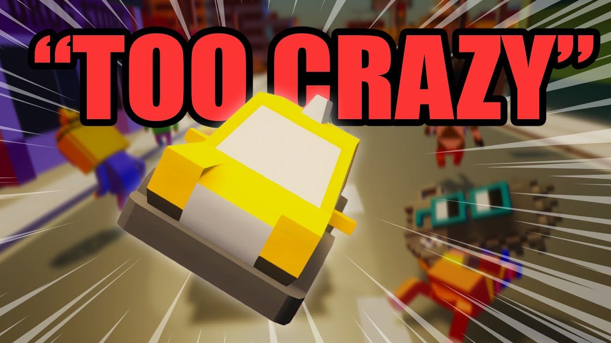
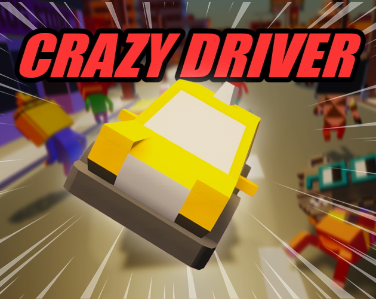
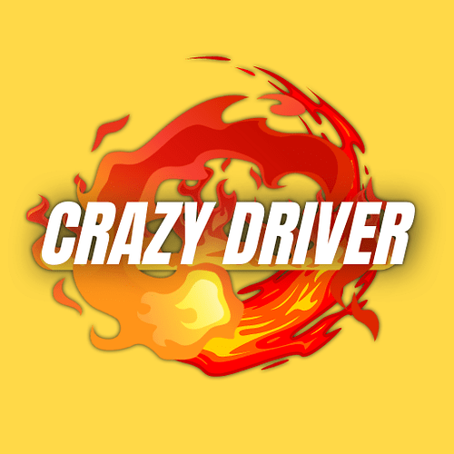
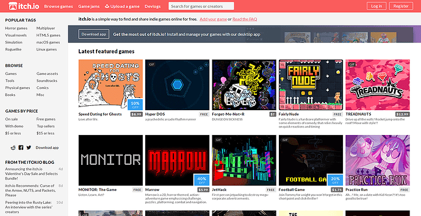
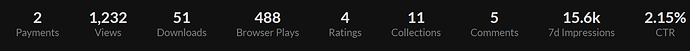
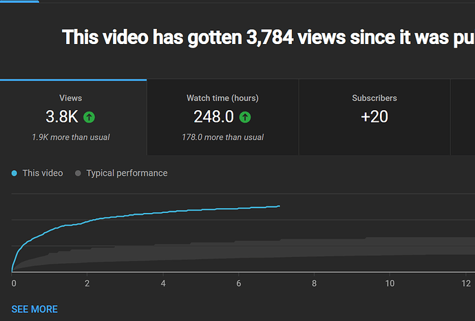
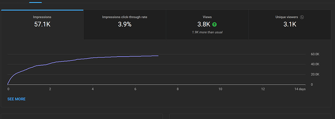
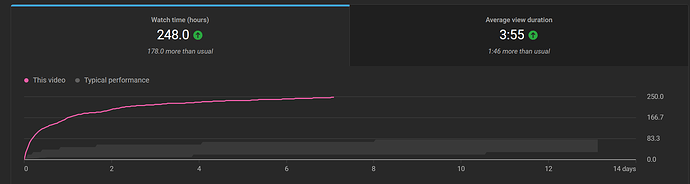
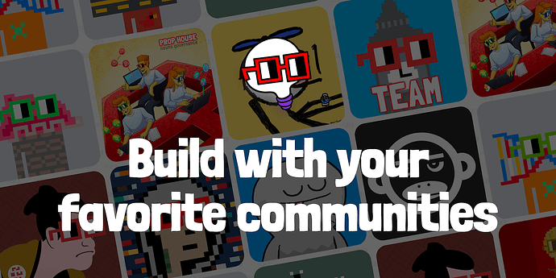

# I Made a Crazy Taxi Nouns Game And a YouTube Video About It!

<!-- ✦✦✦ POST START ✦✦✦ -->

> **Post #1 • samy**
> Created: 2023-01-16 17:16
> Updated: 2023-01-16 17:16

Hey all!  I’m a gamedev content creator on YouTube and engineer.

I used the [3Dnouns.com](http://3Dnouns.com) characters in a Crazy Taxi game I made and published a video detailing the process. I uploaded the game to my [itch.io](http://itch.io) (WebGL, Windows) and Android’s Google Play. I spent around a month between the game, optimizing, publishing, recording, editing, and uploading. Also added the #EnterTheNouniverse tag to the description  Let me know if y’all have any thoughts or feedback!

You can find the video here!

And the game:

 [itch.io](https://sam-yam.itch.io/crazy-driver)

### [Crazy Driver by samyam](https://sam-yam.itch.io/crazy-driver)

Play in your browser

[play.google.com](https://play.google.com/store/apps/details?id=com.Samyam.CrazyDriver)

### Crazy Driver

Race against time with wacky car physics to pick up and drop off passenger...

_Free_

Some cool analytics 

[itch.io](https://itch.io)

### [Download the latest indie games](https://itch.io)

itch.io is a simple way to find, download and distribute indie games online. Whether you're a developer looking to upload your game or just someone looking for something new to play itch.io has you covered.

YouTube  

  

  

<!-- ✦✦✦ POST END ✦✦✦ -->

<!-- ✦✦✦ POST START ✦✦✦ -->

> **Post #2 • Aubtoshi**
> Created: 2023-01-16 21:43
> Updated: 2023-01-16 21:43

This is incredible! Epic to have an established game developer in the ecosystem who is already using other builder assets. Very nounish. The taxi is giving major Dreamcast nostalgia.

<!-- ✦✦✦ POST END ✦✦✦ -->

<!-- ✦✦✦ POST START ✦✦✦ -->

> **Post #3 • Swoleluksobags**
> Created: 2023-01-17 02:28
> Updated: 2023-01-17 02:28

Love this! Great work!

<!-- ✦✦✦ POST END ✦✦✦ -->

<!-- ✦✦✦ POST START ✦✦✦ -->

> **Post #4 • samy**
> Created: 2023-01-18 15:12
> Updated: 2023-01-18 15:12

Hey all! Thanks for the support on social and hope you’ve been enjoying the game!

I’d like to request retroactive funding for my recent project “Crazy Driver”, where I created a game similar to Crazy Taxi but with Uber elements, and featuring Nouns characters as the passengers! As you can see above I have posted the analytics so far on my YouTube video and [Itch.io](http://Itch.io) views. Since then I now have around ~4.1K views on the video, 51 downloads for the Windows version, and 503 Browser plays on [itch.io](http://itch.io).

I have around 34K subscribers on YouTube. The game is published on WebGL, Windows, and Android. It took me around a month to develop the game, optimize it, prepare the video, edit, publish, and promote on social media. I also created a Spanish version ([Hice CRAZY TAXI pero UBER (⭐⭐⭐⭐⭐) - YouTube](https://youtu.be/vNdNf40STV8)) of the video on my newer channel, promoted the video (English version) on Reddit, Twitter, and made a TikTok/Reels/Short. I work on creating content full-time and loved making such a fun and simple game. Here is a small breakdown of my ask:

*Total ask: 10 eth  
Justification:  
-Android Phone: ~.3 eth - Had to purchase a phone to test the game  
-Creation of Game: 6.3 eth  
-Recording, Editing, Publishing Video: 3.4 eth

I’ve also created a Google Doc with some of the advertising and work I did for the game: [Crazy Driver - Google Docs](https://docs.google.com/document/d/1tqKMoGGMp9uv0QgTbTck-AP-m4E-3U79h7JWPVglmmE/edit?usp=sharing)

I hope to continue creating more fun content with Nouns in the future, thank you 

<!-- ✦✦✦ POST END ✦✦✦ -->

<!-- ✦✦✦ POST START ✦✦✦ -->

> **Post #5 • noun22**
> Created: 2023-01-18 21:57
> Updated: 2023-01-18 21:57

hi Sam, great work… we talked about it at NSFW, and we’d love to grant you a retro reward of 1 ETH, how’s that sound?

<!-- ✦✦✦ POST END ✦✦✦ -->

<!-- ✦✦✦ POST START ✦✦✦ -->

> **Post #6 • samy**
> Created: 2023-01-19 01:19
> Updated: 2023-01-19 01:19

Thanks so much! Yes, sounds good to me , appreciate it! My wallet address is samygarcia.eth

<!-- ✦✦✦ POST END ✦✦✦ -->

<!-- ✦✦✦ POST START ✦✦✦ -->

> **Post #7 • Hawwal**
> Created: 2023-01-19 12:15
> Updated: 2023-01-19 12:15

Great work [@samy](/u/samy) totally loving this game and the concept behind it. Looking forward to when it’d be available on IOS. I’m def. gonna be downloading it. 

<!-- ✦✦✦ POST END ✦✦✦ -->

<!-- ✦✦✦ POST START ✦✦✦ -->

> **Post #8 • samy**
> Created: 2023-01-19 16:02
> Updated: 2023-01-19 16:02

Thank you! I wasn’t planning on uploading on iOS because I don’t have a developer account and they are more strict with the apps, but maybe I should!

<!-- ✦✦✦ POST END ✦✦✦ -->

<!-- ✦✦✦ POST START ✦✦✦ -->

> **Post #9 • Hawwal**
> Created: 2023-01-19 16:17
> Updated: 2023-01-19 16:20

Oh I see, you should really consider though. I hope this project gets executed. Welldone.  
Also if you need an animated commercial for this, I and my team would love to create a 2D animation for this, I really love the concept.

<!-- ✦✦✦ POST END ✦✦✦ -->

<!-- ✦✦✦ POST START ✦✦✦ -->

> **Post #10 • BigshotKlim**
> Created: 2023-01-19 20:16
> Updated: 2023-01-19 20:16

Hi Five! Well deserved and I cant wait to see more.

<!-- ✦✦✦ POST END ✦✦✦ -->

<!-- ✦✦✦ POST START ✦✦✦ -->

> **Post #11 • samy**
> Created: 2023-01-26 18:19
> Updated: 2023-01-26 18:19

thanks! it was designed to be a small game done within a weekend, but quickly turned into a full month-long game  i will consider it!

<!-- ✦✦✦ POST END ✦✦✦ -->

<!-- ✦✦✦ POST START ✦✦✦ -->

> **Post #12 • samy**
> Created: 2023-05-17 23:52
> Updated: 2023-05-17 23:52

The Nouns Video Contest is going on right now and my video showing off Nouns CC0 Assets and the game I made was selected into the _top 10_! Your vote would mean the world to me, thank you.  
My entry is: **Winning over Game Developers: Showing Off Nouns Awesome CC0 Assets**

 [prop.house](https://prop.house/nouns/%24200k-video-contest-final-vote)

### [Prop House](https://prop.house/nouns/%24200k-video-contest-final-vote)

Get funded to build with your favorite communities.

<!-- ✦✦✦ POST END ✦✦✦ -->

