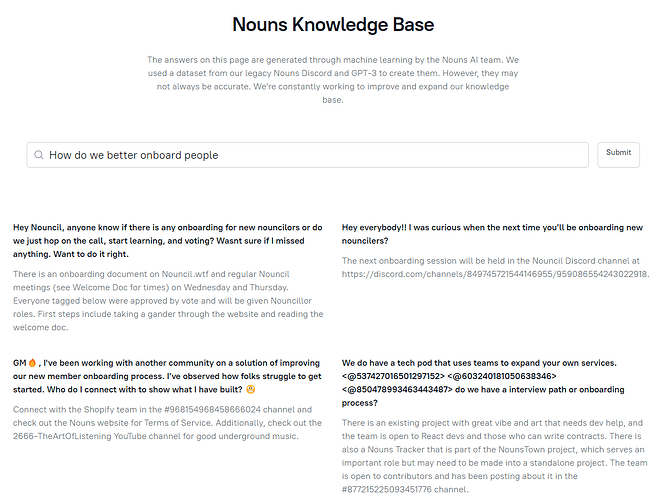

# YOU FOUND NOUNS NOW WHAT? : How do we onboard new people with thoughtful care and respect

<!-- ✦✦✦ POST START ✦✦✦ -->

> **Post #1 • BigshotKlim**
> Created: 2023-01-21 18:16
> Updated: 2023-01-21 18:16

Asking a general question for the community.

Is there anyone working on a new method/platform/discord channel that is inforative, welcoming and engaging to new people coming into the NOUN ecosystem? The jungle seems to be fileld with all sorts of life as well as predatory opportunists that herd attention towards their own causes, and may not speak or act for the grater good of the community. I have dozens of high level corporate brands, international clients and high level artists that are NOUN curious but I can not bring them here and have them discover the garbage anonymous personal attacks on builders or unproductive shit posting ( I know this is web 3 and I was personally told that “if you can’t handle it maybe you should leave”)  
I can not cosign my reputation that i have carefully crafted over two decades of grinding and building by exposing my contacts to this project despite my love and commitment to it. I strongly feel that there has to be another way to welcome the masses that are all coming to this space and look to NOUNs as a beacon of hope and positivity. Is that not what NOUNISH is all about?  
:Who is managing onboarding and what is the “welcome to nouns” strategy?  
:Can we get an AI widget to help new people answer questions? [@TheHeroShep](/u/theheroshep) it feels that this is one of the key components of bringing people in and being respectful of their time and thankful for their curiosity  
What are some of the things you want to see changed or what can be done better?  
lets compile this as a list so that anyone building can reply or add suggestions

Thank you

Klim

<!-- ✦✦✦ POST END ✦✦✦ -->

<!-- ✦✦✦ POST START ✦✦✦ -->

> **Post #2 • TheHeroShep**
> Created: 2023-01-21 18:46
> Updated: 2023-01-21 18:47

A huge part of our goal with the knowledge hub is making it easier to get your questions answered and sharing knowledge throughout the DAO.  
You can see the first steps to that here <https://roko.dev/qa>

The idea is focus on:

  1. Have a webapp you can go to learn by chatting with Nounish data
  2. Get that infront of people in Discord / other clients by, if someone asks a question that there are answers for in the knowledge hub, have Roko the bot reply and make a thread right there
  3. Surface relevant info to an ongoing convo.

If this sounds interesting to you would love to [have your vote](https://nouns.wtf/vote/214) for our prop on chain now & discuss more in our weekly calls / NounsAI Discord!

Wed be happy to be part of an ongoing discussion or hop on a call to discuss

<!-- ✦✦✦ POST END ✦✦✦ -->

<!-- ✦✦✦ POST START ✦✦✦ -->

> **Post #3 • BigshotKlim**
> Created: 2023-01-21 18:49
> Updated: 2023-01-21 18:50

Amazing, if there is anything you need that I can help with, including workshopping possible questions that new noun curious people may have I am happy to jump on a call or discord discussion. Happy to see this going on. Thanks Shep for all you do. I dont have a noun to vote with but if I did you guys would get a 100% trustless hell yes every time

<!-- ✦✦✦ POST END ✦✦✦ -->

<!-- ✦✦✦ POST START ✦✦✦ -->

> **Post #4 • Someone**
> Created: 2023-01-21 21:20
> Updated: 2023-01-21 21:20

Currently our team is engaged in the creation and development of the Russian-speaking Nouns community.  
And although we are on this very long journey, the ideas you describe are very close to us.  
[Twitter](https://twitter.com/NounsDAOru) | [Telegram](https://t.me/NounsDAOru)

<!-- ✦✦✦ POST END ✦✦✦ -->

<!-- ✦✦✦ POST START ✦✦✦ -->

> **Post #5 • BigshotKlim**
> Created: 2023-01-21 22:00
> Updated: 2023-01-21 22:00

Spaseebo moi Droog. Looking forward to seeing what you are doing

<!-- ✦✦✦ POST END ✦✦✦ -->

<!-- ✦✦✦ POST START ✦✦✦ -->

> **Post #6 • pips**
> Created: 2023-01-22 08:13
> Updated: 2023-01-22 08:13

TL;DR

I’ve found a lot of work done on this, scattered across various points. I’ve also been in touch with various people recognizing this pain point and see there’s a lot of community talent that can go towards remedying this. I think it just needs some coherence on what the structure of that improvement is, a plan and an execution team. But yes, I completely agree that there’s work to be done to improve the Nouns image before actively putting out messages that could reach people on the fence. Yeah, a comment like “can’t handle it maybe you should leave” is a sure-fire way to kill the creative/dev community and stagnate the Nouns’ floor price. Please read on and see my thoughts on how to raise it.

Full Thoughts:

Brilliant! And an important sentiment for all those wishing to perpetuate not only the Meme and the Nounish ethos, but also the very notion of what a DAO is.

I’ve found that there’s a lot of work being done to improve the onboarding process for new members in the Nouns community, but it’s scattered across various points. From speaking with and hearing other members, it seems that there’s a lot of community talent that can go towards resolving this issue.

What’s needed is a clear plan and execution team to bring coherence to the structure of the improvement. Currently, there are two main onboarding frontends, the [nouns.wtf](http://nouns.wtf) auction site and the nouns.center sites. They both serve their purpose well, but a solid nouns main page, a brand page, and a design modeled after successful industry creative brands could really elevate and better communicate what it means to be Nounish!

It would do well for the community to come to a consensus on the DAO’s future direction and this could be an inflection point for it. A “What It Means To Be Nounish” video could serve as the first thing people see on the main page, communicating the DAO’s vision and values in an authentic, emotional and captivating way. The community needs to decide if they want the brand to stay where it is, be an NFT project, prominent as it is, or take it to the next level; to go on the world’s stage. If the answer is to elevate the brand and create new revenue streams for the DAO, then a main site would need to reflect that.

In order to make these steps, the community would need to cultivate the builders and creators it’s brought in; translate the DAO’s vision into actionable goals and either solicit proposals or bring in full-time or part-time contributors. This will take work, and importantly, will require coordination. Putting every proposal for a general vote would obviously be a bottleneck and having subDAOs handle specific types of funding is a step in the right direction. But there needs to be a layer between the DAO and the subDAOs to vet, manage, and ensure delivery of funded work; perhaps an elected council of vetted experts and industry experts.

This requires a program/product/project management approach, with creative directors, technical leads, and principle engineers. Traditional companies handle this through a clearly defined hierarchy and chain of command, and for the benefits of that traditional method to be replicated in a decentralized way, careful thought needs to go into selecting the right process and set of tools. I know the ethos of DAOs is decentralization, but I don’t believe there’s a way to circumvent leadership, authority to at least help establish decentralized workflows/SOPs.

The idea is to bring in industry leaders, introduce them to the Nouns ecosystem, be inspired, run with the Meme, catalyze their success via props, and then have them proliferate the Meme among their industry peers, 100x the brand, sell the brand and bring it home. Nouns has the potential to be a true household name, perhaps the first Web3 brand to challenge industry. But for the brand to survive, grow, and financially diversify, there needs to be a clear and smooth process of onboarding talent, defining metrics and evaluating ROIs. Talent is who will create content, talent is what will spread the Meme, talent is how the brand will elevate and it needs to be done now and here.

Remember, the DAO must compete in the labor market like any other organization, it’s really not special in that regard. Yes, there are some upsides, but also, keep in mind that for real talent, the DAO needs to offer more than just financial incentives. The community needs to be welcoming, engaging, and informative to attract and retain top talents, achieve its goals, and bring the Nounish ethos to the world stage. Why would an Apple developer write applications for the DAO? Why would a Disney animator model characters? Why would an IBM engineer engineer build AI systems? Imagine NounsDAO competing to recruit Ivy League graduates. Yes, the first people will join because they believe in being Nounish, but, unless there’s real compensation for their work, the DAO will always take a backseat in terms of their priority and time. At best being fun side-projects and at worst leaving and discouraging others.

I’m a Web3 developer. I’ve chosen to make my living this way, but at the end of the day I need a roof over my head, food on the table and personal capital to grow. Don’t think open-source/CC0 means free work, most well maintained and executed open-source and CC0 creations eventually leads to some kind of revenue, either directly or indirectly by boosting the creator’s portfolio. I make my living off the blockchain, my time is money, that’s undeniable

Right now, power comes from creating fiscal incentives that align with the DAO’s mission. And, yes these ideas are bullish, and those with conservative views about the treasury have their place, after all every corporation has a CFO to handle all the corporate financial engineering, but the people who drive the real value in any company are the builders, the creatives, the talent. My advice is to foster growth within the ecosystem, invest capital, energy and time into the brand, and real power will follow, the power of influence and respect. Think keeping the treasury up will keep the floor up? Imagine what the floor price will be if being a Nouners means having a seat on the board of a multi-billion dollar multi-national cooperative.

Well, now how do we manage all this? How do we both govern and run a business? I view DAOs as the merging of government and corporations and putting them in the hands of the people. Sure the execution is novel, but the fundamentals of diplomacy, politics, economics etc… are still all there. There’s good reason to not only dream about what if, but to also learn from those who came before us and stand on the shoulders of their success.

Look how large and impactful the NounsDAO has become, the gravity and how real lives and livelihoods are being affected by votes cast. This is no longer that baby Noun, where votes can be cast for the memes, no people, real souls are at stake with each vote. And It’s good that we have delegates who can handle this pressure with maturity and grace.

The two most common systems of governance in modern times, the presidential and the parliamentary system do have their flaws, but they’ve also been refined and stood the test of time. As I heard from a Nouner, “decentralization does not mean lack of organization”.

DAOs are meta-nations (pun intended), with NounsDAO being a country within a larger emerging digital universe (metaverse). And just like all nations, as a DAO grows, various organs of governance such as the handling of diplomatic matters (inter-DAO collaborations, metaverse embassies and consulates), the treasury (fiduciary oversight for outgoing transactions, and regulatory compliance of income), trade relations and banking (crypto swap contracts, exchange/market listings), commerce (builders/creators programs, subDAO funding, incubators etc…), education and public relations (writers, journalists, publicists, social media experts, marketers, spokespeople etc), and others would need to be established and manned in order for the DAO to function and scale effectively.

Where’s the DAO’s constitution or charter laying on the structure of governance? The rights, responsibilities and duties of members? What if Nouns 0 becomes the sole delegate, elected on a fixed and limited term basis, to wield veto power and be titled “Chief Noun”, or “Noun Prime” or the such. Or for any prop to execute after passing, to also require their signature? And similar to a Prime Minister or President, they could have a budget and authority to assemble an appropriately sized execution team. This is possible, it’s also possible to have a similar method as the US constitution’s article 25 for those concerned, so that perhaps a 3/4ths yay vote could override the veto. Point is, a lot of political scientists have put significant academic effect into theorizing the various mechanics of governance checks and balances. Perhaps it would be good for the first leader to be a woman? To shake and counter that negative image those from the outside hold of DAOs being a “bros” club. There are ways and we should look out across the greater Web3 ecosystem to utilize tools like Aragon for dispute resolution, and wonderverse for managing, tracking and paying props (and perhaps even individual team members directly); in general to utilizing existing and well designed Web3 resources.

Going through a lot of voter comments on Agora I see a lot of groupthink along the lines of “I’m not an expert in this field so I’ll abstain” or “I’m not an expert but trust so and so Noun holder who’s voting yes, so I’ll vote yes”. Well, was that Noun holder vetted, do they have industry pedigree? This is why it’s essential to have an internal Nouns team composed of industry experts to properly vet, manage, synergize and hold prop recipients accountable for their deliverable; heck even implement basic milestones based funding.

Now as to what I’ve been doing for the DAO. I’d put in significant effort, along with my teammates to understand the ecosystem, to connect, learn, ideate and execute on what would bring the DAO value. I’ve been in touch with @Atrium about incorporating and showcasing their work within our prop. And I’d love to collaborate with [@TheHeroShep](/u/theheroshep) on how to bring their AI tools into a 3D virtual experience. Perhaps there could be an AI widget to help new people answer questions. We can start by auditing and creating/condensing documents into a centralized repository, perhaps a Nouns Awesome List, of all the resources, and outcomes for all funding received. We can then craft an improvement plan by first creating a list of things that need to be changed or that can be done better. This list can be compiled and anyone can reply or add suggestions. This will help to focus the community on specific areas that need improvement and create a more welcoming, constructive and productive environment for new members.

I’ve heard that the last NYFW prop was less than stellar, but my colleagues and I are here to make amends. To prop up the Nouns’ reputation within the fashion industry. We’ve taken the time and care to craft a thorough proposal, have secured the runway spots, and designed the collection. We’re fashion and digital experts, with real industry connections, staking our careers and delivering two runway Events, London and New York Fashion Weeks, along with a digital runway for the same price as the last prop. We’re here to Make Nouns Great Again, to Build It Back Better. But we don’t have much time to finish our execution, we’re actively searching for a sponsor and would greatly appreciate any help towards getting our prop on-chain.

The NounsDAO has reached a point, and is growing day by day, of being the pinnacle example of what a Web3 brand success story looks like. This experiment must succeed, for the sake of all DAOs, we must succeed, we cannot fail - either through paralysis or misaction. Let us show the world there’s more to crypto than FTX!

<!-- ✦✦✦ POST END ✦✦✦ -->

<!-- ✦✦✦ POST START ✦✦✦ -->

> **Post #7 • Mantis**
> Created: 2023-01-23 08:00
> Updated: 2023-01-23 08:00

What you describe is an issue in many DAOs. Interesting to hear your take, and good to know I’m not alone in my thought process.

<!-- ✦✦✦ POST END ✦✦✦ -->

<!-- ✦✦✦ POST START ✦✦✦ -->

> **Post #8 • viks_rum**
> Created: 2023-01-30 11:24
> Updated: 2023-01-30 11:24

We have helped over a 100 DAOs with this and the approach is always super custom. I’ve no way of reaching out to the right stakeholders in Nouns through governance because I don’t have a Nouns either but I’m sure what DaoLens does it going to be loved. We let people explore their reputation pathways depending on answers they give while onboarding, we have a brand new Chat GPT powered ask me anything for newcomers and we also have DAO Manager which handles everything from discussions to voting to tasks to payouts to reputation all from one place.

Know anyone I could chat with?

<!-- ✦✦✦ POST END ✦✦✦ -->

<!-- ✦✦✦ POST START ✦✦✦ -->

> **Post #9 • BigshotKlim**
> Created: 2023-02-14 03:56
> Updated: 2023-02-14 03:56

I wonder if any of this activates any action,

<!-- ✦✦✦ POST END ✦✦✦ -->

<!-- ✦✦✦ POST START ✦✦✦ -->

> **Post #10 • BigshotKlim**
> Created: 2023-09-14 15:26
> Updated: 2023-09-14 15:26

This is still a relevant question, now more than ever [@joshuafisher](/u/joshuafisher) [@profwerder](/u/profwerder)

<!-- ✦✦✦ POST END ✦✦✦ -->

<!-- ✦✦✦ POST START ✦✦✦ -->

> **Post #11 • DigitalDreamsKC**
> Created: 2025-04-06 21:33
> Updated: 2025-04-06 21:33

Is it too late to revive this topic? I found this old thread through specifically searching for any onboarding guide for nouns as I am creating one for merchants and artists and wanted to make sure I wasn’t doing work that was already “done”. Is this done?

<!-- ✦✦✦ POST END ✦✦✦ -->

