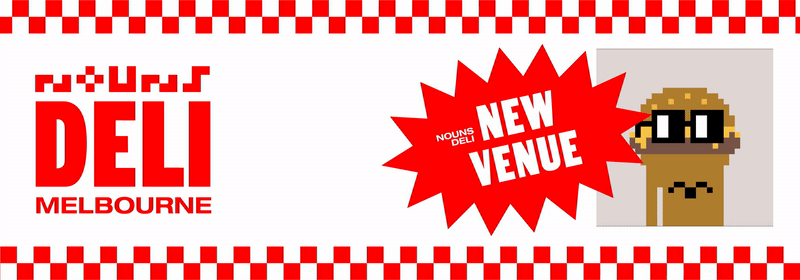
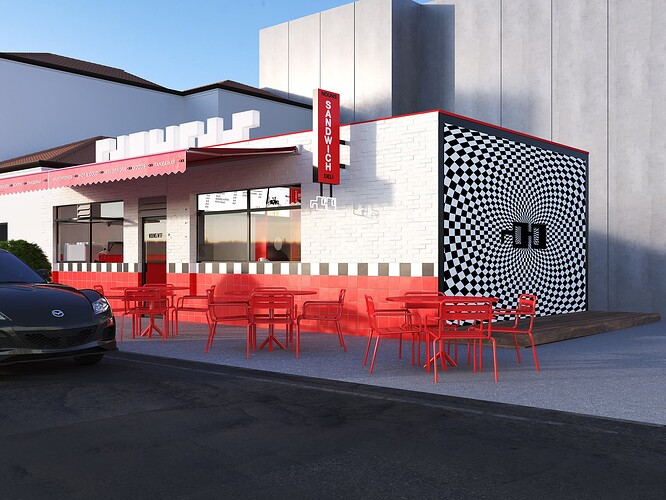
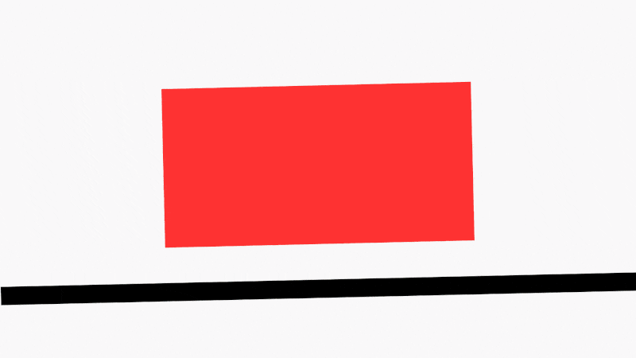
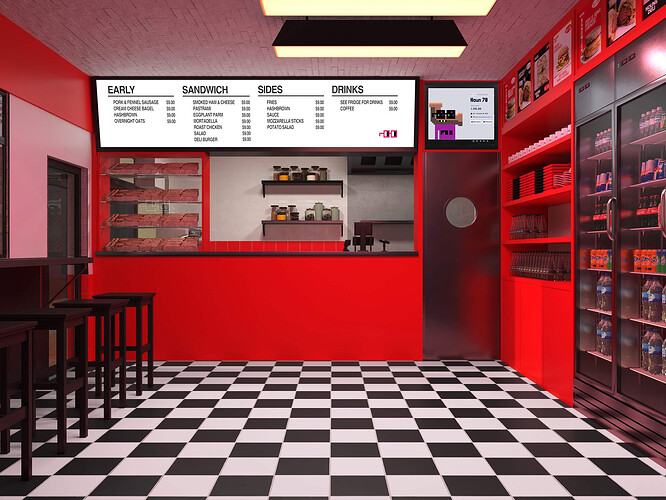
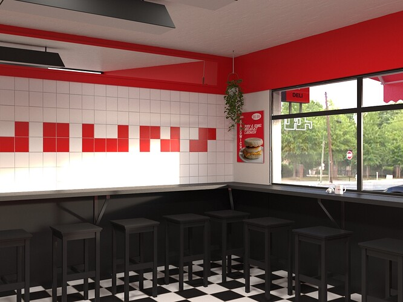
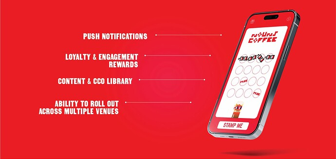
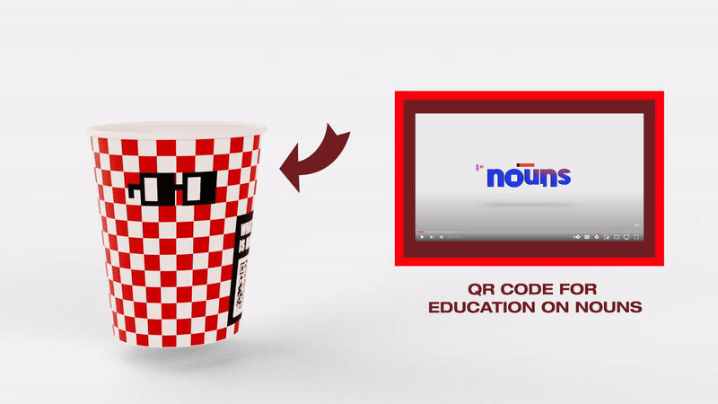
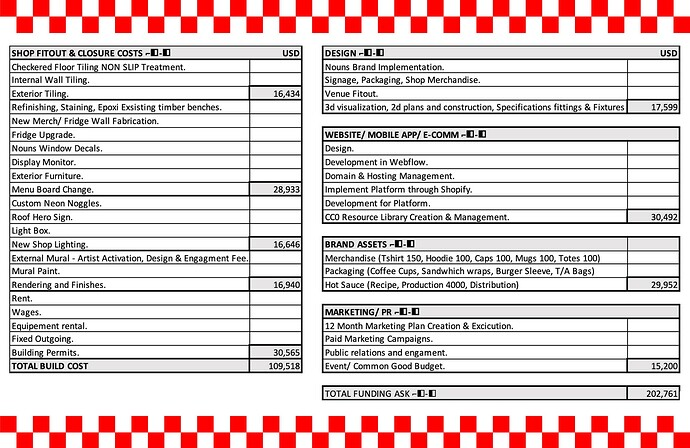

# NOUNS Deli - Melbourne, Aus

<!-- ✦✦✦ POST START ✦✦✦ -->

> **Post #1 • BeerNoogles**
> Created: 2023-03-10 05:39
> Updated: 2023-03-10 05:39

#  TLDR;

We are proposing 202K funding for the first permanent Nouns IRL store. The plan is to rebrand a venue currently owned by 87Bones (Noun552) in Melbourne, Australia, turning it ‘nounish’. With this we will create a public good franchisable package with the intention of scale. The team is already highly respected in the industry with a plethora of experience across the breadth of the field. As the venue is already a profitable business, we believe this would be a low-risk opportunity for Nouns to enter the IRL space. After initial funding this site will be totally self-sustainable.

The shop redesign will be largely cosmetic; a benefit of recreating an already established venue is that most of the infrastructure and industrial equipment has already been purchased.

Instead, the funding will be spent on ‘Nounifying’ the deli and adding custom fixtures to proliferate the brand. The new design will feature screens displaying the nouns daily auctions amongst other Nounish content. We will install large display shelves allowing the sale of a custom merch and a consumable range. Alongside the Nouns deli branded merch and consumable, this space could be an additional platform for previous and future successful Nouns proposals to sell their products on consignment.

Our goal is to build the Nouns Deli brand into a scalable business, opening up opportunities to expand around the world. Sticking to the Nouns CC0 philosophy, our vision is to build a fee-less franchise model; we intend to make everything open source, available to all. As this is rare in the hospitality industry, we expect it to gain a lot of attention, and with it the potential for even more brand proliferation. Goldy (Nounish, Goat Club) & Jarmen (Noun332) will be jumping on the team in a Noun advisory role to focus on public relations/education & content.

##  The Deli / The Team **⌐◧-◧**

Stan’s Deli is a local community hotspot, positioned off one of Melbourne’s most popular boutique shopping strips comprising over 400 retail shops. The area is central to some of Melbourne’s most affluent suburbs. Stan’s is known for its coffee and sandwiches, consistently being voted in the top 5 sandwich venues in Melbourne. The deli has been operating as a profitable business for 3 years with a further 3x3x3 left on the lease. Owned by three experts in the hospitality and retail industry. Between them, they boast 10 retail spaces, 3 beverage brands and over 40 years combined experience in the industry.

This teams owns some of Melbourne’s most iconic venues and has been showered with successes over their careers: Chef hats (Australia’s Michelin Star), ongoing listings in critics top foodie destinations, best fitout awards and a non-alcoholic beverage brand selling over 1.2 million serves across 8 countries and a VC funding deal of $8.5m.

The team’s expertise spreads across all aspects of the business, from food and beverage development, day to day business logistics to brand creation and marketing. Between them, they know the ins and outs of creating a successful business.

[Ful Version Here](http://stansdeli.com.au/wp-content/uploads/2023/03/REVIEWS-REVIEWS-REVIEWS-REVIEWS-REVIEWS-REVIEWS-REVIEWS-REVIEWS-REVIEWS-REVIEWS-REVIEWS-REVIEWS-2.mp4)

##  **Flipping it Nounish ⌐◧-◧**

To make the venue truly Nounish, Stan’s Deli will need a full cosmetic facelift. The essential commercial equipment will remain, but significant changes to the design of the deli are needed to highlight the Noun brand. Our goal is to create a timeless sandwich shop model, incorporating the Nounish pixel art-focused design that can easily be replicated in different locations worldwide. Along with this timeless and replicable design, we want to incorporate custom neon Noggles and exterior murals designed by local artists to make each franchise unique to its location.

Driving home the Nouns brand, we want to add a modern twist, installing screens to display the Nouns daily auctions & other Nounish content on rotation. While customers grab a bite, they can engage and learn more about the DAO.

##  **CC0 ⌐◧-◧**

With a CC0 culture, the new Nouns Deli will change the narrative in the hospitality industry. Currently, it all happens behind closed doors; the secret herbs and spices, special burger sauces. Heck, coke has its recipe in a bank vault that only two people can access at a time. We want to spread the Nouns CC0 philosophy and make everything open source through our CC0 library; recipes, package designs and branding assets will all be made available on our website. The wave of interest and attention the CC0 model will create in this industry will give us the perfect platform to share these core Nouns values.

##  **The Model ⌐◧-◧**

The team is proposing a franchisable model for scaling when ready. Adhering to the Nouns philosophy, there will be no fee associated with this franchise model. To ensure the brand is held to a high standard, those wishing to be officially affiliated with Nouns Deli will have to undertake a compulsory screening process. Once the original Nouns Deli is established, our team will provide consulting and mentoring services to approved franchisees. The goal is for scalability, the ability to replicate across the world.

##  **The App ⌐◧-◧ -**

A custom app will be developed as an easily accessible platform for the Noun’s Deli community and will extend to include any additional franchises. The app will reward regular customers through a loyalty program model, allowing them to earn points towards benefits or discounts with each purchase; a modern day coffee loyalty card. Customers will stay engaged through the use of push notifications, delivering exclusive offers such as happy hours discounts and CTA rewards. These push notifications can also be an opportunity to circulate engaging creative content and Nounish news. The CC0 library will also be made available on the app, alongside cooking videos and other educational tools. Our mobile app will encourage return clientele, creating an experience that extends the reach beyond the physical brick and mortar offerings, drawing them back to further engage with the dao.

##  **Proliferation/touch points ⌐◧-◧**

The potential for proliferation with a franchise model is endless and with every expansion, it grows. The team has a presence in the local hospitality industry and strong existing relationships with three core media agencies in Melbourne—Broadsheet, UrbanList, and Concrete Playground—which have a combined reach of 6.4 million. The team will use these connections to gain feature articles in all three without having to pay for any marketing. Our paid marketing strategies would focus on two areas: online viability using large platforms such as Twitter to reach current untapped audiences, and physical presence focusing on capturing the already large NFT culture within Melbourne. This would include poster runs, pop-up NFT events, and catering to NFT/Web3 conferences. To ensure the Nounish culture of giving is also proliferated, we hope to give out free Nouns ‘Deli Burgers’ wrapped in noggles paper to underprivileged communities. We want to highlight the incredible impact this DAO has had and will continue to have, essentially sharing the story.

Our vision for the first permanent Nouns IRL store is bigger than just a sandwich shop with Noggles painted on; we want to create an approachable educational tool for the DAO. QR codes on coffee cups, enabling us to direct daily traffic selected content, such as the ‘This is Nouns’ video highlighting content from other successful props. Currently averaging around 100,000 coffee sales each year, this is just one easily executed proliferation tool.

As we are entering uncharted territory for the DAO we believe transparency with data collection from these marketing tools and activations is useful information for the community and future proposers. All analytics gathered will be made available on our website.

#  The Sauce ⌐◧-◧

An avenue we believe has huge potential is a “Nouns Deli Sauce” range. We want to create a packaged consumable range that will be featured throughout our in-store menu. Launching the range will be the “Nouns Hot Sauce”. Our dear friend, Mathew Garthweight, owner of Mats Hot Shop—Australia’s leading boutique hot sauce distributor—will collaborate with Nouns Deli to produce our very own “Nouns Hot Sauce”. The products will be available to ship worldwide, allowing consumers to recreate Nouns Deli sandwiches at home. Matt has previously created his own range of hot sauces with huge success, winning multiple international competitions. Upon release, one hot sauce will be made claimable for each noun holder. Other sauces we intend to roll out into the range are “Nouns Burger Sauce” and “Nouns Dipping Ranch”, but the possibilities are endless and can be rolled out according to consumer demand.

Building out our new menu, we plan to feature a ‘Deli Burger’ as a nod to Noun552 owned by 87Bones. This burger will be served in branded sleeves, and is sure to be one of the most recognizable items on the menu. Furthermore, the Deli Burger will be the item served at all of our pop-up events. Additionally, we will invite guest chefs to collaborate and create menu items inspired by other Nouns.

##  **Retail/Merch ⌐◧-◧**

Stan’s Deli has been highly successful with its merchandise in the past, so we intend to release some branded Nouns Deli merchandise. The first drop will feature Nouns Deli t-shirts, hoodies, coffee mugs, a tote bag, and our consumable range.

Furthermore, we would like to use our space to create a platform for previous and future successful Nouns proposals to sell their products on consignment, thus providing another platform for the success of Nouns products.

##  **ROI ⌐◧-◧**

This is not merely a “flash-in-the-pan” proposition; instead, the intention is to promote long-term proliferation of nouns. The store will serve as a “permanent” educational billboard for the DAO, enabling it to capture public attention and provide information and content through multiple touchpoints. This will create a scalable IP for public benefit. Moreover, the store will be an opportunity to grow the community, share resources and knowledge regarding the DAO. Having already established itself as a popular foodie destination, and with a team committed to providing great hospitality supplemented with education, Nouns Deli is set to be a success.

##  **The Risk ⌐◧-◧**

Why would we close a profitable business? - “As a recent investor into the DAO I’m committed to the Nouns brand and believe it can become widely recognised in the near future. The Nouns model aligns with my morals and values and I want to use my resources and skill set to proliferate this incredible brand.” - 87Bones.

##  **Additional Factors ⌐◧-◧**

The rebranding fit-out will cause some time of closure and loss of revenue, we predict around 2 months until Nouns Deli can open its doors to the public. Having built a strong team over the past three years, we would like to hold on to the core members through this time. We intend to utilise this time to educate our team on all things Nouns, by reopening, our team will be able to guide our guests through the nouns ecosystem with ease.

Other costs that will continue during the closure are rent, insurance, utilities and other creditors.

##  The Budget

<!-- ✦✦✦ POST END ✦✦✦ -->

<!-- ✦✦✦ POST START ✦✦✦ -->

> **Post #2 • mrrobbo**
> Created: 2023-03-10 05:55
> Updated: 2023-03-10 05:55

This is an absolute yes ans what proliferation looks like. Huge success story brewing right here for the DAO

<!-- ✦✦✦ POST END ✦✦✦ -->

<!-- ✦✦✦ POST START ✦✦✦ -->

> **Post #3 • 0xDigitalOil**
> Created: 2023-03-10 09:56
> Updated: 2023-03-10 09:56

Love it Love it Love it

<!-- ✦✦✦ POST END ✦✦✦ -->

<!-- ✦✦✦ POST START ✦✦✦ -->

> **Post #4 • necfas**
> Created: 2023-03-10 12:02
> Updated: 2023-03-10 12:02

10/10, this is incredible.

<!-- ✦✦✦ POST END ✦✦✦ -->

<!-- ✦✦✦ POST START ✦✦✦ -->

> **Post #5 • Beckz**
> Created: 2023-03-10 13:10
> Updated: 2023-03-10 13:10

I really like the idea!

<!-- ✦✦✦ POST END ✦✦✦ -->

<!-- ✦✦✦ POST START ✦✦✦ -->

> **Post #6 • supriyo**
> Created: 2023-03-10 19:08
> Updated: 2023-03-10 19:08

Lets go! super cool!

<!-- ✦✦✦ POST END ✦✦✦ -->

<!-- ✦✦✦ POST START ✦✦✦ -->

> **Post #7 • Sam**
> Created: 2023-03-10 19:53
> Updated: 2023-03-10 19:53

I love the commitment to the meme and would love to explore opening a sister location in Muncie IN.

<!-- ✦✦✦ POST END ✦✦✦ -->

<!-- ✦✦✦ POST START ✦✦✦ -->

> **Post #8 • BeerNoogles**
> Created: 2023-03-10 22:39
> Updated: 2023-03-10 22:39

With this model that’s certainly possible. Much appreciated the support 

<!-- ✦✦✦ POST END ✦✦✦ -->

<!-- ✦✦✦ POST START ✦✦✦ -->

> **Post #9 • Oni**
> Created: 2023-03-11 06:24
> Updated: 2023-03-11 06:24

The initial mock ups for branding feel a little five guys / generic to me, but on the whole I think this idea is super sick – looking forward to seeing this on chain.

<!-- ✦✦✦ POST END ✦✦✦ -->

<!-- ✦✦✦ POST START ✦✦✦ -->

> **Post #10 • profwerder**
> Created: 2023-03-11 21:28
> Updated: 2023-03-11 21:28

Love this concept and think that Melbourne is a great option for a first location of a nouns restaurant. They already have a fairly large NFT community (% wise) that is familiar with nouns and this is already a successful restaurant which mitigates the risk tremendously. Plus you have Goldy and Nounish right down the road which will help with wider proliferation. The addition of the sauce and app also add elements that others may be able to tap into outside of that geographic market.

I do think Oni has a point although one that may be more of a US issue. The red and white checkerboard does give a Five Guys vibe. I’m wondering is there some way to use that same look but with noggles?

And I think just the red noggles on top of the store rather than NOUNS would be better but others may disagree. I’m also more of a fan of the Londrina font as I think it’s easier to read but also ties into the Nouns branding.

Overall, really excited for this!

<!-- ✦✦✦ POST END ✦✦✦ -->

<!-- ✦✦✦ POST START ✦✦✦ -->

> **Post #11 • BeerNoogles**
> Created: 2023-03-12 04:51
> Updated: 2023-03-12 05:11

Hey Prof and Oni, thank you for your feedback and positivity towards the prop.

Five Guys opened in Australia less than a year ago, and I have not yet visited nor heard anything about how it is faring. I should definitely check it out.

For context, our red was taken from the Noggles, which I believe to be the most iconic. The checkers was a nod to 8-bit/pixel art, A classic feel with the intention of being able to blend into most settings quite easily. Needless to say, the design team has been made aware of this and will take it into consideration before proceeding, should it be approved.

<!-- ✦✦✦ POST END ✦✦✦ -->

<!-- ✦✦✦ POST START ✦✦✦ -->

> **Post #12 • Deepsan**
> Created: 2023-03-15 17:08
> Updated: 2023-03-15 17:08

Really great bro. Nice details included too

<!-- ✦✦✦ POST END ✦✦✦ -->

<!-- ✦✦✦ POST START ✦✦✦ -->

> **Post #13 • Thinker**
> Created: 2023-03-17 12:05
> Updated: 2023-03-17 12:05

It’s a great way to incorporate nouns into people’s lives.

<!-- ✦✦✦ POST END ✦✦✦ -->

<!-- ✦✦✦ POST START ✦✦✦ -->

> **Post #14 • BigshotKlim**
> Created: 2023-03-19 22:22
> Updated: 2023-03-19 22:22

Love the concept and the idea feels perfectly right with this team. Happy to support with anything and everything

<!-- ✦✦✦ POST END ✦✦✦ -->

<!-- ✦✦✦ POST START ✦✦✦ -->

> **Post #16 • Abugae**
> Created: 2024-03-21 21:02
> Updated: 2024-03-21 21:02

Great concept team, hope it goes well… I agree with [@profwerder](/u/profwerder) in that the noogles on top of the store would have a better presence over the word NOUNS.

All the best

<!-- ✦✦✦ POST END ✦✦✦ -->

<!-- ✦✦✦ POST START ✦✦✦ -->

> **Post #17 • xbase**
> Created: 2024-08-26 02:29
> Updated: 2024-08-26 02:29

Amazing execution, best hash browns in Melbourne. Ka Pie! (Kiwi for Good Job!).

<!-- ✦✦✦ POST END ✦✦✦ -->

<!-- ✦✦✦ POST START ✦✦✦ -->

> **Post #18 • steve**
> Created: 2024-08-26 08:21
> Updated: 2024-08-26 08:21

 BeerNoogles:

> shop redesign will be largely cosmetic; a benefit of recreating an already established venue is that most of the infrastructure and industrial equipment has already been purchased.

This is a really nice presentation. The concept of establishing the first permanent Nouns IRL store, combined with a scalable and CC0-driven franchising model, is ambitious.

Good Luck 

<!-- ✦✦✦ POST END ✦✦✦ -->

