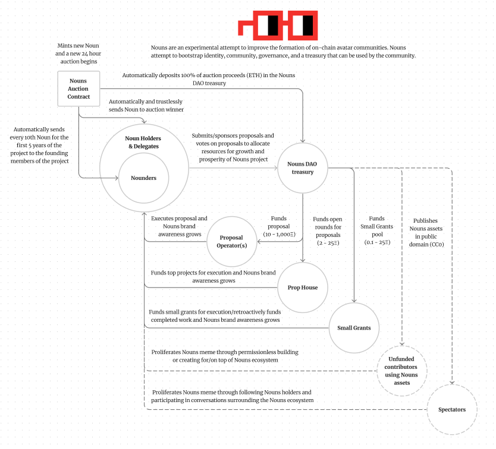
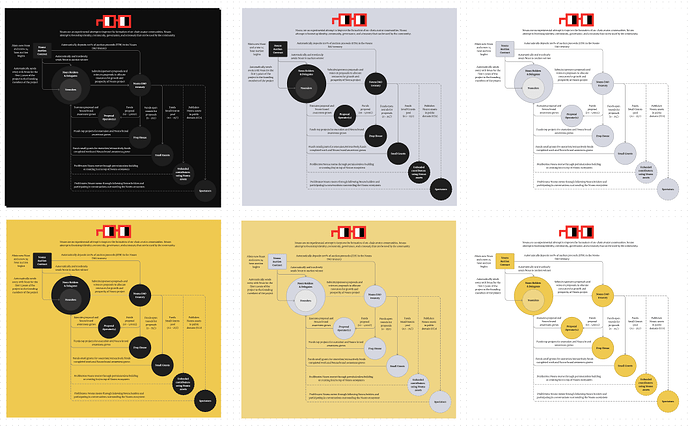

# Nouns Visual Incentive Map

<!-- ✦✦✦ POST START ✦✦✦ -->

> **Post #1 • UncleDabe**
> Created: 2023-03-15 01:12
> Updated: 2023-03-16 00:17

hi all - creating an incentive map for Nouns to make it easier for others to understand in a standalone visual.

i leveraged the existing documentation from [nouns.wtf](http://nouns.wtf), nouns.center to create it, but would really appreciate any feedback/corrections/additions from the community to make it the most accurate / efficient it can be

  
Different color scheme options - going to align on one if you have any feedback  

will mint as a part of my open edition collection, with half of proceeds going directly to nouns treasury ([example](https://twitter.com/Uncle_Dabe/status/1633875029266923525?s=20) from my first mint)

<!-- ✦✦✦ POST END ✦✦✦ -->

<!-- ✦✦✦ POST START ✦✦✦ -->

> **Post #2 • Evil**
> Created: 2023-03-16 07:04
> Updated: 2023-03-16 07:04

Nicely done!  
Yellow-ish with black highlights looks nounish AF

<!-- ✦✦✦ POST END ✦✦✦ -->

<!-- ✦✦✦ POST START ✦✦✦ -->

> **Post #3 • xbase**
> Created: 2024-08-26 01:55
> Updated: 2024-08-26 01:55

As a newb this helps me understand the context immensely. Great job at Information Architecture and Process Mapping, well done!

<!-- ✦✦✦ POST END ✦✦✦ -->

<!-- ✦✦✦ POST START ✦✦✦ -->

> **Post #4 • steve**
> Created: 2024-08-26 08:13
> Updated: 2024-08-26 08:13

Excellent map! However, I have a question.

In the Nouns Center under the general “Get Funding - Overview” tab, the stated funding ranges are as follows:

  * Small Grants: **0.1 - 25 ETH**
  * Prop House: 2 - 25 ETH
  * Proposals: 10 - 1,000 ETH

However, within each specific Funding category (details), the following ranges are provided:

  * Small Grants: **For projects requiring 0.1 - 10 ETH**
  * Prop House: For projects requiring 2 - 10 ETH
  * Proposals: For projects requiring 10 - 1,000 ETH

Could someone please clarify the correct funding range for **Small Grants?**

Thanks,  
Steve

<!-- ✦✦✦ POST END ✦✦✦ -->

<!-- ✦✦✦ POST START ✦✦✦ -->

> **Post #5 • UncleDabe**
> Created: 2024-08-26 14:28
> Updated: 2024-08-26 14:28

Thanks for the responses all! I haven’t updated these in a bit so the ranges may be out of date - i’d defer to other here to answer that. I minted several versions of this map, from complex to simple,  
complex: [Untangl3D: Nouns](https://zora.co/collect/eth:0x4ba82b9b18ff98da07f431fed747e9ec7600f0f5)  
comparison to a startup company: [Nouns](https://zora.co/collect/eth:0x4c2799ad25ac9b5b83ef478cbf4d5ce4ca035f7b/2)  
simplified incentives: [Incentives: Nouns](https://zora.co/collect/zora:0x6164cffed572836ee4c6823ce3d74c648835fc7a)

I hope you enjoy  please share with others

<!-- ✦✦✦ POST END ✦✦✦ -->

