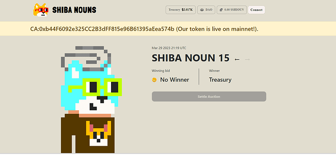

# Shiba Nouns DAO born, What's your opinions?

<!-- ✦✦✦ POST START ✦✦✦ -->

> **Post #1 • 0xBogo**
> Created: 2023-03-30 00:52
> Updated: 2023-03-30 00:52

Thanks for the CC0 Project. We upgraded Nouns DAO to Shiba Nouns. We are going to bring token traders and token holders to nouns space.

What’s New in Shiba Nouns?

  1. Attractive On-Chain Shiba NFTs.
  2. Support Auction using three coins: $SHIOUN, $SHIB, ETH
  3. New $SHIOUN Rewards Pool.
  4. NFT holder can claim $SHIOUN rewards anytime.
  5. New DAO Proposals:

  1. Transfer $SHIB
  2. Transfer $SHIOUN
  3. Transfer SHIBA NOUN NFT

How does the Shiba Noun NFT Auction work?  
#0, #10, #20, …. NFTs — Shiba Nouns Founders

#1, #2, #3, #11, #12, #13 …. NFTs — $SHIOUN Auction  
#4, #5, #6, #14, #15, #16 …. NFTs — $SHIB Auction  
#7, #8, #9, #17, #18, #19 …. NFTs — ETH Auction

$SHIOUN Auction — 70% $SHIOUN goes to Treasury, 30% goes to Rewards pool and distribute to SHIBA NOUN NFT holders.  
$SHIB Auction — 94% $SHIB goes to Treasury, 3% buy $SHIOUN and goes to Rewards pool, 3% goes to Shiba Nouns Founders.  
ETH Auction — 94% ETH goes to Treasury, 3% buy $SHIOUN and goes to Rewards pool, 3% goes to Shiba Nouns Founders.

The Dapp is currently working on Georli testnet but we will go to mainnet soon!

Website: <https://shiouns.wtf/>  
Telegram: [Telegram: Contact @shiounsdao](https://t.me/shiounsdao)  
Twitter: <https://twitter.com/shibanounsdao>  
Medium: [Shiba Nouns – Medium](https://medium.com/@shibanouns)

<!-- ✦✦✦ POST END ✦✦✦ -->

