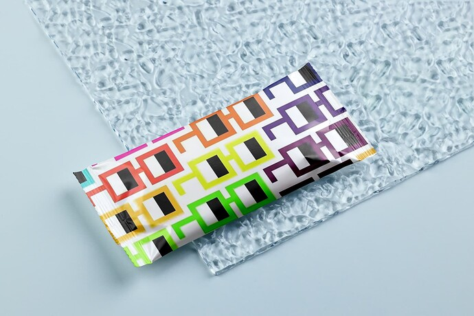
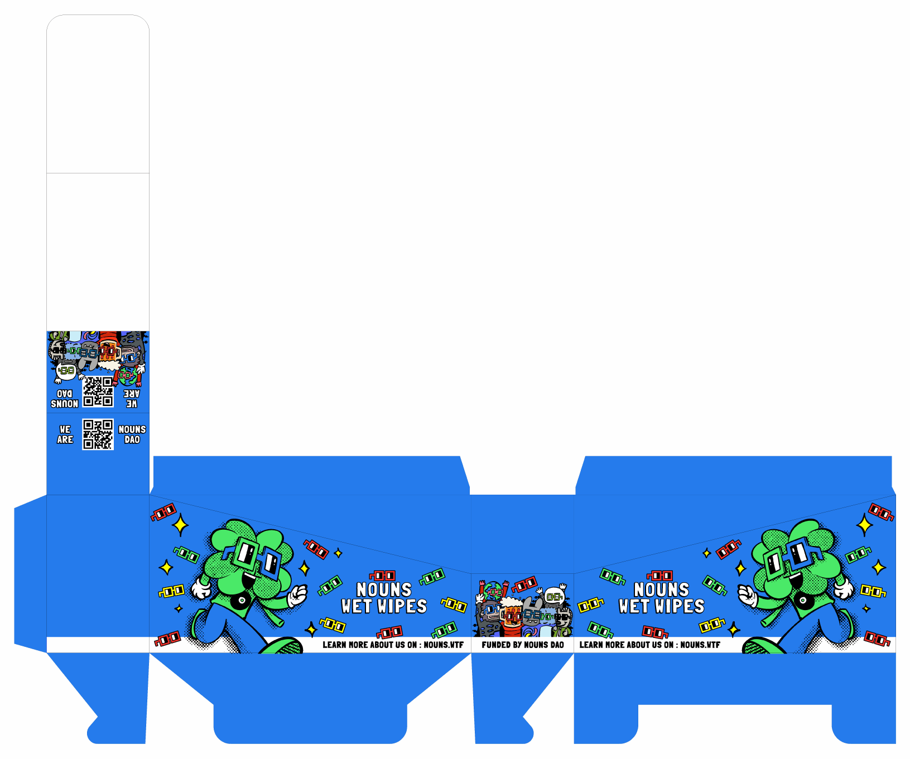

# Design & Win ETH! Nouns Wet Wipes Design Contest

<!-- ✦✦✦ POST START ✦✦✦ -->

> **Post #1 • noun426**
> Created: 2023-04-19 03:03
> Updated: 2023-04-19 03:18

**tl;dr**  
We learned from our Prop 265 that the 2 main reasons nouners were against the prop was:

  1. Lack of distribution / marketing strategy and budget
  2. Low quality product design

Therefore the team has decided to run a Design Contest to address issue no. 2

**Design Contest**  
We need a compelling design for our Noun Wet Wipes packaging. That’s where you come in   
Designers may submit their design of what Noun Wet Wipes should look like and stand a chance to win the grand prize of **1.5 Eth** should the prop succeed and that your design was chosen by the DAO.

Even if your design wasn’t the most popular, 2nd place to 5th place contestants still share a pool of **0.5 Eth** as consolation. 

**Contest Period**  
The contest will run from 19/4/2023 to 3/5/2023 11pm ET

**What’s the criteria for Winning?**  
There’s no set criteria for winning, your designs will be judged through a popularity vote. Nouners can choose the design they think is the best when voting on the prop itself. That being said, we believe the winning design should…

  1. Pop!
  2. Resonates with a fun audience!
  3. Interactive!
  4. Welcoming!
  5. Nounish!!!

Ultimately, these Noun Wet Wipes purpose is to proliferate the Nouns brand.

**Contest Mechanics**  
Contestants are supposed to submit 4 designs

  1. The wrapper design
  2. The flap design
  3. The display box for holding 12 packs design
  4. The 3D mockup of the product (optional)

Templates for the design as follows but please ignore the design on them.

  
_Wrapper template - whiteout part is to print the information required by regulating authorities_  
_Due to manufacturing constraints, please limit the number of colors used to a maximum of 5_

  
_Flap template - this is the opening to the wipes. The flap opens from the top._

  
_Display box template_

There’s no template for 3D mockup as it will not be required for manufacturing but it will undoubtedly increase your chances of winning.

**How to submit your designs?**  
Just reply this discourse thread and attach the your jpegs together with your eth address (where you will receive the price). Should you win please email your design files to [noun426@proton.me](mailto:noun426@proton.me)

_By submitting your designs here, you agree to make your artwork Public Domain and hold no exclusive intellectual property rights to them._

Information regarding Nouns can be found in the links below

 [nouns.wtf](https://nouns.wtf/)

### [Nouns DAO](https://nouns.wtf/)

One Noun, every day, forever. Nouns DAO is an experiment on the Ethereum blockchain.

Resources:

 [nouns.center](https://nouns.center/)

### [Nouns Center](https://nouns.center/)

The knowledge center and resource hub for Nouns DAO. Learn about the project, the community and ways to get involved and funded.

<!-- ✦✦✦ POST END ✦✦✦ -->

<!-- ✦✦✦ POST START ✦✦✦ -->

> **Post #2 • noun426**
> Created: 2023-04-19 08:05
> Updated: 2023-04-19 08:05

Please don’t hesitate to ask any questions.

<!-- ✦✦✦ POST END ✦✦✦ -->

<!-- ✦✦✦ POST START ✦✦✦ -->

> **Post #3 • noun426**
> Created: 2023-04-20 01:06
> Updated: 2023-04-20 01:06

This is what a finished product looks like.

  

<!-- ✦✦✦ POST END ✦✦✦ -->

<!-- ✦✦✦ POST START ✦✦✦ -->

> **Post #4 • baba**
> Created: 2023-04-20 09:52
> Updated: 2023-04-20 09:52

Hey Nouners,  
What do you think of this design ?  
Will ameliorate it and adapt it.  
LMK 

<!-- ✦✦✦ POST END ✦✦✦ -->

<!-- ✦✦✦ POST START ✦✦✦ -->

> **Post #5 • TheYC**
> Created: 2023-04-23 04:28
> Updated: 2023-04-23 04:28

Looks good as a base template for the manufacturer!

How about the 5 colour cap? If you changed it to a 5 colour limit, would the effect remain the same?

<!-- ✦✦✦ POST END ✦✦✦ -->

<!-- ✦✦✦ POST START ✦✦✦ -->

> **Post #6 • maty**
> Created: 2023-04-23 10:40
> Updated: 2023-04-23 10:40

I love the fact that you took in the feedback re:design and turned it into a fun community contest!

<!-- ✦✦✦ POST END ✦✦✦ -->

<!-- ✦✦✦ POST START ✦✦✦ -->

> **Post #8 • probablynothing**
> Created: 2023-04-23 22:37
> Updated: 2023-04-23 22:37

Would love to partner and be part of the initial team, I can help with marketing efforts. I run a crypto tiktok with over 200k followers

<!-- ✦✦✦ POST END ✦✦✦ -->

<!-- ✦✦✦ POST START ✦✦✦ -->

> **Post #9 • noun426**
> Created: 2023-04-24 05:52
> Updated: 2023-04-24 05:52

Sure we are open to partnerships. What do u have in mind? Dm me on Twitter [@noun426](/u/noun426)

<!-- ✦✦✦ POST END ✦✦✦ -->

<!-- ✦✦✦ POST START ✦✦✦ -->

> **Post #10 • noun426**
> Created: 2023-04-28 08:26
> Updated: 2023-04-28 08:26

Almost 10 days in now. SHOW US WHATCHU GOT!!!

<!-- ✦✦✦ POST END ✦✦✦ -->

<!-- ✦✦✦ POST START ✦✦✦ -->

> **Post #11 • skipperlee**
> Created: 2023-05-02 01:13
> Updated: 2023-05-02 01:13

GM! with the printing limit being 5 colours, does this include black and white? would also appreciate the indication of front- and back-facing sides of the display box. thanks!

<!-- ✦✦✦ POST END ✦✦✦ -->

<!-- ✦✦✦ POST START ✦✦✦ -->

> **Post #12 • noun426**
> Created: 2023-05-02 02:53
> Updated: 2023-05-02 02:53

Hiya, the 5 colours does include black but not white. Essentially the white is the base colour of the wrapper.

The display box doubles as the box holding the wipes. It can be opened and ‘torn’ into a display box. I have labelled the display box dimensions below. Thanks for the question !!!

  

<!-- ✦✦✦ POST END ✦✦✦ -->

<!-- ✦✦✦ POST START ✦✦✦ -->

> **Post #14 • skipperlee**
> Created: 2023-05-02 03:08
> Updated: 2023-05-02 03:09

 noun426:

> Hiya, the 5 colours does include black but not white. Essentially the white is the base colour of the wrapper.
> 
> The display box doubles as the box holding the wipes. It can be opened and ‘torn’ into a display box. I have labelled the display box dimensions below. Thanks for the question !!!

thanks for the quick reply!  
is the display box limited to 5-color printing as well?

before I continue working on the display box, here’s a really rough mockup by drawing over one of your example photos  

<!-- ✦✦✦ POST END ✦✦✦ -->

<!-- ✦✦✦ POST START ✦✦✦ -->

> **Post #15 • noun426**
> Created: 2023-05-02 03:43
> Updated: 2023-05-02 03:43

THAT LOOKS SO RAD!!! keep up the good work  
  

<!-- ✦✦✦ POST END ✦✦✦ -->

<!-- ✦✦✦ POST START ✦✦✦ -->

> **Post #16 • noun426**
> Created: 2023-05-03 02:53
> Updated: 2023-05-03 02:53

Sorry missed your question on the display box. The display box does not have a colour limit.

<!-- ✦✦✦ POST END ✦✦✦ -->

<!-- ✦✦✦ POST START ✦✦✦ -->

> **Post #17 • skipperlee**
> Created: 2023-05-03 06:19
> Updated: 2023-05-03 06:19

thanks again, wanted to check again regarding the actual ad area from the print template vs the mockup shown does it fold over and down towards the base of the display box as illustrated below?  

also please find attached another rough mockup image  
this time including the display box  

<!-- ✦✦✦ POST END ✦✦✦ -->

<!-- ✦✦✦ POST START ✦✦✦ -->

> **Post #18 • noun426**
> Created: 2023-05-03 06:57
> Updated: 2023-05-03 06:59

Your illustration of the display box is spot on! However you can increase the ad space above a bit more if there’s a cut out, which is possible as long as its attached to the box below. See pic.  

  
_ps. this is totally optional_ 

<!-- ✦✦✦ POST END ✦✦✦ -->

<!-- ✦✦✦ POST START ✦✦✦ -->

> **Post #19 • skipperlee**
> Created: 2023-05-03 13:35
> Updated: 2023-05-03 13:35

thanks again for the opportunity, here are my entries:

items 1 and 2. wrapper and flap design with Londrina font,  
featuring Nouns 426 and 587, with an expandable roster  
  
wrapper and flap design with Nounstown font,  
featuring Nouns 426 and 587, with an expandable roster  

item 3. display box design preview  
with Londrina and Nounstown font options  

item 4. wrapper and box mockups  
with Londrina and Nounstown font options  
  

<!-- ✦✦✦ POST END ✦✦✦ -->

<!-- ✦✦✦ POST START ✦✦✦ -->

> **Post #20 • zylag**
> Created: 2023-05-03 15:04
> Updated: 2023-05-03 15:04

GM everyone!

Due to the somewhat short timeframe I’m not able to provide everything asked for in the original post. The display box design and the print-ready files will of course be provided in case the design is chosen.  
Anyways!  
The idea is based around the fact that the flap is in the shape of a pill so naturally it should feature a pill head. The 5 color limit is kept by using a diffusion dither effect for the gradients (see 3rd image).

  

  

<!-- ✦✦✦ POST END ✦✦✦ -->

<!-- ✦✦✦ POST START ✦✦✦ -->

> **Post #22 • 0xaprilia**
> Created: 2023-05-03 16:19
> Updated: 2023-05-03 16:19

Hi! This is my entry!

  1. The Wrapper Design

  2. The Flap Design

  3. The Display Box

<!-- ✦✦✦ POST END ✦✦✦ -->

<!-- ✦✦✦ POST START ✦✦✦ -->

> **Post #23 • kemodoge**
> Created: 2023-05-03 17:03
> Updated: 2023-05-03 17:03

Hello! These are my entries for the contest. I personally prefer a cleaner style design so these are my submission.   

  
This will be the design for the wet wipes

  
Mockup picture

  
Sticker Tab (can be a sticker or a plastic tab)

  
Design for the box holder

Thank you for the opportunity and happy contest! Seeing a lot of great work here, keep vibing!!!

<!-- ✦✦✦ POST END ✦✦✦ -->

<!-- ✦✦✦ POST START ✦✦✦ -->

> **Post #25 • noun426**
> Created: 2023-05-03 23:33
> Updated: 2023-05-03 23:33

Thank you for all your submissions  They all look awesome!!!  
I have received some DM whereby some contestants are unable to submit if they attached their eth add together with their designs. It was an oversight on our part as we did not take into account the community guidelines for using this discourse. Please resubmit your designs without the eth address. We will get in touch directly when the time comes to send the prizes out. Sorry for the inconvenience caused. Thanks again for all your effort!!!

<!-- ✦✦✦ POST END ✦✦✦ -->

<!-- ✦✦✦ POST START ✦✦✦ -->

> **Post #26 • zylag**
> Created: 2023-05-10 14:18
> Updated: 2023-05-10 14:18

gm! [@noun426](/u/noun426) can i ask how voting for the designs will happen? will it be likes on the post here or a separate platform?

<!-- ✦✦✦ POST END ✦✦✦ -->

<!-- ✦✦✦ POST START ✦✦✦ -->

> **Post #27 • noun426**
> Created: 2023-05-10 23:01
> Updated: 2023-05-10 23:01

Voting starts in 2 days here

 [nouns.wtf](https://nouns.wtf/vote/286)

### [Nouns DAO](https://nouns.wtf/vote/286)

One Noun, every day, forever. Nouns DAO is an experiment on the Ethereum blockchain.

<!-- ✦✦✦ POST END ✦✦✦ -->

<!-- ✦✦✦ POST START ✦✦✦ -->

> **Post #28 • noun426**
> Created: 2023-05-19 02:08
> Updated: 2023-05-19 02:08

**THE VOTES ARE IN!!!**

**1st Place** goes to **skipperlee**  

* * *

**2nd Place** \- **Victor**  

* * *

Unfortunately the rest of the designs did not get a single vote so we cant rank them here… However all those who submitted both the display box design and also the wet wipes design will share a prize of 0.5 ETH !!!

Please DM me your ETH address and we will notify here again when we have sent out the prizes. Thank you for participating and we hope to see you again when we roll out our next project.

Cheers  
noun426  
  

<!-- ✦✦✦ POST END ✦✦✦ -->

<!-- ✦✦✦ POST START ✦✦✦ -->

> **Post #29 • noun426**
> Created: 2023-05-22 01:03
> Updated: 2023-05-22 01:03

**Prizes have been sent out to Contestants!!!**

SkipperLee - **1.5 ETH**  
Tx: 0x0a0b6aba9bdd953001dca595d74de43659db5acffc7243014bda8dc549d3c7aa

Since there were only 4 complete submissions, we find it fair to split the 0.5 ETH between the eligible contestants. So instead of 0.125 ETH, they now get 0.16 Eth each   

Victor - **0.16 ETH**  
Tx: 0x7af2a8dd9e880f53b9c78bb2c2b24f771e984896db5e28c632dc805c266c6f2b

For the remaining contestants, please DM me your ETH address ASAP!!!

<!-- ✦✦✦ POST END ✦✦✦ -->

<!-- ✦✦✦ POST START ✦✦✦ -->

> **Post #30 • skipperlee**
> Created: 2023-05-22 01:19
> Updated: 2023-05-22 01:19

thanks again for doing this   
I’ve also sent over the artwork files including production revisions  
looking forward to seeing these  on the market!

<!-- ✦✦✦ POST END ✦✦✦ -->

<!-- ✦✦✦ POST START ✦✦✦ -->

> **Post #31 • noun426**
> Created: 2023-05-22 04:52
> Updated: 2023-05-22 04:52

0xaprilia - **0.16 ETH**  
Tx: 0xddea79cd43b7458941f4e3e82b7001268f80ad75815e4b521019baadbca05ac8

<!-- ✦✦✦ POST END ✦✦✦ -->

<!-- ✦✦✦ POST START ✦✦✦ -->

> **Post #32 • noun426**
> Created: 2023-05-22 09:04
> Updated: 2023-05-22 09:04

kemodoge - **0.16 ETH**  
Tx: 0xd8bd9583bb44e6c080cdf9ce8624dbc94ceb3a7967dbcf3edd24648e8476b3cc

All Prizes have been sent out !!!  
This concludes our Nouns Wet Wipes Design Contest, hope everyone had a great time, we sure did   

<!-- ✦✦✦ POST END ✦✦✦ -->

<!-- ✦✦✦ POST START ✦✦✦ -->

> **Post #33 • Gruffdatsik**
> Created: 2023-07-28 07:34
> Updated: 2023-07-28 07:34

GREAT WORK we need more things like this to promote community

<!-- ✦✦✦ POST END ✦✦✦ -->

