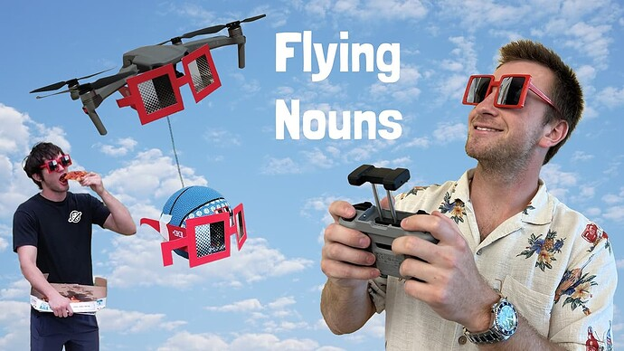

# Florinouns - Flying Nouns Video Submission for #EntertheNouniverse

<!-- ✦✦✦ POST START ✦✦✦ -->

> **Post #1 • Florinouns**
> Created: 2023-04-23 00:54
> Updated: 2023-04-23 00:54

[YOUTUBE LINK FOR VIDEO SUBMISSION](https://www.youtube.com/watch?v=VeXYyoZHNjM)

Hello everyone,

We are excited to share with you our latest project, the Florinouns - Spring Break NFT collection, which was created by students taking a Blockchain course at Florida Gulf Coast University. The collection has a fun theme centered around spring break and is designed by students and prophouse winners for NounishMingos.

Recently, we organized an event to promote our project and used drones to film and drop Noun care packages, while Pizza DAO sponsored free pizza for all attendees. We created a video submission about the event for the 200k Noun Contest, and we need your help to reach 2k views before the 30th. Currently, we have almost 1k views, and with your support, we can achieve our goal and promote our project to a wider audience. If we were to be selected as one of the 50k winners, our funds would go towards helping FGCU college students launch their own unique web3 projects.

To stay up to date with the latest news about our project, please follow us on Twitter at <https://twitter.com/FloriNouns>. We also want to give a special shoutout to [@SuperTightWoody](/u/supertightwoody) for creating a custom song for our collection.

Thank you for your support, and noun on!  

  

<!-- ✦✦✦ POST END ✦✦✦ -->

<!-- ✦✦✦ POST START ✦✦✦ -->

> **Post #2 • Florinouns**
> Created: 2023-04-23 15:20
> Updated: 2023-04-23 15:20

We finally reached 1k views, thank you.

<!-- ✦✦✦ POST END ✦✦✦ -->

