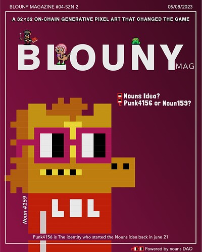

# Sponsorship for an active weekly magazine about crypto, NFT, and art!

<!-- ✦✦✦ POST START ✦✦✦ -->

> **Post #1 • 0xBartender.eth**
> Created: 2023-05-04 09:53
> Updated: 2023-05-04 09:53

TL;DR  
we thought getting sponsor for our weekly mag is the best way to keep **all the data free for everyone** while we can stay alive in web3.0 during the bear market.  
Since we’ve got 0 feedbacks at prop house and nouncil discord, I’m here to ask for your POVs to make it great enough to happen.

We?  
We have been here on-boarding newcomers to the NFT space for over a year by running clubhouse rooms ** **everydays for more than 8 months** and gathering about 500 discord members, and lately we have launched our weekly magazine about cryptoart, NFTs on chain data, and some important subjects like cc0, memes, on chain art and etc, which has gained a pretty good view in the beginning.

our official links:  
[discord](https://blouny.com/discord)  
[twitter](https://twitter.com/blouny_eth)  
[instagram](https://instagram.com/blouny_eth)  
[website](https://blouny.com)

according to dune data from Thomas_m profile you can see the number of active eth wallets trading 1155 & 721 in last weeks was something about 600-800 and we take it as a good sign that our mag has gained about 80 subscribers in the same weeks and it’s still raising by number.  
our focus is to onboard more crypto people by twitter spaces into NFT culture via our weekly mag and we are starting to talk about nounsDAO in the next 5 weeks because we know there are so many newcomers in our viewer and NounsDAO/nounish culture is a good one to explaine for them and here are our suggested topics for 5 editions:

-The idea behind The Nouns? Punk 4156 or Noun159  
-The artist behind Nouns? who is gremplin? on-chain art?  
-Wtf DAO? The Nouns DAO treasury? fair funding mechanism?  
-CC0? noggles? Wtf is prop house? why?  
-A comprehensive look at the entire Nouns ecosystem.

and this is a preview of next week’s cover  

all the data has been free always and we’d like avoid charging people to get access to updates and education. So we dropped a prop in the recent nouns open round (19) on prop house to get our magazine sponsored by nounsDAO for the next 5 weeks and since we got 0 feed backs I’m here to ask you for your suggestions and ideas.

<!-- ✦✦✦ POST END ✦✦✦ -->

<!-- ✦✦✦ POST START ✦✦✦ -->

> **Post #2 • kwikuw**
> Created: 2023-05-05 06:55
> Updated: 2023-05-05 06:55

This is actually dope! Will your team give alpha or just updates of the space?

<!-- ✦✦✦ POST END ✦✦✦ -->

<!-- ✦✦✦ POST START ✦✦✦ -->

> **Post #3 • 0xBartender.eth**
> Created: 2023-05-05 14:26
> Updated: 2023-05-05 14:26

technically we publish our daily news in our Instagram so early that can be considered as alphas somehow for example we published the nakamigos announcement a month before the public mint [here](https://www.instagram.com/reel/Coy9lwTuvOh/?igshid=YmMyMTA2M2Y=), but basically, as a media we’ve decided to go safe in the market, so we usually talk about what has happened. in the magazine we talk about the most important news and a few on-chain analyses about the previous week so everyone can review the whole week in less than 10 minutes.  
now we are adding a new part to introduce the well-known builders and dynamics in the space.

<!-- ✦✦✦ POST END ✦✦✦ -->

<!-- ✦✦✦ POST START ✦✦✦ -->

> **Post #4 • PepeLady**
> Created: 2023-05-05 15:20
> Updated: 2023-05-05 15:20

thank you, Bartender, for sharing this here, it was quite interesting for me as well to know why our lovely nounish ppl didn’t like our prop! as it goes with 0 attention I really would like to know what is mostly in their pov.  
The most important part for us was to keep the data free and useable for everyone, pulse up to date. we would also love to collaborate with other active builders in the space to cover them in our magazine. DMs are always open for NFT frens.

<!-- ✦✦✦ POST END ✦✦✦ -->

<!-- ✦✦✦ POST START ✦✦✦ -->

> **Post #5 • kwikuw**
> Created: 2023-05-05 15:24
> Updated: 2023-05-05 15:24

it shows that the team had a pretty amazing analysis and curation on what’s up in the space!

Good luck on the proposal!

<!-- ✦✦✦ POST END ✦✦✦ -->

