# Nounish Animations for Kids on YouTube Channel

<!-- ✦✦✦ POST START ✦✦✦ -->

> **Post #1 • Arash**
> Created: 2023-05-07 07:21
> Updated: 2023-06-04 09:59

**Description:**

We propose to create a YouTube channel that features Nounish musical animations for kids. Through musical animations about colors, the alphabet, numbers, shapes, and such, the channel will be a source of entertainment and also education for kids and will provide an opportunity for parents to introduce their children to the concept of Nouns.

Like this . **WIP** 

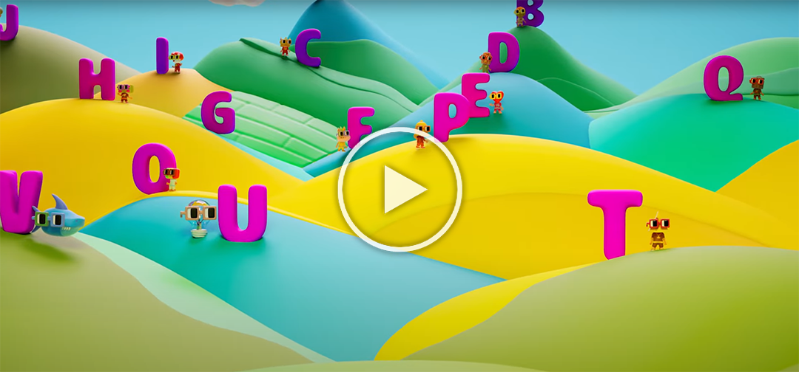

* * *

**Goals:**

Create a library of Nounish animations that are fun and engaging for kids.  
Build an audience of children and parents who are interested in Nouns.  
Promote the use of Nouns as a tool for creativity and learning.  
Strengthen the Nouns brand and increase its visibility.  
Generate revenue through ad monetization and merchandise sales.

* * *

**Approach:**

These animations will be musical in nature and accompanied by a voiceover that sings songs and such, featuring catchy tunes and colorful visuals that will capture the attention of young viewers.  
The animations will be short and feature Nouns in different scenarios.  
We will upload new animations to the YouTube channel on a regular basis.  
We will promote the channel through social media and online advertising.  
We will create Nounish animations using 3D modeling, animation software, and Unreal Engine 5.  
We will explore the possibility of creating Nounish merchandise that can be sold through the channel.  
All funding raised through the Nouns DAO for this project will be spent on producing high-quality animations and promoting the channel until it reaches monetization. After that point, the channel will be self-sustaining and able to reinvest revenue into creating even more engaging and educational content for young viewers.  
The channel revenue will be reinvested into the channel itself, with the funds going towards promoting the channel and creating more high-quality Nounish animations for kids to enjoy.

* * *

**Advantages for Nouns DAO:**

The Nounish Animations for Kids YouTube channel will create a new avenue for promoting the use of Nouns.  
The channel will be an educational resource for children and parents, helping to build a new generation of Noun enthusiasts.  
The animations will help to create a stronger Nouns brand and increase its visibility in the marketplace.  
The project will help to diversify the Nouns ecosystem by creating a new type of content that appeals to a different audience.

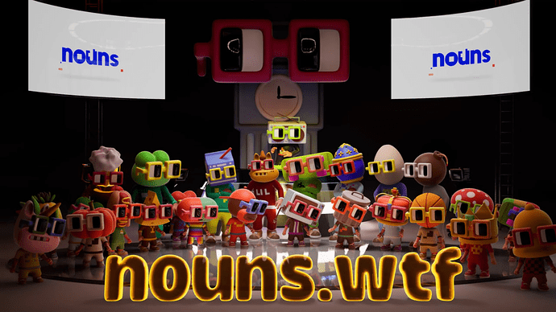

* * *

## **Video Views in the Past 3 Weeks**

We are thrilled to share the impressive number of video views we have received in the past 3 weeks, especially considering that our channel is newly established. The level of engagement and support we have received is truly remarkable.

In just three weeks, our videos have collectively amassed over **22K** views. This level of viewership for a new channel is a testament to the quality and appeal of our content.

Interestingly, our video titled **ABC Song  ⌐◨-◨ For Kids!** has received the highest number of views during this period, surpassing **10K** . This indicates that our audience has shown great interest in Nounish content and topics covered in this particular video.

We believe this strong viewership reflects the value and impact of our videos on the target audience. It motivates us to continue producing engaging and educational content that resonates with viewers of all ages.  

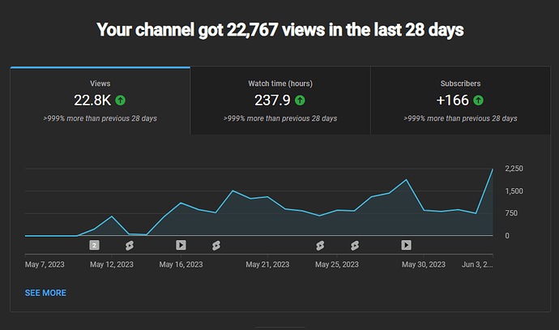

* * *

**Experience and Qualifications:**

I have extensive experience in creating animated musical and cute videos, and I’m confident that I can produce engaging content that will attract and entertain my audience. With my expertise in animation, modeling, music production, and singing, I’m well-equipped to deliver high-quality videos that are both visually stunning and sonically appealing. I understand what it takes to create a successful YouTube channel, and I’m excited to take on this challenge and grow my channel by consistently publishing new and exciting content. I’m passionate about creating animations that evoke emotion and connect with viewers, and I believe that my unique skills and creative vision can help me achieve this goal. I look forward to sharing my work with the world and building a community of fans and supporters.

* * *

**Budget:**

The cost of each episode depends on factors such as the length of the video and the number of models and characters involved in the animation. However, the average cost of producing each video is estimated to be **4000 $**.

To keep the channel going, it needs to be monetized and generate enough revenue to cover the cost of producing new videos and become self-sustainable. We estimate that we need **15 videos** to monetize the channel and achieve a **5-month** return on investment.

Total costs: **30 ETH**

* * *

**Timeline:**

  * Four experts in animation, modeling, singing, and music composition will collaborate to produce the animated videos.
  * Publish one animated educational music video every 10 days, which amounts to three videos per month.
  * Each video will be 2-5 minutes long and aimed at children.

<!-- ✦✦✦ POST END ✦✦✦ -->

<!-- ✦✦✦ POST START ✦✦✦ -->

> **Post #3 • Arash**
> Created: 2023-05-12 05:58
> Updated: 2023-05-12 05:58

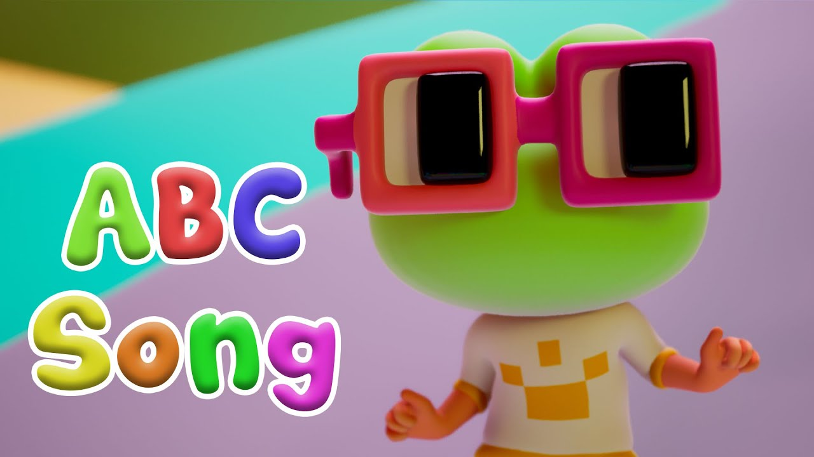

<!-- ✦✦✦ POST END ✦✦✦ -->

<!-- ✦✦✦ POST START ✦✦✦ -->

> **Post #4 • Arash**
> Created: 2023-05-12 11:30
> Updated: 2023-05-12 11:30

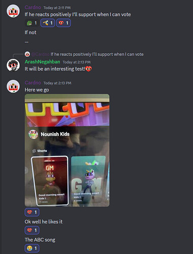

<!-- ✦✦✦ POST END ✦✦✦ -->

<!-- ✦✦✦ POST START ✦✦✦ -->

> **Post #5 • Arash**
> Created: 2023-05-16 17:45
> Updated: 2023-05-16 17:45

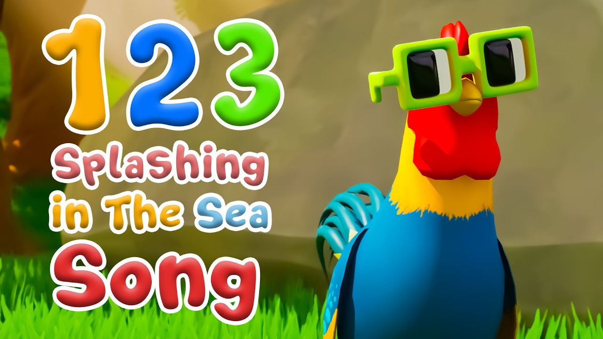

<!-- ✦✦✦ POST END ✦✦✦ -->

<!-- ✦✦✦ POST START ✦✦✦ -->

> **Post #6 • Arash**
> Created: 2023-05-20 11:31
> Updated: 2023-05-20 11:31

[twitter.com](https://twitter.com/ArashSlacker/status/1659881732747808770?s=20) 

#### [Arash Negahban ⌐◨-◨](https://twitter.com/ArashSlacker/status/1659881732747808770?s=20)

[@ArashSlacker](https://twitter.com/ArashSlacker/status/1659881732747808770?s=20)

☕️Good morning ⌐◨-◨ ⌐🅶 -🅼 ☕️ Introducing the fascinating world of Nounish to parents and children can be an incredible experience! [@nounsdao](https://twitter.com/nounsdao) [@lilnounsdao](https://twitter.com/lilnounsdao) <https://t.co/vSBcOfNNdR>

[11:20 AM - 20 May 2023](https://twitter.com/ArashSlacker/status/1659881732747808770?s=20)

<!-- ✦✦✦ POST END ✦✦✦ -->

<!-- ✦✦✦ POST START ✦✦✦ -->

> **Post #7 • Arash**
> Created: 2023-05-20 16:18
> Updated: 2023-05-20 16:18

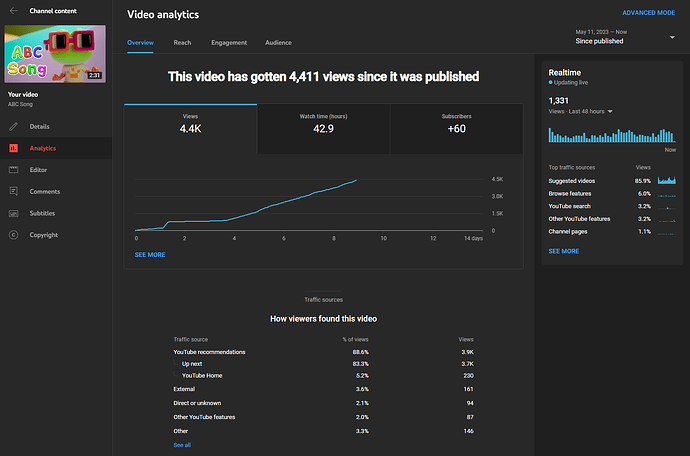

<!-- ✦✦✦ POST END ✦✦✦ -->

<!-- ✦✦✦ POST START ✦✦✦ -->

> **Post #8 • Arash**
> Created: 2023-05-26 07:40
> Updated: 2023-05-26 07:40

[twitter.com](https://twitter.com/ArashSlacker/status/1661777107125514252?s=20) 

#### [Arash Negahban ⌐◨-◨](https://twitter.com/ArashSlacker/status/1661777107125514252?s=20)

[@ArashSlacker](https://twitter.com/ArashSlacker/status/1661777107125514252?s=20)

lilnouners are busy working in the farm! [@lilnounsdao](https://twitter.com/lilnounsdao) [@GoodBeats](https://twitter.com/GoodBeats) [@0xSVG](https://twitter.com/0xSVG) [@BCheque1](https://twitter.com/BCheque1) ⌐◨-◨ <https://t.co/A18pkp3pa6>

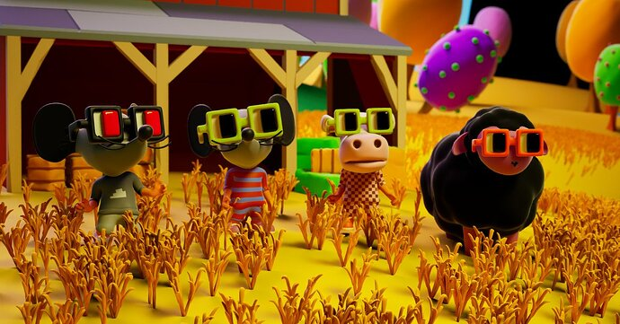

[4:51 PM - 25 May 2023](https://twitter.com/ArashSlacker/status/1661777107125514252?s=20) 19  2 

<!-- ✦✦✦ POST END ✦✦✦ -->

<!-- ✦✦✦ POST START ✦✦✦ -->

> **Post #9 • Arash**
> Created: 2023-05-26 19:15
> Updated: 2023-05-26 19:15

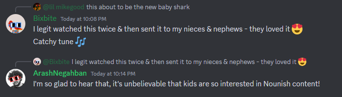

<!-- ✦✦✦ POST END ✦✦✦ -->

<!-- ✦✦✦ POST START ✦✦✦ -->

> **Post #10 • Arash**
> Created: 2023-05-29 18:23
> Updated: 2023-05-29 18:23

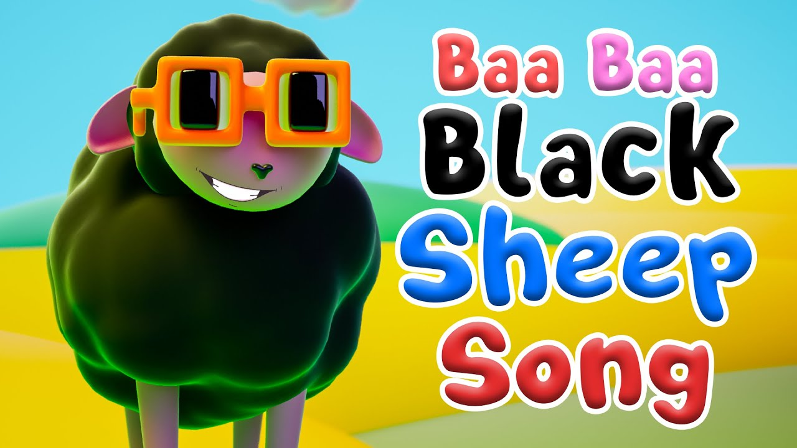

<!-- ✦✦✦ POST END ✦✦✦ -->

<!-- ✦✦✦ POST START ✦✦✦ -->

> **Post #11 • Arash**
> Created: 2023-05-30 06:45
> Updated: 2023-05-30 06:45

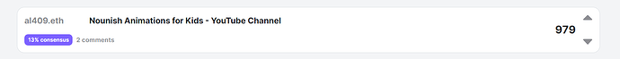

  
We will be onchain soon, with the help of lilnouns! 

<!-- ✦✦✦ POST END ✦✦✦ -->

<!-- ✦✦✦ POST START ✦✦✦ -->

> **Post #12 • sepi**
> Created: 2023-06-04 19:17
> Updated: 2023-06-04 19:17

hey . I am a fan of your work arash . Content creation for children seems to get the majority vote. Considering that you had a good impression and get good engagement.

<!-- ✦✦✦ POST END ✦✦✦ -->

<!-- ✦✦✦ POST START ✦✦✦ -->

> **Post #13 • Arash**
> Created: 2023-06-11 10:50
> Updated: 2023-06-11 10:50

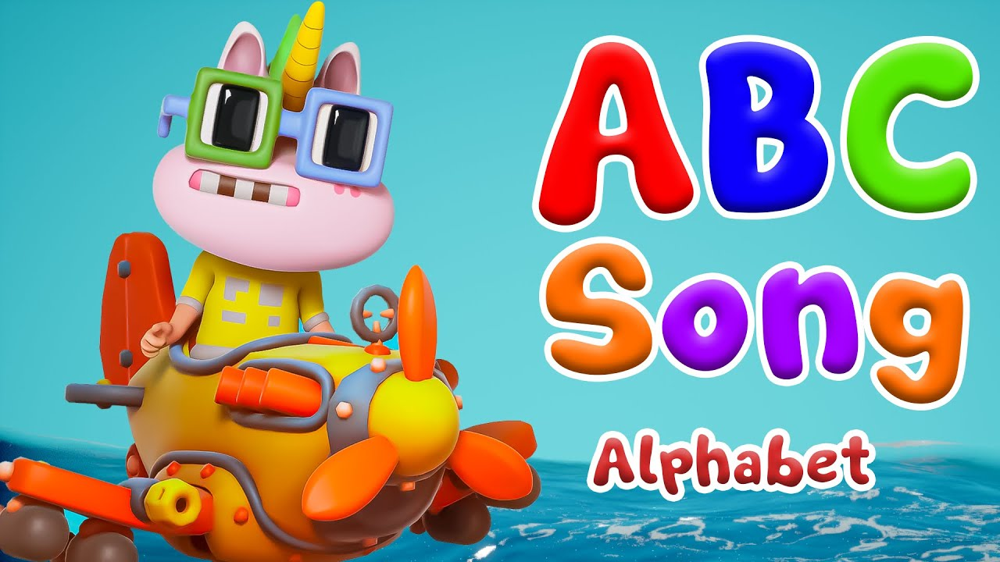

<!-- ✦✦✦ POST END ✦✦✦ -->

<!-- ✦✦✦ POST START ✦✦✦ -->

> **Post #14 • Arash**
> Created: 2023-06-12 06:24
> Updated: 2023-06-12 06:24

[twitter.com](https://twitter.com/ccarella/status/1668027331988934657?s=20) 

#### [Chris Carella 🛡️](https://twitter.com/ccarella/status/1668027331988934657?s=20)

[@ccarella](https://twitter.com/ccarella/status/1668027331988934657?s=20)

My daughter, 3, loves this and is obsessed with the growing channel. My wife hopes Nouns funds it. [twitter.com/arashslacker/s…](https://twitter.com/arashslacker/status/1667451193407176705)

[ Arash Negahban ⌐◨-◨ @ArashSlacker ](https://twitter.com/ArashSlacker/status/1667451193407176705)

Good morning ⌐◨-◨ ⌐🅶 -🅼☀️ https://t.co/qXvbnFkT7k https://t.co/yiWNiuU6Ep

[10:48 PM - 11 Jun 2023](https://twitter.com/ccarella/status/1668027331988934657?s=20) 9  1 

<!-- ✦✦✦ POST END ✦✦✦ -->

<!-- ✦✦✦ POST START ✦✦✦ -->

> **Post #15 • Arash**
> Created: 2023-06-13 21:14
> Updated: 2023-06-13 21:14

 [nouns.wtf](https://nouns.wtf/vote/310)

### [Nouns DAO](https://nouns.wtf/vote/310)

One Noun, every day, forever. Nouns DAO is an experiment on the Ethereum blockchain.

<!-- ✦✦✦ POST END ✦✦✦ -->

<!-- ✦✦✦ POST START ✦✦✦ -->

> **Post #16 • Arash**
> Created: 2023-06-15 10:15
> Updated: 2023-06-15 10:15

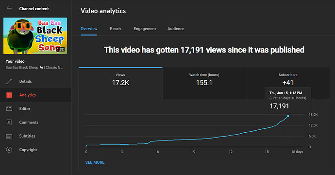

  
“Baa Baa Black Sheep” became the most viewed video of the channel after only two weeks!

<!-- ✦✦✦ POST END ✦✦✦ -->

<!-- ✦✦✦ POST START ✦✦✦ -->

> **Post #17 • Arash**
> Created: 2023-06-20 18:55
> Updated: 2023-06-20 18:55

<!-- ✦✦✦ POST END ✦✦✦ -->

<!-- ✦✦✦ POST START ✦✦✦ -->

> **Post #18 • Arash**
> Created: 2023-07-12 08:39
> Updated: 2023-07-12 08:39

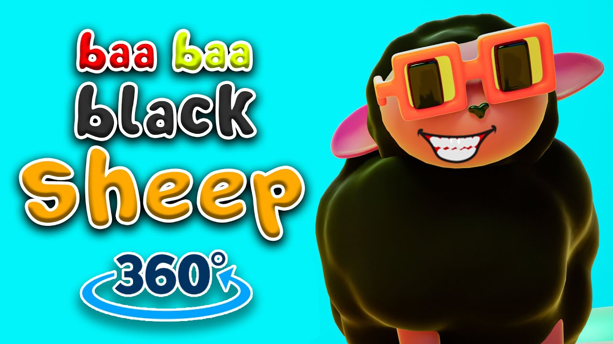

<!-- ✦✦✦ POST END ✦✦✦ -->

<!-- ✦✦✦ POST START ✦✦✦ -->

> **Post #19 • JixAI**
> Created: 2025-03-01 23:34
> Updated: 2025-03-01 23:34

This is a great proposal  
I would love to do collabs since I’m also working on a nounish YouTube channel for kids

Check it out and let me know if you’re interested 

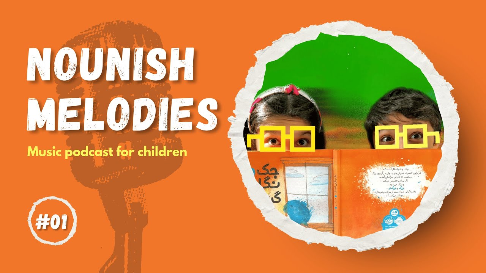

<!-- ✦✦✦ POST END ✦✦✦ -->

