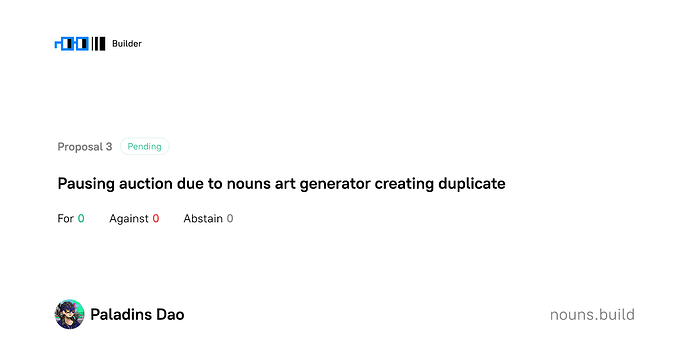

# Problem with nouns art generator on our fork

<!-- ✦✦✦ POST START ✦✦✦ -->

> **Post #1 • Paladinsdao**
> Created: 2023-05-13 01:28
> Updated: 2023-05-13 01:28

[nouns.build](https://nouns.build/dao/0xBb842a85646C8E5423281451B00e18D5Bb5Bf8D3/vote/0x4b6a5f37533d5a17d98ea4ddd057eae78b21160de8f029af5a32fe085aee8b51?tab=details)

### [Prop 3 - Pausing auction due to nouns art generator creating duplicate](https://nouns.build/dao/0xBb842a85646C8E5423281451B00e18D5Bb5Bf8D3/vote/0x4b6a5f37533d5a17d98ea4ddd057eae78b21160de8f029af5a32fe085aee8b51?tab=details)

View this proposal from Paladins Dao

Hi we created Paladins DAO and used the nouns fork builder. However the art generator seems to have created a duplicate as #21 is the same as #14. I’ve tried to create a proposal to pause the auction but there’s no way to pause it quickly enough since it takes 24 hours to vote on that pause.

Is there someone from the nouns tech team who can help?

<!-- ✦✦✦ POST END ✦✦✦ -->

