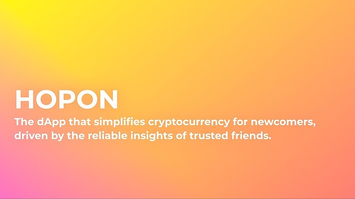

# Nouns need something more innovative

<!-- ✦✦✦ POST START ✦✦✦ -->

> **Post #1 • Nouns4155**
> Created: 2023-05-15 16:27
> Updated: 2023-05-15 18:51

Nouns need far more in development for everyone to see this a trend as product with capable of acquiring the current trend.  
I think first this needs to be a product of use case currently this is built on blockchain so apart from the blockchain community other should see the potential.  
The best solution for it to become popular is to use in proper development strategies like for instance all popular accessories like noggles etc are popular through movies and short films trying that won’t work all the time cause it needs some element to it to be popular for example tom and Jerry got popular because of the jokes and funny play between a mouse and cat with a dog(not all the time.  
The best way to improve the development with my research for this trend would be  
Reply the Solution   
Agree on this? 

<!-- ✦✦✦ POST END ✦✦✦ -->

<!-- ✦✦✦ POST START ✦✦✦ -->

> **Post #2 • Nouns4155**
> Created: 2023-05-15 16:28
> Updated: 2023-05-15 16:28

With my research i am developing the solution.  
I love Nouns   
Sorry we love Nouns   

<!-- ✦✦✦ POST END ✦✦✦ -->

<!-- ✦✦✦ POST START ✦✦✦ -->

> **Post #3 • Nouns4155**
> Created: 2023-05-16 11:47
> Updated: 2023-05-16 11:50

A radical solution would be _games_ **but in more an approach to the current trend not blockchain cause blockchain needs more people adoption**. **This could be a part of the game but not the entry to gaming.**  
We need to acquire the gaming industry with the different approaches like:

  * Easily playable (All different ages involved in game).
  * More innovative.
  * Incentivize the community (Reward in what make the game to next level).

I choose the gaming side cause nouns movies and comics need better scene (explained earlier) also it is in development don’t want to make changes but a more suitable and innovative solution  
gaming industry can be more innovative compared to comics, this generation loves innovation and technology,

> science based survey says games are more better and selected by individuals of all ages compared to stories and comics

.  
Do we need a survey for this question?  
No, of course this is the result you would have expected unless you are from the B.C’s   
But it should not be an old versions of games, A innovative version that will make nouns and noggles a part of history. Just like i wanted it to be one of the best cause of pixel art and the noggles.  
I will be with the team for the end of my tech journey which is my whole life and develop most of my products integrated with nouns.

<!-- ✦✦✦ POST END ✦✦✦ -->

<!-- ✦✦✦ POST START ✦✦✦ -->

> **Post #4 • wonderingchew**
> Created: 2023-05-19 08:36
> Updated: 2023-05-19 08:36

Yes! Agreed. We need to integrate into easily accessible and populist mainstream media outputs, like you suggest very accessible games, all ages not necessarily on-chain.  
On-chain data, community tools and new forms of Open IP are a critical point in human evolution but are not yet mainstream and people do not quite understand the value proposition. Too many friction points.

<!-- ✦✦✦ POST END ✦✦✦ -->

<!-- ✦✦✦ POST START ✦✦✦ -->

> **Post #5 • Nouns4155**
> Created: 2023-05-20 12:48
> Updated: 2023-05-20 12:48

Yes, the game should be mainstream media output making it accessible for everyone but _different from other mainstream media games_ for **instance rewards make it popular, etc**. also with features that are good making it **boasting and slight tactics** used for an example rain world game. .

<!-- ✦✦✦ POST END ✦✦✦ -->

<!-- ✦✦✦ POST START ✦✦✦ -->

> **Post #6 • Nouns4155**
> Created: 2023-05-23 06:29
> Updated: 2023-05-23 06:29

I think the nouns movie as a bug 

<!-- ✦✦✦ POST END ✦✦✦ -->

<!-- ✦✦✦ POST START ✦✦✦ -->

> **Post #7 • Brenna**
> Created: 2023-05-23 06:44
> Updated: 2023-05-23 06:44

What do you think about a European music tour?

<!-- ✦✦✦ POST END ✦✦✦ -->

<!-- ✦✦✦ POST START ✦✦✦ -->

> **Post #8 • Nouns4155**
> Created: 2023-05-23 19:24
> Updated: 2023-05-23 19:26

I am planning to propose the ideas in nouns center ideas and start working with the team.  
Any feedback .

<!-- ✦✦✦ POST END ✦✦✦ -->

<!-- ✦✦✦ POST START ✦✦✦ -->

> **Post #9 • Nouns4155**
> Created: 2023-05-24 11:12
> Updated: 2023-05-24 11:12

I would make a small **thread on my twitter** and propose the full plan of idea in the website.

<!-- ✦✦✦ POST END ✦✦✦ -->

<!-- ✦✦✦ POST START ✦✦✦ -->

> **Post #10 • Nouns4155**
> Created: 2023-06-02 08:32
> Updated: 2023-06-02 08:45

 Anime game or **comic games**   
just like spider-man: Into the spiderverse or spider-man: Across the spiderverse.

The main trend of [Non-photorealistic rendering](https://en.wikipedia.org/wiki/Non-photorealistic_rendering) which is used in the two movies above by Pixar  
How would it be in the game industries, a game like this apart from 3d models  
superb! if so drop a comment.

<!-- ✦✦✦ POST END ✦✦✦ -->

<!-- ✦✦✦ POST START ✦✦✦ -->

> **Post #11 • Nouns4155**
> Created: 2023-06-05 16:55
> Updated: 2023-06-05 16:55

Posted the idea to team.  
And made a twitter thread on some parts.

<!-- ✦✦✦ POST END ✦✦✦ -->

<!-- ✦✦✦ POST START ✦✦✦ -->

> **Post #12 • Nouns4155**
> Created: 2023-06-08 11:19
> Updated: 2023-06-08 11:19

**Crack the Code:**  
I am planning to pick a good name for the game developing **(Nouns game)**  
Comment some names

<!-- ✦✦✦ POST END ✦✦✦ -->

<!-- ✦✦✦ POST START ✦✦✦ -->

> **Post #13 • sepi**
> Created: 2023-06-08 16:04
> Updated: 2023-06-08 16:04

I think popular things are made from hundreds of content. more ideas, more chance

<!-- ✦✦✦ POST END ✦✦✦ -->

<!-- ✦✦✦ POST START ✦✦✦ -->

> **Post #14 • Nouns4155**
> Created: 2023-06-21 08:04
> Updated: 2023-06-21 08:13

We need to come through some criteria’s to _understand the problem_ and _**create a reliable solution (strategy)**_ :  
**1\. What is the problem for Nounsdao.**  
**2\. Why the problem is not improved (Current structure) and solution.**  
**3\. Who need to try the plan to work out.**  
**4\. Where does the problem need more effective and strategical solution.**  
**5\. When will the implementation take place.**  
**6\. How will this benefit the community.**

If this is found and solved we might get to the brand acquisition phase, noggles will become the trend.  
All projects working on any project should consist this formula so this will take eliminate waste cost from treasure and make the ideas more effective.

**Note: Ideas can be generated by anybody but trustful and secure funding for the correct person who is doxxed or well known is important.**

<!-- ✦✦✦ POST END ✦✦✦ -->

<!-- ✦✦✦ POST START ✦✦✦ -->

> **Post #15 • Nouns4155**
> Created: 2023-06-26 13:16
> Updated: 2023-06-26 13:16

Any pixel art animators or graphic designers could join us in the developing process  

<!-- ✦✦✦ POST END ✦✦✦ -->

<!-- ✦✦✦ POST START ✦✦✦ -->

> **Post #16 • Nouns4155**
> Created: 2023-07-19 15:47
> Updated: 2023-07-19 15:47

Something is brewing 

Note: This would be part of the game .

<!-- ✦✦✦ POST END ✦✦✦ -->

<!-- ✦✦✦ POST START ✦✦✦ -->

> **Post #17 • Gruffdatsik**
> Created: 2023-07-28 06:50
> Updated: 2023-07-28 06:50

 ["PROPOSAL IDEA" NOUNISH hardware device](https://discourse.nouns.wtf/t/proposal-idea-nounish-hardware-device/4915) [NounsDAO Proposals](/c/nounsdao/nounsdao-proposals/6)

> Descriptive Title: NFT Phone Unlocker: Empowering Users with Exclusive NFT Avatars and Phone Carrier Unlocking Services [50386161][OIP =(2)]  Summary: Our unique DAO-themed device offers phone carrier unlocking services exclusively for specific company phone models. The pocket-sized hardware features USB 3.0 and Type-C connectors, while each phone service provider (T-Mobile, Verizon, ATT, etc.) presents its collection of NFT avatars representing their unique brand. Minted NFTs will… 

CHECK MY PROPOSAL

<!-- ✦✦✦ POST END ✦✦✦ -->

<!-- ✦✦✦ POST START ✦✦✦ -->

> **Post #18 • Gruffdatsik**
> Created: 2023-07-28 07:14
> Updated: 2023-07-28 07:14

 ["PROPOSAL IDEA" NOUNISH hardware device](https://discourse.nouns.wtf/t/proposal-idea-nounish-hardware-device/4915) [NounsDAO Proposals](/c/nounsdao/nounsdao-proposals/6)

> Descriptive Title: NFT Phone Unlocker: Empowering Users with Exclusive NFT Avatars and Phone Carrier Unlocking Services [50386161][OIP =(2)]  Summary: Our unique DAO-themed device offers phone carrier unlocking services exclusively for specific company phone models. The pocket-sized hardware features USB 3.0 and Type-C connectors, while each phone service provider (T-Mobile, Verizon, ATT, etc.) presents its collection of NFT avatars representing their unique brand. Minted NFTs will… 

CARE TO GIVE ME FEEDBACK??

<!-- ✦✦✦ POST END ✦✦✦ -->

<!-- ✦✦✦ POST START ✦✦✦ -->

> **Post #19 • Nouns4155**
> Created: 2023-10-29 16:53
> Updated: 2023-10-29 16:53

The amount of time I took to develop my project was worth a lot of time so i am planning to give special privileges to nouns community as a chance.

<!-- ✦✦✦ POST END ✦✦✦ -->

<!-- ✦✦✦ POST START ✦✦✦ -->

> **Post #20 • yung_algorithm**
> Created: 2023-10-31 14:29
> Updated: 2023-10-31 14:29

i have a playable nouns game demo currently, let me know and i can share a link. a proposal will come up in the next week or so on it, i hope i can gain your support!

<!-- ✦✦✦ POST END ✦✦✦ -->

<!-- ✦✦✦ POST START ✦✦✦ -->

> **Post #21 • Trackstats**
> Created: 2023-11-02 06:46
> Updated: 2023-11-02 06:46

I think that the means of destroying culture are suitable for mass acceptance and popularization. Basically, you could print a small comic and sell it (I can just give it away) in local stores.

Make limited editions and it will spur the interest of ordinary people.

In modern realities, when AI manages to distribute a lot of content, you don’t even have to hire a huge staff of employees.

<!-- ✦✦✦ POST END ✦✦✦ -->

<!-- ✦✦✦ POST START ✦✦✦ -->

> **Post #22 • richkidsofsolana**
> Created: 2023-11-03 07:50
> Updated: 2023-11-03 07:50

Anyone can check my game [‎Bitfight on the App Store](https://apps.apple.com/tr/app/bitfight/id6449154006)

<!-- ✦✦✦ POST END ✦✦✦ -->

<!-- ✦✦✦ POST START ✦✦✦ -->

> **Post #23 • M-theory**
> Created: 2023-11-14 07:11
> Updated: 2023-11-14 07:11

I would love to share 3 proposal on this note (or at least share the ideas for now). Sadly every post that i have made across the nouns ecosystem hasn’t received a comment back so I’m hesitant to put it all out there. If anyone wants to hear, i can open a thread  
Cheers

<!-- ✦✦✦ POST END ✦✦✦ -->

<!-- ✦✦✦ POST START ✦✦✦ -->

> **Post #24 • Nouns4155**
> Created: 2023-12-01 17:42
> Updated: 2023-12-01 17:42

How about a proposal for me to bring more awareness for nouns within a period of 3 months?

<!-- ✦✦✦ POST END ✦✦✦ -->

<!-- ✦✦✦ POST START ✦✦✦ -->

> **Post #25 • Nouns4155**
> Created: 2023-12-01 17:44
> Updated: 2023-12-01 17:49

0x9d35D46dE62a4017b69540cFA4648B65099B7b0e My address for 3.65 eth.  
That would be a great amount to build a whole network and bring awareness but it doesn’t come with money it is the relentless amount of time you put to bring the most  
Blood & sweat   
3 months is enough to go mainstream.

<!-- ✦✦✦ POST END ✦✦✦ -->

<!-- ✦✦✦ POST START ✦✦✦ -->

> **Post #26 • Nouns4155**
> Created: 2023-12-01 17:53
> Updated: 2023-12-01 17:53

[Aether Zedition](https://zora.co/collect/zora:0xccdcd223ecb3102ffb150aa83ff0881f71503f49) This is a collection on Zora network it will switch to a different network and give benefits to all nouns and buyers  
Hint* Just read the description in the collection page

<!-- ✦✦✦ POST END ✦✦✦ -->

<!-- ✦✦✦ POST START ✦✦✦ -->

> **Post #27 • Nouns4155**
> Created: 2023-12-23 14:14
> Updated: 2023-12-23 14:14

Collab with the blue-chip to launch our own model but with a amazing twist  

<!-- ✦✦✦ POST END ✦✦✦ -->

<!-- ✦✦✦ POST START ✦✦✦ -->

> **Post #28 • Nouns4155**
> Created: 2023-12-27 16:45
> Updated: 2023-12-27 17:16

Airdrop 1 completed for the holders.   
And a Puzzle Hint was dropped for the holders.

Clue for My lovely Nouns community go to discord to access the Secret Hint.  
Where is the discord??

[Aether Zedition (zora.co)](https://zora.co/collect/zora:0xccdcd223ecb3102ffb150aa83ff0881f71503f49)  
Find my t____er in the c_e__t__ Page

<!-- ✦✦✦ POST END ✦✦✦ -->

<!-- ✦✦✦ POST START ✦✦✦ -->

> **Post #29 • andrew1**
> Created: 2023-12-29 03:11
> Updated: 2023-12-29 03:11

 Nouns4155:

> **but in more an approach to the current trend not blockchain cause blockchain needs more people adoption**.

I agree with you; we need to solve real pain points from mass people to make public good. I had a proposal, but it got hidden by the forum bot accidentally, so I have to paste the Google cache to show you my idea - What do you think?

 [Nouns – 27 Dec 23](https://webcache.googleusercontent.com/search?q=cache:6ht2qtSrTeEJ:https:%2F%2Fdiscourse.nouns.wtf%2Ft%2Fproposal-a-revolutionary-dapp-for-onboarding-the-next-million%2F5196&hl=zh-CN&gl=jp "04:25PM - 27 December 2023")

### [Proposal: A Revolutionary dApp for Onboarding the Next Million](https://webcache.googleusercontent.com/search?q=cache:6ht2qtSrTeEJ:https:%2F%2Fdiscourse.nouns.wtf%2Ft%2Fproposal-a-revolutionary-dapp-for-onboarding-the-next-million%2F5196&hl=zh-CN&gl=jp)

NounsDAO NounsDAO Proposals

Please let me know what you think; any advice is appreciated! Will you agree with the problem, the solution, and the whole proposal? Summary - TL;DR HOPON: A Revolutionary dApp for Onboarding the Next Million Objective: To simplify the crypto...

<!-- ✦✦✦ POST END ✦✦✦ -->

<!-- ✦✦✦ POST START ✦✦✦ -->

> **Post #30 • Mute**
> Created: 2023-12-29 13:56
> Updated: 2023-12-29 13:56

I can bring that fire. Let me know if this post gets seen and I can lay it out.  
love,  
MuteX

<!-- ✦✦✦ POST END ✦✦✦ -->

<!-- ✦✦✦ POST START ✦✦✦ -->

> **Post #31 • Nouns4155**
> Created: 2023-12-30 10:49
> Updated: 2023-12-30 10:59

I think your solution is an already existing one and it doesn’t solve anything (It isn’t a Problem to solve currently), you mentioned to provide guidance, you think that only stands to solve and pass your proposal also the budget is to much for a four-day old in the nouns community member and it is fake in all angles of your presentation.  
Solving a problem in the Nouns Community doesn’t always mean you should have Big or Low Budget Sometimes a little from (Very Low) the treasury and a self-sustaining system (**Zero Budget System**) is great.  
Aimimg for High Budget for an existing solution that are more effective that yours, well that is over for you.

This Applies to Everyone:  
If you are so passionate to build something, then build it effective and efficient from others

<!-- ✦✦✦ POST END ✦✦✦ -->

<!-- ✦✦✦ POST START ✦✦✦ -->

> **Post #32 • Nouns4155**
> Created: 2023-12-30 10:51
> Updated: 2023-12-30 10:51

You have community which is already present so build with **zero budget**.  
It is most savage way to build an efficient system and grow with the community.

<!-- ✦✦✦ POST END ✦✦✦ -->

<!-- ✦✦✦ POST START ✦✦✦ -->

> **Post #33 • Nouns4155**
> Created: 2023-12-30 10:52
> Updated: 2023-12-30 10:52

**Failure is the power to build destruction**.

<!-- ✦✦✦ POST END ✦✦✦ -->

<!-- ✦✦✦ POST START ✦✦✦ -->

> **Post #34 • andrew1**
> Created: 2023-12-31 08:41
> Updated: 2023-12-31 08:41

Hey Nouns4155,

Thank you for your idea!! I really appreciate it!

I’m sorry that my account raised your questions, well also the amount I tried to acquire. Please let me clarify that I applied the fund in a one-year-stream and the Nouncils can terminate it any time, so the power is balanced, and the goals are aligned to build this product together without anyone can do harm. I know there are lots of cons in this field, so I’l willing to address any question any one raises.

As to the Zero Budget System you mentioned, I would call it Minimum Viable Product, I already finished the MVP in past years, using free tech stacks like CEX+API+spreadsheets to help onboard newbies and it proved such product will significantly increase newbie’s onboarding rate by 10x, so I know it is be a good time to ship the product (before this bull run). I’m confused why the presentation is fake in all angles, and no hard feelings, I would love to discuss.

Your last question is there is an existing solution, would you mind give me a link so I can research on? That would be super helpful, thank you [@Nouns4155](/u/nouns4155)!

Cheers,  
Andrew

<!-- ✦✦✦ POST END ✦✦✦ -->

<!-- ✦✦✦ POST START ✦✦✦ -->

> **Post #35 • nounimal**
> Created: 2024-01-01 07:05
> Updated: 2024-01-01 07:05

#Solana gets #nounish

<!-- ✦✦✦ POST END ✦✦✦ -->

<!-- ✦✦✦ POST START ✦✦✦ -->

> **Post #36 • M-theory**
> Created: 2024-01-02 10:03
> Updated: 2024-01-02 10:03

WTF. is this real? I can’t believe how blatantly some of us are ignored.

I will buy 35 nouns at 15 eth each. Show your interest here. I have been trying for months to get involved in the community, but I feel you rather force people to be outsiders.

I am more than happy to win auctions for 10eth and fork for 22eth,but much rather we grow this community to epic proportions.

Comment anything below… or nothing, your choice

<!-- ✦✦✦ POST END ✦✦✦ -->

<!-- ✦✦✦ POST START ✦✦✦ -->

> **Post #37 • Bixbite**
> Created: 2024-01-02 13:47
> Updated: 2024-01-02 13:47

Your engaging on a platform that no one uses anymore. Best bet is to join a community Discord server like Nouncil or Lil Nouns or engage on Twitter or Farcaster.

<!-- ✦✦✦ POST END ✦✦✦ -->

<!-- ✦✦✦ POST START ✦✦✦ -->

> **Post #38 • Nouns4155**
> Created: 2024-01-03 17:19
> Updated: 2024-01-03 17:19

Hey Mate, the budget you requested is too high for a platform that is similar to some of the major exchanges **(ex. Binance Safepal Ledger etc)** are doing more effectively and the idea is good (Solution) not that your idea is bad but i think it is not viable solution for the current trend to build well if you see your product must bring awareness to nouns so it doesn’t solve it and the trend is changing rapidly. To bring newbies it is good to build new tech  
Simply user interface to solve your crypto needs is a existing need doubled up, You Get it.

Thanks  
Keep on building innovately  
Beyond Infinity.

<!-- ✦✦✦ POST END ✦✦✦ -->

<!-- ✦✦✦ POST START ✦✦✦ -->

> **Post #39 • andrew1**
> Created: 2024-01-04 04:47
> Updated: 2024-01-04 04:47

Hey man, thanks for your honest thoughts on the budget and the comparison to major platforms, I really enjoyed our convo, so I just got my first Noun and hope we can talk more and dive deeper with you fun people.

You’re absolutely right about the rapid change in trends and the necessity for innovation to attract newcomers. The goal we had wasn’t just to replicate what was already out there. Instead, it’s about creating a more intuitive, user-friendly interface that bridges the gap for newbies, making their entry into crypto smoother and less daunting - trust me, this didn’t change for years; what’s nice and easy for us is crazy scary for newbies, they don’t have any means to start with confidence.

I am really good at building product that combines new techs in different fields and creates outstanding user experiences. I will refine the proposal and update u. And yes ser, I’ll definitely keep your feedback in mind when I do it.

<!-- ✦✦✦ POST END ✦✦✦ -->

<!-- ✦✦✦ POST START ✦✦✦ -->

> **Post #40 • gekkid**
> Created: 2024-01-18 13:39
> Updated: 2024-01-18 13:40

I am replying as an outsider of the Nouns community, an observer I should say. I think that what Nouns brings to the table is the decentralization of organizations, aka DAO, and this is where the focus should be, on the **governance of Nouns itself** , how decentralized/democratic it is, what mechanisms are in place for accountability, and of course to keep expanding and working on **marketing elements** as you’ve done well so far. So these are two vectors of action IMHO for the long term sustainability of the project. I kindly remind the community that as of 17/06/2023 out of the 290 projects approved, around 23,3% were yet to be implemented IRL. I don’t know what the figures would be by now. Just my 2 cents.

<!-- ✦✦✦ POST END ✦✦✦ -->

<!-- ✦✦✦ POST START ✦✦✦ -->

> **Post #41 • dyoraki**
> Created: 2024-01-19 10:12
> Updated: 2024-01-19 10:12

Music Festival Tickets - The First Nouns Music Festival

A ticketing platform powered by the Nouns Ecosystem. We are a group of festival organizers that aims to integrate our music event with blockchain technology. Making our already 10-year event as a marketing arm for the Nouns Ecosystem and blockchain technology in general. We need a sponsor who owns a Nouns NFT to support our vision and help us submit a proposal to the Nouns Ecosystem community.

I see Nouns project as a proposal platform which caters to the needs and interests of various individuals and organizations that are seeking innovative solutions and collaborations to support its ecosystem. Although I do not own a Nouns NFT, mainly because of its price, I like the idea of its unlimited supply yet only mints one every 24 hours to maintain rarity and exclusivity.

However, its limited accessibility for retail users due to its high prices on top of the already complex blockchain technology, retail users may find it difficult to participate in the Nouns project and in the blockchain space in general.

Our team aims to address this limitation by actively engaging with retail users and exploring ways to make blockchain technology valuable and accessible to a wider audience. This means that we will work on ways to give retail users a reason of value to incentivize their effort in learning and adopting blockchain technology.

One way we plan to implement is through the entertainment industry. A particular asset that we believe can bridge the gap between retail users and blockchain is through the tokenization of tickets for concerts, movies, and other live events. Current ticketing systems other than being inefficient and prone to fraud, also lack value after the event is over.

Hence, we envision creating a platform where event organizers can tokenize their tickets, inject an intrinsic value into them, and allow retail users to easily purchase, trade these tickets on the blockchain, and stake it for future rewards.

<!-- ✦✦✦ POST END ✦✦✦ -->

<!-- ✦✦✦ POST START ✦✦✦ -->

> **Post #42 • SignsFromAbove**
> Created: 2024-01-26 21:32
> Updated: 2024-01-26 21:32

Hey Nouns  
I am happy to be here.  
I read through all the comments and ideas.  
As a newbie here I wonder if this platform still works the way it was implemented for?

Where are all projects/prospects/ideas posted? How is it controlled? Or is the nouns-proposal ecosystem already a closed  system for only “the well known, famous high noun society”.

Don’t get me wrong, if it is that way it would be a pity but easy to decide to take an idea to some VC or even to public authorities promoting start ups.

But I rather would love to go with nouns if it is what it always seemed to be on the first glance (at least for me)…:

A fantasic project of the bleeding edge of _Tech+Art+Social layer_

Hope I wasn’t mistaken!

<!-- ✦✦✦ POST END ✦✦✦ -->

<!-- ✦✦✦ POST START ✦✦✦ -->

> **Post #43 • dpx**
> Created: 2024-02-18 06:58
> Updated: 2024-02-18 06:58

Sounds pretty cool, maybe make a thread for it!

<!-- ✦✦✦ POST END ✦✦✦ -->

<!-- ✦✦✦ POST START ✦✦✦ -->

> **Post #44 • UndisturbedCat**
> Created: 2024-02-23 04:43
> Updated: 2024-02-23 04:46

Tokenizing tickets is a game-changer, seriously. No more losing tickets, dealing with scalpers, or those post-event blues when your ticket stub is just a memory.

I can’t believe nobody has implemented this yet.

<!-- ✦✦✦ POST END ✦✦✦ -->

<!-- ✦✦✦ POST START ✦✦✦ -->

> **Post #45 • BaseVille**
> Created: 2024-05-14 12:50
> Updated: 2024-05-14 12:50

Hey There! i have a simple idea that can work, something similar to what i proposed about baseville. [BaseVille A Storytelling Universe supported by NounsDAO](https://discourse.nouns.wtf/t/baseville-a-storytelling-universe-supported-by-nounsdao/5377)

i can 3d model any nouns that wants to participate and create an animated series on Unreal engine, this could help having content on social media and letting everyone share the stories that will be recreated using nouns.

i would love to help in anything i can

<!-- ✦✦✦ POST END ✦✦✦ -->

<!-- ✦✦✦ POST START ✦✦✦ -->

> **Post #46 • dyoraki**
> Created: 2024-06-17 17:58
> Updated: 2024-06-17 17:58

Here is the link to the thread - [Proposal: The Decentralized Music Festival - A Value Distribution Mechanism For The Music Industry](https://discourse.nouns.wtf/t/proposal-the-decentralized-music-festival-a-value-distribution-mechanism-for-the-music-industry/5284)

<!-- ✦✦✦ POST END ✦✦✦ -->

