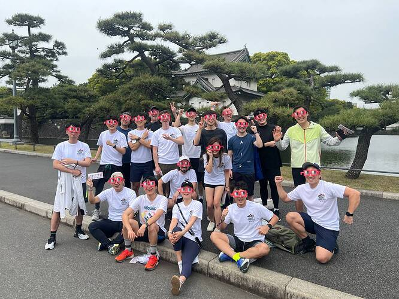
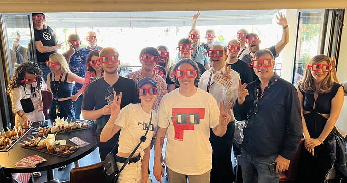

# Noggles everywhere forever!

<!-- ✦✦✦ POST START ✦✦✦ -->

> **Post #1 • BigshotKlim**
> Created: 2023-06-08 04:03
> Updated: 2023-06-08 04:09

THIS IS PART 2 to our LoFiNoggles idea  
looking for a vibe check to see if they should be one prop? Also looking for some help to tighten this up to go on chain. THis is not a usual prop, more of a utility prop for something that the whole ecosystem will benefit from . Please comment below

#  PROP STAGE 2: NON-STOP NOGGLES EVERYDAY forever maybe

We are NOUNWORKS! A dedicated team focused on creating, manufacturing and distribution of the highest quality NOUNISH products in the space. To date we have shipped over 20K of the highest quality Nounish items to every part of the world. (Noggles, Lo-Fi paper Noggles, pins, stickers, AR experiences, soon mini figures, and more!) We would love to continue this mission every day, as long as we can.

We think that the DAO should fund a stream of NOGGLEs and related items to supply every passed on-chain prop, as well as all Prophouse props that require physical goodies for social activations and engagement.

We also feel that any new Nouner should receive a set of Noggles, and a “welcome aboard” package or starter kit that will help them proliferate the community they’ve just stepped into.

The physical can feed & help build the digital.

#  OUR ASK

**3-4 ETH / month or more ? to cover:**

  * products & shipping / fulfillment
  * warehousing and shipping
  * This can be increased based on demand

**1-1.5ETH / month to cover:**5tb

  * Bigshot administrative costs, communication, and back end coordination work tracking, logistics and comms.

**Record keeping:**  
We would maintain a publicly accessible record (spreadsheet) detailing who we shipped to, what we shipped, and the associated costs.

**Controlling the flow:**  
We’d also need to establish eligibility parameters (who gets the products). Noun holders, passed on-chain proposals and Nounish IRL events which benefit the community should be eligible for kits.

**Best usage:**  
If a builder is creating a prop and needs IRL collateral like Noggles or Lo-Fi Noggles to help them execute their proposal, they should be eligible to receive those items. Social media posts & assets are better with Noggles!

* * *

Some examples of how the products could be used:

**Bundled “Party Packs”**

“Passed” Prop welcome bundle includes a case of 10 plastic Noggles, 50 paper Noggles and 50 pins. This is basically a Party Pack that enables a super fun Nouns-themed event and gives the builders an opportunity to share and document their experiences and journey, share info and more with the world as they build their project.

**Proliferator Packs:**

For Nouners planning IRL events: could come in 4 tiers to supply a variety of sizes of events:

  * Tier 1: Single pair of Noggles: $20 + shipping
  * Tier 2: 50 pack Lo-Fi: $150 + shipping
  * Tier 3: 1 Noggles, 50 Lo-Fi, 10 pins: $220 + shipping
  * Tier 4: Case of 10 noggles, 100 Lo-Fi, 50 pins: $750 + shipping

  

<!-- ✦✦✦ POST END ✦✦✦ -->

