# PLEASE READ: My appeal to the entire Nouns Community (this is not for votes)

<!-- ✦✦✦ POST START ✦✦✦ -->

> **Post #1 • arya**
> Created: 2023-07-17 18:05
> Updated: 2023-07-17 18:05

Fellows before you criticise me for this post, please do spare 5 minutes to read it till the end.

Few whales have really been controlling the voting on all the Nouns sub-DAOs. Namely SharkDAO, Lil Nouns and Nouncil. These sub-DAOs have a high weightage on the on chain votes. And an influencial outreach in the Nouns community.

I submitted a prop on-chain few days ago. The voting in the subDAOs began on their discord channels and on snapshot. After I presented my idea to these sub-DAOs, I had literally gotten multiple DMs appreciating my prop, people saying it was a great prop. But the votes show a complete different story. I knew, something was fishy. Things just don’t add up.

Have a look below at sharkDAO voting on snapshot for my prop:  

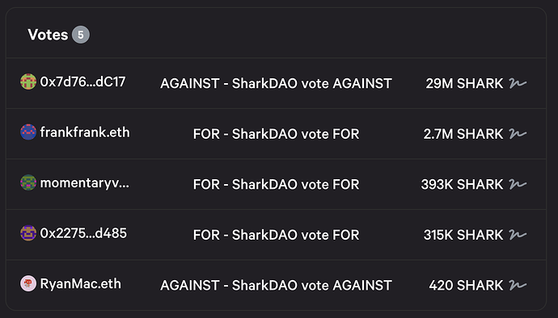

  

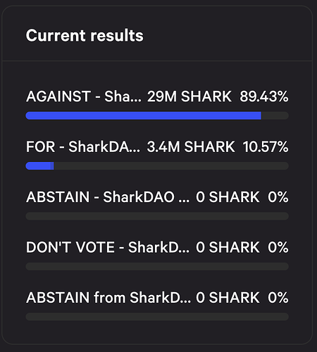

<https://snapshot.org/#/sharkdao.eth/proposal/0xa1ac3d3b1570644668905f5e73d8b4a502322f2be74b9d0ae3795ad974f487fd>

One whale with 29M shark tokens has outweighed all the FOR votes.

Now look at Lil Nouns snapshot votes for my prop:  

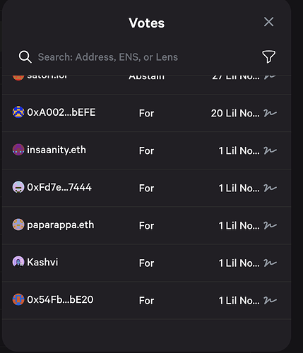

  

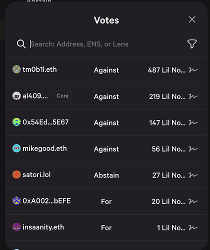

  

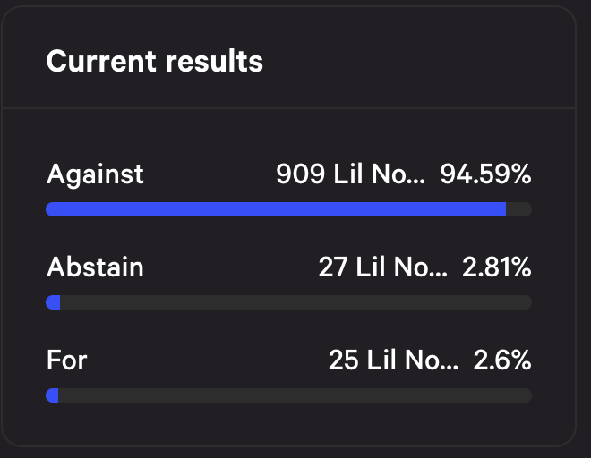

<https://snapshot.org/#/leagueoflils.eth/proposal/0x18e4f1a2f61c5c5c1ed7f1e3d57133e3f0c3c4308bea11c39a397cb7885bdbde>

Again a whale (which i suspect has multiple wallets) with a ton of Lil Nouns has outweighed all the FOR votes.

Now look at Nouncil votes for my prop:  

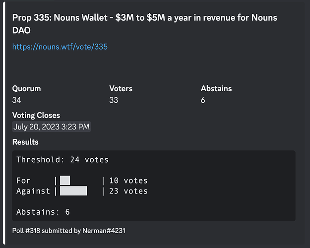

Now you might think that Nouncil voting has been fair, but I highly doubt. 10 Nouncillors voted FOR me. 23 voted AGAINST. I suspect many of these 23 Nouncillors are a whale(s) too, possible the same one(s) from sharkDAO and Lil Nouns. I say this not because it is my prop and I feel a bias for it. Not at all. I would gladly be rejected if the votes reflected the sentiment of the community at large. But i know that they don’t. Because I have gotten multiple positive DMs (from fellow Nouncillors and Nouners) on discord and positive feedbacks on discourse posts.

About the people who messaged me on discord supporting my prop, I want to respect their privacy and hence am not posting screenshots of conversations. However, below are few screenshots from my last few discourse posts (since they are all already public):  

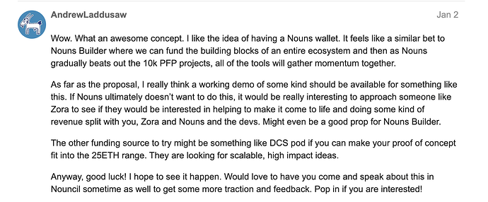

  

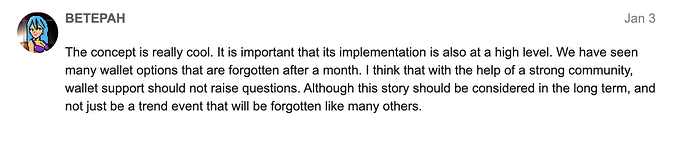

  

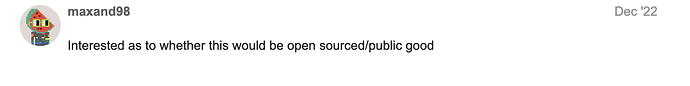

  

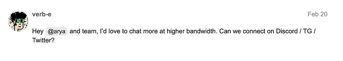

  

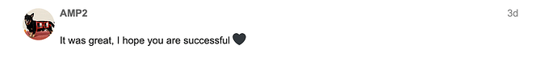

  

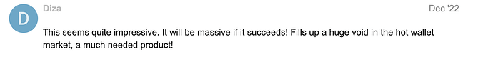

  

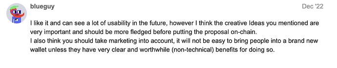

  
And so on.

There are way more DMs in my discord showing excitement. Especially after I took everyone’s feedback into consideration and incorporated it into my final on-chain prop.

Hence my appeal to the community is that please engage more in voting. Not saying you have to support my prop. But just voice your opinion in terms of replies and votes. Whatever your opinion may be - supportive or critical. We really cannot let a few whales decide for the entire community. That just defeats the purpose DAOs.

Lastly, this is not to post against any of the sub-DAOs. In fact, I highly appreciate all of the sub-DAOs, especially the Nouncil, for giving me a chance to present my idea on their weekly meeting. Fellow Nouncillors have been really supportive. One of them even sponsored my prop. Deep gratitude from my side to Nouncil  For all of you who believe in me, we have to fight this together to defeat the whales who are single handedly spoiling the sub-DAO and Nouns ecosystem.

<!-- ✦✦✦ POST END ✦✦✦ -->

<!-- ✦✦✦ POST START ✦✦✦ -->

> **Post #2 • ChiccarottiTom**
> Created: 2023-07-17 19:50
> Updated: 2023-07-17 19:50

I am not able to understand it either. So many interesting proposals and they were lost. But well, the charms of democracy.    

<!-- ✦✦✦ POST END ✦✦✦ -->

<!-- ✦✦✦ POST START ✦✦✦ -->

> **Post #3 • arya**
> Created: 2023-07-18 10:39
> Updated: 2023-07-18 10:39

Well, defeats the purpose of DAOs in my opinion. Corporate governance is in tradfi and power structures in existing democracies are exactly the same, atleast not packaged as decentralised. We need one vote from one network participant, rather than one vote from one token. Of course the implementation of it is not yet figured out, but something we should work towards!

<!-- ✦✦✦ POST END ✦✦✦ -->

<!-- ✦✦✦ POST START ✦✦✦ -->

> **Post #4 • maty**
> Created: 2023-07-23 17:24
> Updated: 2023-07-23 17:24

hey [@arya](/u/arya), regarding Nouncil - the voting is done using a Discord bot, which only allows votes to be cast by users with “Nouncillor” role, so whales (or bots) have no influence there.

Lil Nouns and SharkDAO on the other hand are heavily influenced by whales, that’s true.

<!-- ✦✦✦ POST END ✦✦✦ -->

