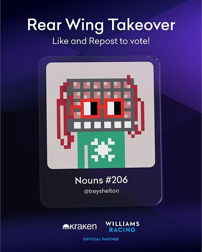

# Help me get Noun 206 on an F1 car

<!-- ✦✦✦ POST START ✦✦✦ -->

> **Post #1 • Tres**
> Created: 2023-08-28 17:31
> Updated: 2023-08-28 17:32

Noun community,  
I entered Noun 206 into Kraken’s RearWingTakeover contest and was selected as one of 20 finalist. Now I need a quick vote from you in the form of a like.

As you might be aware, Noun 206 depicts Alan Turing’s Turing Machine. It’s only fitting that the greatest British invention should be riding the fastest F1 car from British racing legend, Frank Williams.

Six of the 20 finalist will make it on the car. I need your vote by liking and/or retweeting the following post. You small act here can result in some great Noun visibility.

[twitter.com](https://twitter.com/KrakenNFT/status/1696193721392410806) 

#### [Kraken NFT](https://twitter.com/KrakenNFT/status/1696193721392410806)

[@KrakenNFT](https://twitter.com/KrakenNFT/status/1696193721392410806)

Rally for [@treyshelton](https://twitter.com/treyshelton) and [@nounsdao](https://twitter.com/nounsdao) in the [#RearWingTakeover](https://twitter.com/search?q=%23RearWingTakeover) contest! 🎉 🗳️ Every like and repost counts as a vote. Join the race to victory and help them win by showing your support 🤝 🏆 Voting ends 11:59 PM EST on Aug 31st. Good luck! [@WilliamsRacing](https://twitter.com/WilliamsRacing)

[4:11 PM - 28 Aug 2023](https://twitter.com/KrakenNFT/status/1696193721392410806) 10  6 

<!-- ✦✦✦ POST END ✦✦✦ -->

