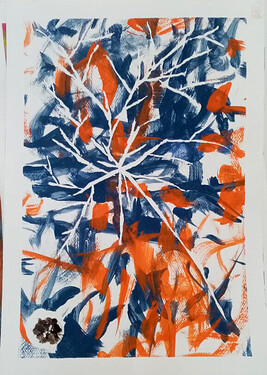

# What do you think about merging the world of #pets with #NOUNS?

<!-- ✦✦✦ POST START ✦✦✦ -->

> **Post #1 • AMP2**
> Created: 2023-10-06 14:51
> Updated: 2023-10-07 07:28

I and my eight dogs possess the ability to create artworks, and we proudly declare ourselves as the world’s first group of eight canine painters. I have numerous ideas for advancing the Name of the Nances. Here are a few of my ideas:

In the first stage, I intend to create 10 to 15 paintings with various styles and diverse designs using Nouns glasses.  

In the second stage, we aim to participate in international art exhibitions, particularly in Istanbul, Turkey, as the Nouns painting team. This endeavor will provide us with a great opportunity to showcase our abilities and attract the attention of art enthusiasts.

In the third stage, I have written an instructional book on painting for dogs that I have yet to publish. I believe that incorporating graphic images of Nouns on the book cover and pages will make it highly captivating and unique.

I am highly interested and ready to collaborate with Nouns family graphic designers to complete the book.  

This endeavor has the potential to captivate the broader artistic community and animal lovers. It not only demonstrates the extraordinary artistic abilities of the Nances but also promotes the love and connection between art and companionship with domestic animals. This project can foster new connections and combine the love for art and pets.

Your feedback and suggestions inspire us to bring out our best in this journey. We eagerly await your input to embark on this adventure!

Visit our Instagram to see more  
instagram : **[WOOF9_](https://www.instagram.com/woof9_/)**

**Some examples of our work**

  

  

  

  

<!-- ✦✦✦ POST END ✦✦✦ -->

<!-- ✦✦✦ POST START ✦✦✦ -->

> **Post #2 • AMP2**
> Created: 2023-10-08 16:29
> Updated: 2023-10-08 16:29

Why does no one comment?

<!-- ✦✦✦ POST END ✦✦✦ -->

