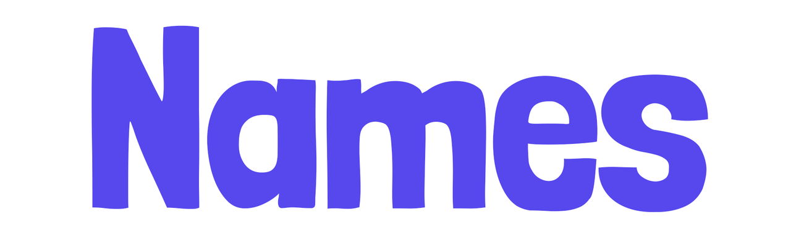
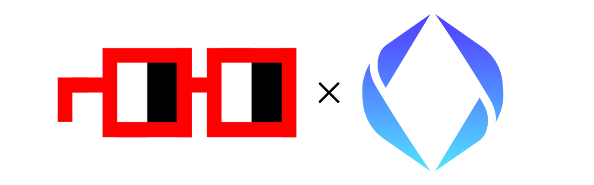
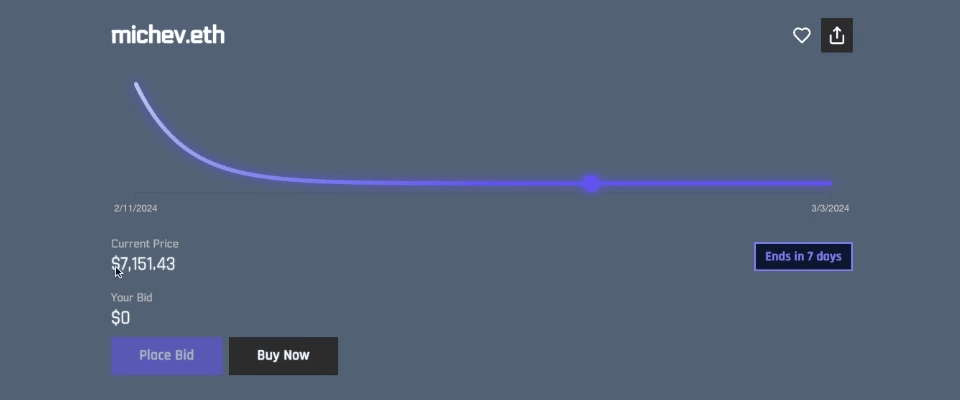
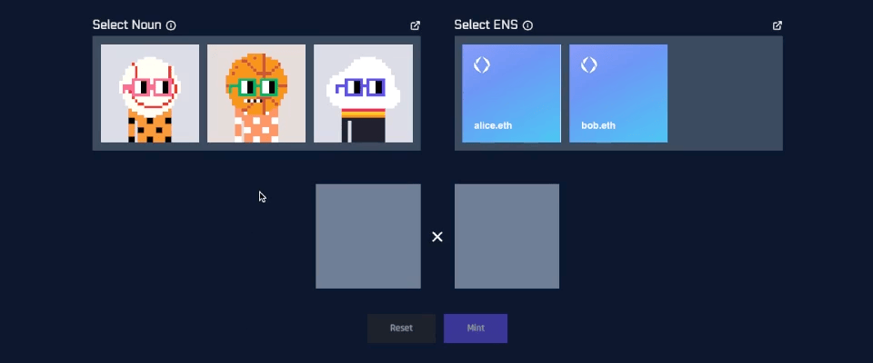
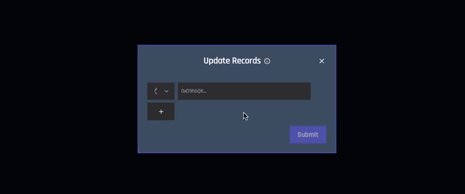
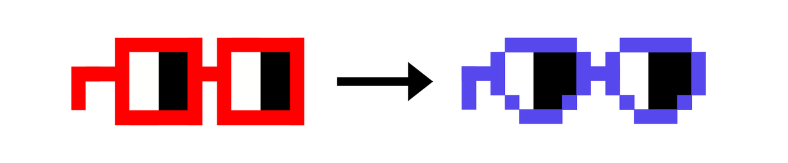

# Names - Nouns x ENS

<!-- ✦✦✦ POST START ✦✦✦ -->

> **Post #1 • three9s**
> Created: 2024-02-25 05:43
> Updated: 2024-02-25 05:49

### TL;DR

By integrating the practicality of ENS domain resolution with the distinctive character of Nouns avatars, Names significantly enhances the recognizability of Ethereum accounts. This transformation turns on-chain interactions into a more engaging and inviting experience.

### Background

Many of us dream of a time when visiting Etherscan reveals not just complex hexadecimal addresses, but an on-chain world that’s fun and immersive. Instead of interacting with dull accounts, we envision them as _characters in a deeper story_.

[Nouns](https://nouns.wtf/), along with many early NFT projects, began by championing the proliferation of PFP avatars. While this was a step toward creating a more captivating narrative on-chain, there’s still untapped potential for integrating these digital identities more deeply into Ethereum to enhance user interaction and engagement.

A limitation of current PFP solutions is their incompleteness - there is no direct way to set an NFT as your account profile picture or use it as a way to identify your account. For example, owning Noun 100 does not directly link ‘Noun 100’ with your account in tools like Etherscan or MetaMask.

[ENS](https://docs.ens.domains/) offers solutions: you can set a designated avatar and use a memorable domain in place of your account address.

These approaches, individually, address only aspects of identity representation and interaction on the blockchain. However, by integrating them, we can create a comprehensive and seamless user experience that bridges the gap between ownership and identity.

### Objectives

  1. **Foster Unique On-Chain Personas:** Utilize Nouns and ENS to encourage high-quality interactions on-chain, making Ethereum more accessible and inviting.
  2. **Promote CC0 Art:** Showcase the vast array of Nouns CC0 public domain artwork, emphasizing creativity, openness, and community collaboration.
  3. **Increase Appeal of Nouns:** Provide additional incentives for acquiring and holding a Noun.
  4. **Increase Appeal of ENS:** Provide additional incentives for acquiring and holding an ENS domain.
  5. **Incorporate Nounish Mechanism Design:** Apply permissionless auction mechanisms to ensure fairness and guarantee that Names with high demand are acquired by the most interested bidder.
  6. **Spread The Meme:** Extend Nouns’ reach with active participation in meme proliferation and cultural storytelling.

### Protocol

There is a natural way to derive art directly from the domain itself, which will be used to proliferate CC0 art to domain owners.

In Nouns, art is generated via pseudorandomness created from the blockhash and noun ID:
    
    
    uint256 pseudorandomness = uint256(
        keccak256(abi.encodePacked(blockhash(block.number - 1), nounId))
    );
    

Similarly, in Names, the art is generated directly from the ENS namehash:
    
    
    uint256 namehash = uint256(keccak256(abi.encodePacked(BASE_NODE, keccak256(bytes(domain)))));
    

Just as _pseudorandomness_ determines Nouns traits, the _namehash_ determines Names traits.

The namehash is extensively used as a reference to a domain in the ENS protocol. This ensures that alice.eth will always have unique Name artwork, bob.eth will have theirs, and so on.

Names ensures every Ethereum account can showcase a unique persona. This concept allows further refinement of the protocol with Nounish mechanism design principles for minting Names through two primary avenues:

  1. Bidding in the ENS Dutch Auction
  2. Combining a Noun with an ENS domain

These mechanisms are designed to incentivize participation and promote each protocol, as described below.

#### 1\. Bidding in the ENS Dutch Auction

Names incorporates an auction to mint a new NFT, leveraging the Dutch auction built into the ENS protocol for expiring domains.

After a domain expires, the price for a domain decays from $100m over a 21-day period. At any point, a bidder can secure it by sending the current price in ETH. This ensures ENS domains go to the bidder who wants it most. Auction details can be found [here](https://docs.ens.domains/dao/proposals/1.5).

Names builds on top of this auction by being minted when this registration occurs and setting the appropriate ENS records:

  * The address field is set to the owner
  * The avatar field is set to the CC0 artwork

This provides a frictionless user experience for getting fully set up as an on-chain persona. Names also improves upon the existing ENS Dutch auction user experience by allowing you to set a bid at a specific target price, as opposed to having to wait for a specific date and time to send a transaction:

Such a system significantly benefits the ENS DAO, as heightened competition in the Dutch auction leads to elevated bid prices and, consequently, increased revenue.

#### 2\. Combining a Noun with an ENS domain

Names will flourish with the active engagement and collaboration of the Nouns community. Therefore, the protocol also incorporates mechanisms that incentivize owning and purchasing a Noun.

Names can be claimed by combining an existing Noun with an ENS:

This is a one-time opportunity: once a Name has been minted for a given Noun and ENS domain, that same Noun or domain cannot be used to mint again.

With this alternative strategy, users can acquire a specific domain without waiting for its expiration and subsequent re-registration in the Dutch auction. Such an approach likely appeals to existing ENS domain holders, provided they also own an unused Noun.

Moreover, the Nouns DAO stands to gain significantly: The added utility of Noun ownership drives up auction competitiveness and, by extension, revenue.

#### Additional Features

Not only will Names streamline the process of personalizing and identifying Ethereum accounts, but it will also introduce a suite of features designed to enhance user interaction and visibility. For example, we will assist users in setting up their domain records, ensuring that their identities are easily accessible:

These kinds of additional functionalities, while not a target for the initial phase of Names, may be pursued in the future. Anything that can further enhance account recognizability and foster a more welcoming environment is within the scope of challenges Names aims to address.

### Funding

To ensure the successful launch and ongoing support of the Names project, we’re seeking a total funding of 70 ETH. This budget will be allocated as follows:

#### Development and Deployment: 40 ETH

  * **Smart contract development** for integrating the Names protocol with ENS and Nouns: 20 ETH
  * **Frontend development** for the user interface and auction system: 10 ETH
  * **Security audits and testing** to ensure the integrity and safety of the protocol: 10 ETH

#### Operational and Miscellaneous: 20 ETH

  * **Awareness initiatives** to engage and inform the Ethereum and NFT communities: 10 ETH
  * **ENS and Nouns support** for integration efforts, including technical assistance and optimization: 5 ETH
  * **Reserve fund** for unforeseen expenses and leveraging new opportunities: 5 ETH

The funding strategy begins with a request for 35 ETH from Nouns, capitalizing on its engaged community to set a strong foundation for the project’s early development stages. This initial phase aims to demonstrate tangible progress and value, creating a compelling case for support from the ENS DAO.

Following this, we will present our achievements and future plans to the ENS DAO, seeking an additional 35 ETH to complete the funding requirements. This phased approach underscores our commitment to fostering a more engaging, personalized on-chain experience by bridging two pivotal ecosystems within Ethereum.

### Expected Outcomes

With the implementation of Names, we anticipate a significant increase in the appeal and utility of both Nouns and ENS domains. This project is expected to:

  * Enhance the visibility and usability of ENS domains and Nouns avatars, driving up engagement and value.
  * Strengthen the Ethereum ecosystem by making on-chain interactions more accessible and personal.
  * Foster a vibrant community of users who are invested in the creative and functional potential of their on-chain identities.
  * Generate additional revenue for both the Nouns and ENS DAOs through increased domain registrations, renewals, and Noun auctions.

### Conclusion

Names represents a unique opportunity to enrich the Ethereum ecosystem by combining the cultural impact of Nouns with the functional utility of ENS domains. Through this project, we aim to create a new standard for on-chain identity that is both meaningful and enjoyable for users, contributing to the broader adoption and appreciation of Ethereum and its communities.

By funding this initiative, the Nouns and ENS DAOs will not only support the development of innovative on-chain solutions but also play a pivotal role in shaping the future of digital identity on Ethereum.

> This proposal is draft phase: your feedback is welcome. If you are interested in getting involved, reach out on [Farcaster](https://warpcast.com/three9s.eth) or [Telegram](https://t.me/three9s).

<!-- ✦✦✦ POST END ✦✦✦ -->

<!-- ✦✦✦ POST START ✦✦✦ -->

> **Post #2 • bubs_eth**
> Created: 2024-02-25 16:35
> Updated: 2024-02-25 16:35

Super excited about the Names idea! Onboarding users in a fair way was the primary concern I was thinking about but the strategic incentive design has that covered (also TIL about the expiry auction)

Overall meshing Nouns with ENS sounds like a game-changer for Eth’s vibe and wallet friendliness, looking forward to the final prop.

<!-- ✦✦✦ POST END ✦✦✦ -->

<!-- ✦✦✦ POST START ✦✦✦ -->

> **Post #3 • dpx**
> Created: 2024-02-28 04:51
> Updated: 2024-02-28 04:51

I don’t think there was any mention of a fee but still I’m bullish b/c of the huge potential for returns. With $100,000,000 starting price, even just one extremely high-demand name could pay for itself if there was like a 5% fee.

Also since it’s an entirely different collection it’s customary to not make the avatars 1:1 with Nouns art itself. For example look at [DinoNouns](https://discourse.nouns.wtf/t/nsfw-dinonouns-interactive-on-chain-nft/2642) where they modified the head trait. This kind of thing distinguishes it from the Nouns collection.

But yeah really creative idea to solve the bad UX of ugly hexidecimal address, DM’d about mvp I’d be down to test.

<!-- ✦✦✦ POST END ✦✦✦ -->

<!-- ✦✦✦ POST START ✦✦✦ -->

> **Post #4 • three9s**
> Created: 2024-02-29 05:47
> Updated: 2024-02-29 05:52

> I don’t think there was any mention of a fee but still I’m bullish b/c of the huge potential for returns. With $100,000,000 starting price, even just one extremely high-demand name could pay for itself if there was like a 5% fee.

Hadn’t really thought about this since #1 priority is removing friction. May look into this as a possibility if getting 100% of funding isn’t possible.

> Also since it’s an entirely different collection it’s customary to not make the avatars 1:1 with Nouns art itself. For example look at [DinoNouns ](https://discourse.nouns.wtf/t/nsfw-dinonouns-interactive-on-chain-nft/2642) where they modified the head trait. This kind of thing distinguishes it from the Nouns collection.

That’s a good idea, otherwise the tokens and brand could get pretty confusing. What do you think about this?

The modified Names noggles (naggles?) will replace the normal glasses trait. Additionally it can be used as the Names _brand_ as noggles are for Nouns.

> DM’d about mvp I’d be down to test.

Replied!

<!-- ✦✦✦ POST END ✦✦✦ -->

<!-- ✦✦✦ POST START ✦✦✦ -->

> **Post #5 • dpx**
> Created: 2024-03-02 21:03
> Updated: 2024-03-02 21:03

Yeah that is understandable. Design looks great!

<!-- ✦✦✦ POST END ✦✦✦ -->

<!-- ✦✦✦ POST START ✦✦✦ -->

> **Post #6 • three9s**
> Created: 2024-04-13 19:42
> Updated: 2024-04-13 19:42

Demo is live at <https://demo.name.bid> \- Your feedback would be greatly appreciated!

<!-- ✦✦✦ POST END ✦✦✦ -->

