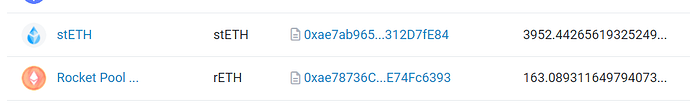
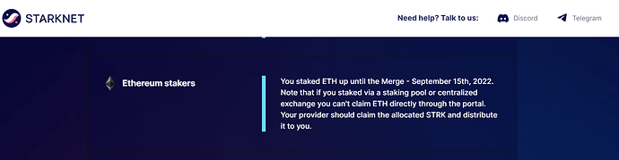

# Starknet airdrop possibility?

<!-- ✦✦✦ POST START ✦✦✦ -->

> **Post #1 • Mart**
> Created: 2024-04-23 22:34
> Updated: 2024-04-23 22:34

Currently there is a Starknet airdrop which includes the wallets or accounts that stake Ethereum, thanks to the DAO wallet publishing it we can see that there are 4,115 Eth in treasury staked to date today  

  
and the starnet airdrop eligibility says this:  

My proposal is to verify this eligibility and pass the possible airdrop to the treasury.

The verification page is this:

[starknet.io](https://www.starknet.io/provisions-geo-regulations)

### [Starknet's Provisions Program: Allocating STRK Tokens to the Community](https://www.starknet.io/provisions-geo-regulations)

Starknet's Provisions program will allocate STRK to the community, including Starknet users and builders, Ethereum contributors and stakers, and more.

<!-- ✦✦✦ POST END ✦✦✦ -->

