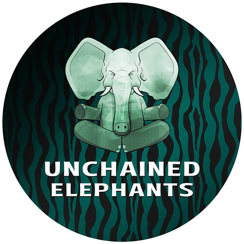
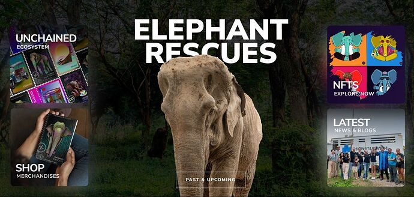

# Buying the Freedom of Mongkol, the Baby Elephant - Thailand

<!-- ✦✦✦ POST START ✦✦✦ -->

> **Post #1 • DanielUnchained**
> Created: 2024-05-05 08:52
> Updated: 2024-05-05 08:52

Hey Public Nouns,

I’m sharing a draft grant proposal for feedback.

We are seeking funding to rescue a baby elephant, a 7-year-old bull elephant who has experienced early separation from his mother. This rescue mission goes beyond saving one elephant; it aims to educate the public and raise awareness of the significant challenges these beatuful aminals face throughout their lives due to human entertainment practices.

Unchained Elephants has successfully rescued two elephants to date as well as contribuited with food & care for 8 elephants duing the pandemic. Our first rescue, Kanoon, was recenetly featured on [The Dodo](https://www.youtube.com/watch?v=LG7OGAAhYCw&t=3s&pp=ygUIdGhlIGRvZG8%3D).  
Our second rescue, [Kham Phaeng](https://www.youtube.com/watch?v=5vIH9rKnHbs), will also be featured on The Dodo’s channels, and we are preparing for our third elephant rescue which most probably get the featured there as well.

As part of this rescue, we will bring an American film crew to continue documenting the plight of elephants in Thailand, were we will be add the logos of Nouns with the goal of developing a documentary series.

We are seeking to raise 5 ETH for Public Goods from Nouns, which is a partial amount of the total funding needed for our initiative: $42,700.

The remaining funds will be sourced from traditional crowdfunding methods, through which we have previously raised around $40,000, along with sales of NFTs on ICP & XRPL.

Thank you for your consideration.

Daniel

 [Unchained Elephants](https://unchainedelephants.com/)

### [NFT Project For A Cause - Unchained Elephants - Unchained Elephants](https://unchainedelephants.com/)

Unchained Elephants NFT Project: Transforming Elephant Welfare & Rescuing Elephants with Each Collectible. Join our NFT project for a cause!

<!-- ✦✦✦ POST END ✦✦✦ -->

<!-- ✦✦✦ POST START ✦✦✦ -->

> **Post #2 • maty**
> Created: 2024-07-08 15:27
> Updated: 2024-07-08 15:27

Hi [@DanielUnchained](/u/danielunchained) !  
This sounds like a great project, however Discourse is kind of a ghost time these days. If you have a Farcaster account, most of the Nouns community hang out in the /nouns channel on Farcaster  Alternatively you can create a candidate proposal (e.g. via [Nouns Camp](https://www.nouns.camp/)) and gather feedback this way, but there some costs associated with proposing.

Feel free to reach out to me on Twitter or Discourd (maty.eth on both) and I’ll be happy to help you move this along!

<!-- ✦✦✦ POST END ✦✦✦ -->

<!-- ✦✦✦ POST START ✦✦✦ -->

> **Post #3 • francigloo**
> Created: 2024-07-09 13:21
> Updated: 2024-07-09 13:21

This is awesome! Keep up the good work.

<!-- ✦✦✦ POST END ✦✦✦ -->

<!-- ✦✦✦ POST START ✦✦✦ -->

> **Post #4 • DanielUnchained**
> Created: 2024-07-10 02:13
> Updated: 2024-07-10 02:13

Hey Maty!  
Thank you so much for your reply! I dropped you a message on X from our account Unchained Elephants and also followed you on Farcaster.  
Hopefully you can guide me a bit since we already rescue Mongkoln a few weeks ago but we have other initiatives on the pipeline, including our 4th elephant rescue.  
Cheers  
D.

<!-- ✦✦✦ POST END ✦✦✦ -->

<!-- ✦✦✦ POST START ✦✦✦ -->

> **Post #5 • DanielUnchained**
> Created: 2024-07-10 02:19
> Updated: 2024-07-10 02:19

Thank you so much! We did rescue that baby elephant already but we are onto the next milestone, producing a pilot episode for our documenatry, we will be updating the info and making a new proposal, hopefully we get some support   

<!-- ✦✦✦ POST END ✦✦✦ -->

<!-- ✦✦✦ POST START ✦✦✦ -->

> **Post #6 • francigloo**
> Created: 2024-07-12 14:24
> Updated: 2024-07-12 14:24

Please keep us updated on the documentary!

Looking forward to seeing it.

<!-- ✦✦✦ POST END ✦✦✦ -->

<!-- ✦✦✦ POST START ✦✦✦ -->

> **Post #7 • DanielUnchained**
> Created: 2024-07-13 04:36
> Updated: 2024-07-13 04:36

Thanks! I am actually working to submitt a draft for a proposal becuase we still need to raise funds for the post-production of teh documentary but also paring it with our 4th elephant rescue under the name of Nouns.  
I will definitly let you know as soon as we are ready with the draf for review.  
Thanks!!!

<!-- ✦✦✦ POST END ✦✦✦ -->

<!-- ✦✦✦ POST START ✦✦✦ -->

> **Post #8 • DanielUnchained**
> Created: 2024-10-30 03:38
> Updated: 2024-10-30 03:38

Hey [@maty](/u/maty) & [@francigloo](/u/francigloo),

Sorry to bug you here, but we have an updated proposal, and I was wondering if you could perhaps help me with some feedback on it? As you may know, we already rescued the elephant mentioned on this treath, but now we are looking for our 4th elephant rescue under the Nouns name, and getting it featured on the Dodo.

We have 1 sponsored vote, but we still need a 2nd one. Any support on this would be really helpful.

Here is the link: <https://nouns.wtf/candidates/0xa6c6322b69fe8f85983ef537eff1bcc21ac00a1c-nouns-elephant-rescue-featured-on-the-dodo>

Thanks in advance!

<!-- ✦✦✦ POST END ✦✦✦ -->

