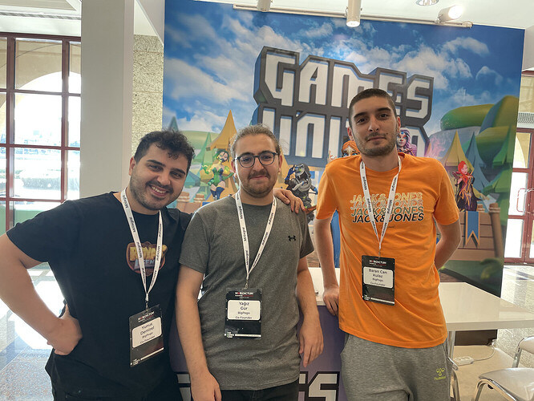
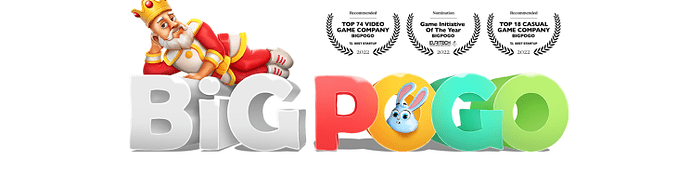

# # Nounstone - Competitive PvP Trading Card Game (TCG) in the World of Nouns!

<!-- ✦✦✦ POST START ✦✦✦ -->

> **Post #1 • yagizgur**
> Created: 2024-05-16 15:41
> Updated: 2024-05-16 15:47

> Dear Nouns Community,
> 
> We are excited to share the demo of our TCG game, Nounstone, which we’ve worked hard to develop. As a candidate project, we now need the support of two sponsors to elevate it to the proposal stage. Your sponsorship will help us bring this unique game to life within the Nouns ecosystem. We would be incredibly grateful for your support and consideration of our efforts.
> 
> Thank you!
> 
> Our candidate: [Nouns DAO](https://nouns.wtf/candidates/0x364d34efaceebb9eefd792eab6e0ae0c9524398e--nounstone---competitive-pvp-trading-card-game-tcg-in-the-world-of-nouns)

### Description:

### TL,DR

We aim to strengthen the presence of the Nouns ecosystem in the gaming industry through the development of the **“Nounstone” TCG (Trading Card Game).** For the successful **execution of Phase 2** of this project, we are requesting a budget of **$96,850** from Nouns DAO, ensuring transparency and community involvement throughout the process.

* * *

### Demo:

**Important Demo Notice**

Download the game for your [**Mac**](https://drive.google.com/file/d/1WFoqXzPcBq4Ux-wCl__rEvk2k-t28-Od/view?usp=sharing) **or** [**Windows**](https://drive.google.com/file/d/16MR1-WkoF_Wk0cVhIOqnURVezmTfoLCA/view?usp=sharing) computer.

Double-click the .zip file you downloaded and open the folder where you will directly see Nounstone.

After opening main menu, click on deck to create your battle deck.

Enter the deck and click create in the top right corner to select a commander for your deck.

Then click on the cards and choose 28 cards, and save your deck by clicking Save in the bottom right corner.

Then return to the main menu and click play to start searching for an opponent.

This Demo is **real time** **multiplayer** , you will be matched with someone waiting in the lobby and can play. If you can’t find someone to play with, you can [watch the demo](https://drive.google.com/file/d/1c7sPYB7fUZcMVIvm2Qdwc1kGC8lDzF46/view?usp=sharing) video.

Enjoy the game!

* * *

For eons, the balance among the universes endured, sustained by the continuous flow of cosmic energy known as **Vitae**. This vital force wove the fabric of existence, maintaining harmony across the realms. However, a mysterious catastrophe deep within the cosmos disrupted the flow of Vitae, causing the energy sources to dwindle. As the energy diminished, once-peaceful relations between universes began to fracture, leading to fierce competition for resources.

During this chaotic period, the legendary universe of **Etherea** , foretold in ancient prophecies, re-emerged. Etherea was the mythical realm responsible for restoring balance when all else failed. Its champions, known as **Nouns** , were summoned to **Crux** , the central **battlefield** of cosmic reconciliation. This arena would be the stage where the fate of all universes would be decided.

As these factions converged at Crux, alliances were formed, and rivalries intensified. The battle for Vitae was not merely a fight for survival but a race to redefine cosmic order. Every clash, every victory, and every defeat at Crux reshaped the energy pathways between universes, either restoring the delicate balance of the multiverse or plunging it further into disarray. The monumental encounters at Crux would determine not only the fate of each realm but also the future structure of the cosmos itself.

* * *

Nounstone is a **card game** that emphasizes **strategic thinking** and **planning**. Players start with a set amount of health points and aim to reduce their opponents’ points to zero.

The game features a variety of cards with different abilities: **attack, defense, magic, and special skills.**

Each card has **unique powers** and **usage conditions** , which allow for different strategies **every** **game**. The mana system requires players to strategically plan which cards to play and when.

Players aim to obtain **new cards** from **card packs** they unlock as the game progresses, with each card having a **rarity level**.

The positioning of cards on the battlefield is crucial as it affects attack and defense tactics. Character cards and power-ups further deepen the in-game strategies.

Nounstone regularly organizes tournaments that test players’ skills and offer a competitive environment. This structure encourages players to continuously discover new strategies.

In the game, players can use **cryptocurrency** to **buy card packs** on the **Web3 Nounstone marketplace** and try to pull **legendary cards**.

Players **can also earn** these cards **by playing** , demonstrating that the game **does not** solely rely on a **“pay-to-win”** structure.

The game offers the possibility to create new cards through **card fusion** and to gain in-game resources by "**burning"** excess cards.

Additionally, players **can sell** their **cards** on the **Web3 marketplace** to other players.

In the **Wagering Arena** , players **bet** cryptocurrency against each other, with the winner taking **90%** of the pot and **10%** going to the **DAO pool**. This system not only stimulates competition but also **contributes** to the **growth of the community** **pool**.

Nounstone stands out with its rich game content and community-centered economic participation, bringing constant dynamism and innovation to the Nouns ecosystem.

* * *

  1. **Card Pack Sales:** Through the Web Marketplace, players can buy card packs or special offers directly from the game itself with cryptocurrency. **100%** of the revenue go to the **Nouns DAO treasury**.
  2. **Royal Fee on Resale:** Players can put rare cards from card packs or fusions up for sale on the web marketplace and sell them to other players. 95% of the revenue from this sale goes to the seller and **5%** to the **Nouns DAO treasury**.
  3. **Wagering Arena Commission:** Players bet cryptocurrency against each other, with the winner taking 90% of the pot and **10%** going to the **DAO pool**. (For example both sides bet 20 dollars, the winner gets 36 dollars, 4 dollars is sent to the Nouns DAO treasury.)

[Check out the Nounstone Revenue Estimator and calculate ROI with your own thoughts!](https://docs.google.com/spreadsheets/d/1I1SBfKyQrDLmoBUxiCCyW9WNDE5UOQXjwJJEoQqNLAs/edit?usp=sharing)

* * *

### Project Timeline:

The development process for the Nounstone project has been meticulously **planned** across **3 key phases** , each crucial for the game’s effective progression and designed to ensure that **Nounstone** delivers **substantial value** to the **Nouns ecosystem**.

**Nounstone Demo Phase (W.1):** Initially presented to you, the **PC & Video based** demo version was developed following a month of dedicated effort by our team. This demo showcases the fundamental dynamics of Nounstone, aiming to shape your **early impressions** of the project and **collect your feedback**.

**Nounstone Phase 2 (W.2):** Upon approval of our proposal, we will immediately commence development, targeting a **release of the full version** on **PC platform (Website based install. Not 3th Party Store).** **within 2-month**. During this phase, we will focus on the **core functionalities** of the game; economic transactions and Web3 integrations **will not be activated yet**.

  1. 50 Playable Nounstone Cards with Spectacular Effects
  2. Multiplayer Gameplay
  3. Adding Friends and Friendly Battle
  4. Card Pack Openings and Collecting Cards
  5. Carefully designed UX and UIs for each page
  6. Unique soundtracks, ambient and sound effects

**Nounstone Phase 3 (W.3):** After successfully **completing** the **second phase** , we will enter an **8-10 month period** of expansion and integration. In this phase, we will develop **Nouns Game Launcher** , fully **integrate** the **Web3 infrastructure** and introduce competitive features like **tournaments** and the **Wagering Arena**. Completion of this phase will commence a regular **flow of funds** into the **Nouns Community Fund**.

  1. 120 Playable Nounstone Cards with Spectacular Effects
  2. Nouns Game Launcher
  3. Web marketplace will open and players will be able to buy and sell cards
  4. Wagering Arena
  5. Card Fusion Mechanic
  6. Story Based Adventure Gameplay

This carefully structured roadmap is designed to create **significant** , **enduring value** for Nounstone within the **Nouns ecosystem**. Each phase will be shaped by continuous, **transparent communication** with the community, driven by your feedback and engagement.

* * *

### Ask for Nounstone Phase 2 (W.2)

The proposed **budget** for the **Nounstone Phase 2** is meticulously designed to cover **critical costs** essential for the project’s **successful execution**. This includes expenses for **personnel** and **legal / launch & others**.

**Personnel Costs: 95,000 USDC**

We have a dedicated team of professionals from various fields, each with significant expertise, focused solely on the Nounstone project. This allocation will support **expenses** for the team’s over the **2-month** development phase

**Legal, Launch & Other Costs: 1,850 USDC**

This allocation will support expenses for the **publish** **Nounstone,** nounstone domains, nounstone emails, nounstone web site and for the **preparation** of **legal contracts** such as T&C - Privacy Policy etc.

### Total Cost: 96,850 USDC

This budget has been carefully prepared with the highest standards of **transparency** and **accountability** , ensuring that every dollar spent is geared towards achieving the project’s objectives and contributing to the **long-term success** of Nounstone within the **Nouns ecosystem**. Each expenditure is **clearly** detailed, showing how it supports the project’s goals.

* * *

The entry of the Nouns ecosystem into the gaming industry presents significant **financial opportunities**. With the gaming market projected to reach **$212.4 billion by 2026** , this sector offers a dynamic structure and a constantly expanding user base, making it an **attractive investment**. Even though initial costs may be high, the potential for substantial long-term financial gains is promising. The community-driven approach in game development allows for in-game innovations and developments to be shaped directly by user feedback, **enhancing players’ sense of** **ownership and deepening their engagement**.

**Culturally and socially** , Nouns’ entry into gaming is also of great significance. **Games** provide excellent platforms for **global interactions** and **cross-cultural exchanges**. Nouns DAO’s decentralized and open-source structure **brings together** players from diverse **cultural** backgrounds, promoting **inclusivity** and **diversity**. This transforms the game from merely a fun activity into a cultural ambassador. The transparency and reliability introduced by blockchain technology set new standards in in-game transactions and digital asset management, fostering trust among players and helping to build a more robust community structure.

The Nounstone, a TCG (Trading Card Game) within the Nouns ecosystem, can integrate with **Nouns’ esports** infrastructure, aiming for Nouns DAO to be an influential player and **owner** in the **esports world**. This strategy enables the brand to secure a more **strategic and effective position** within the **esports ecosystem**. It allows for the promotion and marketing of the game through its channels, **reaching the player and viewer base directly.** Thus, Nouns DAO strengthens its position as an innovative leader in the esports ecosystem, enhancing both its **financial success** and its brand image supported by the community.

* * *

### Why TCG?

Choosing to develop a **Trading Card Game (TCG)** for the Nouns ecosystem is a strategic decision driven by the substantial market opportunities and the broad appeal of card games. TCGs are one of the **most straightforward** and **universally engaging** types of games, attracting **millions of enthusiasts** worldwide. This format’s simplicity makes it accessible and enjoyable for a diverse audience, spanning different ages and gaming experiences.

The entertainment sector consistently **leverages** successful **IPs** to launch **card games** , capitalizing on their ability to extend IP reach and create robust revenue streams. Look at iconic franchises like **Pokémon** , **Magic: The Gathering** , **Marvel Snap** ; these TCGs have **not only** thrived as **physical collectibles** but have also seen tremendous **success** in **digital formats**. **The digital card game market** is **expanding** rapidly, underscoring the **growth potential** for a **well-crafted TCG.**

Furthermore, card games inherently **promote community** and **social interaction** , which are crucial for building lasting engagement with an IP. They offer players a blend of strategic gameplay and creative expression, deepening their connection to the game’s universe. This aspect of social play aligns perfectly with our vision at Nouns DAO, where community involvement and **decentralized decision-making** are at the **heart of everything we do**.

**By integrating a TCG into our ecosystem** , we are not just tapping into a profitable market; we are enhancing our community’s engagement and co-creation, fostering a sense of **ownership** and **loyalty** among **our players**. This not only promises to expand our reach within the gaming community but also solidifies our standing as a **pioneering** , **community-focused** entity in the broader **entertainment industry**.

In summary, **launching a TCG** is a strategic move that leverages both the **economic benefits** of the gaming market and the **communal ethos** of the Nouns DAO, ensuring sustained **engagement** and **growth** in the **entertainment sector**. This is why we are confident that investing in a TCG is **not just** a profitable move but a transformative one for Nouns.

* * *

### Who we are?

In 2020, we have established a professional mobile game studio led by [**Yunus Demirel**](https://www.linkedin.com/in/yunusdemirel/), who has over **15 years of experience** as a Senior Game Environment Artist in [**AAA projects**](https://www.artstation.com/yunusdemirel) such as **Assassin’s Creed Unity** and **Diablo IV** , along with Game Designer [**Yağız Gür**](https://www.linkedin.com/in/yagiz-gur/) and Game Developer [**Baran Can Kulaz**](https://www.linkedin.com/in/barancan-kulaz-91a1369a/).

Our focus is on [**Tower Defense RPG**](https://play.google.com/store/apps/details?id=com.gamesunited.DefenseOfAlamos) and [**Line Battle**](https://play.google.com/store/apps/details?id=com.BigPogoGames.RoyalLegends) type games, and in 2021, our studio was [**acquired by Games United**](https://egirisim.com/2021/06/14/8-yerli-oyun-girisimine-yatirim-yapan-games-united-turkiyede-faaliyetlerine-basladi/).

After the acquisition, **our team** continued to create value **under Games United** , and in 2023, we reached a [**company valuation of $60M.**](https://mobidictum.com/games-united-recieved-60-million-valuation/)

* * *

### Last Words

We are people who have worked in various fields of this industry for years. We want your support to do the job we know best at world standards and we believe we have demonstrated the footsteps of this in our demo, where we focused on just gameplay. **At every stage of this game, any feedback is welcome. You can reach us on the[Nounstone Discord](https://discord.gg/wV8NncYY) for any questions.** Let’s build together!

<!-- ✦✦✦ POST END ✦✦✦ -->

