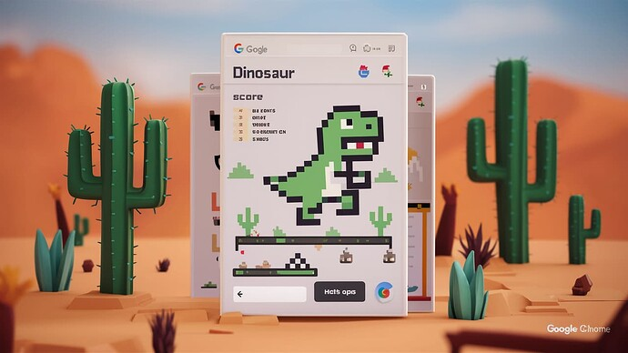

# Nouns Jumping Game Like Dino

<!-- ✦✦✦ POST START ✦✦✦ -->

> **Post #1 • Joud**
> Created: 2024-05-20 00:26
> Updated: 2024-05-20 00:26

Hello friends,  
My name is Joud Albert and I have a great idea for the Nouns community that I would like to present to you. We all know the famous dinosaur game on the Google Chrome browser, which has more than 2 billion users. Anyone who uses Chrome is certainly familiar with this beautiful game 

My idea revolves around several points:

  1. We will work on creating a game similar to the dinosaur game but with Nouns characters instead of the dinosaur. This game will be part of the play-to-earn games. (We will develop the game on multiple platforms such as Android, iPhone, and a bot on Telegram for playing. Additionally, a Chrome extension will be created to replace the dinosaur game with our game in the Chrome browser.)

What will make this game unique:

The game will follow the play-to-earn principle, where the points collected by the player will be converted into money through a cryptocurrency created for this purpose. This cryptocurrency will be listed on trading platforms and distributed fairly. The mechanism of currency distribution and earning will be discussed later. Game additions:

  * The ability to shop and buy Nouns characters, each with features such as increasing the number of earned points.
  * Game characters can be purchased using the game’s internal currency.
  * There will be a dedicated market within the game for purchasing digital products like Nouns coloring books or physical products in various stores, with payments within the app made only through the currency.
  * There will be a daily limit on the points a player can collect through playing, and they can earn a 2% commission from the points of the people they invite via a special link.
  * The game rewards will be halved every four months to prevent the currency from becoming inflationary.
  * Players can withdraw their earnings from the currency to their wallets.
  * The Nouns NFTs will be promoted within the game or through dedicated advertisements for stores that sell Nouns products.
  * Adding charity donation campaigns within the app, where donations can be made using Nouns currency, responding to environmental disasters and famine worldwide.
  * Adding a special wallet for the currency, allowing swaps and the purchase of Nouns NFTs.

<!-- ✦✦✦ POST END ✦✦✦ -->

