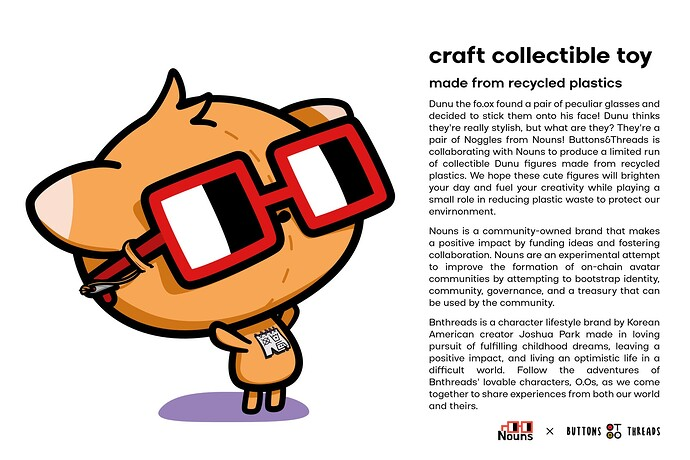
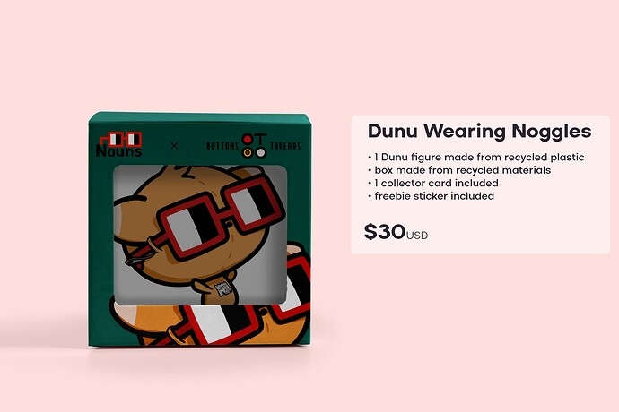

# Small Grants: Collectible Recycled Plastic Art Toys

<!-- ✦✦✦ POST START ✦✦✦ -->

> **Post #1 • namurabbit**
> Created: 2024-06-21 06:39
> Updated: 2024-06-21 11:50

**DESCRIPTION**

Hello Everyone! I’m a Chicago-based artist with a love for cute character lifestyle brands and toys. I am asking for a small grant of $8,000 to create 100 art toys of one of my characters wearing a pair of Noggles.  

The toys will be sold in person at DesignerCon, the largest design/collectible toy convention in North America with 65,000+ attendees.

**Impact**  
I believe this is a great way of putting Nouns in front of a large and highly receptive audience. Through this collaborative effort, I believe I can bring lots of attention to not just the Nouns name, but also highlight Nouns’ collaborative culture and appreciation/support of small artists as well as fun, bold, and unique ideas.

**Recycled Plastic**  
I anticipate there will be many challenges when creating collectible toys made from recycled plastic materials as it is very uncommon and not cost-effective. Despite this, I believe there is much significance in pursuing this harder route to create a more eco-friendly plastic toy. However, if it turns out to be too difficult or time/labor intensive to create art toys using recycled plastic, I will go the more conventional route and create the toys out of PVC/vinyl, which is standard for art toys.

**Asking for $8,000**  
Potential Price Breakdown:

  * 3D modeling fee (500)
  * Mold fee (3000)
  * Packaging fee (250)
  * Material cost (1500)
  * Shipping fee (250)
  * Personal labor (500)
  * Miscellaneous/Reserve (2000)

<!-- ✦✦✦ POST END ✦✦✦ -->

<!-- ✦✦✦ POST START ✦✦✦ -->

> **Post #2 • AGI**
> Created: 2024-06-21 11:20
> Updated: 2024-06-21 11:20

love this! great idea…would you be interested in exploring opportunities to collaborate and explore distribution/access into the Australian market?

<!-- ✦✦✦ POST END ✦✦✦ -->

<!-- ✦✦✦ POST START ✦✦✦ -->

> **Post #3 • namurabbit**
> Created: 2024-06-21 20:42
> Updated: 2024-06-21 20:42

Hi Agi, thanks for the support! I’m definitely open to any potential opportunities for entering the Australian market! I’m just concerned because as a small artist I don’t have deep pockets, so I’m not sure of the financial feasibility of such a move. If the opportunity arises though I’d be so down

<!-- ✦✦✦ POST END ✦✦✦ -->

<!-- ✦✦✦ POST START ✦✦✦ -->

> **Post #4 • AGI**
> Created: 2024-06-22 02:05
> Updated: 2024-06-22 02:05

sounds like a plan - did you wanna have a chat via WattsApp? +61478834818 – I’m on AEST let me know…  
Definitely think if we can get some support from the nouns community via a grant we can definitely create a movement

<!-- ✦✦✦ POST END ✦✦✦ -->

<!-- ✦✦✦ POST START ✦✦✦ -->

> **Post #5 • namurabbit**
> Created: 2024-06-22 08:14
> Updated: 2024-06-22 08:14

sadly it doesn’t seem like my proposal will get accepted  I’m unfortunately not able to finance this project out of pocket so if the nouners don’t approve, I can’t make anything. Perhaps in the future!

<!-- ✦✦✦ POST END ✦✦✦ -->

<!-- ✦✦✦ POST START ✦✦✦ -->

> **Post #6 • AGI**
> Created: 2024-06-23 08:17
> Updated: 2024-06-23 08:17

that’s a shame, seems like a good opportunity…do you know why?

<!-- ✦✦✦ POST END ✦✦✦ -->

<!-- ✦✦✦ POST START ✦✦✦ -->

> **Post #7 • namurabbit**
> Created: 2024-06-25 05:48
> Updated: 2024-06-25 05:48

It seems like the community just simply isn’t interested in my proposal, but I hope there will be more exciting opportunities in the future of Nouns! I’m still new to nouns and the crypto/nft space and I came across it almost randomly, but it seems like the community just isn’t as active as it used to be 

<!-- ✦✦✦ POST END ✦✦✦ -->

<!-- ✦✦✦ POST START ✦✦✦ -->

> **Post #8 • mekail**
> Created: 2024-07-15 22:46
> Updated: 2024-07-15 22:46

Love the concept.  
Unfortunately I share the perspective that the capital investment currently required may exceed expectation, especially if they are being sold. It is unclear where the revenue will go, and how it will be utilized beyond marketing at the conference. There may be a priority on projects with more direct impact, and understanding of who the partner is. I may be on the less educated side of things being unfamiliar with the Dunu fox, but from a relatively outsiders perspective I believe it may be beneficial to express the mission and intent the project your project you are seeking to collaborate with.

<!-- ✦✦✦ POST END ✦✦✦ -->

<!-- ✦✦✦ POST START ✦✦✦ -->

> **Post #9 • namurabbit**
> Created: 2024-08-05 07:14
> Updated: 2024-08-05 07:14

Hi Mekail and sorry for the late response! When you say that the capital investment required may exceed expectation, do you mean that the grant amount feels too large for the potential impact this project may have?

My belief is that if we sell toys with the Nouns brand at Designer Con it will be a great way of introducing Nouns to a new audience of people who are highly receptive to unique brands and ideas. And by making a collaboration piece with a small indie artist it will help portray the collaborative culture of Nouns and get people excited to know more about the brand.

<!-- ✦✦✦ POST END ✦✦✦ -->

<!-- ✦✦✦ POST START ✦✦✦ -->

> **Post #10 • steve**
> Created: 2024-08-05 08:47
> Updated: 2024-08-05 08:47

Hello namurabbit,

I’m new here and still exploring the discourse, but from my understanding, you may need to include more information in your proposal to help the Nouns community understand its benefits. Consider adding details such as:

  * What is the development timeframe for your Plastic Art Toys?
  * How will the toys be sold at the conference (e.g., will you have a kiosk)?
  * What is your marketing strategy to ensure the toys attract attention and sales?
  * How will the generated revenue be distributed, and how can the Nouns community benefit from it?
  * Do you have any previous experience or success stories related to similar projects?
  * How will you measure the success of this project, and what are the key milestones?
  * Does your project have any long-term potential, and if so, how?

I hope this helps you get more feedback on your funding proposal.

<!-- ✦✦✦ POST END ✦✦✦ -->

<!-- ✦✦✦ POST START ✦✦✦ -->

> **Post #11 • namurabbit**
> Created: 2024-08-06 12:25
> Updated: 2024-08-06 12:25

Thanks Steve! I appreciate you taking time to make such a thorough reply and I’ll definitely keep your suggestions in mind. I wish you success in your future art projects!

<!-- ✦✦✦ POST END ✦✦✦ -->

