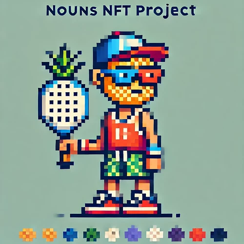
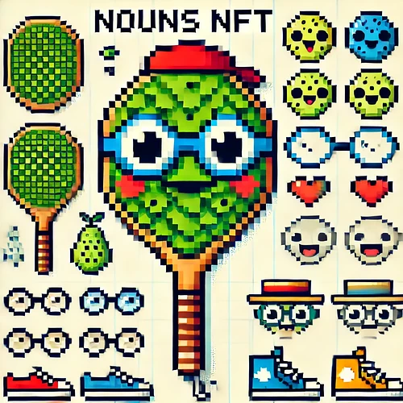
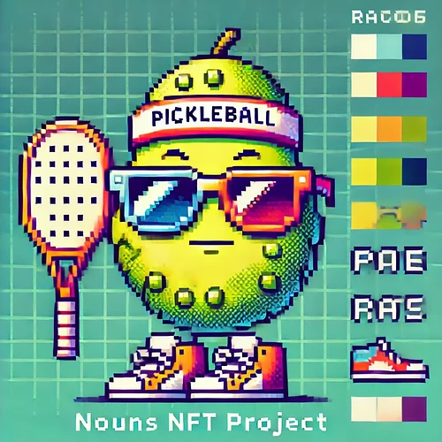

# SMALL GRANTS: Launching the NPL (Nouns Pickleball League)

<!-- ✦✦✦ POST START ✦✦✦ -->

> **Post #1 • AGI**
> Created: 2024-06-21 02:49
> Updated: 2024-06-21 02:49

The proposal to create a Nouns Pickleball League (NPL) represents a groundbreaking fusion of traditional sports and modern digital culture. By integrating the unique aesthetics and community-driven spirit of Nouns NFTs with the energetic and inclusive sport of pickleball, the NPL aims to create a vibrant, engaging, and innovative league that will captivate and unite diverse audiences.

The NPL aims to create a unique, engaging, and community-driven league that attracts both sports enthusiasts and digital art collectors. By leveraging the vibrant aesthetics and community spirit of Nouns, the NPL will offer a fresh and exciting experience for fans, players, and collectors alike.

Objectives

  1. **Promote Pickleball** : Increase the popularity of pickleball through unique & engaging events and leagues.
  2. **Leverage NFT Culture** : Utilize Nouns’ unique digital assets to attract a tech-savvy audience.
  3. **Community Building** : Foster a vibrant community around the NPL, integrating both sports and digital art fans.

Strategy

  1. **League Structure** :

  * **Teams** : Create teams with Nouns-themed branding.
  * **Matches** : Organize regular matches, tournaments, and special events.
  * **Venues** : Partner with local communities and facilities to host matches.

  2. **NFT Integration** :

  * **Nouns Characters** : Each team and player can be represented by a Nouns character.
  * **Merchandise** : Offer Nouns-branded merchandise and digital collectibles.
  * **Digital Engagement** : Use NFTs for ticketing, exclusive content, and fan rewards.

  3. **Marketing and Promotion** :

  * **Social Media** : Leverage platforms to create buzz and engage fans.
  * **Collaborations** : Partner with influencers and NFT communities & artists.
  * **Events** : Host launch events, exhibitions, and interactive fan experiences.

Implementation Plan

  1. **Initial Setup** :

  * Develop a website and digital presence.
  * Form partnerships with pickleball associations and facilities.
  * Launch marketing campaigns targeting both sports and NFT communities.

  2. **Pilot Season** :

  * Organize a pilot season with a limited number of teams and matches.
  * Collect feedback and refine the league format and operations.

  3. **Full Launch** :

  * Expand the number of teams and venues.
  * Introduce a full schedule of matches and tournaments.
  * Enhance NFT offerings and fan engagement initiatives.

Financial Plan

  1. **Revenue Streams** :

  * **Ticket Sales** : Revenue from match tickets and season passes.
  * **Merchandise** : Sales of Nouns-themed merchandise and digital collectibles.
  * **Sponsorships** : Partnerships with brands and organizations.
  * **NFT Sales** : Unique Nouns NFTs for fans and collectors.

  2. **Budget Allocation** :

  * **Marketing** : Promotional activities and campaigns.
  * **Operations** : Venue rentals, staff, and equipment.
  * **Technology** : Development of digital platforms and NFT integrations.  

  

  

<!-- ✦✦✦ POST END ✦✦✦ -->

<!-- ✦✦✦ POST START ✦✦✦ -->

> **Post #2 • AGI**
> Created: 2024-06-23 08:18
> Updated: 2024-06-23 08:18

hi Nouners, how do I know if this project is of interest? Is it appropriate to include a detailed budget?

<!-- ✦✦✦ POST END ✦✦✦ -->

<!-- ✦✦✦ POST START ✦✦✦ -->

> **Post #3 • AGI**
> Created: 2024-06-23 22:32
> Updated: 2024-06-23 22:32

High-Level Budget for the Nouns Pickleball League (NPL) - Total Estimated Investment: $50,000 USD

### Budget Breakdown

  1. **Initial Setup and Development**

  * **Website Development ($5,000):** Create a comprehensive website to provide information, updates, subscription service for giveaways and ticket sales.
  * **Digital Platform Setup ($3,000):** Develop and integrate digital platforms for NFT transactions and fan engagement.
  * **Legal and Administrative Fees ($2,000):** Cover costs for legal advice, registrations, and administrative tasks.

  2. **Marketing and Promotion**

  * **Social Media Campaigns ($5,000):** Run targeted campaigns on platforms like Twitter, Instagram, and TikTok to create buzz.
  * **Influencer Partnerships ($4,000):** Collaborate with sports and NFT influencers to promote the league.
  * **Launch Event ($3,000):** Host a grand launch event featuring exhibition matches and NFT showcases.
  * **Press and Media Coverage ($3,000):** Secure media coverage to reach a wider audience.

  3. **Operations and Logistics**

  * **Venue Rentals and Upgrades ($8,000):** Rent and upgrade venues to host matches and events.
  * **Equipment and Supplies ($4,000):** Purchase necessary equipment for players and event management.
  * **Staff and Event Management ($3,000):** Hire staff to manage events, logistics, and operations.

  4. **NFT Integration and Merchandise**

  * **NFT Creation and Distribution ($5,000):** Develop unique Nouns NFTs for players, teams, and events.
  * **Merchandise Production ($3,000):** Create Nouns-themed merchandise for fans and participants.
  * **Digital Content Development ($2,000):** Produce exclusive digital content, such as behind-the-scenes footage and match highlights, available to NFT holders.

This budget outline provides a high-level view of the necessary investments to launch and operate the Nouns Pickleball League (NPL). By strategically allocating the $50,000 investment requested under the NOUNS small grant program, the NPL can effectively set up, promote, and run a successful league that combines the excitement of pickleball with the engaging world of Nouns NFTs.

### Potential Revenue Streams and Opportunities to ensure a viable, scalable and long term model…

  1. **Ticket Sales:**

  * **Match Tickets:** Revenue from ticket sales for regular season matches and special events both online (virtual) & IRL.
  * **Season Passes:** Offer discounted season passes for fans to attend all matches.

  2. **Sponsorships and Partnerships:**

  * **Corporate Sponsorships:** Partner with brands for league sponsorships, team sponsorships, and event sponsorships.
  * **Local Businesses:** Collaborate with local businesses for sponsorships and promotional activities.

  3. **Merchandise Sales:**

  * **Physical Merchandise:** Sell Nouns-themed jerseys, hats, paddles, and other sports gear.
  * **Digital Merchandise:** Offer digital collectibles and NFTs representing teams, players, and special moments.

  4. **Broadcasting Rights:**

  * **Streaming Services:** Negotiate deals with streaming platforms to broadcast matches and events.
  * **Exclusive Content:** Create exclusive behind-the-scenes content, interviews, and highlight reels available to subscribers or NFT holders.

  5. **NFT Sales and Auctions:**

  * **Unique NFTs:** Mint and sell unique Nouns NFTs for players, teams, and events.
  * **Auction Events:** Host auctions for limited-edition NFTs, with proceeds supporting the league and community initiatives.

  6. **Fan Engagement Initiatives:**

  * **Membership Programs:** Offer memberships with perks such as exclusive content, early access to tickets, and special events.
  * **Interactive Experiences:** Develop interactive fan experiences using AR/VR technologies, enhancing fan engagement.

  7. **Event Hosting:**

  * **Special Tournaments:** Organize special tournaments and exhibition matches to attract larger audiences and sponsors.
  * **Community Events:** Host local community events, clinics, and workshops to promote pickleball and the Nouns brand.

  8. **Advertising Revenue:**

  * **In-Venue Advertising:** Sell advertising space in venues during matches and events.
  * **Digital Advertising:** Utilize the league’s digital platforms for advertising opportunities.

By strategically leveraging these potential revenue streams, the Nouns Pickleball League (NPL) can generate substantial income, ensuring the sustainability and growth of the league. This multifaceted approach will not only promote the sport of pickleball but also expand the Nouns ecosystem, attracting a diverse and engaged community of fans, players, and collectors.

<!-- ✦✦✦ POST END ✦✦✦ -->

