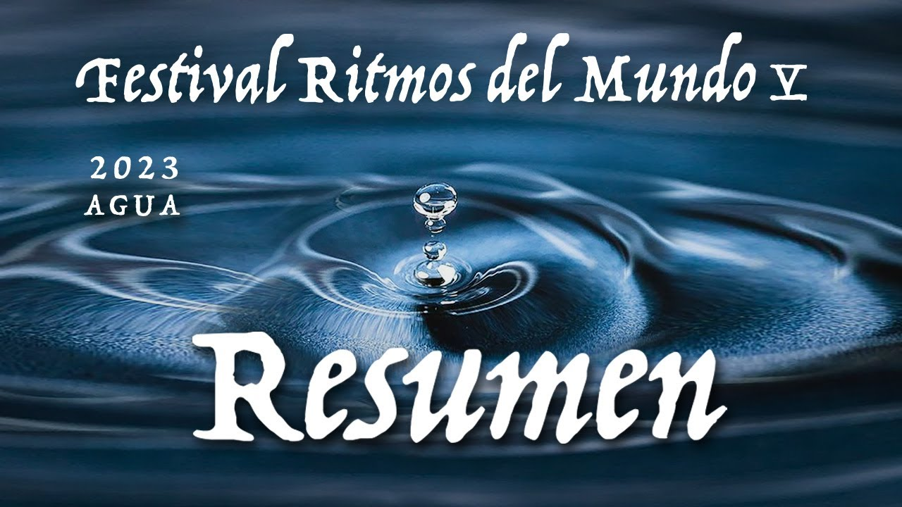
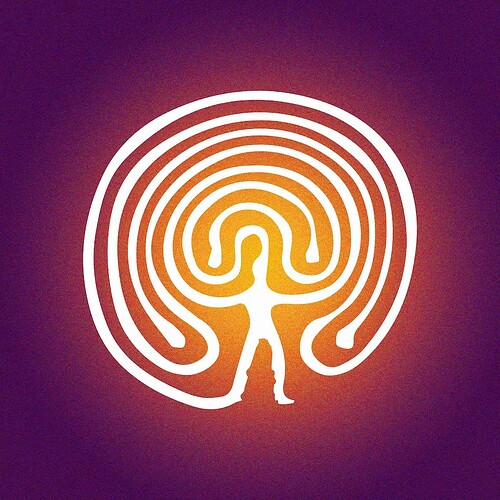

# Small grant: Yearly Music Festival Ritmos del Mundo Nounish 2025. Rescuing the music world and Colombian traditions

<!-- ✦✦✦ POST START ✦✦✦ -->

> **Post #1 • jejimenez**
> Created: 2024-06-23 00:54
> Updated: 2024-06-23 21:41

**Objective:** Addressing the critical issue of limited support and accessibility for local artists in Colombia focusing on cultural traditions from around the world, ensuring these cultural expressions are accessible to all, regardless of socioeconomic status. This year, the festival is at risk of being discontinued due to financial constraints, making this funding request particularly urgent and crucial.

#### Problem Statement

**Lack of Support for Local Artists:** Local artists with unique and culturally significant projects struggle to find platforms and support to share their work, limiting their professional growth and the cultural diversity available to the public.

**Restricted Public Access to Cultural Expressions:** Many people, especially from lower-income backgrounds, do not have the means to experience and learn from the rich cultural traditions of Colombia and the world, creating a cultural divide.

#### Mission

Ritmos del Mundo is dedicated to celebrating and promoting cultural diversity through the arts by creating inclusive spaces where musicians, artists, and communities can come together to share, learn, and grow. The mission aligns with positive change by:

  * Preserving and promoting cultural heritage
  * Ensuring inclusivity and accessibility to cultural experiences
  * Building community and social cohesion
  * Supporting local artists and entrepreneurs
  * Promoting environmental stewardship
  * Providing educational opportunities
  * Creating educational Media content (<https://www.youtube.com/@festivalritmosdelmundo> \- [Podcast](https://festivalritmosdelmundo.com/podcast/))

#### Past Activities

Since 2019, Ritmos del Mundo has:

  * Hosted annual festivals, including opening day events in Bogotá and three-day festivals in the mountains, featuring concerts, workshops, and artisan markets.
  * Organized workshops on music, dance, and environmental conservation.
  * Held virtual events during the pandemic, including workshops, concerts, and film screenings.

**Impact Evidence:**

 [YouTube](https://www.youtube.com/@festivalritmosdelmundo) 

### [Ritmos del mundo](https://www.youtube.com/@festivalritmosdelmundo)

Festival Ritmos del Mundo (Colombia) Septiembre 27-29 de 2024 Convocatoria Junio 1-Julio 15 www.festivalritmosdelmundo.com

[Festival Ritmos del Mundo](https://festivalritmosdelmundo.com/frm-2023/)

### [2023](https://festivalritmosdelmundo.com/frm-2023/)

[et_pb_section fb_built=»1″ custom_padding_last_edited=»off|phone» module_class=»pa-hide-background-image-mobile» _builder_version=»4.24.2″ _module_preset=»default» background_enable_color=»off» use_background_color_gradient=»on»...

  * Successful execution of multiple festivals with increasing attendance and participation.
  * High engagement in workshops and educational programs.
  * Positive feedback from artists and attendees.
  * Demonstrated ability to adapt to virtual formats during the pandemic.

#### Proliferation of Nouns

Ritmos del Mundo will proliferate Nouns in the following specific ways:

  1. **Festival Branding and Promotion:**

  * **Event Materials:** Nouns characters will be prominently featured on all festival-related materials, including posters, flyers, banners, and stage backdrops.
  * **Merchandise:** Festival merchandise, will include Nouns imagery, raising awareness among attendees.

  2. **Digital and Social Media Campaigns:**

  * **Dedicated Social Media Posts:** Regular posts on our social media platforms (Facebook, Instagram) will highlight the collaboration with Nouns DAO, featuring Nouns characters and branding.

  3. **Festival Activities:**

  * **Interactive Nouns Booth:** A booth dedicated to Nouns where attendees can learn about the DAO, create their own Nouns-inspired art, and participate in interactive activities.
  * **Workshops and Talks:** Sessions explaining the concept of Nouns DAO and how it supports community projects, encouraging attendees to get involved.

  4. **Online Content:**

  * **YouTube and Spotify Channels:** Featuring special episodes about Nouns DAO, including interviews with Nouns community members, explaining the impact and significance of DAOs, and showcasing how Nouns supports cultural initiatives.
  * **Event Recaps:** Videos and podcasts recapping the festival, prominently highlighting Nouns’ contributions and branding.

  5. **Community Engagement:**

  * **Collaborative Art Projects:** Engaging local artists to create Nouns-themed murals or installations, which will be displayed during the festival and in public spaces afterwards.
  * **Educational Materials:** Creating and distributing educational materials about Nouns DAO and decentralized governance, tailored to different age groups and educational levels.

  6. **Expectation Campaign with Nouns Glasses:**

  * **QR Code and NFT Raffle:** Launch an expectation campaign where festival attendees can scan a QR code to receive an NFT number. This NFT will enter them into a raffle to win a pair of iconic Nouns glasses.
  * **Interactive Engagement:** The campaign will create buzz and excitement around Nouns, encouraging festival-goers to learn more about the Nouns DAO and its community.

#### Funding Request

**Upfront Funding Needed:** $10,000

**Budget Breakdown:**

  * Event Production Costs: $4,000
  * Artist and Performer Fees: $2,000
  * Workshop Materials: $1,000
  * Sustainability Practices: $500
  * Marketing and Promotion: $1,000
  * Educational Content Creation: $500
  * Community Engagement Initiatives: $500
  * Administration and Operational Expenses: $500

**Retroactive Funding:** The committee will decide on additional retro funds based on the project’s impact and success.

#### Future Plans

**Upcoming Milestones:**

  * Free Event in Bogotá featuring workshops on recycled musical instruments and gypsy dances from India, followed by two concerts with diverse groups.
  * Continued production and dissemination of educational content related to global cultural traditions on YouTube and social media.

#### Use of Funds

The funds raised will be meticulously allocated to ensure public benefit, including covering event production costs, compensating artists and performers, purchasing workshop materials, implementing sustainability practices, marketing and promotion, creating educational content, and supporting community engagement initiatives.

#### Conclusion

By supporting Ritmos del Mundo, NOUNS DAO will contribute to a project that fosters cultural understanding, supports local artists, builds inclusive communities, and promotes sustainable practices. The festival’s integration of Nouns into its branding and activities will further enhance the visibility and reach of the Nouns community, creating a symbiotic relationship that benefits both the festival and the DAO.

<!-- ✦✦✦ POST END ✦✦✦ -->

