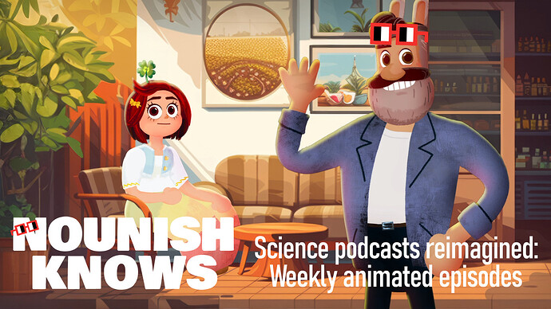
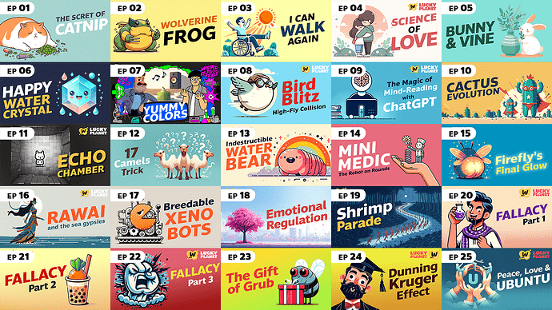
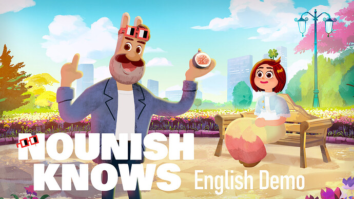
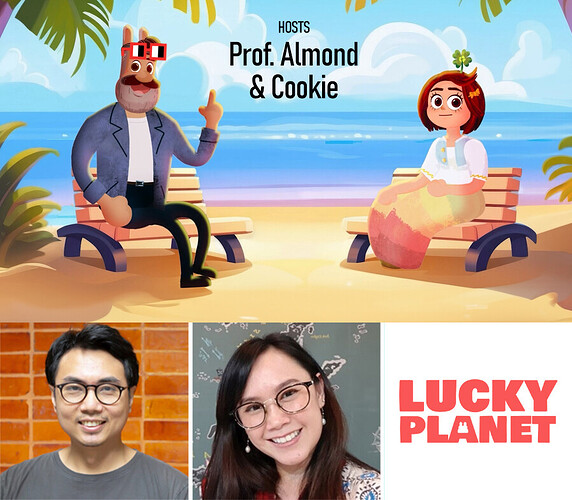
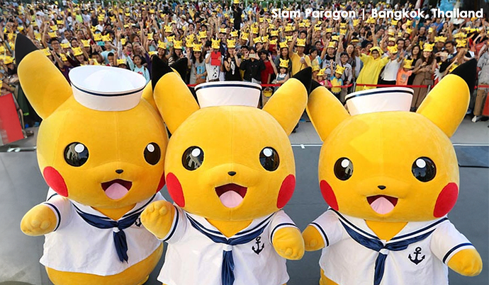

# Proposal: Nounish Knows | Where Science Gets Animated, Every Single Week

<!-- ✦✦✦ POST START ✦✦✦ -->

> **Post #1 • LuckyPlanet**
> Created: 2024-07-07 12:55
> Updated: 2024-07-07 13:00

# TLDR

  * **Goal:** Create a year-long weekly science animated show featuring Nouns characters as hosts. (3 min x 52 episodes)
  * **Why:** Foster critical thinking and scientific curiosity in young minds while amplifying the spirit of Nouns’ cc0 intellectual property.
  * **Prove of success:** We’ve already completed 25 episodes in Thai language, garnering over 8 million views.

Please check out [this VIDEO](https://youtu.be/nYNBxvM8lOk) to see what we’re all about.

# Our Journey So Far

We’re on a mission to create captivating animations for the science lover worldwide. In partnership with [WiTcast](https://www.witcastthailand.com/), a renowned Thai science podcast since 2012, we’ve already made significant strides. With initial funding from the Thai government, we successfully completed 25 episodes, covering a wide range of topics from animals and global warming to galaxies and psychology. After launching our animated series, we successfully helped our podcast partner grow their follower base from 50,000 to 150,000 people in just 4 months, which we aim to replicate and amplify with the Nounish Knows project on a global scale.

You can view these 25 episodes and witness our dedication and quality at [Lucky Planet’s Linktree.](https://linktr.ee/LuckyplanetS1)

# Our Vision

We believe science should be fun, engaging, and accessible to everyone, everywhere. To make our content universally available, we’re breaking language barriers and reaching out to a global audience. However, securing local funding is a challenge because our global vision doesn’t align with local funders’ priorities. That’s why we’ve decided to power up with Nouns, leveraging the DAO’s global reach and innovative spirit to amplify our impact. We’re not just creating science animations – we’re building a bridge between web3 culture and educational content. This collaboration allows us to expand our reach while introducing Nouns to a wider, younger audience.

Please check out the [Link HERE](https://youtu.be/Eb4CsefvmGo) for the video to get a taste of what **Nounish Knows** will offer.

# Our Team

  * **Tanthai Prasertkul** : Thailand’s top Science Communicator (2023)
  * **Linina Phuttitarn** : UNESCO Bangkok Office Individual Specialist
  * **LuckyPlanet** : Award-winning Thai animation creator (SIGGRAPH USA winner, Annecy Animation Festival nominee)

# Peer Review Production

In the spirit of scientific peer review, we’ll share our scripts and designs on Discord. This open process allows anyone to provide feedback, engage with the director, and help shape each episode, ensuring our animations are crafted for the public good.

# Budget Breakdown: $300,000 USDC (52 episodes)

Revamping existing Thai Episodes: $62,500 USDC (2,500 x 25 ep)

  * Translation and script revision to engage the international audience
  * English dubbing
  * Reanimating characters to match English audio
  * Refine the illustrations for a more polished appearance.

Creating **New Weekly Episodes** for the Rest of the Year: $232,200 USDC (8,600 x 27 ep)

  * Script writing
  * Voice-over
  * Animation production
  * Music & Score

Marketing and Promotion: $5,300 USDC  
Our initial 25 episodes achieved success without any promotional investment. By strategically combining organic growth strategies with targeted promotion, we can reach a wider global audience.

# Timeline

Thanks to our prep work, production can kick off right away! The first episode will be ready to roll by September, with new ones following every week until September 2025. Our aim is to create an evergreen project, continuously engaging and educating children worldwide.

# Sustainability

Our team has a proven track record managing top licensing characters. For example, we handled Pokémon merchandise and events in Thailand, which has demonstrated to us that character licensing can provide long-term funding for IP characters. Licensing not only multiplies the power of the community and brings people together, but it also helps other businesses to profit from our intellectual property.

While we don’t aim to reach the heights of Pokémon, we believe that our Nouns characters have the potential to find a special place in children’s hearts and grow with them, just like other successful characters around the world. As cartoon characters, they have the potential to be adapted into different languages and cultures. The possibilities are limitless.

# Beyond Science

Our vision extends beyond just science. With partnerships with famous podcasts in Thailand, we aim to introduce new characters and storytelling in areas such as art, music, history, mythology, and more. By producing this project, we are investing in the next generation of scientists, artists, innovators, and critical thinkers.

# Key Strengths of This Project

  * **Long-term Potential:** Our project is designed for lasting impact, with a whole year of engaging content for our audience to enjoy and learn from.
  * **Global Scalability:** Our content is crafted to easily adapt to various languages and cultures, maximizing its reach no matter where in the world you are.
  * **Community Building:** This project has the potential to create a global community of young science enthusiasts around the Nouns brand.
  * **Cross-platform Potential** : Starting online, our content can be adapted for other media, including TV, educational platforms, and interactive experiences, expanding its influence and accessibility.

By supporting **Nounish Knows** , the Nouns DAO community isn’t just funding an animation series – you’re investing in a scalable, impactful project with the potential to revolutionize science education while expanding the Nouns brand globally.

Together, we can make science Nounish and accessible to young minds everywhere!

Lucky Planet  
Twitter: [LuckyPlanet_One](https://x.com/LuckyPlanet_One)  
Email: [wonderlugia@gmail.com](mailto:wonderlugia@gmail.com)  
WarpCast: [LuckyPlanet](https://warpcast.com/luckyplanet)

<!-- ✦✦✦ POST END ✦✦✦ -->

<!-- ✦✦✦ POST START ✦✦✦ -->

> **Post #2 • trashmammal**
> Created: 2024-07-11 01:22
> Updated: 2024-07-11 01:22

This looks really cool, I can’t vote on it, but I might be able to help with production if it gets funding.

<!-- ✦✦✦ POST END ✦✦✦ -->

<!-- ✦✦✦ POST START ✦✦✦ -->

> **Post #3 • LuckyPlanet**
> Created: 2024-07-11 02:31
> Updated: 2024-07-11 02:31

Hi, thank you so much for the feedback. I’ve just updated the proposal by splitting it into two phases to make the budget more efficient.

 [nouns.camp](https://www.nouns.camp/candidates/nounish-knows%3A-where-science-gets-animated%2C-every-single-week-b59269457d289c2d58b96ccc092b42bad7630ee1)

### [Nounish Knows: Where Science Gets Animated, Every Single Week](https://www.nouns.camp/candidates/nounish-knows%3A-where-science-gets-animated%2C-every-single-week-b59269457d289c2d58b96ccc092b42bad7630ee1)

Please check out https://youtu.be/nYNBxvM8lOk to see what we're all about.

<!-- ✦✦✦ POST END ✦✦✦ -->

<!-- ✦✦✦ POST START ✦✦✦ -->

> **Post #4 • francigloo**
> Created: 2024-07-29 12:43
> Updated: 2024-07-29 12:43

Please let me know if you need help with translating! Happy to help 

<!-- ✦✦✦ POST END ✦✦✦ -->

<!-- ✦✦✦ POST START ✦✦✦ -->

> **Post #5 • LuckyPlanet**
> Created: 2024-07-29 13:16
> Updated: 2024-07-29 13:16

Thanks for your help!  
After feedback from the Nouns community, I’m working on some episodes independently to demonstrate the project’s value. I’ve started a crowdfunding campaign at <https://fundrazr.com/52Pvl4>  
Any contribution or sharing would be much appreciated!

<!-- ✦✦✦ POST END ✦✦✦ -->

