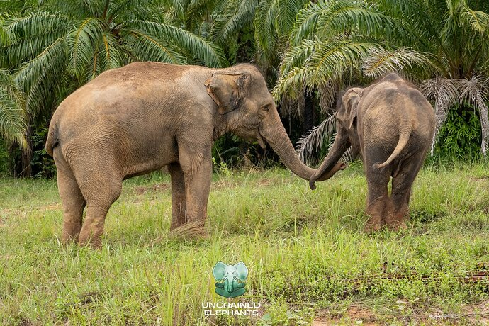
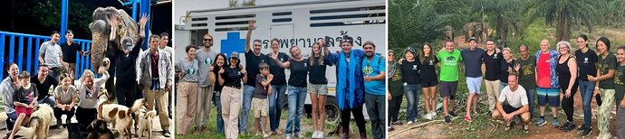
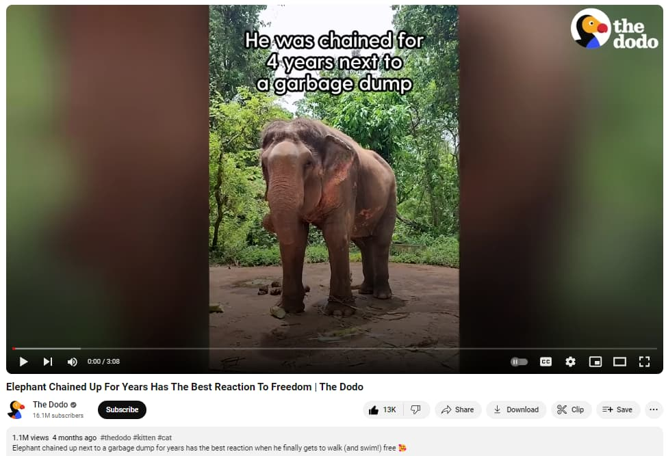
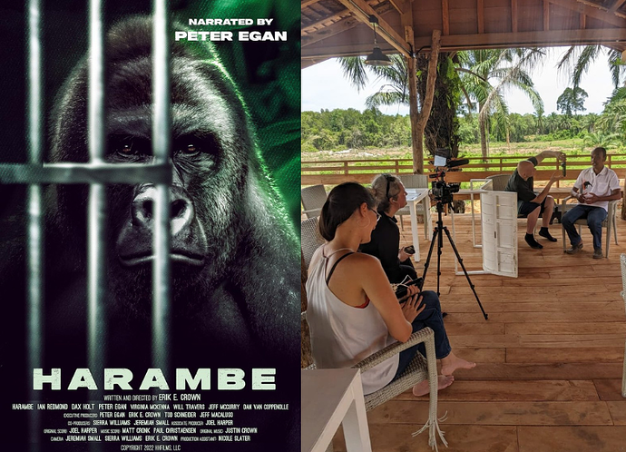
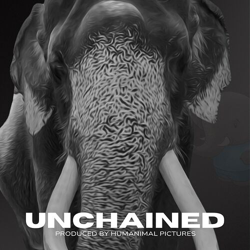

# Nouns Unchaining Elephants: Rescue, Save & Proliferate

<!-- ✦✦✦ POST START ✦✦✦ -->

> **Post #1 • DanielUnchained**
> Created: 2024-07-13 11:47
> Updated: 2024-07-14 04:58

## **TLDR;**

We at **[Unchained Elephants NFTs](https://unchainedelephants.com/)** are **a community of elephant lovers** dedicated to promoting elephant welfare in Thailand. Our mission is clear: **rescue elephants from dire conditions** and relocate them to ethical sanctuaries where they can thrive. We strive for **lasting change through education** , focusing on traveler awareness, an education center for ethical practices, and rescuing elephants in need. Our project integrates NFTs to support these initiatives, inviting ownership in our mission of lasting change.

**Funding for 2 key initiatives:**

  * Rescue an Elephant living in dire conditions
  * Title Sponsor For Unchained Pilot Episode Documentary  
**Proposed budget 73,700 USD** Lead by Unchained Elephants

**

**

## **Who is Unchained Elephants?**

Unchained Elephants is a project dedicated to improving elephant welfare by rescuing elephants from dire conditions and relocating them to ethical sanctuaries. Our mission includes educating travelers, establishing an education center, and using NFTs to support these initiatives. Over the past 12 months, we’ve rescued three elephants—Kanoon, Kham Phaeng, and Mongkoln—whose stories have reached over 5 million viewers through media coverage, including features on The Dodo and Yahoo News.

We are a web3 project, though most of our community members and supporters are from web2, helping us crowdfund our rescue initiatives. On teh web3 side, we will be migrating an NFT collection to BASE to onboard and proliferate our message to new audiences and animal lovers, after working on other chains, BASE has the easiest onboarding with the smart wallet and no doubt we will contribute to onboard our audience.

To date, Unchained Elephants has donated $86,000 towards the care and rescue of three elephants, as well as the care of eight elephants during the pandemic when we started.

As part of our initiatives, we are currently seeking funding for a fourth elephant rescue, a rescue fund, and funding for the post-production of our pilot episode featuring the rescue of our baby elephant Mongkoln. This latest rescue was documented in 4K for our pilot episode, UNCHAINED, by a filmmaker focused on animal and environmental issues.

**

**

**#1 \- Elephant Rescue Fund - Budget: 38,700 USD**

We are working on our 4th elephant rescue, the rescue date is tentatively on at the end of August to the first week of September. In our previous rescues, we rallied our community to raise funds through traditional crowdfunding and sales of NFTs (80/20). This time, the goal will be to launch a fully web3 elephant Noun rescue, currently we have 3 potential cases we are looking into it but there a lot of due diligence as well as preparation to relocate an elephant take up to 8 weeks. The most critical side is that we need to ensure that the rescued elephant will not be replaced by another, thereby fostering the elephant trade. We work with accredited elephant sanctuaries by World Animal Protection, so we carefully relocate the elephants to an accredited elephant sanctuary.

**Value Proposition to Nouns:**

We are supported by the Dodo as 2 our rescues have been featured on their channels and we are working with them on the video that features the 3rd rescue. We have established a relationship with them and based on the story we will be able to make get a featured video with on their channel (it is not guaranteed as we can’t control what they publish but there is a extremely high chance of it happening). During our rescues we bring photographers and video crew to document all the prices

Additionally as part of this donation, Unchained Elephants and the rescue team will deliver the following to raise awareness about Nouns and continue to proliferate:

✓ Prominent Logo Placement in the Main Videos in regards  
✓ Custom Social Media Content  
✓ Featured on all press releases  
✓ Deidated email blast to our audience  
✓ Logo on the T-shirts during the rescue  
✓ Dedicated video of the rescue with the Nouns logo  
✓ 1 Unchained Elephants NFT (top tier) to each Noun unique holders

**Budget Break down: 38,700 USD**

  * Buying the elephant’s freedom - 30,000
  * Elephant Transportation - 1,500
  * Transportaion UE Team - 2,300
  * Transporation Sanctuary Team - 700
  * Film & Photo Crew - 3,000
  * Food & Accommodation - 1,200

**#2 \- Unchained Pilot Episode - Budget: 35,000 USD**

As we are committed to improving elephant welfare in Thailand and Asia, we are working in tandem with the rescues on a pilot for our Docuseries. Our goal is to inspire global audiences to join the conservation effort and make a lasting impact on elephant conservation, and with the sponsorship of The Nouns, we can make this happen through our pilot episode. This first episode of UNCHAINED, sets the story, and tone, introducing a group of passionate and dedicated elephant rescuers in Thailand. It demonstrates that anyone can embark on a journey to create an impact larger than themselves with a mission of spreading awareness about public goods and making real-world impact with the support of a community & web3. UNCHAINED showcases the rescue of a baby elephant Mongkoln who was destined to entratin humans for food at a large tourist attraction. The story of struggle and hardship, of the rescue and brings its emotional rollercoaster with a happy and positive ending.

His story was documented by Erik Crown, an environmentalist and filmmaker who recently produced the **documentary Harambe**. With him, we aim to develop a compelling episode that will eventually evolve into a documentary series.

The pilot will be screened to the community via a token-gated site for holders of the NFT tickets, gathering feedback before pitching to TV networks. Sponsorship benefits include logo placements, digital exposure, blog posts, and our NFTs for the Public Noun Holders.

**Marketing Benefits of this Initiative For Nouns**  
*Title Sponsorship Package  
✓ Logo placement in opening or closing credits.  
✓ Logo placement in the pilot episode promotional materials: Trailer & Posters  
✓ Product placement or integrated branding within the pilot episode.  
✓ Logo placement on [Unchainedmovie.net](http://Unchainedmovie.net) & on relevant pages on [UnchainedElephants.com](http://UnchainedElephants.com)  
✓ Mention in through our marketing campaign to promote the episode.  
✓ Blog post on [UnchainedElephants.com](http://UnchainedElephants.com) & on [Unchainedmovie.net](http://Unchainedmovie.net) highlighting the sponsor’s support and involvement in conservation efforts.  
✓ Unchained Screening NFT Tickets, 1:1 ratio for Nouns NFTs  
✓ Tailored social media campaigns or digital advertising featuring the sponsor.  
✓ Long-Term Partnership: Discussion for potential long-term partnership opportunities beyond the pilot episode.  
✓ Priority Sponsorship: First option to sponsor the full series with enhanced benefits and exclusive engagement opportunities.

See all Sponsorship Packages Here:

[docs.google.com](https://docs.google.com/presentation/d/1mKDMaaHhJQkFdZNjynXikJAA6zwA8iFI/edit?usp=sharing&ouid=106265049778566195245&rtpof=true&sd=true) 

### [Deck - Unchained Elephants - Elephant Welfare Docuseries.pptx](https://docs.google.com/presentation/d/1mKDMaaHhJQkFdZNjynXikJAA6zwA8iFI/edit?usp=sharing&ouid=106265049778566195245&rtpof=true&sd=true)

BY UNCHAINED ELEPHANTS &amp; HUMANIMAL PICTURES UNCHAINED UNCHAINED A community dedicated to promoting elephant welfare in Thailand. EMPOWER. EDUCATE. EVOLVE SPONSORSHIP OPPORTUNITY

**Budget Pilot Episode: 35,000 USD**

We have successfully raised funds to bring the production team with us to document the rescue of the baby elephant but we are currently, we are seeking funding to commence the post-production phase, which includes:

  * Marketing
  * Story Writing
  * Sound Editing
  * Color Correction
  * Online Graphics
  * Mastering & Soundtrack for the trailer
  * Token-gated site for screening the episode

According to the director, it will take 3 to 4 months to deliver the pilot episode.

**Impact of Sponsoring an Elephant Rescue and the UNCHAINED Docuseries**

Sponsoring an elephant rescue and the UNCHAINED docuseries with Unchained Elephants brings profound and multifaceted benefits:

  1. **Direct Contribution to Welfare:** Your sponsorship directly funds the rescue and relocation of elephants from dire conditions to ethical sanctuaries, ensuring they live in a safe and nurturing environment.

  2. **Raising Awareness:** The docuseries educates viewers about elephant mistreatment in captivity, promoting ethical alternatives to shift public perception and behavior. Your support helps amplify this critical message, reaching millions and fostering a deeper understanding of ethical tourism and conservation.

  3. **Inspiring Action:** UNCHAINED showcases powerful rescue stories to inspire global audiences to support conservation and ethical tourism, advocating for animal welfare and driving positive change.

  4. **Catalyzing Change:** Through compelling storytelling and advocacy, the docuseries aims to influence and transform elephant tourism practices, encouraging a more humane and sustainable approach.

  5. **Community Engagement:** Both the rescue initiatives and the docuseries foster online and offline engagement by encouraging discussions, supporting ethical sanctuaries, and contributing to conservation efforts. Your sponsorship encourages community involvement and inspires others to participate in these meaningful activities.

  6. **Media Impact:** The broad media coverage and viewership of the docuseries amplify the message of elephant welfare, reaching diverse audiences and creating a significant impact.

  7. **Enhanced Visibility:** Sponsors receive recognition and exposure through various channels, including logo placements, digital exposure, and features in our media content, enhancing your brand’s reputation as a champion for animal welfare.

  8. **Emotional Connection:** Being part of a rescue mission and the docuseries allows sponsors to form a personal connection with the rescued elephants, witnessing their transformation and knowing they played a crucial role in their journey to freedom and happiness.

By sponsoring both the elephant rescue and the UNCHAINED docuseries, you play an integral role in driving awareness, inspiring action, and creating lasting change for elephant welfare and ethical tourism.

Together, let’s make a lasting difference in elephant welfare and rewrite their story for a brighter future with Nouns & Public Nouns! 

  * **Relevant Links About Our Work:**

    * [The Dodo - Kanoon](https://youtu.be/LG7OGAAhYCw)
    * [The Dodo - Kham Phaeng](https://youtu.be/XUCW7qge4YI)
    * The Dodo - Mongkoln: …COMING SOON…
    * Mention on Forbes: [How NFTs Can Still Unlock Value For Your NonProfit](https://www.forbes.com/sites/forbesnonprofitcouncil/2024/05/01/how-nfts-can-still-unlock-value-for-your-nonprofit/?sh=3ccd935b4354)
    * Mentions on Yahoo News: [Support for Mongkoln Rescue](https://au.news.yahoo.com/mission-to-rescue-baby-elephant-from-grim-existence-inside-cage-at-tourist-park-221051563.html) & [Support for Kham Phaeng](https://au.news.yahoo.com/race-against-time-to-purchase-42k-thai-elephant-in-really-bad-shape-064323362.html)
  * **Social Media Links:**

*[X](https://x.com/unchainelephant)  
*[Website](https://unchainedelephants.com/)  
*[Multichain NFTs](https://nft.unchainedelephants.com/)  
*[Instagram](https://www.instagram.com/unchainedelephants/)  
*[LinkeIn](https://www.linkedin.com/company/unchained-elephants)

Recipient Address  
unchainedelephants.eth / 0xA6c6322B69FE8f85983ef537Eff1bcC21aC00a1c

Sponsorship Budget Request:  
23 ETH

<!-- ✦✦✦ POST END ✦✦✦ -->

<!-- ✦✦✦ POST START ✦✦✦ -->

> **Post #2 • DanielUnchained**
> Created: 2024-07-13 11:49
> Updated: 2024-07-13 11:49

Hey [@maty](/u/maty) and [@francigloo](/u/francigloo), thanks for your replies on my previous post.  
I was wondering if you can have a look at this proposal?  
All feeback is super welcome!  
Thanks

<!-- ✦✦✦ POST END ✦✦✦ -->

<!-- ✦✦✦ POST START ✦✦✦ -->

> **Post #3 • DanielUnchained**
> Created: 2024-07-14 04:19
> Updated: 2024-07-14 04:19

Hi [@maty](/u/maty), I tried to submitte the proposal on noun.camp but I don’t have a vote to push the proposal for review or maybe I am doing something wrong.  
Please let me know.  
Thanks

<!-- ✦✦✦ POST END ✦✦✦ -->

