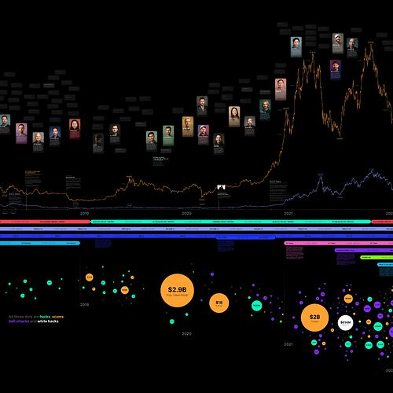
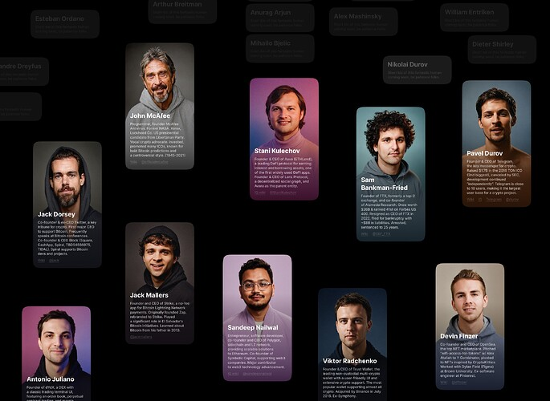

# The Grand Timeline 🧶

<!-- ✦✦✦ POST START ✦✦✦ -->

> **Post #1 • stepahin**
> Created: 2024-08-28 18:15
> Updated: 2024-08-29 09:26

Hey, awesome Nouns family!

I’m Igor, a product designer. I’m working on my own project — a historical research and data visualization of the entire history of Crypto, Web3, including NFT space and how we got to where we are today. No one has done something like this before. I’ve been working on this as a side project for 3 years, off and on. This is a public good, and I’m doing it because it fascinates me, because I can, and because I’m inspired by the Web3 community and the amazing stories within it. Most importantly, I believe this format of visual storytelling captures and holds attention, and can bring new amazing people into Web3. That’s why I really want to bring the project to its final release and I need your community’s help!

The project lives in Figma, where I’m working on it openly:  Zoom in Figma  
More details: [Twitter article](https://x.com/stepahin/status/1817955760753594557) & [grandtimeline.org](https://grandtimeline.org/)

I have already done a lot of work, but now it’s difficult for me to continue the project without community support, as I’m currently between jobs. Here’s my progress while working on the project on and off for the last 3 years — <https://youtu.be/lkVy6JzlyNY>

**The biggest challenge for me** is that most Foundations or DAOs perceive the project as very broad and not specifically focused on their product and ecosystem or/and something on chain, code-intense projects, webapps and dapps, which makes it quite difficult for me to secure funding with project like mine. But I believe this format will attract a lot of attention and bring many wonderful new people to Web3 and NFT.

**Recent achievements and validation of my idea and progress, quality:** Lido has already supported me with a small grant, and one of the top 10 blockchain (announcement coming soon) + here’s who has already liked/rt: Camila Russo, Tim Copeland, banteg, Sergej Kunz & Anton Bukov (1inch founders), Roman Storm, the Lido Team, Vlad Zamfir (for the portraits project), Robert Leshner (portraits project), Sam Kazemian, Juicebox Team, some of your Optimism Gov members, Devin Walsh (Executive Director of Uniswap Foundation), Evgeny Yurtaev (Zerion), and even legends from the Bitcoin community: Charlie Shrem, Jameson Lopp, Samson Mow, and Adam Back.

**My plan** is to raise about $100k-$150k, which would be enough for a year of work, for me as a researcher and designer, and for a developer to create an interactive version of the Timeline. I would like to ask Nouns DAO to support me with a small grant.

I also promise to add the Nouns DAO logo to the timeline as a sponsor forever, whether it’s the printed version or the interactive one (where it will be clickable)

**Do you think Nouns DAO might support this project?** I’m considering creating a proposal and was thinking of requesting around $10,000, but I’m unsure if this amount is appropriate. Please give me advice.

If you prefer to send a PM, you can find me everywhere as [@stepahin](/u/stepahin)  
Thank you!

<!-- ✦✦✦ POST END ✦✦✦ -->

<!-- ✦✦✦ POST START ✦✦✦ -->

> **Post #2 • steve**
> Created: 2024-08-29 17:04
> Updated: 2024-08-29 17:04

This is fantastic work! Well done!

Creating an interactive website with all this information would be incredibly helpful for many people to better understand the history of crypto.

Congratulations, and I wish you all the best!

<!-- ✦✦✦ POST END ✦✦✦ -->

<!-- ✦✦✦ POST START ✦✦✦ -->

> **Post #3 • stepahin**
> Created: 2024-08-30 07:36
> Updated: 2024-08-30 07:36

Thank you Steve! Do you think I can ask for support Nouns DAO for such a project, or do you usually only support directly Nouns-related initiatives here? I’m completely new here and don’t know how things work.

<!-- ✦✦✦ POST END ✦✦✦ -->

<!-- ✦✦✦ POST START ✦✦✦ -->

> **Post #4 • eusoujp**
> Created: 2024-09-06 04:33
> Updated: 2024-09-06 04:33

Hey, [@stepahin](/u/stepahin)! Great project  I’d suggest presenting it in the [/nouns](https://warpcast.com/~/channel/nouns) channel on Warpcast, since almost no one uses Discourse anymore. Good luck!

<!-- ✦✦✦ POST END ✦✦✦ -->

