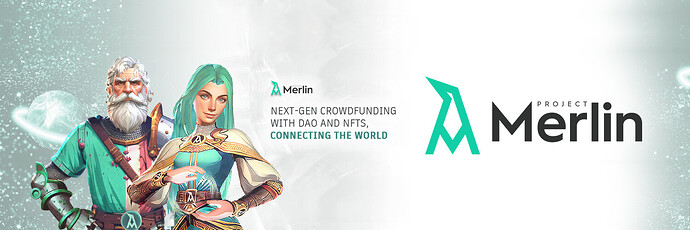
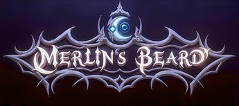
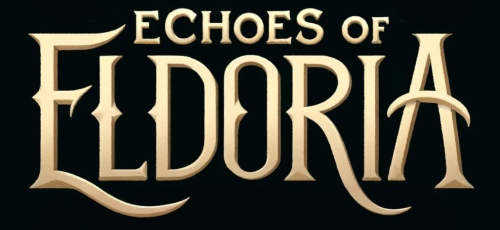

# Small Grants: Project Merlin; The Future of Decentralized Crowdfunding and DAOs

<!-- ✦✦✦ POST START ✦✦✦ -->

> **Post #1 • FargoHKN**
> Created: 2024-09-06 08:30
> Updated: 2024-09-06 08:30

Hello **Nouns** ,

I’d like to share some exciting details about our project and explore how Nouns can collaborate with us.

With Project Merlin, we can expand Nouns’ DAO mechanics. Through this partnership, Nouns NFT holders could become direct members of the Project Merlin community and actively participate in DAO processes. Project Merlin, which offers a unique governance model providing continuous earning opportunities, can extend these benefits to Nouns NFT holders as well. Additionally, Small Grant applications could be managed directly through Project Merlin, offering a more streamlined and trackable process.

I’d love to briefly introduce Project Merlin to you.

**Project Merlin**  
_The Future of Decentralized Crowdfunding and DAOs_

Project Merlin is a decentralized autonomous crowdfunding platform with a community-driven decision-making mechanism. Our platform is designed to support and develop blockchain ecosystems, with a particular focus on GameFi projects.

 **Key Features**  
Direct support for projects using cryptocurrency assets.  
Direct support for projects via credit card payments.  
Decentralized funding pools for projects through an advanced DAO system.  
Rewarding users participating in DAO stages with MRLN tokens.  
Providing grants to GameFi projects.

 **Our Vision**  
At Project Merlin, our vision is to create a global, inclusive, and interactive crowdfunding and DAO platform that facilitates the realization of innovative projects and ideas.

 **Financial Data and Compliance**  
To date, our project has spent over $275,000, fully financed by the founders. We meet corporate standards with a team of over 25 employees from five different continents.

 **Community and Marketing**  
Despite having just begun advertising efforts, we have already amassed over 10,000 Telegram members and more than 4,000 followers on Twitter. Marketing will be enhanced through the development of the “Merlin’s Beard!” mini-game on Telegram and our collaboration with TON, which is expected to drive rapid growth.

A global promotional campaign with Solana Super Team is anticipated to positively impact our marketing efforts. Additionally, upcoming reward campaigns on Galxe is expected to accelerate progress.

 **Games**  
Project Merlin is developing two different games in two separate ecosystems to expand its community. These games are:

 **Merlin’s Beard**  

  
_Mini Airdrop game developed within the Telegram ecosystem to grow the**Project Merlin** ecosystem, build awareness, and distribute loyalty rewards to its users._

 **Echoes of Eldoria**  
  
_An auto chess game developed within the Solana ecosystem to expand the Project Merlin community._

 **Sponsors and Partners**  
We currently have two announced partners and five additional partners awaiting announcement.  
Skale Network  
Sequence

 **ROAD MAP**  
Seed Rounds: **October**  
Launch: **November**

<!-- ✦✦✦ POST END ✦✦✦ -->

<!-- ✦✦✦ POST START ✦✦✦ -->

> **Post #2 • FargoHKN**
> Created: 2024-10-17 15:39
> Updated: 2024-10-17 15:39

Version Update for Project Merlin,

**Project Merlin**     
The future of decentralized all-in-one ecosystem; Crowdfunding, Talent sourcing, Community Building, and Launchpad.  
[www.projectmerlin.io](https://projectmerlin.io/)

Project Merlin is an all-inclusive platform that offers everything needed to turn an idea into a fully realized project within the Web3 ecosystem. With four core decentralized services, it simplifies the entire process from ideation to funding, team assembly, and community building: MerlinCap DAO for community-driven crowdfunding; Merlin’s Guild as a freelance marketplace; Excaliber for Web3 engagement; and Avalon Launchpad as an IDO launchpad service.

 **MerlinCap**  
A community-driven crowdfunding platform that allows decentralized decision-making for project funding and support.

 **Merlin’s Guild**  
A freelance marketplace where professionals offer their services, and employers can pay using cryptocurrency.

 **Excaliber**  
An on-chain platform that enables users to build blockchain-based identities and earn rewards through completing quests, fostering deeper engagement and interaction.

 **Avalon Launchpad**  
A launchpad for initial decentralized offerings (IDO), where blockchain projects can offer their tokens for presale, allowing early investors to participate in new ventures.

 **Key Features**  
Direct support for projects via cryptocurrency and credit card payments.  
Decentralized funding pools using an advanced DAO system.  
Rewarding users with MRLN tokens for participating in DAO stages.  
Earn MRLN tokens by completing simple quests in Camelot Chronicles, promoting user engagement and interaction on the platform.  
Easily find and hire freelancers through Merlin’s Guild using cryptocurrency payments, streamlining the process of connecting with blockchain professionals.  
Conduct seamless token presales with Avalon Launchpad, offering a straightforward and secure method for early investors to participate in new projects.

 **Our Vision**  
At Project Merlin, our vision is to create a fully decentralized platform that provides all the essential tools and support needed to transform a Web3 idea into a complete product. We aim to offer a seamless, all-in-one ecosystem where funding, talent sourcing, community building, and token launches come together in a decentralized environment. Everyone who contributes to and supports this process will be rewarded, ensuring mutual growth and success across the ecosystem.

 **Financial Data and Compliance**  
To date, our project has spent over $275,000, fully financed by the founders. We meet corporate standards with a team of over 25 employees from five different continents.

 **Community and Marketing**  
Despite having just begun advertising efforts, we have already amassed over 10,000 Telegram members and more than 4,000 followers on Twitter. Marketing will be enhanced through the development of the “Merlin’s Beard!” mini-game on Telegram and our collaboration with TON, which is expected to drive rapid growth.

A global promotional campaign with Solana Super Team is anticipated to positively impact our marketing efforts. Additionally, upcoming reward campaigns on [Galxe.com](http://Galxe.com) is expected to accelerate progress.

 **Sponsors and Partners**  
We currently have two announced partners and five additional partners awaiting announcement.  
Skale Network  
Sequence.xyz  
Konnect3d  
SH Partners

 **ROAD MAP**  
Seed Rounds: November  
Launch: December

 **Resources**  
[Pitch Deck](https://t2m.io/ZxKJcsRY) I [Whitepaper](https://t2m.io/LTsdCrmr) I [Website](https://projectmerlin.io/) I [Tokenomics](https://t2m.io/GKrgC6d3) I [X/Twitter](https://x.com/ProjectMerlinio) I [Telegram](https://t.me/ProjectMerlin) I [Discord](https://discord.com/invite/projectmerlin)

<!-- ✦✦✦ POST END ✦✦✦ -->

