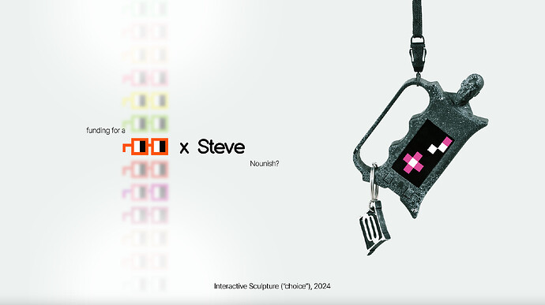
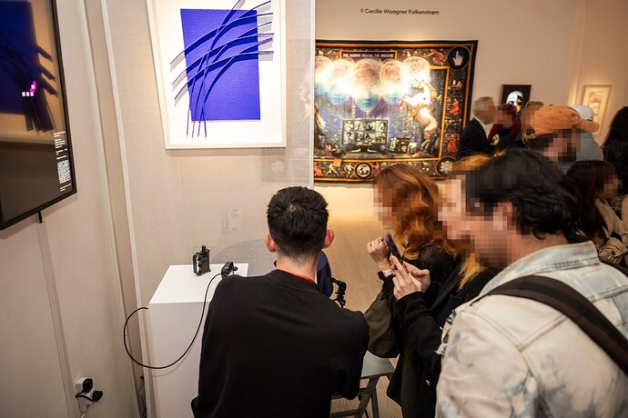
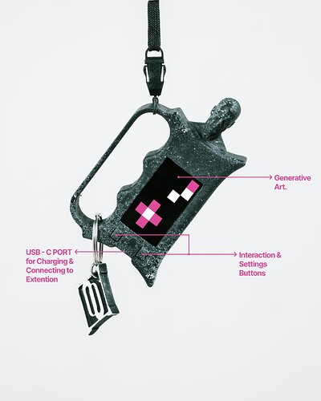
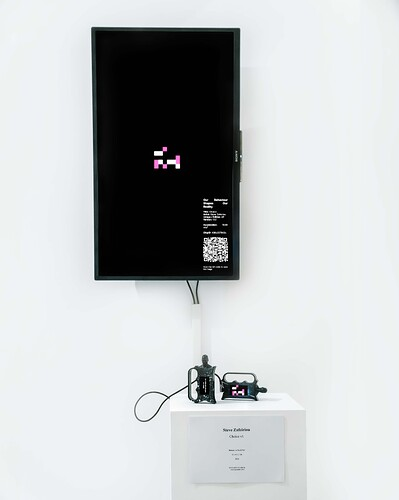

# Small Grants: "Choice" An Interactive Sculpture & Research (Nouns x Steve)

<!-- ✦✦✦ POST START ✦✦✦ -->

> **Post #1 • steve**
> Created: 2024-10-09 13:43
> Updated: 2024-10-09 13:43

### TL;DR

Research, upgrade and further development of “Choice,” **an interactive sculpture** and installation that explores how small actions can shape our reality. By incorporating haptic feedback, my work aims to push the limits of digital and sensory art experiences, aligning it with the Nouns culture.

[Read the full (40 pages) Small Grand Proposal here.](https://stevezafeiriou.com/nouns)

* * *

## 2\. Overview

“Choice” is an interactive sculpture that creates generative art using real-time data. It uses human behavior data, captured through sensors, to dynamically create digital art that evolves over time. This project has already been exhibited at the British Art Fair 2024 at **Saatchi Gallery, London, UK** and seeks **funding for research on haptic sensory experience, including further development, and the design and creation of a larger installation (the “Extention”)**.

This proposal aims to align the artwork with Nouns Culture by incorporating Nouns Branding into the project, developing open-source tools, and expanding its reach through future exhibitions.

## 3\. **Details**

### **What It Is?**

“Choice” is a data-driven, interactive artwork that generates digital art based on movement, embodying the idea that small, consistent actions lead to significant change. This sculpture uses sensors to capture movements and autonomously creates a visual output that evolves over time. **The new phase of the project will integrate Nouns Branding and expand upon the current installation, creating an immersive experience that includes tactile feedback**.

### **Why It Aligns with Nouns Culture?**

The project perfectly aligns with the Nouns DAO values of innovation and community participation. The sculpture’s pixel-based, generative art is conceptually linked to the pixel art used in Nouns NFTs. Moreover, the project’s emphasis on user interaction mirrors the community-driven ethos of Nouns DAO, where members actively shape the ecosystem. By integrating Nouns Branding, this project bridges the digital and physical worlds, embodying Nouns DAO’s forward-thinking spirit.

### **Small Grant Request**

I request €41,650 (approx. 17.35 ETH) and 1 Noun to fund the following:

  1. **Design & Production:** Designing and upgrading to new versions of the sculpture and installation with Nouns Branding.
  2. **Research and Development: Implementing haptic feedback technology to create a multi-sensory art experience**.
  3. **Exhibitions and Outreach:** Further showcasing Nouns culture through exhibitions and public appearances.
  4. **Documentation:** Developing an artwork booklet and media content documenting the project’s development.

The requested funds will cover mechanical design, electronic components, 3D printing, packaging, cloud services, video production, artwork booklet, documentation and artist compensation over a 4-6 month period.

[Read the detailed proposal here.](https://stevezafeiriou.com/nouns)

### **Timeline**

  * **Months 1-2:**
    1. Redesign the sculpture’s 3D model.
    2. Update web applications with Nouns branding.
    3. Order materials and begin production.
  * **Months 2-3:**  
4\. Assemble and test the electronic components.  
5\. Start researching and integrating haptic feedback technology.
  * **Months 1-2:**  
6\. Build the “Choice Extension” installation.  
7\. Finalize artwork documentation and booklets.  
8\. Prepare for exhibition submissions.

### **Purpose and Future Collaboration**

By funding this project, Nouns DAO will enable the creation of a multi-sensory digital art experience, making the artwork more accessible and engaging, particularly for individuals with visual impairments. The integration of haptic feedback pushes the boundaries of how digital art can be experienced, opening the door for technological innovation that can be applied in various fields.

In return, Nouns DAO will be recognized across all exhibitions and documentation, and Steve will continue collaborating with Nouns DAO, exploring further innovations in digital and sensory art.

* * *

**Thank you for considering this funding proposal.** If you have any questions, please feel free to reach out via email or discourse. You can also review the **detailed[PDF presentation](https://stevezafeiriou.com/nouns) attached for a comprehensive overview**.

_This funding proposal is designed with flexibility in mind and can be adjusted based on feedback from the community._

<!-- ✦✦✦ POST END ✦✦✦ -->

