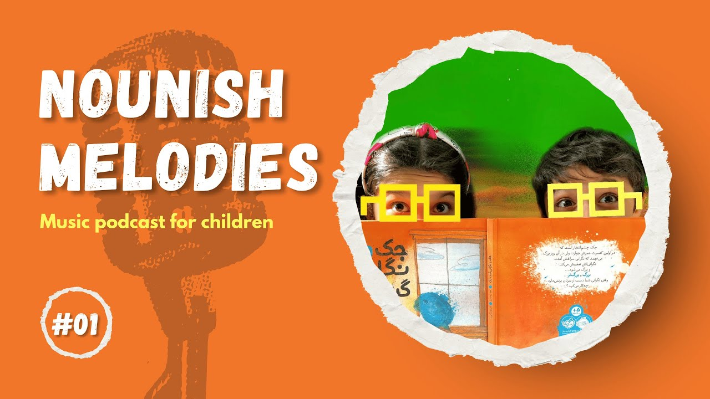
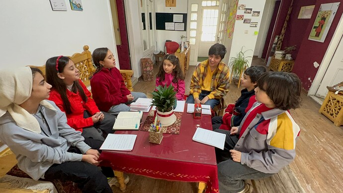

# Nounish Melodies Podcast

<!-- ✦✦✦ POST START ✦✦✦ -->

> **Post #1 • JixAI**
> Created: 2025-03-01 23:25
> Updated: 2025-03-01 23:31

Nounish Melodies Podcast, is a podcast for children by children hosts.  
Since I’m a Music instructor for kids, my core idea is to introduce variety of musical resources to children (books, movies, AI tools, apps and…)  
And I started it by asking my students to host the podcast.  
As the podcast grows I want to work more on introducing the new generation to how to use AI tools, how to become digital musicians or artists and what is Nouns and DAOs.  
I plan to make this podcast universal and have kids applying for podcast episodes from everywhere regardless of their language  
And eventually create a community of young onchain artists familiar with the benefits of DAO communities and eager to work and collaborate on new ideas.  
For the start, I released the first episode of the podcast on YouTube

Let me know what you think and if I can count on any support for a nouns proposal

<!-- ✦✦✦ POST END ✦✦✦ -->

